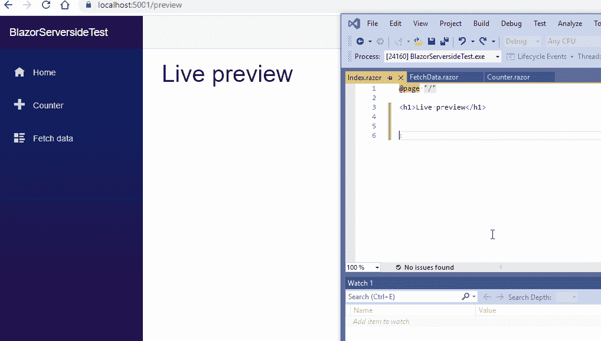

# Blazor 实时重装预览

> 原文：<https://itnext.io/blazor-live-reload-preview-4505015fd589?source=collection_archive---------1----------------------->



在 react 中，我们有热模块替换功能，该功能允许我们更改代码，并在您的浏览器中立即看到更改。我们可以使用 Roslyn 编译器在 blazor 中创建一个类似的特性。在运行时编译 razor 组件，并使用文件监视器在每次文件更改时使用 WebSockets。

# 它是如何工作的

它使用 razor 引擎版本 3 将组件编译成 c#类。然后我用罗斯林编译器把这些类编译成汇编。最后，我使用反射从一个程序集中加载 app.razor 组件，并使用 Steve Sanderson 测试主机修改的库将组件转换为普通 HTML。为了实时提供 HTML 文件，我使用 WebSockets 进行全双工通信。

# 怎么会更好呢？！

修复路由而不是使用/preview，这可以通过将 WebSocket 客户端注入到每个 HTTP 请求上下文中来实现。

使用两个构建服务器，一个用于快速预览，另一个带有 dotnet watch build 的服务器用于真正更长的构建。

在 Blazor web assembly 中，也许我们可以在浏览器中加载和卸载程序集？

# 安装

1.添加包:

```
dotnet add package RazorComponentsPreview
```

2.添加到启动:

```
services.AddRazorComponentsRuntimeCompilation();
app.UseRazorComponentsRuntimeCompilation();
```

3.运行项目转到/预览并更改 razor 文件组件

来源:https://github.com/martasp/BlazorLiveReload