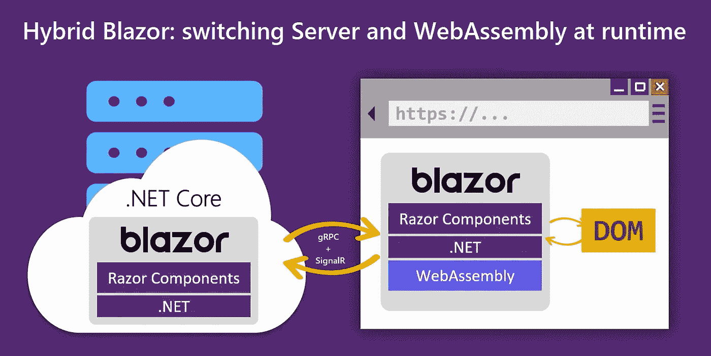
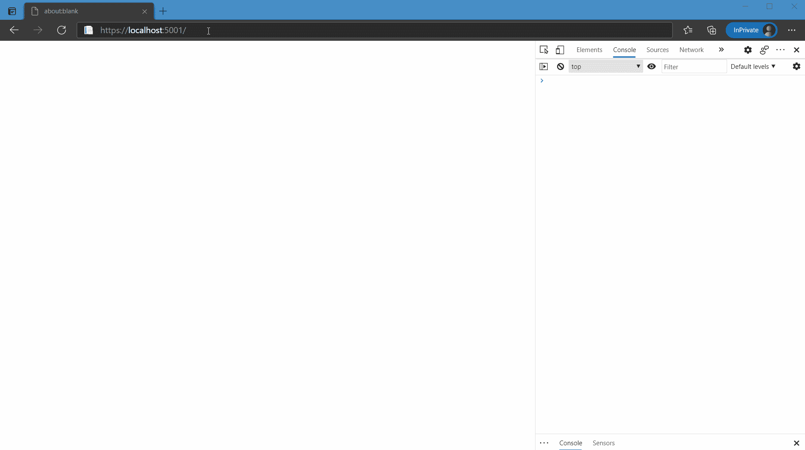
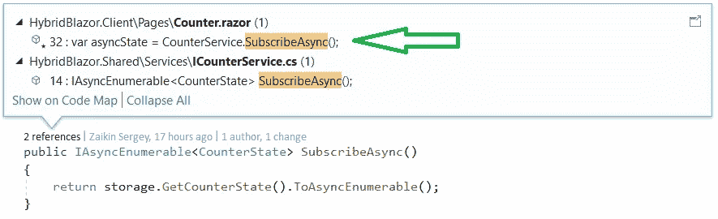

# Blazor:在运行时切换服务器和 WebAssembly

> 原文：<https://itnext.io/blazor-switching-server-and-webassembly-at-runtime-d65c25fd4d8?source=collection_archive---------1----------------------->



ASP。NET Core Blazor 是一个 web 框架，设计用于在基于 WebAssembly 的浏览器中运行客户端*。NET 运行时(Blazor WebAssembly)或者 ASP.NET 核心的*服务器端*(Blazor Server)，但是这两种模式[不能同时使用](https://github.com/dotnet/aspnetcore/issues/17678)。关于托管模型的更多信息可以在文档中找到[。](https://docs.microsoft.com/ru-ru/aspnet/core/blazor/hosting-models?view=aspnetcore-5.0)*

本文描述了如何

*   在一个应用程序中同时运行 Server 和 WebAssembly，
*   在运行时从服务器切换到 WebAssembly，无需重新加载应用程序，
*   实现通用基于 Cookie 的认证机制，
*   使用 gRPC 同步服务器和 WebAssembly 状态。

TL；博士:



[代码可在 GitHub 上获得。](https://github.com/jdtcn/HybridBlazor)

# 简介:为什么我们需要它

两种托管模式各有利弊:

Blazor 服务器优点:

*   下载的资源较小(约 250 KB)。
*   快速加载。
*   响应式用户界面。

Blazor 服务器缺点:

*   由于 DOM 的更改是在服务器上计算的，所以一个响应迅速的 UI 需要可靠而快速地连接到服务器。
*   如果连接中断，浏览器中的应用程序将停止工作。
*   如果服务器重新启动，浏览器应用程序将停止工作，界面状态将丢失。
*   难以扩展，因为客户端只能与存储其状态的服务器一起工作。

Blazor WebAssembly 优点:

*   Blazor Server 没有缺点，因为该应用程序在浏览器中离线运行。比如可以离线工作，或者做 PWA。

Blazor WebAssembly 缺点:

*   不体面的大尺寸:10-15mb。
*   由于这种大小，从链接到界面出现(第一次启动)可能需要 15-20 秒，这在现代世界已经是不可接受的了。

需要注意的是，预渲染对于两种主机模型都是可用的，它极大地提高了响应能力，我们将使用它。但是，即使启用了 WebAssembly 的预渲染，界面也将长时间保持无响应，第一次启动时为 15-20 秒，重复启动时为 5-10 秒。

为了结合服务器和 WebAssembly 的优点，我有了实现混合操作模式的想法:应用程序应该在服务器模式下运行，然后在用户不注意的情况下进入 WebAssembly 模式，例如，当在页面之间导航时。

接下来，我将告诉你我是如何实现的。

# 第 1 部分:同时运行服务器和 WebAssembly

我们需要从[在 ASP.NET 核心应用程序中托管](https://docs.microsoft.com/en-us/aspnet/core/blazor/components/prerendering-and-integration?view=aspnetcore-5.0&pivots=webassembly) WebAssembly 应用程序开始，然后启用预渲染。

有了这个配置，Blazor 在文件`[_Host.cshtml](https://github.com/jdtcn/HybridBlazor/blob/main/HybridBlazor/Server/Pages/_Host.cshtml)`中启动，向页面添加一个组件[来创建我们的应用程序的 DOM](https://docs.microsoft.com/en-us/aspnet/core/mvc/views/tag-helpers/built-in/component-tag-helper?view=aspnetcore-5.0) ，并下载使我们的应用程序具有交互性的脚本。

对于服务器，它看起来像这样:

对于这样的 WebAssembly:

因此，没有什么可以阻止我们同时加载它们:

这当然行不通。重点是`<component>`标签变成了这样的 html:

在应用程序初始化期间，Blazor 会查找这个片段，然后用应用程序的 DOM 替换它。如果脚本`blazor.server.js`和`blazor.webassembly.js`同时运行，它们将竞争第一个组件，忽略第二个组件。

如果我们只在`blazor.server.js`结束后才开始运行`blazor.webassembly.js`，这很容易避免，就像这样:

现在这两个应用程序都启动了，但是不能正常工作。问题是两个应用程序都订阅事件(点击、提交、onpush 等。)在`document`和`window`上。因此，Server 和 WebAssembly 会尝试处理彼此的事件。

我们只想让它们监听它们的`<srvr-app>`和`<wasm-app>`节点中的事件。要做到这一点，我们将不得不打破 js 最佳实践，并为窗口和文档覆盖`addEventListener`:

这两个应用程序现在都可以工作了。剩下的就是等待 WebAssembly 加载，并通过隐藏`<srvr-app>`和显示`<wasm-app>`来启用它:

让我们将这个逻辑放在文件`[blazor.hybrid.js](https://github.com/jdtcn/HybridBlazor/blob/main/HybridBlazor/Client/wwwroot/blazor.hybrid.js)`中，并将其连接到`_Host.cshtml`而不是前两个脚本。在同一个文件中，我们将放置一个函数，该函数将根据来自应用程序的信号切换放置模型。我们将从应用程序的 c#代码中调用它。

从 c#应用程序的角度，让我们创建一个`[RuntimeHeader.razor](https://github.com/jdtcn/HybridBlazor/blob/main/HybridBlazor/Client/Shared/RuntimeHeader.razor)`组件，其内容如下:

就是这样，混合应用程序正在工作。还需要增加一些便利，例如，可以在`appsettings.json`中设置运行应用的类型

`HybridType`在哪里

# 第 2 部分:身份验证

为了同时使用 Server 和 WebAssembly，我们需要创建一个适用于这两种模型的身份验证机制。

由于服务器端和客户端位于同一个应用程序中，Cookie 身份验证对我们来说很好。

让我们像往常一样配置`[Startup.cs](https://github.com/jdtcn/HybridBlazor/blob/main/HybridBlazor/Server/Startup.cs)`使用 Cookie 认证。

问题仍然有待解决:当 Blazor 服务器执行应用程序的客户端代码(通过 HTTP 调用 API)时，它将在其进程中使用 HttpClient。这意味着为了授权机制能够工作，我们需要向这个 HttpClient 实例添加客户机 cookies。让我们配置依赖注入，以便它为 Blazor 服务器创建正确的 HttpClient:

Blazor 服务器在进程中对自己的 API 请求现在将被授权。

但是在 Blazor Server 中，我们不能使用 Set-Cookie HTTP 头，因为它会为我们内部的 HttpClient 设置 Cookie。因此，对于 Blazor Server 和 Blazor WebAssembly，我们将创建`IAuthService`接口的不同实现，以强制 Blazor Server 为客户端浏览器设置 cookie。

对于 WebAssembly `[WasmAuthService.cs](https://github.com/jdtcn/HybridBlazor/blob/main/HybridBlazor/Client/WasmAuthService.cs)`和服务器`[ServerAuthService.cs](https://github.com/jdtcn/HybridBlazor/blob/main/HybridBlazor/Server/Services/ServerAuthService.cs)`。

我们现在有了一个身份验证机制，可以同时用于 Blazor 服务器和 Blazor WebAssembly。

# 第 3 部分:同步服务器和 WebAssembly 状态

这是一项艰巨的任务。如果我们限制自己在导航时将服务器切换到 WebAssembly，我们可以跳过解决它。

但是我们不会寻找简单的方法，我们将使用 gRPC 流同步组件`[Counter.razor](https://github.com/jdtcn/HybridBlazor/blob/main/HybridBlazor/Client/Pages/Counter.razor)`的状态。

为此，让我们创建一个 gRPC 服务。

并在`[CounterService.cs](https://github.com/jdtcn/HybridBlazor/blob/main/HybridBlazor/Server/Services/CounterService.cs)`中实现。

看看我们的应用程序是如何静态类型化的，在客户端的`Counter.razor`中，我们创建了一个`ICounterService`的实例:

在后端，我们看到了使用`SubscribeAsync`方法的地方:



这可以通过 [protobuf-net 实现。Grpc](https://github.com/protobuf-net/protobuf-net.Grpc) 库，它允许我们在创建 Grpc 服务时使用代码优先的方法，而不是编写*。手动创建原型文件。

让我们配置依赖注入来创建 gRPC 服务的实例:

现在我们的 DI 可以创建 gRPC 服务了。gRPC 服务中的授权检查是使用`[Authorize]`属性执行的，就像常规的 ASP.NET 核心控制器一样。在这个应用程序中，服务`[WeatherForecastService](https://github.com/jdtcn/HybridBlazor/blob/main/HybridBlazor/Server/Services/WeatherForecastService.cs)`用这个属性标记。

# 结果

事实证明，制作一个混合 ASP.NET 核心 Blazor 应用程序并不困难。该应用程序可以托管在 Kestrel、IIS (IIS 仅支持 HTTPS)和 Docker(使用 Kestrel)中。

结果项目[可以在 GitHub](https://github.com/jdtcn/HybridBlazor) 上获得。

此外，我还为 docker 发布了一张图片:

```
> docker run --rm -p 80:80/tcp jdtcn/hybridblazorserver:latest
```

您可以在任何模式下运行容器中的应用程序:

```
> docker run --rm -p 80:80/tcp jdtcn/hybridblazorserver:latest -e HybridType=HybridManual
```

您可以使用`demo`用户名和密码登录。

新的 Blazor 框架给了 c#开发者无限的想象空间。

试试吧，实验！