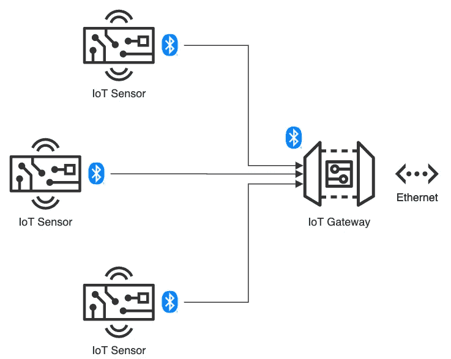
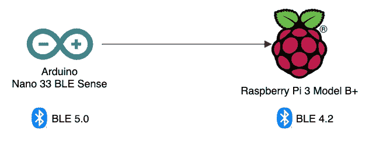
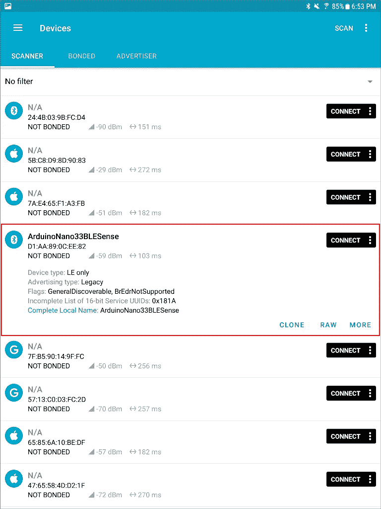
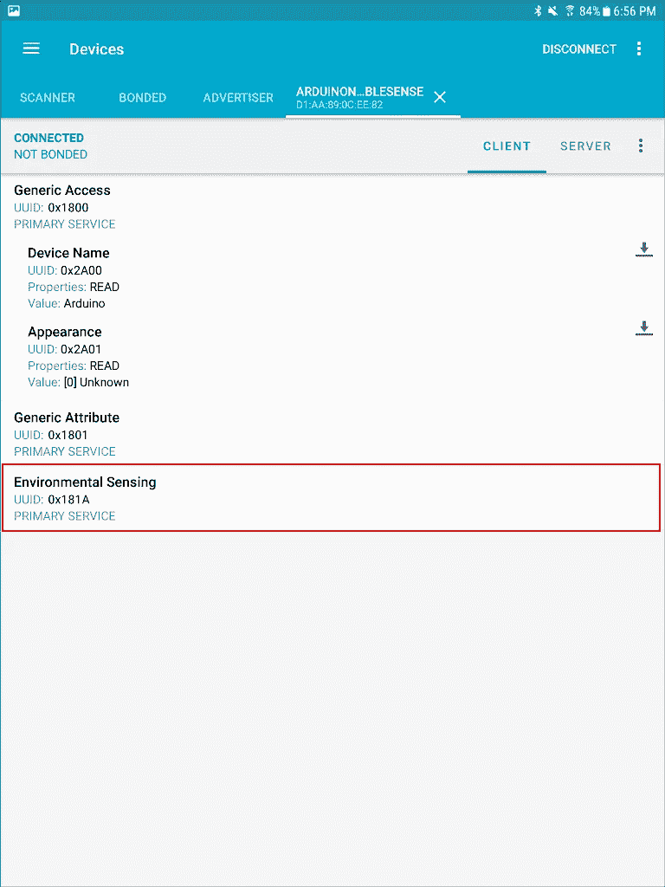
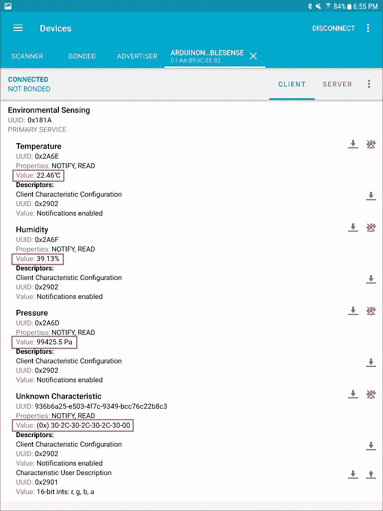
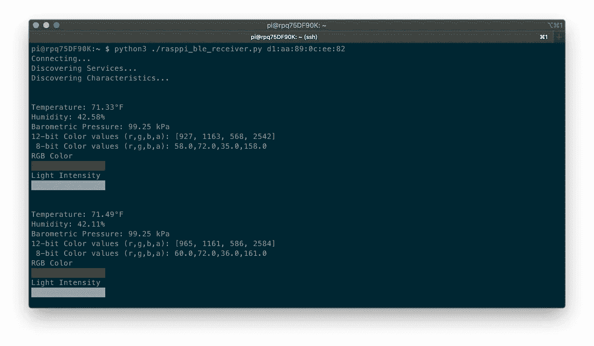

# BLE 与关贸总协定的物联网

> 原文：<https://itnext.io/ble-and-gatt-for-iot-2ae658baafd5?source=collection_archive---------1----------------------->

## 物联网蓝牙低能耗(BLE)和通用属性配置文件(GATT)规范入门

帖子的音频版本

# 介绍

根据维基百科，[蓝牙](https://en.wikipedia.org/wiki/Bluetooth)是一种无线技术标准，用于在固定和移动设备之间短距离交换数据。[蓝牙低能耗](https://en.wikipedia.org/wiki/Bluetooth_Low_Energy)(蓝牙 LE 或 BLE)是由[蓝牙特别兴趣小组](https://www.bluetooth.com/)(蓝牙 SIG)设计并推向市场的[无线个人区域网](https://en.wikipedia.org/wiki/Personal_area_network) (WPAN)技术。根据[蓝牙 SIG](https://www.bluetooth.com/learn-about-bluetooth/bluetooth-technology/radio-versions/) ，BLE 是为极低功耗操作而设计的。BLE 支持从 125 Kb/s 到 2 Mb/s 的数据速率，具有从 1 毫瓦(mW)到 100 mW 的多种功率级别。几个关键因素会影响可靠蓝牙连接的有效范围，从一公里到不到一米不等。新一代蓝牙 5 理论上比蓝牙 4.2 提供了 4 倍的范围改进，从大约 200 英尺(60 米)到 800 英尺(240 米)。

维基百科目前列出了蓝牙 SIG 定义和采用的蓝牙规范的 36 个[定义](https://en.wikipedia.org/wiki/List_of_Bluetooth_profiles)，包括[通用属性规范(GATT)规范](https://www.bluetooth.com/specifications/gatt/)。根据蓝牙 SIG，GATT 建立在[属性协议(ATT)](http://lpccs-docs.dialog-semiconductor.com/tutorial-custom-profile-DA145xx/att.html#) 之上，为 ATT 传输和存储的数据建立通用操作和框架。GATT 为 BLE 协议提供配置文件发现和描述服务。它定义了如何将 ATT 属性分组到集合中以形成服务。

鉴于其低能耗和完善的配置文件，如 GATT，与竞争协议如 [ZigBee](https://zigbeealliance.org/) 、[蓝牙 classic](https://en.wikipedia.org/wiki/Bluetooth) 和 [Wi-Fi](https://en.wikipedia.org/wiki/Wi-Fi) 相比，BLE 是用于[物联网](https://en.wikipedia.org/wiki/Internet_of_things)(物联网)设备的理想短程无线协议。在本帖中，我们将探讨如何使用 BLE 和 GATT 规范将环境传感器数据从物联网传感器传输到物联网网关。

## 物联网传感器

在本文中，我们将使用 Arduino 单板微控制器作为物联网传感器，实际上是一个传感器阵列。2019 年 8 月发布的 3.3V 支持人工智能的 [Arduino Nano 33 BLE 感应](https://store.arduino.cc/usa/nano-33-ble-sense-with-headers)板，配备了 Nordic Semiconductors 的强大 [nRF52840](https://www.nordicsemi.com/Products/Low-power-short-range-wireless/nRF52840) 处理器，一个运行频率为 64 MHz 的 32 位 ARM Cortex-M4 CPU，1MB 的 CPU 闪存，256KB 的 SRAM，以及一个 [NINA-B306](https://www.u-blox.com/en/product/nina-b3-series-open-cpu) 独立蓝牙 5 低能耗模块。


试验板上的 Arduino Nano 33 BLE 传感器(带接头)

Sense 还包含一系列令人印象深刻的嵌入式传感器:

*   9 轴惯性传感器( [LSM9DS1](https://content.arduino.cc/assets/Nano_BLE_Sense_lsm9ds1.pdf) ): 3D 数字线加速度传感器、3D 数字
    角速度传感器、3D 数字磁传感器
*   湿度和温度传感器( [HTS221](https://content.arduino.cc/assets/Nano_BLE_Sense_HTS221.pdf) ):电容式数字相对湿度和温度传感器
*   气压传感器( [LPS22HB](https://content.arduino.cc/assets/Nano_BLE_Sense_lps22hb.pdf) ): MEMS 纳米压力传感器:260–1260 百帕(hPa)绝对数字输出气压计
*   麦克风( [MP34DT05](https://content.arduino.cc/assets/Nano_BLE_Sense_mp34dt05-a.pdf) ): MEMS 音频传感器全向数字麦克风
*   手势、接近度、光色和光强传感器( [APDS9960](https://content.arduino.cc/assets/Nano_BLE_Sense_av02-4191en_ds_apds-9960.pdf) ):高级手势检测、接近度检测、数字环境光感测(ALS)和颜色感测(RGBC)。

Sense 是一款出色的[低成本](https://www.amazon.com/Arduino-Nano-Sense-headers-Mounted/dp/B07WXKDVTL)单板微控制器，用于学习收集和传输物联网传感器数据。

## 物联网网关

根据 [TechTarget](https://whatis.techtarget.com/definition/IoT-gateway) 的说法，物联网网关是一种物理设备或软件程序，充当云与控制器、传感器和智能设备之间的连接点。所有移动到云的数据都要经过网关，反之亦然，网关可以是专用的硬件设备或软件程序。



在本帖中，我们将使用最新一代的 [Raspberry Pi 3 Model B+](https://www.raspberrypi.org/products/raspberry-pi-3-model-b-plus/) 单板计算机(SBC)，作为物联网网关。这款 Raspberry Pi 型号具有 1.4GHz Cortex-A53 (ARMv8) 64 位四核处理器片上系统(SoC)、1GB LPDDR2 SDRAM、双频无线局域网、蓝牙 4.2 BLE 和千兆以太网。

*按照本文，您可以用 Raspberry Pi 替代任何基于 Linux 的机器来运行包含的示例 Python 脚本。*


树莓 Pi 3 型号 B+

Arduino 将通过 BLE 向 Raspberry Pi 传输物联网传感器遥测数据。Raspberry Pi 使用 Wi-Fi 或以太网，能够安全地将传感器遥测数据传输到云端。在蓝牙[术语](https://learn.adafruit.com/introduction-to-bluetooth-low-energy/gap)中，蓝牙外围设备(*又名* GATT 服务器)，也就是 Arduino，会将数据传输到蓝牙中央设备(*又名* GATT 客户端)，也就是树莓派。



## Arduino 草图

对于那些不熟悉 Arduino 的人来说，一个[草图](https://www.arduino.cc/en/tutorial/sketch)是 Arduino 为一个程序使用的名字。它是上传到非易失性闪存并在 Arduino 板上运行的代码单元。Arduino 语言是一组 C/C++函数。avr-g++ 编译器支持的所有标准 C 和 C++结构都应该可以在 Arduino 中工作。

对于本文，草图 [combo_sensor_ble.ino](https://github.com/garystafford/iot-ble-demo/blob/master/combo_sensor_ble/combo_sensor_ble.ino) 包含了收集环境传感器遥测数据所需的所有代码，包括温度、相对湿度、大气压力、环境光和 RGB 颜色。这篇文章的所有代码，包括草图，都可以在 [GitHub](https://github.com/garystafford/iot-ble-demo) 上找到。

传感器遥测将由 Sense 在 BLE 宣传为具有多种 GATT 特征的 [GATT 环境传感服务](https://www.bluetooth.com/specifications/gatt/characteristics/) (GATT 指定编号 [0x181A](https://www.bluetooth.com/specifications/assigned-numbers/environmental-sensing-service-characteristics/) )。每个特性代表一个传感器读数，并包含最新的传感器值，例如温度( [0x2A6E](https://www.bluetooth.com/xml-viewer/?src=https://www.bluetooth.com/wp-content/uploads/Sitecore-Media-Library/Gatt/Xml/Characteristics/org.bluetooth.characteristic.temperature.xml) )或湿度( [0x2A6F](https://www.bluetooth.com/xml-viewer/?src=https://www.bluetooth.com/wp-content/uploads/Sitecore-Media-Library/Gatt/Xml/Characteristics/org.bluetooth.characteristic.humidity.xml) )。

每个 GATT 特性都定义了数据应该如何表示。为了准确地表示数据，需要修改传感器读数。例如，使用 [ArduinoHTS221 库](https://www.arduino.cc/en/Reference/ArduinoHTS221)，以两位小数精度捕捉温度(如 22.21°C)。然而，温度 GATT 特性(0x2A6E)需要一个带符号的 16 位值(-32，768–32，767)。为了保持精度，将捕获的值(例如，22.21°C)乘以 100 以将其转换为整数(例如，2221)。然后，Raspberry Pi 将以正确的精度将该值转换回原始值。

GATT 规范没有表示环境光和 RGB 颜色的当前预定义特征。因此，我为颜色值创建了一个自定义特征，并为其分配了一个通用的唯一标识符(UUID)。

根据文档，环境光和 RGB 颜色被捕获为 16 位值(范围为 0–65，535)。然而，使用 [ArduinoAPDS9960 库](https://www.arduino.cc/en/Reference/ArduinoAPDS9960)，我发现读数的范围在 0–4097 之间。不用深入杂草，最大计数(或饱和度)值是可变的。它可以基于积分时间和计数寄存器的大小(例如，16 位)来计算。在库文件 Arduino_APDS9960.cpp 中，ADC 积分时间似乎设置为 10 ms。

RGB 值通常表示为 [8 位颜色](https://en.wikipedia.org/wiki/8-bit_color)。我们可以在发送之前将值转换为 8 位，或者稍后在 Raspberry Pi 物联网网关上处理它。为了演示数据传输效率，草图将 12 位值连接成一个字符串(例如，`4097,2811,1500,4097`)。该字符串将在树莓 Pi 上从 12 位转换为 8 位(如`255,175,93,255`)。

## 预览和调试 BLE 设备服务

在查看运行在 Raspberry Pi 上的代码之前，我们可以使用任意数量的移动应用程序来预览和调试运行在 Arduino 上并在 BLE 广告的环境感知服务。一个普遍推荐的应用程序是 Nordic Semiconductor 的 [nRF Connect for Mobile](https://www.nordicsemi.com/Software-and-tools/Development-Tools/nRF-Connect-for-mobile) ，可在 [Google Play](https://play.google.com/store/apps/details?id=no.nordicsemi.android.mcp&hl=en_US) 上获得。我发现 Android 版本在正确解释和显示 GATT 特征值方面比 iOS 版本更好。

下面，我们看到一个扫描我的本地附近的 BLE 设备广告，使用 nRF 连接移动应用程序的 Android 版本。请注意 BLE 设备 ArduinoNano33BLESense(用红色表示)。另外，请注意 BLE 设备的媒体访问控制地址(MAC 地址)，在我的例子中是`d1:aa:89:0c:ee:82`。物联网网关稍后将需要 MAC 地址。



连接到设备，我们看到三个服务。环境传感服务(以红色表示)包含传感器读数。



深入到环境感知服务(0x181A)，我们看到四个预期特征:温度(0x2A6E)、湿度(0x2A6F)、压力(0x2A6D)和未知特征(936 b6a 25-e503–4f7c-9349-bcc 76 c 22 b 8 c 3)。由于 nRF Connect 无法将颜色传感器读数识别为注册的 GATT 特性(没有 GATT 分配的编号)，因此它显示为未知特性。尽管温度、湿度和压力值(以红色表示)被正确解释和显示，但颜色传感器读数仍为原始十六进制文本(例如，`30-2c-30-2c-30-2c-30-00`或`0,0,0,0`)。



这些结果表明一切都在按预期运行。

## BLE 客户端 Python 代码

作为 BLE 客户端(也称为中央设备)，Raspberry Pi 运行一个 Python 脚本。脚本 [rasppi_ble_receiver.py](https://github.com/garystafford/iot-ble-demo/blob/master/rasppi_ble_receiver.py) 使用 [bluepy](https://github.com/IanHarvey/bluepy) Python 模块通过 Linux 上的 [Bluez](http://www.bluez.org/) 与 ble 设备接口。

要运行 Python 脚本，请执行以下命令，将 MAC 地址参数替换为您自己的 BLE 设备通告的 MAC 地址。

```
python3 ./rasppi_ble_receiver.py d1:aa:89:0c:ee:82
```

与 nRF Connect 应用程序不同，bluepy Python 模块无法正确解释和显示 GATT 特征值。因此，该脚本从 Arduino 获取原始的十六进制文本，并将其转换为正确的值。例如，温度读数必须从字节`b'\xb8\x08\x00\x00'`转换为字节数组`bytearray(b'\xb8\x08\x00\x00')`，然后转换为整数`2232`，再转换为小数`22.32`，最后转换为华氏温标`72.18°F`。

每两秒钟从 BLE 设备中检索一次传感器读数。除了显示数字传感器读数，Python 脚本还使用 [colr](https://pypi.org/project/Colr/) Python 模块显示 8 位 RGB 颜色的颜色样本，以及表示光强度的灰度样本。



以下屏幕记录显示了 Arduino 串行监视器和 Raspberry Pi 终端输出的并行视图。当 Python 脚本启动时，Raspberry Pi(中央设备)连接到 Arduino(外围设备)。Raspberry Pi 成功读取并解释来自环境传感服务的遥测数据。

# 结论

在本文中，我们探讨了如何使用 BLE 和 GATT 规范将环境传感器数据从外围设备传输到中央设备。鉴于其低能耗和完善的配置文件，如 GATT，蓝牙低能耗(BLE)是物联网设备的理想短程无线协议。

这篇博客代表我自己的观点，而不是我的雇主亚马逊网络服务公司的观点。