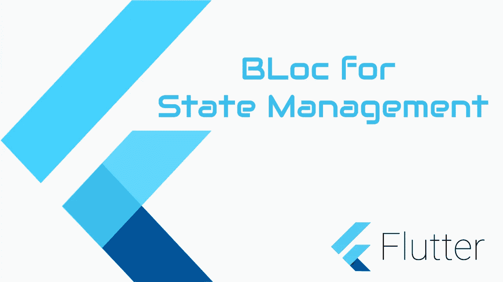
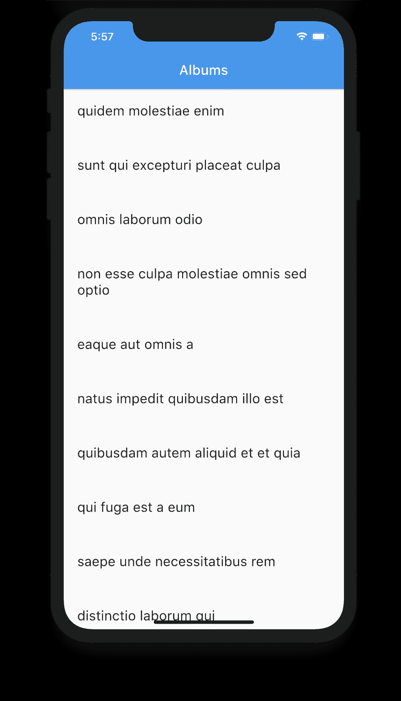

# 用实例解释颤振中阻塞模式

> 原文：<https://itnext.io/bloc-pattern-in-flutter-explained-with-real-example-a858e69eb5b8?source=collection_archive---------0----------------------->

在本文中，我们将通过一个简单实际例子来学习状态管理中的阻塞模式。你可以在这里找到本教程的第二部分[。](/theming-your-app-in-flutter-using-bloc-save-reload-62048a330584)



阻塞颤振状态管理

# **观看视频教程**

订阅我的[频道](https://www.youtube.com/channel/UC5lbdURzjB0irr-FTbjWN1A)获取更多视频。

对于这个例子，我们将尝试使用一个 web 服务。我们将要使用的服务是

https://jsonplaceholder.typicode.com/albums

***什么集团？***

块有助于分离表示和业务逻辑。

因此，简单地说，我们将在 bloc 文件中编写所有的业务逻辑。

*Bloc 基本上做的是，它接受一个事件和一个状态，并返回一个新的状态，我们将使用它来更新 UI。*

如果已经阻塞，就不需要在应用程序中维护任何本地状态。

让我们开始…

我们将首先编写一个使用 web 服务的服务类。

# 添加依赖关系

打开您的 *pubspec.yaml* 文件添加依赖项

添加本例所需的所有依赖项

```
dependencies:
    flutter:
        sdk: flutter    cupertino_icons: ^0.1.2
    flutter_bloc: ^6.0.4
    equatable: ^1.2.4
    http: ^0.12.2
```

**http** 包从 web 服务中获取数据。

**颤振 _ 阻塞**用于使用阻塞模式。

**等价的**用于比较对象。

让我们首先为服务响应创建模型类。

# 模型类

下面是服务响应的响应类

```
import 'dart:convert';List<Album> albumFromJson(String str) =>
    List<Album>.from(json.decode(str).map((x) => Album.fromJson(x)));String albumToJson(List<Album> data) =>
    json.encode(List<dynamic>.from(data.map((x) => x.toJson())));class Album {
  Album({
    this.userId,
    this.id,
    this.title,
  });int userId; int id;
  String title;factory Album.fromJson(Map<String, dynamic> json) => Album(
        userId: json["userId"],
        id: json["id"],
        title: json["title"],
      );Map<String, dynamic> toJson() => {
        "userId": userId,
        "id": id,
        "title": title,
      };
}
```

一旦我们有了模型类，我们就为服务消费做好了准备。

让我们创建服务文件并获取数据。

创建一个名为“ *services.dart* 的新文件，并复制下面的。

```
import 'package:flutter_demos/model/albums_list.dart';
import 'package:http/http.dart' as http;
import 'package:http/http.dart';abstract class AlbumsRepo {
  Future<List<Album>> getAlbumList();
}class AlbumServices implements AlbumsRepo {
  //
  static const _baseUrl = 'jsonplaceholder.typicode.com';
  static const String _GET_ALBUMS = '/albums';[@override](http://twitter.com/override)
  Future<List<Album>> getAlbumList() async {
    Uri uri = Uri.https(_baseUrl, _GET_ALBUMS);
    Response response = await http.get(uri);
    List<Album> albums = albumFromJson(response.body);
    return albums;
  }
}
```

现在让我们使用 BLOC 将数据发送到 UI。

# 事件

这里我们只有一个事件— *fetchAlbums* 。

让我们创建一个名为 *events.dart* 的类，并添加下面的枚举。

```
enum AlbumEvents {
  fetchAlbums,
}
```

# 州

以下是我们开始从服务中获取相册时的状态。

所以通常我们会有状态…

1.  白蛋白初始状态
2.  白蛋白加载
3.  装载白蛋白
4.  白蛋白列表错误

创建一个名为“ *states.dart* 的文件，并复制下面的代码。

```
import 'package:equatable/equatable.dart';
import 'package:flutter_demos/model/albums_list.dart';abstract class AlbumsState extends Equatable {
  [@override](http://twitter.com/override)
  List<Object> get props => [];
}class AlbumsInitState extends AlbumsState {}class AlbumsLoading extends AlbumsState {}class AlbumsLoaded extends AlbumsState {
  final List<Album> albums;
  AlbumsLoaded({this.albums});
}class AlbumsListError extends AlbumsState {
  final error;
  AlbumsListError({this.error});
}
```

这里我们扩展了“Equatable”类，它有助于比较对象。它需要一个覆盖，我们可以提供需要比较的属性，以确定两个对象是否相等。为了简单起见，我们将保持它为空。

# 阻止获取相册

让我们创建一个名为“ **AlbumsBloc** 的类，它扩展了 Bloc。

```
import 'dart:io';
import 'package:flutter_bloc/flutter_bloc.dart';
import 'package:flutter_demos/api/exceptions.dart';
import 'package:flutter_demos/api/services.dart';
import 'package:flutter_demos/bloc/albums/events.dart';
import 'package:flutter_demos/bloc/albums/states.dart';
import 'package:flutter_demos/model/albums_list.dart';class AlbumsBloc extends Bloc<AlbumEvents, AlbumsState> {

  final AlbumsRepo albumsRepo;
  List<Album> albums;AlbumsBloc({this.albumsRepo}) : super(AlbumsInitState());[@override](http://twitter.com/override)
  Stream<AlbumsState> mapEventToState(AlbumEvents event) async* {
    switch (event) {
      case AlbumEvents.fetchAlbums:
        yield AlbumsLoading();
        try {
          albums = await albumsRepo.getAlbumList();
          yield AlbumsLoaded(albums: albums);
        } on SocketException {
          yield AlbumsListError(
            error: NoInternetException('No Internet'),
          );
        } on HttpException {
          yield AlbumsListError(
            error: NoServiceFoundException('No Service Found'),
          );
        } on FormatException {
          yield AlbumsListError(
            error: InvalidFormatException('Invalid Response format'),
          );
        } catch (e) {
          yield AlbumsListError(
            error: UnknownException('Unknown Error'),
          );
        }break;
    }
  }
}
```

在上面的 bloc 类中，您可以看到我们有一个实例变量“AlbumsRepo”。

您需要向 BLoC 构造函数提供一个初始状态。

所以我们有了“AlbumsInitState”。

“mapEventToState”是一个异步*函数，这意味着它可以在不终止函数的情况下返回数据。这里我们使用 **yield** 在适当的时候返回专辑状态之一。

即当加载开始时…上述函数将向 UI 返回 *AlbumsLoading* 状态，然后当数据返回时，随同相册返回' *AlbumsLoaded* '，然后如果有任何错误，返回' *AlbumsListError* '并带有适当的异常，最后这里是我们的异常类。

```
class NoInternetException {
  var message;
  NoInternetException(this.message);
}class NoServiceFoundException {
  var message;
  NoServiceFoundException(this.message);
}class InvalidFormatException {
  var message;
  InvalidFormatException(this.message);
}class UnknownException {
  var message;
  UnknownException(this.message);
}
```

如果你愿意，Dart 允许抛出任何类作为异常。

# 屏幕

现在让我们创建一个监听这些事件的屏幕。

```
import 'package:flutter/material.dart';
import 'package:flutter_bloc/flutter_bloc.dart';
import 'package:flutter_demos/bloc/albums/bloc.dart';
import 'package:flutter_demos/bloc/albums/events.dart';
import 'package:flutter_demos/bloc/albums/states.dart';
import 'package:flutter_demos/model/albums_list.dart';
import 'package:flutter_demos/widgets/error.dart';
import 'package:flutter_demos/widgets/list_row.dart';
import 'package:flutter_demos/widgets/loading.dart';class AlbumsScreen extends StatefulWidget {
  [@override](http://twitter.com/override)
  _AlbumsScreenState createState() => _AlbumsScreenState();
}class _AlbumsScreenState extends State<AlbumsScreen> {
  //
  [@override](http://twitter.com/override)
  void initState() {
    super.initState();
    _loadAlbums();
  }_loadAlbums() async {
    context.bloc<AlbumsBloc>().add(AlbumEvents.fetchAlbums);
  }[@override](http://twitter.com/override)
  Widget build(BuildContext context) {
    return Scaffold(
      appBar: AppBar(
        title: Text('Albums'),
      ),
      body: Container(
        child: _body(),
      ),
    );
  }_body() {
    return Column(
      children: [
        BlocBuilder<AlbumsBloc, AlbumsState>(
            builder: (BuildContext context, AlbumsState state) {
          if (state is AlbumsListError) {
            final error = state.error;
            String message = '${error.message}\nTap to Retry.';
            return ErrorTxt(
              message: message,
              onTap: _loadAlbums,
            );
          }
          if (state is AlbumsLoaded) {
            List<Album> albums = state.albums;
            return _list(albums);
          }
          return Loading();
        }),
      ],
    );
  }Widget _list(List<Album> albums) {
    return Expanded(
      child: ListView.builder(
        itemCount: albums.length,
        itemBuilder: (_, index) {
          Album album = albums[index];
          return ListRow(album: album);
        },
      ),
    );
  }
}
```

我们创建的 AlbumsScreen 有一个名为 BlocBuilder 的小部件，它具有类型“AlbumsBloc 和 AlbumsState”。这个小部件将监听来自 bloc 文件的更改并更新 UI。

在这里，您可以看到 BlocBuilder 有一个“Builder”属性，该属性有一个状态变量，可以让我们访问返回的状态。

那我们怎么触发它。

```
context.bloc<AlbumsBloc>().add(AlbumEvents.fetchAlbums);
```

上述调用将触发“fetchAlbums”事件，该事件将触发阻塞并返回状态。最初它将返回 AlbumLoading 状态，然后如果调用成功，它将返回 AlbumsLoaded 状态等。Rest 很简单，根据状态更新 UI。当调用成功时，我们在这里显示一个相册列表。

# 主要部分

**BlocBuilder** 接收事件来更新 UI。但是应该有提供者，正确。所以您需要用 BlocProvider 包装 AlbumsScreen。所以我们的想法是，想要监听 AlbumBloc 更新的屏幕应该用下面的 **BlocProvider** 包装自己。

```
class MyApp extends StatelessWidget {
  [@override](http://twitter.com/override)
  Widget build(BuildContext context) {
    return MaterialApp(
      title: 'Flutter Bloc Demo',
      debugShowCheckedModeBanner: false,
      theme: ThemeData(
        primarySwatch: Colors.blue,
        visualDensity: VisualDensity.adaptivePlatformDensity,
      ),
      home: BlocProvider(
        create: (context) => AlbumsBloc(albumsRepo: AlbumServices()),
        child: AlbumsScreen(),
      ),
    );
  }
}
```

在这里，您可以看到“AlbumsBloc”正在接收“album services”repo，该 repo 获取相册。

就是这样。



喜欢这个帖子的请鼓掌…

记住，你最多可以打 50 个拍子。

***如果你觉得我的文章有用，请给我买杯咖啡***

[](https://www.buymeacoffee.com/vipinvijayan) [## Vipin Vijayan

### 嘿👋我刚刚在这里创建了一个页面。你现在可以给我买杯咖啡了！

www.buymeacoffee.com](https://www.buymeacoffee.com/vipinvijayan) 

# 源代码

[https://bit bucket . org/vipinvijayan 1987/tutorial projects/src/bloc simple/fluttertutorial projects/flutter _ demos/](https://bitbucket.org/vipinvijayan1987/tutorialprojects/src/BlocSimple/FlutterTutorialProjects/flutter_demos/)