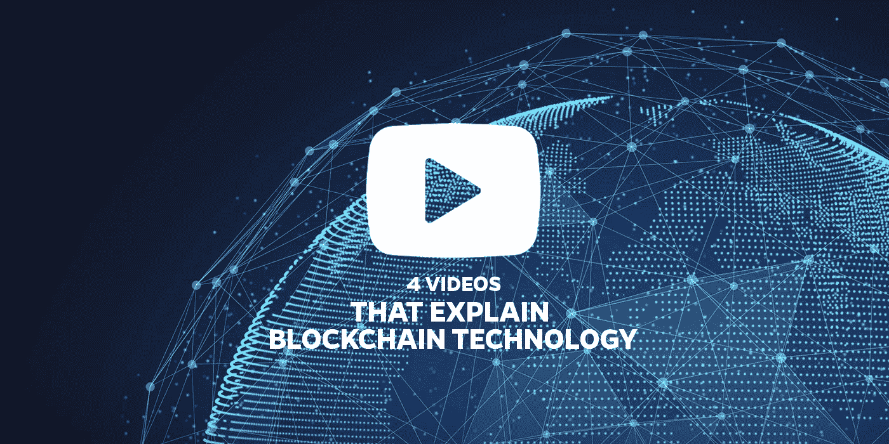
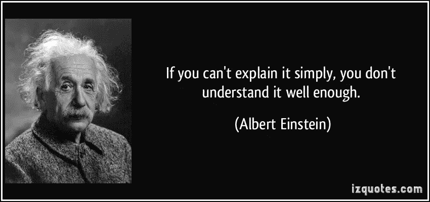

# 4 个视频讲解区块链

> 原文：<https://itnext.io/blockchain-explained-in-4-videos-7b6d14e0312f?source=collection_archive---------0----------------------->

## 通过这些视频更好地了解区块链

两年前，让你的初创公司获得投资的诀窍是大喊:“我们正在使用区块链！”区块链[是](https://medium.com/@pavelkravchenko/decline-of-blockchain-hype-and-rise-of-a-common-sense-8de5789a794d)这个没有人理解的神奇术语，却有着“下一个大事件”的标签。这就是为什么投资者疯狂投资那些声称正在使用它的公司。如果这些创业公司中只有一家赚了大钱，投资者就会变得(更加)疯狂富有。

向下滚动查看解释区块链技术的四个精选视频。

# 繁荣了吗？它是活的吗？

两年后的今天，我们看到像 [ING](https://www.ingwb.com/insights/news/2017/compelling-results-for-blockchain-oil-trade-test-ing-and-societe-generale) 这样的大公司用区块链作为存储合同的方式执行[试点](https://twitter.com/maurice_roos/status/894457374244691968)。埃森哲和联合国已经创建了一个[解决方案](http://fortune.com/2017/06/19/id2020-blockchain-microsoft/)，将在区块链内登记世界各地的难民。

我对区块链技术几乎一无所知，想了解一下正在发生的事情。在 Blockchain 作为一种新技术被引入前沿科技初创公司近三年后，人们、住房和公司的注册被承诺将通过 Blockchain 开放。但是它仍然不在这里。这个区块链是什么，真的会是一场革命吗？

# 不看书，这里有一些视频

由于一张图片胜过千言万语，这里有几个视频以每个人都能理解的方式解释了这项复杂的技术。我选择了这些视频，这样你可以一个一个地看，最后有一个清晰的认识。视频之间有一些重叠，但这将有助于更好地理解。

## 两分钟看懂区块链(IFTF 2m25)

由[未来研究院](http://www.iftf.org/home/) (IFTF)制作的这个视频**清晰**，**快速**，并且给出了关于区块链技术是什么的很好的**见解**。

[https://www.youtube.com/watch?v=r43LhSUUGTQ](https://www.youtube.com/watch?v=r43LhSUUGTQ)

## 比特币和加密货币技术的真正价值——区块链讲解(DutchChain 6m15)

有点枯燥:)但清晰，有助于提炼之前视频的信息。观看只需要 6 分钟。这个视频是由荷兰连锁组织制作的。

https://www.youtube.com/watch?v=YIVAluSL9SU

## 区块链技术讲解:什么是区块链？(通行证 4m)

相当清晰的故事由 [PassKit](https://passkit.com/) …..

[https://www.youtube.com/watch?v=eXJHPDs4M3Y](https://www.youtube.com/watch?v=eXJHPDs4M3Y)

## 比特币如何在 5 分钟内发挥作用(技术)( [CuriousInventor](https://www.youtube.com/channel/UCOGrxFj_j7PZRQM63OFCwmA) 5m25)

在这个视频中，解释了网络投票的部分。投票是区块链中必不可少的部分，决定了区块链中交易的合法性。

[https://www.youtube.com/watch?v=l9jOJk30eQs](https://www.youtube.com/watch?v=l9jOJk30eQs)

# 区块链定义

维基百科[上对“区块链”的定义是“一个分布式数据库，用于维护一个不断增长的记录列表，称为块……从设计上来说，区块链天生就抵制对数据的修改。”](https://en.wikipedia.org/wiki/Blockchain)

在其核心，区块链背后的数据库是一个包含所有交易记录的分类账。分类账是分布式的，这意味着没有保存记录的单一中心点。它提供了一种透明的方式，在这种方式下，双方之间的交易是可验证的并且被永久存储。任何所有权交易都可以存储到区块链中。

如果你有更多的时间阅读，你可以在 ITNEXT 上查看[这篇](/what-is-blockchain-technology-735a19951ff9)文章，其中[关于区块链的最常见问题](/what-is-blockchain-technology-735a19951ff9)由 [Ivo van der Nagel](https://medium.com/u/8848e883ddee?source=post_page-----7b6d14e0312f--------------------------------) 回答。

另一个很棒的读物是这本由 IBM 制作的[傻瓜区块链](https://public.dhe.ibm.com/common/ssi/ecm/xi/en/xim12354usen/XIM12354USEN.PDF)书。如果你在看完视频和阅读上面提到的文章后需要更多的背景信息和更好的理解，你可以阅读它。

[http://izquotes.com/quote/56365](http://izquotes.com/quote/56365)

# 区块链总结

在各种视频和[文章](https://samwouters.com/what-is-the-blockchain/)中，区块链被总结为(至少)使用以下三组特征中的一组。

**未就关键特征达成共识**

我觉得这个很有意思:2009 年，区块链第一次实现。这项技术仍然很新，甚至在关键特征上也没有共识。突然出现的一个大问题是:这是一个大炒作，还是只是一些如此复杂的事情，不是每个人都理解它？如果这只是一个大炒作，为什么风险投资家要投资数百万在它上面。为什么联合国把难民的生命押在这上面？

每个人似乎都梦想有一个更点对点的贵重物品登记网络。对人们来说，贵重物品是什么并不重要，可以是钱、房子、文件或身份。人们梦想着不依赖政府或金融机构时会发生什么。消除繁文缛节以提高速度，降低交易成本，并为机器对机器的交易创造机会是许多科幻故事的主要成分。

而这些梦想家[忽略了](http://sloanreview.mit.edu/article/seeing-beyond-the-blockchain-hype/)区块链技术这个复杂的中心。他们忽略或者不知道，只有给定特定的规则或者规则的平衡，它才起作用。这就是我担心的地方。例如:只有当网络相对较大时，交易有效的共识模型才有效，否则拥有大型 bot 农场的人可以接管网络。

当没有巨大的动力去创造一个想要建造区块链的大型计算机网络时，区块链又能增加什么呢？

正如尼古拉·汉普顿所写的:

> “比特币区块链受到大规模集体挖矿活动的保护。任何私人区块链都不太可能试图使用千兆瓦的计算能力来保护记录——这既耗时又昂贵。在一个私人的区块链也没有“种族”；没有动力比竞争对手使用更多的功率或更快地发现数据块。这意味着许多内部区块链解决方案将只不过是笨重的数据库。”—[https://www . computer world . com . au/article/606253/understanding-区块链-hype-why-much-it-not-than-snake-oil-spin/](https://www.computerworld.com.au/article/606253/understanding-blockchain-hype-why-much-it-nothing-more-than-snake-oil-spin/)

**你对区块链技术的愿景是什么？在下面的评论中分享你的想法吧！**