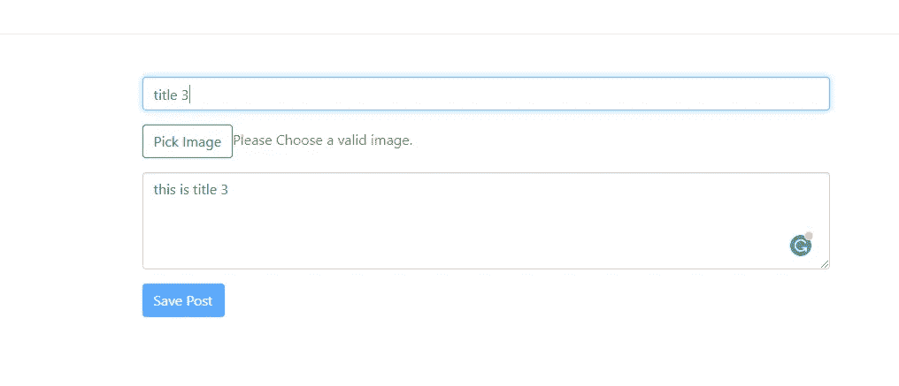

# 使用 MERN 堆栈的博客应用程序

> 原文：<https://itnext.io/blog-app-using-mern-stack-b0b4d69d7ea1?source=collection_archive---------0----------------------->

## 博客应用程序使用 mern 栈技术与完整的认证系统。

## github:【https://github.com/mehulk05/Blogapp-using-MERN 

## 现场演示:[https://mehulk05.github.io/Blogapp-using-MERN/](https://mehulk05.github.io/Blogapp-using-MERN/#/)

## 博客:[https://blogs-by-mehul . blogspot . com/2021/01/blog-app-using-mern-stack . html](https://blogs-by-mehul.blogspot.com/2021/01/blog-app-using-mern-stack.html)

## 我们正在创造的演示


完整的应用程序演示

# 让我们理解 means 斯塔克是什么意思。

*   这是一个开源的 NoSQL 跨平台面向文档的数据库。
*   `Express JS`–这是一个基于 web 的应用程序框架，与 Node JS 一起工作，它有助于构建 web 应用程序和 RESTful APIs。
*   `React`–React 是由**脸书创建的 **JavaScript** 库。** React 是一个**用户界面** (UI)库。React 是一个构建 **UI 组件**的工具
*   `Node JS`–这是一个免费的 JavaScript 运行时环境，它在浏览器之外执行 JavaScript 代码。它适用于 macOS、Windows、Linux 和 Unix。

# 我将使用以下插件和工具来创建 MERN 堆栈应用程序。

*   [节点 JS](https://nodejs.org/en/)
*   [MongoDB](https://www.mongodb.com/)
*   [猫鼬 JS](https://mongoosejs.com/)
*   [快递 JS](https://expressjs.com/)
*   [反应堆](https://reactjs.org/)
*   [Visual Studio 代码](https://code.visualstudio.com/)

# #1 设置节点 JS 开发环境

跟随此链接到[在您的系统中设置节点 JS。](https://nodejs.org/en/download/)只需根据您的系统位(即 32 位和 64 位以及操作系统)下载并安装节点

# #2 建立一个节点。JS 后端

为了编写易于管理的代码，我们应该将 MERN 堆栈后端文件夹分开。在 React 的根目录下用后端的名字或者任何你喜欢的名字创建一个文件夹。这个文件夹将处理我们的应用程序的后端代码，记住它将有来自 React 的单独的 node_modules 文件夹。

```
mkdir backend
cd backend
npm init -y
```

以上命令将带您进入后端文件夹，然后使用所有默认配置生成 package.json。

## –安装和配置 MERN 堆栈应用程序开发所需的 NPM 软件包

使用以下命令安装以下节点模块。

```
npm install --save body-parser cors express mongoose
```

*   **body-parser:**body-parser NPM 模块是一个 JSON 解析中间件。它有助于解析 JSON 数据、纯文本或整个对象。
*   **CORS** :这是一个 Node JS 包，也叫 express js 中间件。它允许启用具有多个选项的 CORS。可通过国家预防机制登记处获取。
*   **Express.js** : Express js 是一个免费开源的 Node js web 应用框架。它帮助创建 web 应用程序和 RESTful APIs，并充当中间件
*   **mongose**:mongose 是节点的 MongoDB ODM。它允许您与 MongoDB 数据库进行交互。

每次进行更改时启动和停止服务器是一项耗时的任务。为了解决这个问题，我们使用了`nodemon`NPM 模块。每次我们做出更改时，该软件包都会自动重启服务器。我们将使用下面给出的命令在本地安装它。

```
npm install nodemon --save-dev
```

此外，确保将 package.json 更改为启动 nodemon

# #3 后端的文件夹结构


# #4 编写 App.js

```
const path = require("path");
const express = require("express")
const mongoose = require("mongoose")const db = require("./db/db")
const postRouter = require("./Routes/post");const app = express();
app.use(bodyParser.json());
app.use(bodyParser.urlencoded({
   extended: false
}));
app.use(cors());const PORT = process.env.PORT || 3000app.use("/api/posts", postRouter)app.listen(PORT, (req, res) => {
console.log(`app is listening to PORT ${PORT}`)
})
```

# #5 编写 db.js

要创建数据库，您可以到[这里](https://www.mongodb.com/cloud/atlas)注册并创建一个新的数据库。此外，您将获得我将在代码中使用的连接 URL

```
const mongoose = require('mongoose');mongoose.Promise = global.Promise;const url = "mongodb://testuser:<password>[@cluster0-shard-00-00.ecaql.mongodb.net](mailto:9eVH8YT0rVZ0X1uj@cluster0-shard-00-00.ecaql.mongodb.net):27017?ssl=true&replicaSet=atlas-ceza4t-shard-0&authSource=admin&retryWrites=true&w=majority"// Connect MongoDB at default port 27017.let mong = mongoose.connect(url, {
    useNewUrlParser: true,
    useCreateIndex: true,
    useUnifiedTopology: true
}, (err) => {
    if (!err) {
        console.log('MongoDB Connection Succeeded.')
    } else {
        console.log('Error in DB connection: ' + err)
    }
});
```

# #6 用 Mongoose JS 创建模型

```
const mongoose = require('mongoose');const Post = mongoose.model('Post', {
    title: {
        type: String,
        required: true
    },content: {
        type: String,
        required: true
    },

});module.exports = Post
```

# #7 使用快速 JS 路线创建 RESTful APIs

# **# 8 创建前端**

现在，我们将创建一个全新的 react 项目，我们将设置 react 项目与我们在上述步骤中创建的后端进行交互。

1.  **创建 React 应用**

```
npx create-react-app Blogapp-using-mern
cd Blogapp-using-mern
npm start
```

**2。在 Index.js 中设置 Axios**

```
axios.defaults.baseURL = '[https://zany-periodic-fisherman.glitch.me/api'](https://zany-periodic-fisherman.glitch.me/api');let userData = JSON.parse(localStorage.getItem("userData"))
let token
if (userData) {
  token = userData.token
}axios.defaults.headers.common['Authorization'] = `Bearer ${token}`;
axios.defaults.headers.post['Content-Type'] = 'application/json';axios.interceptors.request.use(request => {
  return request;
}, error => {
  //  console.log(error);
  return Promise.reject(error);
});axios.interceptors.response.use(response => {
  return response;
}, error => {
  console.log(error.response);
  return Promise.reject(error);
});
```

# #9 创建组件

我们将创建 3 个组件

1.  后列表组件(用于读取)
2.  创建帖子组件(用于创建和更新帖子)
3.  PostDetail 组件(用于阅读完整帖子和执行删除操作)

# #10 后置列表组件

在这个组件中，我们将从我们创建的后端获取数据。为此，我们将在**componentidmount(**)生命周期钩子中进行 Http 调用。一旦我们得到数据，我们将使用 setState()更新我们的状态

# #11 创建后组件

在这个组件中，我们将创建一个表单，并在 changeHandler 上处理输入。一旦我们完成输入，我们将在表单的提交方法上发送 Http 请求。

# #12 使用创建后组件的更新操作

这里我们将使用 componentDidMount()生命周期挂钩来获取数据，然后使用 setState()设置状态。然后我们将使用这个状态来填充表单输入值。然后根据网址，我们将更新帖子或创建一个全新的帖子

# #13 删除帖子的帖子详细信息组件

在这里，我们将使用帖子的 id 来查看详细的帖子。此外，我们将使用相同的 id 删除帖子，方法是将其作为参数传递给 URL，并在后端使用相同的参数，我们将通过 Id 识别帖子，然后我们将删除它。

# #演示图像



创建帖子


发布列表

# #结论

最后，我们使用 React 和 Bootstrap 4 完成了 MERN 堆栈教程。我试图在本教程中强调每个重要的主题。然而，如果你跳过了什么，你可以看看我的 [Github Repo](https://github.com/mehulk05/Blogapp-using-MERN) 。

## 另外，请阅读我的博客

[](/authentication-using-jwt-in-mean-stack-6b425247b7d8) [## 在均值堆栈中使用 JWT 的认证

### 从头开始在一个平均堆栈应用程序中使用 JWT 进行身份验证

itnext.io](/authentication-using-jwt-in-mean-stack-6b425247b7d8) [](/crud-operation-using-mean-stack-7dfa2f51ec8c) [## 使用平均堆栈的 CRUD 操作

### github:https://github . com/me hulk 05/Blog-using-mean

itnext.io](/crud-operation-using-mean-stack-7dfa2f51ec8c)