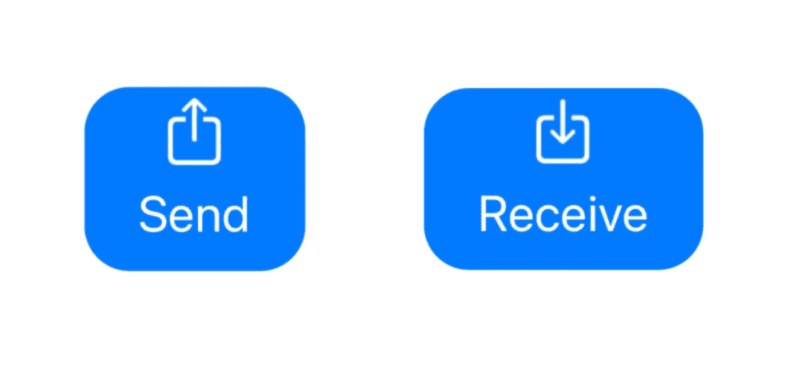
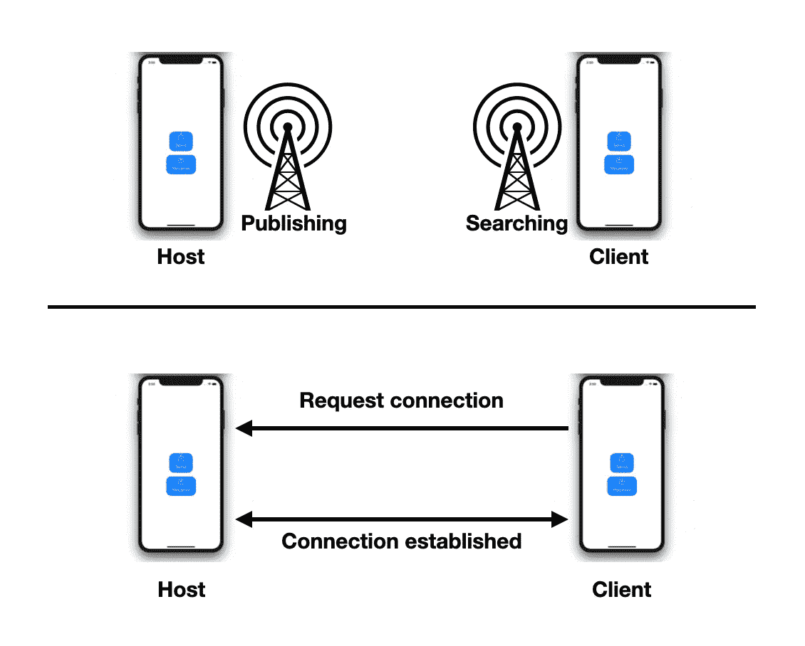
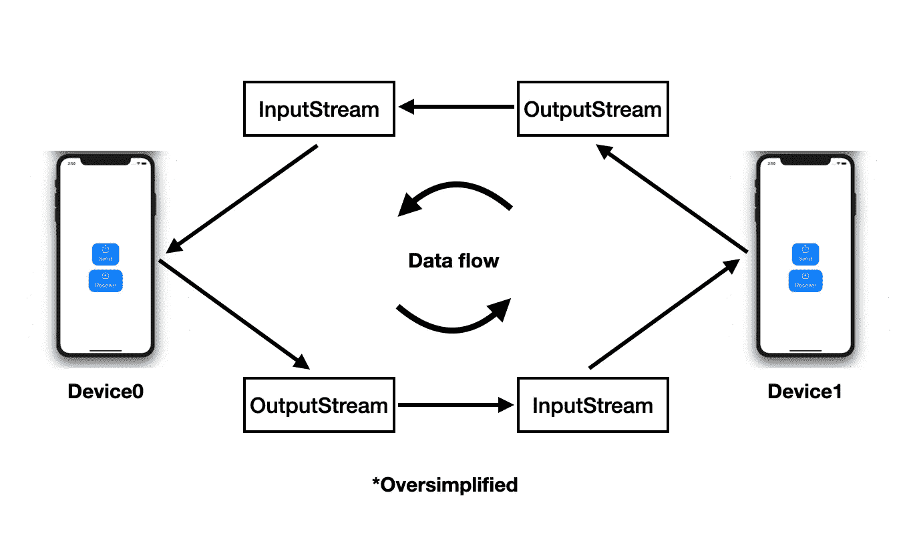
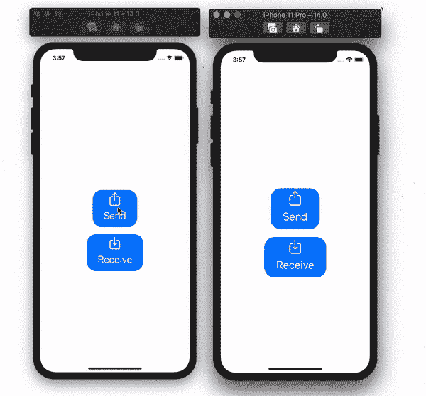

# Bonjour:如何通过两个简单的步骤传输数据

> 原文：<https://itnext.io/bonjour-how-to-stream-data-in-2-easy-steps-f335bded87?source=collection_archive---------6----------------------->

## 使用流从一台设备向下一台设备发送数据

最近在另一篇文章中，我开始讲述我进入一个不是每个人都会去的世界的旅程。网络和数据流的世界。在第一篇文章中，我们介绍了如何利用一个简单易用的工具 Bonjour 来处理这种情况。

现在我们必须认真对待将数据从一个设备转移到另一个设备的严肃事务。**我不想撒谎，这并没有你想象的那么难。**

这里有那篇文章的链接，所以你可以在开始阅读这篇文章之前先读一读: [**【你好:网络发现简单易行】**](http://Figure out the IP of the device receiving the data. Establish a connection with it. Send data.) **。**

简单回顾一下。**为了实现这一目标，我们之前定义了需要遵循的 3 个步骤。**这些步骤如下:

1.  *算出接收数据的设备的 IP。*
2.  **与其建立联系。**
3.  **发送数据。**

**我们已经完成了第一步，使用** [**网络服务**](https://developer.apple.com/documentation/foundation/netservice) **和** [**网络服务浏览器**](https://developer.apple.com/documentation/foundation/netservicebrowser) **发布并查找同一网络内的设备**。我们可以连接的设备，并希望在它们之间传递数据。这使得第二步和第三步悬而未决。我会尽我所能展示我是如何完成这些部分的。

在对实现这些步骤的不同方法进行了数小时的研究并在网上看到了许多不同的资源后，我发现很少有利用第三方解决方案的。而是依靠第三方框架来完成繁重的工作。我有意识地选择只使用苹果公司提供的工具和框架。记住这一点，让我们来解决第 2 步。

# **2。与其建立连接**

**我要用来解决这个问题的是**[**URLSession**](https://developer.apple.com/documentation/foundation/urlsession)**。**惊讶？我敢打赌你是。在很大程度上，我可以有把握地假设，正如我直到最近也一直这样做的那样，你们中的许多人只是使用 URLSession 与后端进行日常交互。这意味着您知道通过使用 URLSession，您必须创建一个 [URLSessionTask](https://developer.apple.com/documentation/foundation/urlsessiontask) 。有许多类型的任务:数据，下载，上传等。**我们有兴趣使用**[**URLSessionStreamTask**](https://developer.apple.com/documentation/foundation/urlsessionstreamtask)**。**

流任务为我们提供了一个进行 TCP/IP 连接的接口。**要创建这个任务，我们有两个选择:使用主机名和端口来连接，或者我们可以直接使用网络服务。**记住，当我们使用网络服务浏览器时，我们寻找网络服务。所以我们手头有所有这些值，可以使用其中任何一个。

首先，我们来做个区分。我们将拥有一台主机设备和一台客户机。主机是发布服务的一方，客户机是寻找服务并随后请求连接服务的一方。这是一张示意图:

让我们在第一步结束时给自己定位。我们在客户端设备上的服务浏览器已经找到了由主机发布的服务。

这意味着我们已经找到了要连接的东西，并且拥有了请求它所需的所有信息。为此，我们使用该信息创建流任务，并发送它来请求连接。

到目前为止，一切都不言自明。我们用默认配置创建了一个 URLSession 的实例。我们通过遵循 URLSessionStreamDelegate 将自己指定为该会话的代表，因为这些是我们感兴趣的。然后，我们通过使用搜索时获得的网络服务来创建流任务。

完成后，我们“恢复”任务。我们就是这样开始的。然后我们继续**调用“**[**captureStreams()**](https://developer.apple.com/documentation/foundation/urlsessionstreamtask/1410132-capturestreams)**”这将触发对委托的调用，传入一个**[**InputStream**](https://developer.apple.com/documentation/foundation/inputstream)**和一个**[**OutputStream**](https://developer.apple.com/documentation/foundation/outputstream)。我们将保留对这些流的引用，并告诉这两个流都打开。这个动作允许我们从 InputStream 中读取并写入 OutputStream。

您可能注意到的另外两件事是，我们也希望成为两个流的代表，我们将流插入到 [RunLoop](https://developer.apple.com/documentation/foundation/runloop) 中。**delegate 方法会让我们知道流的状态**，但是更重要的是，**当 InputStream 上有可用的信息要读取时，它会通知我们。关于 RunLoop，它可以让我们避免对流进行轮询。我推荐阅读关于 RunLoop 的文档和这篇来自苹果的关于[“轮询与运行循环调度”](https://developer.apple.com/library/archive/documentation/Cocoa/Conceptual/Streams/Articles/PollingVersusRunloop.html)的简短文章**

## 什么是 InputStream 和 OutputStream？

让我们解释一下它们是什么，以及为什么我们需要这些流。

> 流是一段时间内可用的数据元素序列。**一个流可以被认为是传送带上的物品，一次处理一个，而不是成批处理。[维基百科](https://en.wikipedia.org/wiki/Stream_(computing))**

我觉得这解释得很好。**它代表我们将用来将数据从一个设备转移到下一个**的装配线。但是为什么会有两种类型的流呢？

嗯，**顾名思义，InputStream** 处理所有传入的数据。它的目的是接收数据并传递给我们。如果没有这个输入流，我们将无法获得从其他设备发送的信息。

**另一方面，**输出流**处理将消息写入另一个设备**上的输入流。我们需要它通过已建立的链路发送数据。

这意味着客户端的输入流从主机的输出流获取信息，同样，客户端的输出流将数据传递给主机的输入流。

现在让我们来看看等式的主机端。客户端请求连接，如果一切顺利**，我们将通过**[**net servicedelegate**](https://developer.apple.com/documentation/foundation/netservicedelegate)**得到一个委托调用，告诉我们一个连接已经被接受**，它将为我们提供主机相应的流。我们将不得不做和以前一样的事情:捕获溪流并打开它们。

这与我们之前在启动 URLSessionStreamTask 之后所做的完全相同。**至此，我们完成了第 2 步，并准备开始第 3 步。**

# 3.**发送数据**

现在我们已经完成了我们的连接，并且我们有了对我们打开的和等待使用的流的引用。我们现在需要做的就是使用它们。**让我们从输出流方面开始:**

**要沿着溪流移动对象，它们需要一个** [**数据**](https://developer.apple.com/documentation/foundation/data) **对象**。这就是为什么我们把字符串转换成数据，然后我们可以把它交给 OutputStream 来传递。您可能还注意到，我在 OutputStream 上利用了一个扩展。我不打算详细讨论那里发生了什么，因为这超出了本文的范围。

知道我们传递的是数据对象，它就为通过它发送更复杂的结构打开了大门。通过定义一个符合 Codable 的对象，我们可以利用它来发送更多有趣的东西。绳子很酷，但我们可以做得更多。这里有一个例子:

我知道，这个例子只是在本质上是一个消息字符串的地方添加了一个用户字段。但是你明白了。使用 codable 可以让你更灵活地发送结构更好的数据。

但是 InputStream 呢？我们如何在主机端接收数据呢？**我们这样做是因为符合 StreamDelegate** 。每次事件发生时，我们都会通过代理人得到通知。我们只需要监听正确的事件并等待它。**我们期望的事件是:。**

当大事”。当我们知道有数据等待读取时，就会触发“hasBytesAvailable”。我们继续**告诉 InputStream 去读它**。这样做之后，我们将那些**字节插入到我们的数据对象中，然后我们将它们转换回字符串，以成功地获得我们的“Hello World”。**正如我对 OutputStream 所做的一样，我也在这里利用一个扩展来读取数据。然而，解释将花费很长时间，这超出了本文的范围。

从这一点来看，我们需要做的就是将消息传递给任何期望它的对象。我们可以通过实现我们自己的委托来实现，或者如果项目已经使用了 combine，那么将它传递给发布者，以分发给它的听众。

为了完整起见，如果您通过传递一个可编码的对象，就像我们之前定义的 Package 一样。那么您阅读部分可能看起来有点像这样:

我们完了。**消息已从一台设备发送到另一台设备。这就完成了步骤 3** 。现在就看你自己了，用这些知识向前迈进，做一些很酷的事情。

# 最终想法

经过一段时间的努力和艰辛之后，**我可以有把握地说，有了这些知识，任何人都可以开始尝试创建点对点连接**。

这些信息不仅适用于 iOS 设备之间，**同样的原则也适用，即使你想用它与 Mac、Android 或打印机进行通信**。发送的是字节信息，唯一的条件是无论另一端的设备是什么，它都必须能够读取和使用它。

当然，关于这个主题还有更多，这只是冰山一角。这取决于你继续做更多的研究，弄清楚这是否是你正在寻找的解决方案，以及如何在你的项目中最好地使用它。

因为你一路走到了最后。这是这段代码在演示中的一个片段:

## 小免责声明

这里提供的代码代表了实现预期目标所需的最低限度。这就缺少了将代码投入生产所需的部分代码和错误处理。所提供的信息旨在用作就此问题开展工作的指南。

如果你喜欢这篇文章，请为它鼓掌(喜欢它),并在下面留下你的问题、评论或建议。我会尽力回答他们。

**更多内容由我:**

*   [你好:网络易发现](/bonjour-share-data-across-devices-without-a-backend-36faee520e14)
*   [利用 Swift 中的泛型和可编码性](https://blog.usejournal.com/taking-advantage-of-generics-and-codable-in-swift-b5e28cdeb6fa)
*   [一些你可能不知道的快速技巧](https://medium.com/@mpesate/a-few-swift-tricks-that-you-might-not-know-7d14afbd5f71)