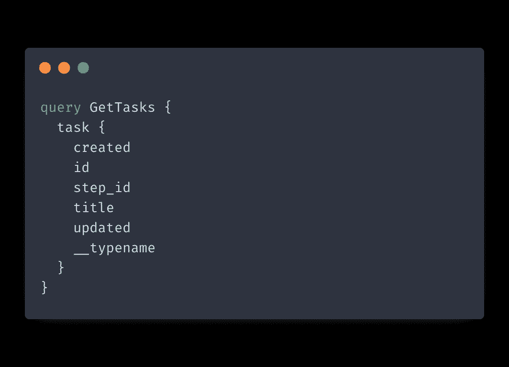
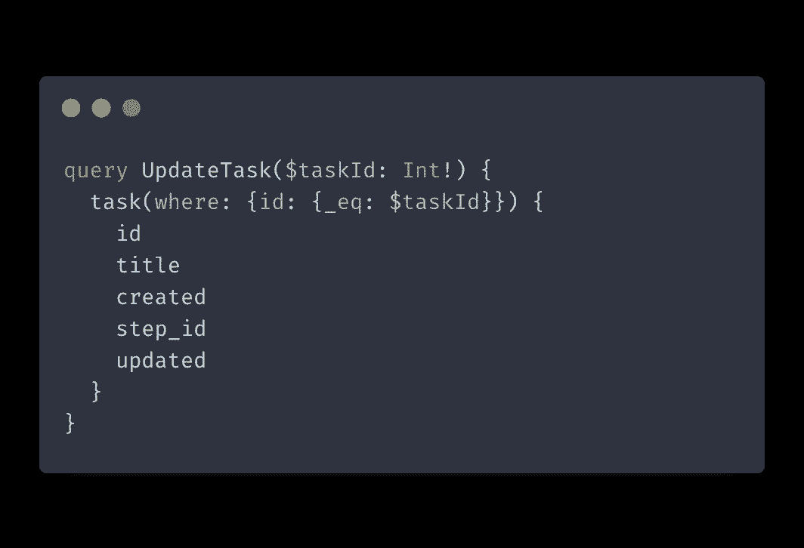

# 通过缓存规范化提升 Apollo GraphQL 性能

> 原文：<https://itnext.io/boost-apollo-graphql-performance-with-cache-normalization-c7800fc8771e?source=collection_archive---------4----------------------->

# 介绍

Apollo 是一个流行的 GraphQL 客户端，有很多特性。您可以将它用于获取数据和状态管理。Apollo 有一个健壮的缓存机制。正确使用时，它可以通过减少您发出的 API 请求的数量来显著提高您的应用程序的性能。

让我们看看 Apollo 是如何处理缓存规范化的，并介绍一些有助于您充分利用它的技巧。

# 什么是缓存正常化？

规范化是指减少冗余的做法。在数据库中，减少冗余意味着通过调整数据库的结构来减少重复数据的数量。

对于 Apollo，缓存规范化意味着使用缓存来减少重复 API 请求的数量。Apollo 客户机可以从缓存中返回匹配的数据，而不是发出请求。

# Apollo 如何执行缓存规范化？

让我们简要介绍一下缓存规范化是如何工作的。

在底层，Apollo 客户机使用一个带有键值对的 JavaScript 对象来存储缓存数据。这个对象是平面的，这使得从缓存中获取数据几乎是即时的。

无论何时发送查询，Apollo 都会检查该数据是否已经存在于缓存中。如果它这样做了，客户端将立即返回缓存的数据，防止一个多余的 API 请求。

只要返回的数据具有有效的格式，Apollo 就会通过保存查询和变异的响应将新数据添加到缓存中。此外，每当缓存更新时，所有依赖于 Apollo 数据的 UI 部分都会自动重新呈现并反映新数据。

为了能够在缓存中保存数据，您的响应需要包含一个唯一的标识符。这个标识符和`__typename`字段一起被用作缓存对象中的一个键，比如:`__typeName + id`。默认情况下，Apollo 会查找`id`字段，但是在配置缓存对象时，您可以[调整唯一标识符键](https://www.apollographql.com/docs/react/caching/cache-configuration/#customizing-cache-ids)。

# 阿波罗行动能缓存和不能缓存

并非所有的阿波罗行动都是平等的。其中一些可以由 Apollo 自动缓存，因为它们返回有效的数据，而另一些必须手动处理。

以下是 Apollo 可以自动缓存的操作列表:

*   问题
*   变异单个对象
*   变异一组对象

以下是 Apollo 无法缓存的操作列表:

*   添加数据
*   删除数据

Apollo 不知道您希望应用程序何时反映添加或删除数据。在这些情况下，您可以手动改变缓存或使用新的查询重新提取更新的数据。

# 更好的缓存规范化技巧

现在让我们来介绍一些技巧，它们将帮助您充分利用 Apollo 的自动缓存规范化。

## 返回查询的 id

正如我之前提到的，Apollo 需要一个惟一的标识符作为键，所以一个好的经验法则是总是为您想要缓存的任何查询返回`id`字段。

## 返回突变的 id 和更新数据

类似地，如果您希望 Apollo 缓存它，您应该总是返回 id 和来自您的变化的更新数据。这个技巧既适用于单个突变，也适用于一组对象的突变。

# 结论

在这篇文章中，我们简要介绍了 Apollo 的缓存机制是如何工作的，以及如何优化 GraphQL 查询以充分利用它并减少应用程序进行的冗余 API 调用的数量。编码快乐！

*原载于 2021 年 11 月 8 日【https://isamatov.com】**。***