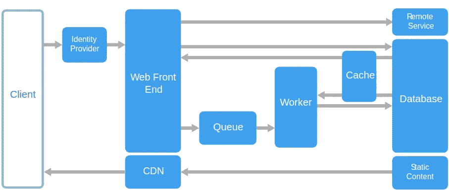
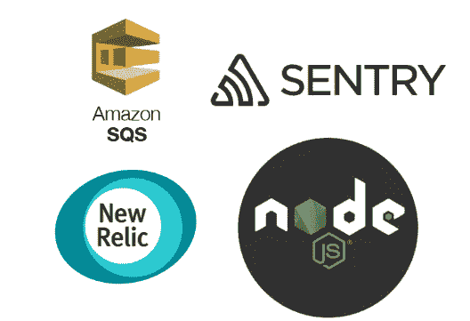
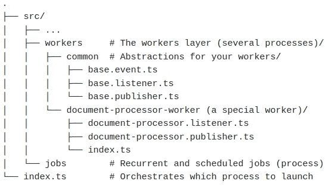
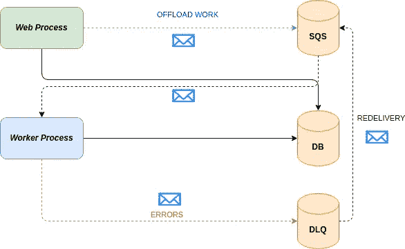
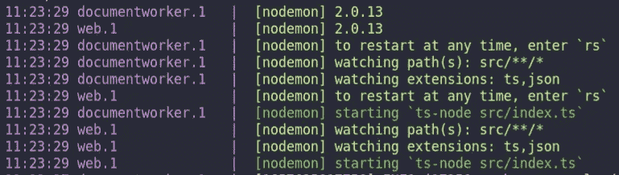
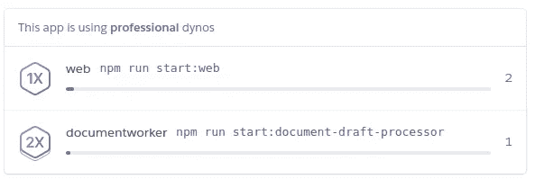
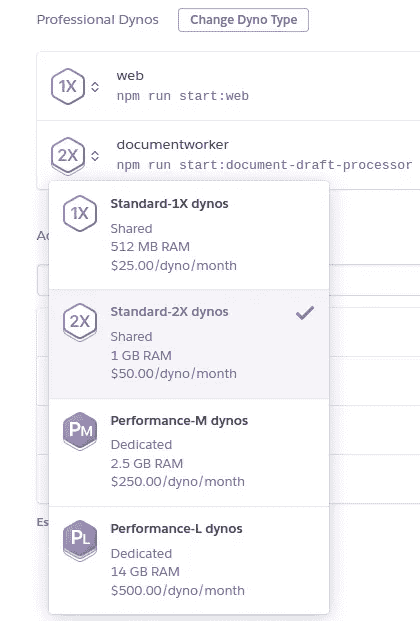

# 🚀借助多处理架构提升节点的可扩展性🚀

> 原文：<https://itnext.io/boost-nodejs-scalability-with-multi-processing-architecture-6d7bd03c892c?source=collection_archive---------1----------------------->

过去几个月，我不得不面对扩展现有 NodeJS 应用程序后端的挑战。该应用程序通过使用定制的解析器和解释器处理文本来生成巨大的 PDF 文档。我没有看到很多如何实现这一点的例子，所以我采取了一种务实的方法来解决这个问题。

用户对工作负载的压力越大，吞吐量急剧下降的幅度就越大，延迟从几毫秒增加到几秒。仔细测量应用程序，我们意识到事件循环在很长一段时间内都非常繁忙地使用 CPU。这是不可接受的情况，因为后端没有正确扩展。迫切需要对其进行扩展并卸载一些工作。

**症状**🤢：

*   在 REST 端点上，延迟从毫秒增加到秒。☠️
*   新用户必须等待才能进入应用程序。😞
*   指标显示了高 CPU 利用率和高事件循环延迟(nodejs veterants 将凭直觉解决这个问题)。🔥

# 向外扩展的建筑决策🕵🏻

我们都知道，NodeJS 在处理 CPU 密集型任务时是很糟糕的，因为它让事件循环超级繁忙。它提供了一些本机机制来卸载一些工作，如 ***worker_threads。这可能不是解决长时间运行任务的正确方法，而且每次应用程序必须处理大任务时，它可能会导致创建长时间运行线程的巨大开销。它还强制 NodeJS 垂直缩放，而不是水平缩放。***

我选择了一条不同的道路，我决定将有问题的进程卸载到一个专用的 ***工作进程*** 。它是应用程序的一个专用部分，运行在为工作优化的专用资源上。

**该方法的用例**:

*   卸载 CPU 密集型任务。🕢
*   卸载重复性任务或 cron 作业，如日常 ETL 作业。⚡

该过程还需要重用应用程序的一些部分，并访问相同的现有存储库或域服务。这种设计有两种可能性:

1.  使用不同的代码库并创建专门的服务。❌
2.  使用相同的代码库，根据环境以 ***api 模式*** 或 ***工作模式*** 运行应用程序。事实证明，这样做大大减少了向外扩展应用程序的开销，并允许我们重用现有的代码库。✅

在这篇文章里， ***选项 2*** 已经取了，都是关于它的。如果您认为选项 1 可能是一种更好的方法，并且您需要更高的隔离级别，或者如果您决定使用另一种适合 CPU 工作负载的语言(如 Golang ),那么它是完全合适的。您可能需要选项 2 的原因是，您需要共享许多依赖项，并且共享相同的代码库以避免开发开销是有意义的。我将分享在生产中拥有防弹多核单代码库架构的细节。

此外，让我们提一下这个有趣的模式，微软架构更好地描述了关于[网络队列工作者模式](https://docs.microsoft.com/en-us/azure/architecture/guide/architecture-styles/web-queue-worker)。

微软

# 文件夹结构🥪

这里您可以看到 nodejs 项目的结构。这是一个常规的分层 REST api。这种文件夹结构在中小型项目中很常见，可能您有类似的东西，或者您可能使用了一种更加*或 ***干净的架构*** 方法，在本文中我们将保持它的简单，我们将重点关注创建一个 ***单多处理器代码库*** 的挑战。*

**

*在上面的文件夹结构中，有 3 个重要文件夹( ***web、工人和工作*** )和 1 个 ***流程调度员*** 文件:*

*   ****Web*** 文件夹只包含 Api 相关的东西。*
*   ****工作者*** 将包含不同的工作者，并且那些工作者可能在同一个进程中隔离运行或者进入不同的进程。这种架构将使其更加灵活，这完全取决于您的决定。*
*   ****作业*** 将包含重复性任务，例如 ETL 流程。对他们来说，有一个隔离的过程可能有意义，也可能没有意义，这是另一个隔离点，但是这个架构让你来决定。*

****index.ts*** 作为一个调度器，它将决定如何创建流程。*

# *技术栈🕹️*

*多核架构需要一些支持技术来实现可扩展性的目标。作为一名架构师，您需要问自己:*

*   ****我如何将 web 上的繁重工作卸载给工作人员？****
*   *是否有详细记录的方法来实现 nodejs？*
*   ****我是否已经从云提供商那里获得了一些服务？****
*   ****如果我的工作负载出现故障，我该如何处理？应用程序可以自己重试吗？****
*   ****如果一切都失败了，我能得到通知以便解决问题吗？解决问题后，我可以再试一次吗？****
*   ****如何才能衡量工作量？****

*让我们来回答这些问题:*

*   ****一个好主意是使用已知的消息代理技术将工作负载排队，避免给 web api 带来压力。****
*   ****一个有据可查的方法是使用 redis 和 bull。****
*   ****SQS 对于 AWS，Azure Service Bus，RabbitMQ 等。****
*   *使用消息代理，我们可以通过配置来保证重试。*
*   ****死亡信队列(DLQ)很常见，大多数消息代理会根据您的配置重试多次，然后将失败的消息发送给 DLQ 进行审查。DLQ 通常支持重新发送到源队列(例如 SQS)。****
*   ****使用带有 Sentry 等通知的集中日志记录，并使用 New Relic 等第三方工具监控进程。这样，您可以根据需要解决员工或秤的问题。****

**

# *调度员💎*

*这是单一代码库中多核架构的核心组件。调度程序将使用一个环境变量来理解哪个上下文/环境在起作用，并在正确的位置启动正确的进程。它还将决定是否可以利用环境处理器，并尝试运行一个进程集群，以便每当环境发生变化时，应用程序都会自动调整其进程，并将每个进程分配给一个处理器内核。*

*我们将使用以下工具来构建调度程序:*

*   *一个名为 **PROCESS_TYPE** 的环境变量。*
*   *库 ***通过*** 启用模块内启用集群模式。*

*这样，在环境中使用不同的 env 变量，它将在集群模式下启动正确的进程。它将有条件地需要其中一个模块，并且它所符合的条件中的所有内容都将存在于同一个集群中。启用日志并优雅地*终止进程以避免内存泄漏是很重要的。在第 42 行中，您可以设置可用的处理器数量，有些环境(如 Heroku)会公开一个环境变量，或者您可以使用 ***os*** 本机模块来计算。**

# **卸下问题👾**

**我假设您已经研究了情况，测量了应用程序并找到了瓶颈。如果我们达到了向外扩展应用程序的这一点，这意味着您有一个大问题。在第一步中，您想知道是否可以将问题分解成更小的部分。**

> **就像孙子说的:势力若合，则分。**

**工人处理比整个大流程小很多倍的小部分是值得的。一旦您找到了可以卸载给工作人员的最小部分，我们就通过将消息发布到特定队列来将信息发送给消息代理。我必须解决的一个非常具体的问题是将已处理文档的文本与其文档的系谱树合并，这就是为什么我将工作负载拆分为许多消息，其中一条消息是要成批处理的文档。**

**因此，在 web 流程中，您通常会执行以下操作，启动并忘记该流程，因此只要工作进程可用，它就会继续从队列中获取消息并处理它们:**

**这样，我们通过委派工作并保持 api 的安全和健康来节省 web 进程消耗的 CPU 利用率资源。你必须不惜任何代价保持用户体验的流畅，我们不能奢侈地让这个过程忙碌起来。**

# **工人 Process⚙️**

**工人进程就是那个家伙，那个将要执行所有繁重工作的人。它将连接并监听所选的消息代理，获取消息并逐个处理它们。**

**该工人必须具备以下能力:**

*   **在多个 cpu 内核上运行。🎛**
*   **失败后重试。💊**
*   **经过一段时间的重试后，将失败的消息发送给*。📤***
*   ***如果需要，它还可以在一些数据库表中保存进度跟踪。⏳***
*   ***捕捉错误，并在需要时通知工程团队和用户。📨***

***workers 文件夹结构如下:***

******

***首先，我们将事件抽象为 ***名称*** 和 ***版本。*** 版本保持复古兼容性很重要。***

**然后我们有了***base . listener . ts***组件，它连接到队列并触发正确的工作文件，在我的例子中是***document-processor . listener . ts。在我的例子中，默认情况下它使用 SQS，但也可以是其他任何东西。*****

**通过实现上面的抽象类，你将拥有一个现成的处理器。正如您所看到的，这个抽象处理了一些事情:**

*   **连接到 SQS。📨**
*   **使哨兵能够集中日志。📈**
*   **启动流程并将消息交付给正确的工人实现。🎠**

**我将我的员工的指标发送到***new relic******APM***以便了解您的流程发生了什么。你可能更喜欢 ***PM2*** ，那也没关系。**

# **最终的画面🌆**

**准备好整个多处理架构后，您应该准备好以下工作流。**

*   **web 进程将繁重的工作交给了 SQS。**
*   **工作进程每隔一定时间轮询一次 SQS 队列，以搜索新消息。**
*   **工作进程完成这项工作。**
*   **如果失败，至少 3 次，它将发送一条消息到 DLQ 进行人工调查。一旦消息可以被处理，一些消息代理支持将那些失败的消息重新发送回队列。如果消息代理不提供这种功能，您可以添加另一个 worker 来支持重新交付特性。**

****

# **开发工作流程🛸**

**之后，开发流程将被分成几个部分，开发人员将需要一种方法来更好地处理几个部分。因为有很多方法，例如，可以是 docker，另一种方法是使用 [foreman 包](https://github.com/strongloop/node-foreman)，它读取一个 ***Procfile*** 并自动启动不同的部分。**

****

**一些云提供商，如 ***Heroku*** 读取 ***Procfiles*** 并自动为他们独立启动基础设施，这就是神奇之处。Heroku 的一个优点是，您可以用不同的资源扩展 Procfile 中的每个进程。**

********

**另一件事，如果你使用 AWS，你可能想使用 [localstack](https://localstack.cloud/) ，它有一个 docker 容器，你可以用它来模拟他们的基础设施，比如 SQS、迪纳摩等。**

# **嘿，在离开这篇文章之前🙏**

**你喜欢吃吗?👀**

*   **跟我来🤳**
*   **拍拍我，让我有动力写更多👏👏👏**

# **结论**

**我希望你喜欢这篇文章。这背后的想法是稍微解释一下如何在 NodeJS 应用程序中处理多处理。当我不得不开发它时，我没有找到很多可以寻找灵感的地方，这就是我写这篇文章的原因。我真的希望它对你的项目有所帮助，或者至少让你得到一些新的想法。**

**编码快乐！**

****