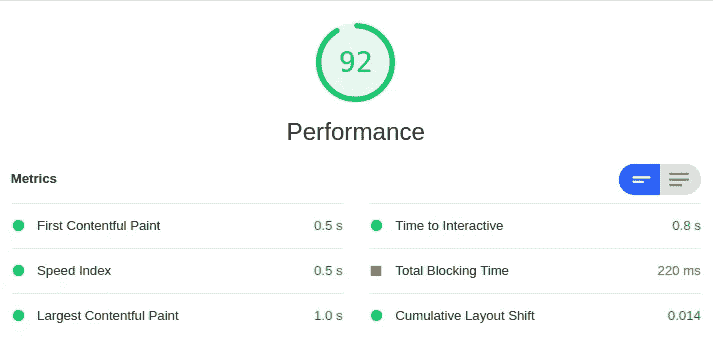
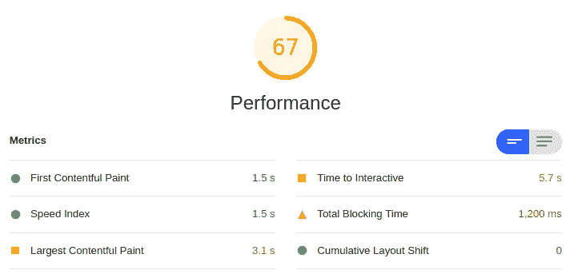
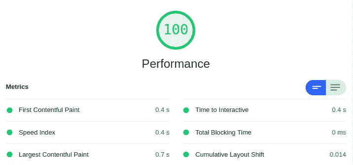
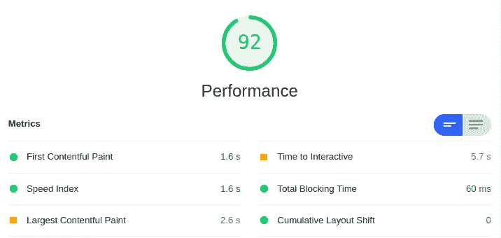

# 通过服务人员提高 web 性能

> 原文：<https://itnext.io/boost-web-performance-with-service-workers-18065d24d007?source=collection_archive---------2----------------------->

如果你已经为你的网站的性能工作了一段时间，还没有尝试过服务人员，请继续阅读。服务工作者是在您的浏览器中运行的脚本，有助于优化网站上的资产加载，甚至允许在浏览器中缓存资产以供离线使用。这不是一个关于服务人员的来龙去脉的深入教程，而是一个关于服务人员给你的网站的灯塔绩效评分带来的好处的见解。

对于本文，我使用 Lighthouse，因为它检查的是此时的性能，而不是更长时间内的性能。以下截图已于当日拍摄。第一组截图代表没有注册服务人员的网站，第二组截图是我注册服务人员时拍摄的。同样是网站，唯一不同的是服务人员。

# 在服务人员之前

如果我们没有之前和之后的情况，洞察力就没有任何意义。在下面两张截图中，您可以看到之前的手机和台式机得分截图。

服务人员之前的 Lighthouse 绩效评分(桌面)

正如你所看到的，桌面的分数已经很好了，不需要太多的改进。然而，如果我们看一下手机的得分，就会发现情况有所不同。

服务人员之前的灯塔绩效评分(移动)

移动版本的分数不是很高，确实需要一些改进，特别是因为这个网站的大部分流量(80%以上)都是在移动设备上。

# 服务人员进来了

由于我运行这个测试的网站是用 Laravel 构建的，所以我使用 Laravel Mix 来编译 Sass 和其他资产。Laravel Mix 有一个生成服务工作者的插件: [laravel-mix-workbox](https://laravel-mix.com/extensions/workbox) 。使用这个扩展，您可以非常容易地为编译的资产生成一个服务工作者。

这是我用来生成服务工作者的配置的摘录:

这里最重要的一点是，您需要包含“webpackConfig”部分。如果您不这样做，服务人员将尝试使用额外的前导斜杠:"//css/style.css "来缓存您的资产。这将引发错误，并导致服务人员无法启动，因为如果有任何错误，服务人员将无法启动。因此，通过在新的 publicPath 中添加“webpackConfig ”,可以解决这个问题。

如果您使用 Webpack 来捆绑和编译您的资产，您可以使用相同的配置。只需将“generates SW”替换为“new GenerateSW ”,并将其包含在 webpack.config.js 文件的 plugins 部分中。

现在您已经有了 sw.js 文件，您需要将它包含在您的网页中:

# 在服务人员之后

现在，我们已经在您的网页上安装了服务人员，我们可以再次检查我们的灯塔性能得分。这些是包括服务人员在内的 Lighthouse 手机和台式机性能得分的截图。

Lighthouse 绩效评分(桌面)售后服务人员

如你所见，分数比以前高了。这对我们的分数是一个很好的提升，但是桌面版本从来不需要额外的性能。另一方面，移动电话有了巨大的飞跃:

灯塔得分(手机)售后服务人员

移动评分现在已经高到可以绿色了，这是我开始这个的时候的目标。服务人员已经使分数上升了很多，并且更有效地加载了静态资产。

# 为提高分数而采取的其他措施

要达到这个分数，有一个优化很差的网站，只增加一个服务人员是不够的。在添加服务人员之前，我已经进行了各种不同的优化:

*   通过 loading="lazy "延迟加载图像
*   使用 [Gumlet](https://roelofjanelsinga.com/articles/technical-seo-improving-your-page-loads-with-properly-sized-images) 正确调整图像大小

这些因素都在最终得分中发挥了作用，但这并不意味着服务人员仍然提供了很好的性能提升。

# 结论

在你的网站上增加一名服务人员可以极大地提高灯塔绩效分数，你的 UX，甚至可以带来更好的 SEO 分数。所以，如果你能为你的项目做到这一点，并且你希望从你的网站中获得一些额外的性能，包含一个服务人员是你能获得的最快的性能提升之一。

发布时间:2020 年 8 月 5 日

*最初发表于*[T5【https://roelofjanelsinga.com】](https://roelofjanelsinga.com/articles/boost-web-performance-with-service-workers)*。*