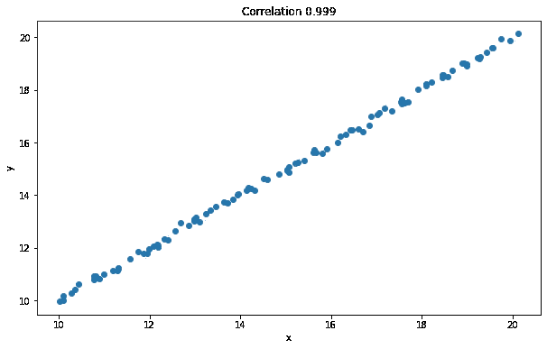
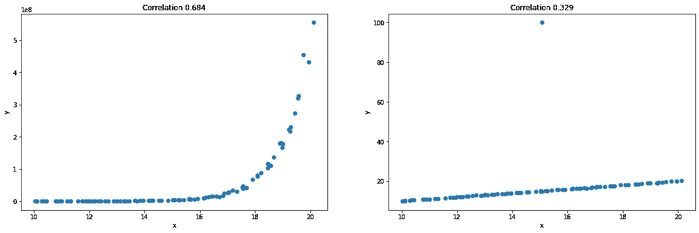
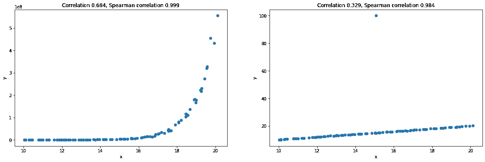
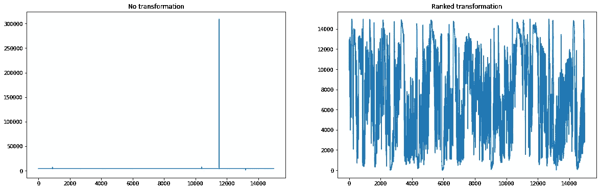
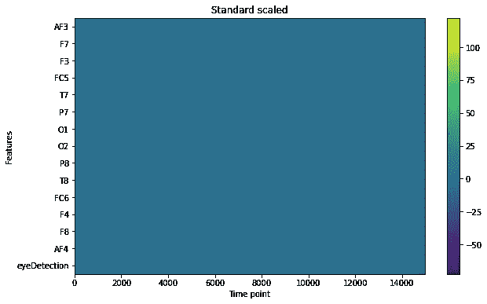
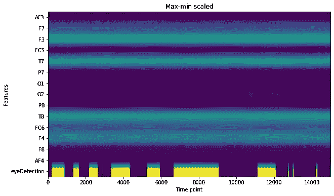
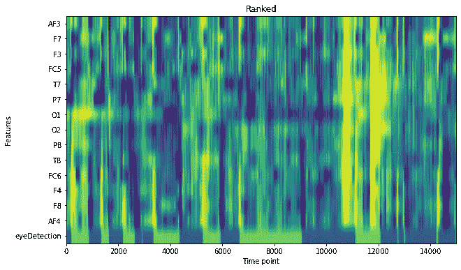
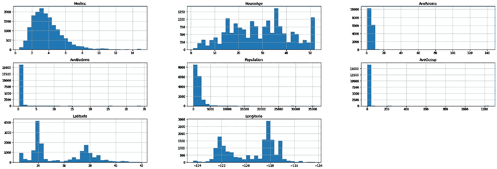
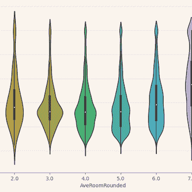

# 通过 Python 和 Pandas 中的排名提升您的数据科学

> 原文：<https://itnext.io/boost-your-data-science-with-ranking-in-python-and-pandas-911080128e1?source=collection_archive---------0----------------------->

## 数据科学

## 排名是一种简单而有效的数据转换方法。在本文中，我将解释它的工作原理、优点以及如何使用它来分析变量之间的关联、可视化数据和转换特征。

由 [Jacob Ferus](https://medium.com/@dreamferus) 使用 Midjourney 生成。

# 什么是等级？

对价值进行排序意味着对它们进行排序，并根据它们在顺序中的位置为每个价值赋予一个新的价值*。*例如，如果我们有以下值:

*   36
*   72
*   12
*   102

我们可以命令他们，并提取他们的排名:

*   12 -排名 1
*   36 -排名第二
*   72 -排名第三
*   102 -排名第 4

因此，36，72，12，102 的新值将是 2，3，1，4。

这里等级是按升序排列的(等级 1 对应于最小值)，根据我的经验，这似乎是最常见的选择，但是降序也是可能的(等级 1 对应于最大值)。

# 使用等级分析关联

## 相关性问题

相关性或*皮尔逊相关系数*是确定变量之间线性关联大小的有用度量，但它有弱点。首先，它只适用于线性关系。其次，它容易受到离群值的影响。

让我们来说明这一点。首先，我将展示一个相关性几乎完美的数据图:

可以看出，相关性几乎是 1 的最大值。现在，让我们修改数据，看看会发生什么。在第一个变化中，我将把 *y* 改为它自身的指数。在第二个变化中，我将在时间序列中间添加一个异常值:

在左边的图中，仍然有一个清晰的关系，但不是线性的。由于这个原因，相关性已经下降到 0.684。在第二个图中，关系仍然是线性的，但是由于一个大的异常值，相关性已经显著下降到 0.329。我们能避免这些问题吗？

## 输入 Spearman 相关性

使用*斯皮尔曼关联*可以缓解这两个问题。方法很简单，不是计算*原始值*之间的相关性，而是计算*值的等级:*之间的相关性

相关性(秩(X)，秩(Y))

在解释为什么这有帮助之前，让我们先通过再次绘图和计算 Spearman 相关性来说明它的影响:

如图所示，在指数情况下(左图)，Spearman 相关性为 0.999，就像应用指数函数之前的相关性一样。在异常值(右图)的情况下，Spearman 相关性仍然很高，为 0.984。这里发生了什么？

## 它可以检测非线性关联

假设你有三个不同的数据序列。一个是线性增长，一个是对数增长，一个是指数增长。他们有什么共同点？它们都是不断或单调递增的。但是请注意，这也意味着*他们的等级是相同的*。因此，如果我们对这些序列中的任何一对使用 Spearman 相关性，相关性将是 1！通过排名，数据中唯一有影响的因素是每个值是大于还是小于其他值，*而不是它们之间的实际差异*。

## 减轻异常值的影响

因为顺序是 Spearman 相关中唯一重要的东西，如果我们有值[1，1000000000000，2]，值的秩与值[1，4，2]相同。因此，大的和小的异常值将会减少影响。最大可能的差异是向量的长度减去 1(在平局的情况下可以更小)。相比之下，原始值可以有任何差异。

# 熊猫的等级和 Spearman 相关

熊猫里的数据排名毫不费力。可以使用方法`.rank()`并立即将其应用于数据帧或数据系列中的每一列。默认情况下，排名是升序，但是您可以使用`ascending=False`参数将其更改为降序。

如果出现平局，默认情况下取平均值。但是这种行为可以通过使用`method`参数来改变。

另一个有用的参数是`pct`，是 percentile 的缩写。这样，您将计算数据中每个点对应的百分点或分位数，即每个点下的数据百分比。这只是标准化的排名。

您也可以使用`.corr()`中的`method`参数，即`df.corr(method="spearman")`来计算 Spearman 相关性。

示例:

可以看到，在使用`.rank()`之后，每个值都被独立地转换为各自在每一列中的等级。

# 使用排名进行可视化

分级数据对于可视化特别有用，不仅因为它可以减轻异常值的影响，还因为它将数据放入相同类型的分布和规模中。我将针对一个变量，然后同时针对多个变量来说明这一点。我将从获取一些时间序列数据来分析开始，它来自于[这个](https://archive.ics.uci.edu/ml/datasets/EEG+Eye+State)链接。

## 可视化一个变量

现在让我们想象第一列(AF3):

在左边，有一个非常大的异常值，模糊了整个情节。在右边，使用排名数据，情节清晰得多。请注意，使用排名数据确实有丢失信息的弱点，因此，请注意*实际显示的是什么*。绝对变化被去除，同样分布特性也被去除。

## 可视化多个变量

为了可视化多个变量，我将使用`plt.imshow`将时间序列数据绘制成矩阵。每个变量是一行(y 轴)，每个时间步长是一列(x 轴)。我将使用三个不同的预处理步骤来说明使用 rank 的好处:标准缩放、最小-最大缩放和排序:

**标准比例:**

对于标准的缩放数据，根本看不到任何东西。其原因是色标是线性的，即如果一个值比其他值大得多，较小值的颜色将大致相同，而最大值将仅具有明亮的颜色。此外，由于这是所有列的一个图，一列中的一个大的异常值可能会使天平倾斜。

一个解决办法是使用对数色标。问题是，如果一些要素具有线性比例，而一些要素具有对数比例，则绘图仍然不会非常连贯。

## 最小-最大比例:

现在数据看起来稍微好一点。所有列的最大值都是相等的，但是，如果最大值是一个异常值，其余数据的颜色将会更深。见 O1 和 O2 栏。

**排名:**

最后，使用分级转换，每个列都被同等地表示，并且更容易看到不同列之间的相互关系是如何变化的。

像这样的图对可视化趋势很有用。例如，对于大多数列来说，第 10700 个时间步长附近的趋势清晰可见。像以前一样，记住显示的内容。关于异常值、偏斜等的分布信息。已删除。

# 使用秩的特征变换

当通过执行从原始值到等级的*特征转换*来创建机器学习模型时，减少离群值的影响和简化复杂分布的相同好处可能是有用的。为了说明这一点，我将把这一转换与加利福尼亚住房数据集的标准缩放进行比较。注意，基于树的模型不需要**也不需要**特征转换，例如标准缩放和使用分级数据。在这个实验中，为了简单起见，我将使用来自 sklearn 库的前馈神经网络，但我会在实践中推荐 PyTorch、TensorFlow 或类似的库。

首先，让我们加载并拆分数据:

现在，让我们先来看看一个简单的标准比例神经网络有多好:

在执行秩转换之前，最好调查一下哪些列可以从这种转换中受益。为了验证这一点，让我们绘制每一列的直方图:

AveRooms、AveBedrms、Population 和 ave occupation 似乎有较大的异常值。现在，让我们在标准缩放步骤之前仅对这些列执行等级转换:

在这里，我构建了一个执行等级转换的类。首先，从训练数据中提取等级。然后对于测试数据，它被映射到训练数据中最近的等级。也有其他的选择，比如如果它出现在等级之间，使用某种平均值。在实践中，你应该使用 scikit-learn 的`[QuantileTransformer](https://scikit-learn.org/stable/modules/generated/sklearn.preprocessing.QuantileTransformer.html)`来代替，它是相似的，并且包括额外的功能和选项。

成绩提高了！当然，情况并不总是如此，但是值得在建模期间尝试不同的特征转换，看看是否可以做出任何重大改进。

感谢阅读！

如果你有兴趣阅读更多关于数据科学的文章，请查看我下面的阅读列表:

雅各布·费罗斯

## 数据科学

[View list](https://medium.com/@dreamferus/list/data-science-57808dcf16f0?source=post_page-----911080128e1--------------------------------)14 stories

如果你想成为中级会员，你可以使用我的[推荐链接](https://medium.com/@dreamferus/membership)。祝你有愉快的一天。