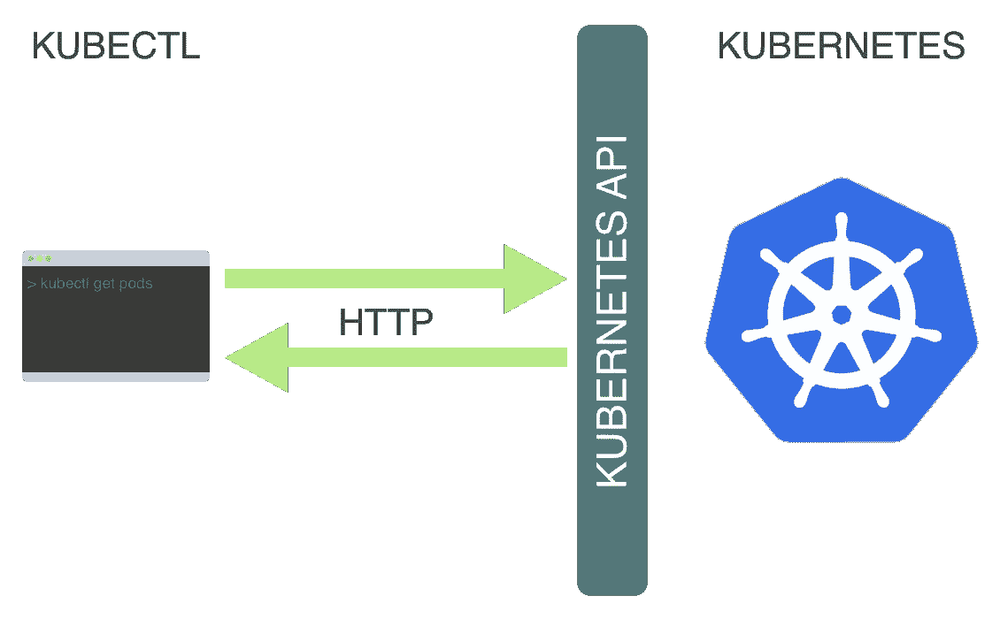
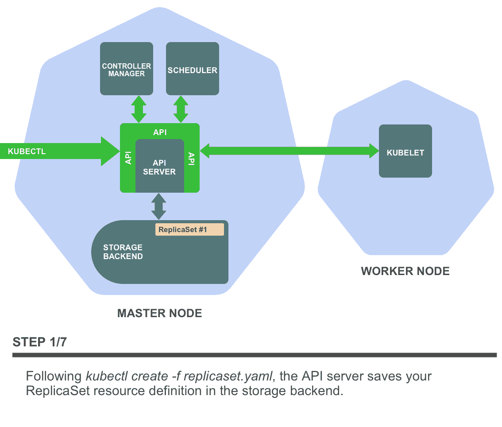
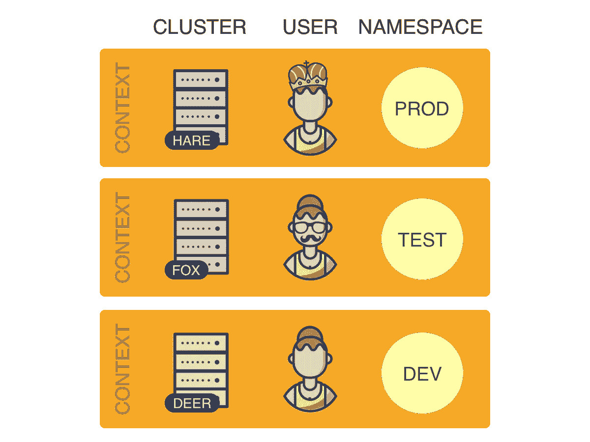
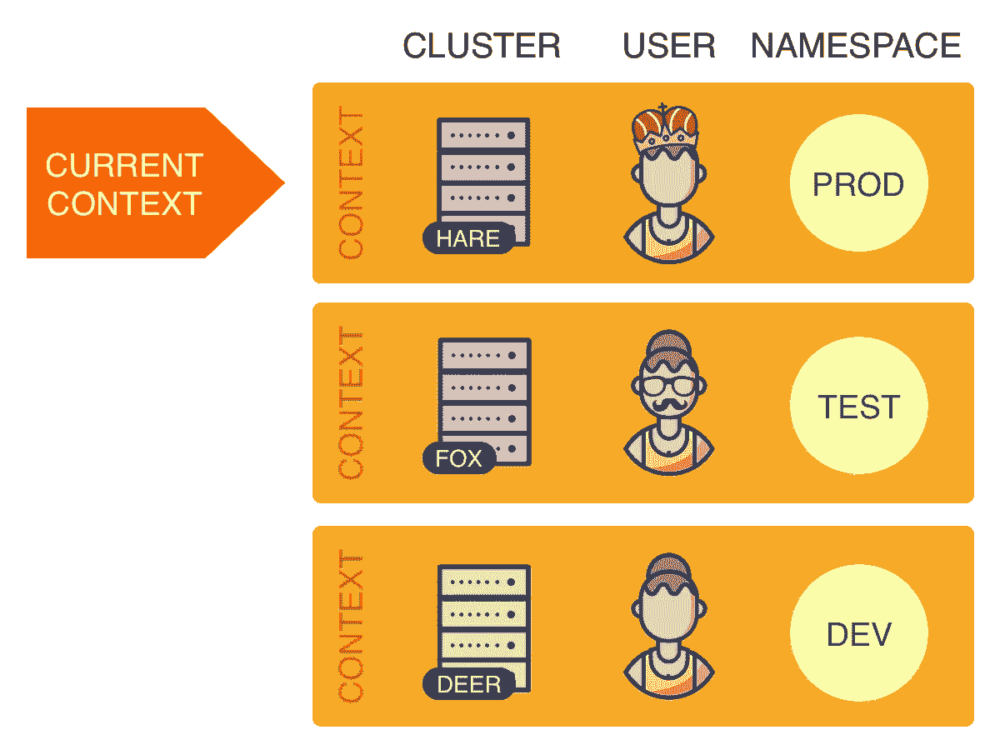
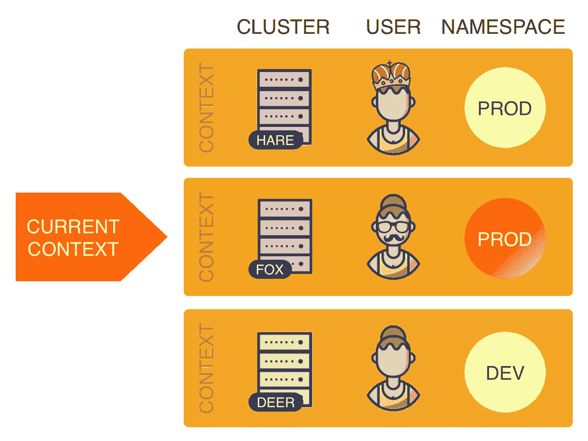
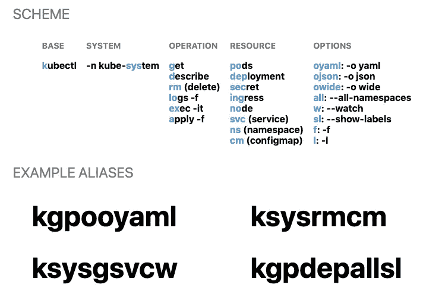

# 提高您的 kubectl 生产力

> 原文：<https://itnext.io/boosting-your-kubectl-productivity-b348f7c25712?source=collection_archive---------3----------------------->


*本故事最初发表于*[*learn k8s . io*](https://learnk8s.io/blog/kubectl-productivity)*。*

如果您使用 Kubernetes，那么 kubectl 可能是您最常用的工具之一。每当你花费大量时间使用一个特定的工具时，很好地了解它并学习如何有效地使用它是值得的。

本文包含一系列技巧和诀窍，可以让您更高效地使用 kubectl。同时，它旨在加深您对 Kubernetes 各方面工作方式的理解。

本文的目标不仅是让您的 Kubernetes 日常工作更加高效，而且更加愉快！

# 内容

*   [**简介:kubectl 是什么？**](#0430)
*   [**1。用命令完成**保存输入](#b8ce)
*   [②**。快速查找资源规格**](#5ba7)
*   [**3。使用自定义列输出格式**](#c563)
*   [4。轻松在集群和名称空间之间切换](#0910)
*   [**5。用自动生成的别名**](#8d1d) 保存输入
*   [**6。用插件**](#6329) 扩展 kubectl

# 简介:什么是 kubectl？

在学习如何更有效地使用 kubectl 之前，您应该对它是什么以及它是如何工作的有一个基本的了解。

从用户的角度来看，kubectl 是你控制 Kubernetes 的驾驶舱。它允许您执行所有可能的 Kubernetes 操作。

从技术的角度来看，kubectl 是 Kubernetes API 的客户端。

Kubernetes API 是一个 **HTTP REST API** 。这个 API 是真正的 Kubernetes **用户界面**。Kubernetes 完全通过这个 API 控制。这意味着每个 Kubernetes 操作都被公开为一个 API 端点，并且可以通过对这个端点的 HTTP 请求来执行。

因此，kubectl 的主要工作是执行对 Kubernetes API 的 HTTP 请求:



> *Kubernetes 是一个完全以* ***资源为中心的*** *系统。也就是说，Kubernetes 维护着一个资源的内部状态，所有的 Kubernetes 操作都是对这些资源的* [***CRUD 操作***](https://kubernetes.io/docs/reference/generated/kubernetes-api/v1.13/#resource-operations) *。通过操纵这些资源，您完全控制了 Kubernetes(并且 Kubernetes 根据资源的当前状态计算出该做什么)。由于这个原因，Kubernetes*[***API 引用***](https://kubernetes.io/docs/reference/generated/kubernetes-api/v1.13/) *被组织为一个资源类型及其相关操作的列表。*

让我们考虑一个例子。

假设您想要创建一个 [ReplicaSet](https://kubernetes.io/docs/reference/generated/kubernetes-api/v1.13/#replicaset-v1-apps) 资源。为此，您可以在名为`replicaset.yaml` file 的文件中定义副本集，然后运行以下命令:

```
**kubectl create -f replicaset.yaml**
```

显然，这会在 Kubernetes 中创建您的副本集。但是幕后发生了什么呢？

Kubernetes 有一个 *create ReplicaSet* 操作，和所有 Kubernetes 操作一样，它被公开为一个 API 端点。此操作的特定 API 端点如下:

```
**POST /apis/apps/v1/namespaces/{namespace}/replicasets**
```

> *你可以在* [*API 引用*](https://kubernetes.io/docs/reference/generated/kubernetes-api/v1.13) *中找到所有 Kubernetes 操作的 API 端点(包括端点* *上面的* [*)。要向端点发出实际请求，您需要将 API 服务器的 URL 添加到 API 参考中列出的端点路径前面。*](https://kubernetes.io/docs/reference/generated/kubernetes-api/v1.13/#create-replicaset-v1-apps)

因此，当您执行上面的命令时，kubectl 向上面的 API 端点发出一个 HTTP POST 请求。副本集定义(您在`replicaset.yaml`文件中提供的)在请求体中传递。

这就是 kubectl 为所有与 Kubernetes 集群交互的*命令工作的方式。在所有这些情况下，kubectl 只是向适当的 Kubernetes API 端点发出 HTTP 请求。*

> *注意，完全可以使用类似* `*curl*` *的工具，通过手动向 Kubernetes API 发出 HTTP 请求来控制 Kubernetes。Kubectl 只是让你更容易使用 Kubernetes API。*

这些是 kubectl 是什么以及它如何工作的基础。但是关于 Kubernetes API，每个 kubectl 用户都应该知道更多。为此，让我们简单地探究一下 Kubernetes 的内部结构。

## Kubernetes 内部

Kubernetes 由一组独立的组件组成，这些组件作为独立的进程在集群的节点上运行。一些组件运行在主节点上，另一些运行在工作节点上，每个组件都有非常具体的功能。

这些是主节点上最重要的组件:

*   **存储后端:**存储资源定义(通常使用 [etcd](https://coreos.com/etcd/) )
*   **API 服务器:**提供 Kubernetes API 并管理存储后端
*   **控制器管理器:**确保资源状态符合规范
*   **调度器:**将 pod 调度到工作节点

这是工作节点上最重要的组件:

*   **Kubelet:** 管理工作节点上容器的执行

为了了解这些组件是如何协同工作的，我们来看一个例子。

假设您刚刚执行了`kubectl create -f replicaset.yaml`，kubectl 向[*create ReplicaSet*API 端点](https://kubernetes.io/docs/reference/generated/kubernetes-api/v1.13/#create-replicaset-v1-apps)发出 HTTP POST 请求(传递您的 replica set 资源定义)。

在集群中，什么影响导致了这种情况？在下面观看:



下面是文字描述。

对*创建复制集*端点的 API 请求由 **API 服务器**处理。API 服务器对请求进行身份验证，并将您的 ReplicaSet 资源定义保存在存储后端。

该事件触发**复制集控制器**，它是**控制器管理器**的子进程。复制集控制器监视存储后端中复制集资源的创建、更新和删除，并在发生这种情况时通过事件得到通知。

复制集控制器的工作是确保复制集的所需数量的复制盒存在。在我们的示例中，还不存在 Pod，因此 ReplicaSet 控制器创建这些 Pod 定义(根据 ReplicaSet 定义中的 Pod 模板)并将它们保存在存储后端。

新 Pod 的创建触发了**调度器**，它监视尚未调度到工作节点的 Pod 定义。调度程序为每个 Pod 选择一个合适的工作节点，并使用此信息更新存储后端中的 Pod 定义。

> *注意，到目前为止，集群中没有任何工作负载代码正在运行。到目前为止所做的就是在主节点上的存储后端创建和更新资源。*

这个事件触发了 **kubelets** ,这些 kubelets 监视被调度到它们的工人节点的 pod。您的 ReplicaSet Pods 已被调度到的 worker 节点的 kubelet 指示已配置的容器运行时(可能是 Docker)下载所需的容器映像并运行容器。

至此，您的 ReplicaSet 应用程序终于开始运行了！

## Kubernetes API 的作用

从上面的例子可以看出，Kubernetes 组件(除了 API 服务器和存储后端)通过观察存储后端的资源变化和操纵存储后端的资源来工作。

然而，这些组件**并不**直接访问存储后端，而只是通过 Kubernetes API 访问**。**

考虑下面的例子:

*   复制集控制器使用带有`watch`参数的 [*列表复制集* API 端点](https://kubernetes.io/docs/reference/generated/kubernetes-api/v1.13/#list-replicaset-v1-apps) API 操作来监视复制集资源的变化。
*   复制集控制器使用 [*创建 Pod* API 端点](https://kubernetes.io/docs/reference/generated/kubernetes-api/v1.13/#create-pod-v1-core)来创建 Pod。
*   调度程序使用 [*补丁程序盒* API 端点](https://kubernetes.io/docs/reference/generated/kubernetes-api/v1.13/#patch-pod-v1-core)来更新盒中关于所选工作节点的信息。

如您所见，这是 kubectl 也使用的**相同的 API。**

Kubernetes API 对内部组件和外部用户的双重使用是 Kubernetes 的基本设计理念。

有了这些知识，您可以总结 Kubernetes 的工作方式如下:

1.  存储后端存储 Kubernetes 的状态(即资源)。
2.  API 服务器以 Kubernetes API 的形式提供了一个到存储后端的接口。
3.  所有其他 Kubernetes 组件和用户通过 Kubernetes API 读取、观察和操作 Kubernetes 的状态(即资源)。

熟悉这些概念**将会帮助你更好地理解 kubectl 并充分利用它！**

现在让我们看看一系列具体的技巧和诀窍，来帮助您提高 kubectl 的生产率。

# 1.使用命令完成保存键入

提高 kubectl 生产率的最有用但经常被忽视的技巧之一是命令完成。

命令补全允许您使用*标签*键自动补全 kubectl 命令的各个部分。这适用于子命令、选项和参数，包括难以键入的内容，如资源名称。

在这里，您可以看到 kubectl 命令的运行:


命令完成对 [**Bash**](https://www.gnu.org/software/bash/) 和 [**Zsh**](https://www.zsh.org/) 炮弹有效。

[官方文档](https://kubernetes.io/docs/tasks/tools/install-kubectl/#enabling-shell-autocompletion)包含了设置命令完成的详细说明，但以下章节为您提供了一个概述。

## 命令完成是如何工作的

一般来说，命令完成是一个 shell 特性，它通过一个**完成脚本**来工作。完成脚本是为特定命令定义完成行为的外壳脚本。提供完成脚本可以完成相应的命令。

Kubectl 可以使用以下命令自动生成并打印出 Bash 和 Zsh 的完成脚本:

```
**kubectl completion bash** *# or*
**kubectl completion zsh**
```

理论上，将这个命令的输出放在适当的 shell 中可以完成 kubectl 命令。

然而，实际上，Bash(包括 Linux 和 macOS 之间的差异)和 Zsh 的细节是不同的。以下部分解释了所有这些情况:

*   [**为 Linux 上的 Bash 设置命令完成**](#8bfa)
*   [**为 macOS 上的 Bash 设置命令完成**](#bdc4)
*   [**为 Zsh**](#b4ae) 设置命令完成

## Linux 上的 Bash

Bash 的完成脚本依赖于[**Bash-completion**](https://github.com/scop/bash-completion)项目，所以您必须首先安装它。

你可以用[各种包管理器](https://github.com/scop/bash-completion#installation)安装 bash-completion。例如:

```
**sudo apt-get install bash-completion** *# or* **yum install bash-completion**
```

您可以使用以下命令测试 bash-completion 是否正确安装:

```
**type _init_completion**
```

如果这输出了 shell 函数的代码，那么 bash-completion 已经被正确地安装了。如果命令输出一个`not found`错误，您必须将下面一行添加到您的`~/.bashrc`文件中:

```
**source /usr/share/bash-completion/bash_completion**
```

> *您是否必须将这一行添加到您的* `*~/.bashrc*` *文件中，取决于您用来安装 bash-completion 的包管理器。因为它是必要的，因为它不是。*

一旦安装了 bash-completion，您就必须进行设置，以便 kubectl **完成脚本**可以在您的所有 shell 会话中获得。

一种方法是将下面一行添加到您的`~/.bashrc`文件中:

```
**source <(kubectl completion bash)**
```

另一种可能是将 kubectl 完成脚本添加到`/etc/bash_completion.d`目录中(如果不存在，就创建它):

```
**kubectl completion bash >/etc/bash_completion.d/kubectl**
```

> *`*/etc/bash_completion.d*`*目录中的所有补全脚本都由 bash-completion 自动获取。**

*这两种方法是等效的。*

*在重新加载您的 shell 之后，kubectl 命令完成应该可以工作了！*

*[**跳到下一节→**](#5ba7)*

## *苹果电脑上的狂欢*

*对于 macOS，有一点复杂。原因是 macOS 上的 Bash 默认版本是 3.2，已经相当过时了。不幸的是，kubectl 完成脚本至少需要 Bash 4.1，因此不能与 Bash 3.2 一起工作。*

> **苹果在 macOS 中包含 Bash 过时版本的原因是新版本使用了* [*GPLv3 许可*](https://en.wikipedia.org/wiki/GNU_General_Public_License) *，苹果不支持。**

*这意味着，要在 macOS 上使用 kubectl 命令补全，您必须**安装 Bash 的新版本**。你甚至可以把它作为你新的默认 shell，这样可以省去你以后很多这种麻烦。其实并不难，你可以在我之前写的一篇 [**在 macOS 上升级 Bash**](/upgrading-bash-on-macos-7138bd1066ba)的文章中找到说明。*

***在继续之前，确保你现在使用的确实是 Bash 4.1 或更新版本(用** `**bash --version**` **了解一下)。***

*Bash 的完成脚本依赖于[**Bash-completion**](https://github.com/scop/bash-completion)项目，所以你必须先安装它。*

*你可以用 [Homebrew](https://brew.sh/) 安装 bash-completion:*

```
***brew install bash-completion@2***
```

> **`*@2*`*代表* ***的 bash-completion v2****。kubectl 完成脚本需要 bash-completion v2，bash-completion v2 至少需要 Bash 4.1。这就是不能在低于 4.1 的 Bash 版本上使用 kubectl 完成脚本的原因。***

**`brew install`命令的输出包括一个“警告”部分，指示将下面几行添加到您的`~/.bash_profile`文件中:**

```
****export BASH_COMPLETION_COMPAT_DIR=/usr/local/etc/bash_completion.d
[[ -r "/usr/local/etc/profile.d/bash_completion.sh" ]] &&
  . "/usr/local/etc/profile.d/bash_completion.sh"****
```

**为了完成 bash-completion 的安装，您必须这样做。然而，我建议将这些行添加到您的`~/.bashrc`而不是`~/.bash_profile`文件中。这确保了 bash 完成在子 shells 中也是可用的。**

**重新加载 shell 后，可以使用以下命令测试 bash-completion 是否正确安装:**

```
****type _init_completion****
```

**如果这输出了一个 shell 函数的代码，那么就万事俱备了。**

**现在，您必须进行设置，以便 kubectl **完成脚本**可以在您的所有 shell 会话中获得。**

**一种方法是将下面一行添加到您的`~/.bashrc`文件中:**

```
****source <(kubectl completion bash)****
```

**另一种可能性是将 kubectl 完成脚本添加到`/usr/local/etc/bash_completion.d`目录中:**

```
****kubectl completion bash >/usr/local/etc/bash_completion.d/kubectl****
```

> **只有在你安装了 bash-completion with Homebrew 的情况下，这才有效。在这种情况下，bash-completion 将所有完成脚本都放在这个目录中。**

**如果你也[用家酿](https://kubernetes.io/docs/tasks/tools/install-kubectl/#install-with-homebrew-on-macos)安装了 kubectl，你甚至不需要做上面的步骤，因为完成脚本应该已经被 kubectl 家酿公式放在`/usr/local/etc/bash_completion.d`目录中了。在这种情况下，在安装 bash-completion 之后，kubectl completion 应该会自动开始工作。**

**最后，所有这些方法都是等价的。**

**在重新加载您的 shell 之后，kubectl 完成应该可以工作了！**

**[**跳到下一节→**](#5ba7)**

## **Zsh**

**Zsh 的完成脚本没有任何依赖性。因此，您所要做的就是进行设置，以便它可以在您的所有 shell 会话中获得。**

**您可以通过将下面一行添加到您的`~/.zshrc`文件中来做到这一点:**

```
****source <(kubectl completion zsh)****
```

**如果您在重新加载 shell 后得到一个`command not found: compdef`错误，您必须启用`compdef`内置，这可以通过将以下内容添加到您的`~/.zshrc`文件的开头来实现:**

```
****autoload -Uz compinit
compinit****
```

# **2.快速查找资源规格**

**创建 YAML 资源定义时，需要了解这些资源的字段及其含义。查找这些信息的一个地方是在 [API 参考](https://kubernetes.io/docs/reference/generated/kubernetes-api/v1.13/)中，它包含了所有资源的完整规范。**

**然而，每次你需要查找某个东西的时候都要切换到网络浏览器是一件很乏味的事情。因此，kubectl 提供了`kubectl explain`命令，它可以在您的终端上打印出所有资源的资源规格。**

**`kubectl explain`的用法如下:**

```
****kubectl explain resource[.field]...****
```

**该命令输出所请求的资源或字段的规范。`kubectl explain`显示的信息与 API 参考中的信息相同。**

**在这里，您可以看到`kubectl explain`正在运行:**

****

**默认情况下，`kubectl explain`只显示一个级别的字段。您可以显示带有`--recursive`标志的**整个字段树**:**

```
****kubectl explain deployment.spec --recursive****
```

**如果您不确定哪些**资源名称**可以与`kubectl explain`一起使用，您可以使用以下命令显示所有这些名称:**

```
****kubectl api-resources****
```

**该命令以复数形式显示资源名称(如`deployments`而不是`deployment`)。它还显示那些有资源的简称(例如`deploy`)。不用担心这些差异。所有这些名称变体对于 kubectl 都是等价的。也就是说，对于`kubectl explain`，你可以使用其中的任何一个。**

**例如，以下所有命令都是等效的:**

```
****kubectl explain deployments.spec** *# or* **kubectl explain deployment.spec** *# or* **kubectl explain deploy.spec****
```

# **3.使用自定义列输出格式**

**`kubectl get`命令的默认输出格式(用于*读取*资源)如下:**

```
****$ kubectl get pods** NAME                      READY   STATUS    RESTARTS   AGE
engine-544b6b6467-22qr6   1/1     Running   0          78d
engine-544b6b6467-lw5t8   1/1     Running   0          78d
engine-544b6b6467-tvgmg   1/1     Running   0          78d
web-ui-6db964458-8pdw4    1/1     Running   0          78d**
```

**这是一种很好的人类可读格式，但是它只包含有限的信息。正如您所看到的，每个资源只显示了一些字段(与完整的资源定义相比)。**

**这就是 [**自定义列输出格式**](https://kubernetes.io/docs/reference/kubectl/overview/#custom-columns) 的用武之地。它允许您自由定义列和要在其中显示的数据。您可以选择资源的任何*字段作为单独的列显示在输出中***

**自定义列输出选项的用法如下:**

```
****-o custom-columns=<header>:<jsonpath>[,<header>:<jsonpath>]...****
```

**您必须将每个输出列定义为一个`<header>:<jsonpath>`对:**

*   **`<header>`是该列的名称，你可以选择任何你想要的。**
*   **`<jsonpath>`是一个选择资源域的表达式(下面将详细解释)。**

**让我们看一个简单的例子:**

```
****$ kubectl get pods -o custom-columns='NAME:metadata.name'** NAME
engine-544b6b6467-22qr6
engine-544b6b6467-lw5t8
engine-544b6b6467-tvgmg
web-ui-6db964458-8pdw4**
```

**这里，输出由显示所有 pod 名称的单个列组成。**

**选择 Pod 名称的表达式是`metadata.name`。这是因为 Pod 的名称是在 Pod 资源的`metadata`字段的`name`字段中定义的(您可以在 [API 参考](https://kubernetes.io/docs/reference/generated/kubernetes-api/v1.13/#pod-v1-core)或使用`kubectl explain pod.metadata.name`来查找)。**

**现在，假设您想要向输出中添加一个额外的列，例如，显示每个 Pod 正在运行的节点。为此，您只需向自定义列选项添加适当的列规范:**

```
****$ kubectl get pods -o custom-columns=\
'NAME:metadata.name,NODE:spec.nodeName'** NAME                      NODE
engine-544b6b6467-22qr6   ip-10-0-80-67.ec2.internal
engine-544b6b6467-lw5t8   ip-10-0-36-80.ec2.internal
engine-544b6b6467-tvgmg   ip-10-0-118-34.ec2.internal
web-ui-6db964458-8pdw4    ip-10-0-118-34.ec2.internal**
```

**选择节点名的表达式是`spec.nodeName`。这是因为一个 Pod 被调度到的节点被保存在 Pod 的`spec.nodeName`字段中(参见`kubectl explain pod.spec.nodeName`)。**

> ***注意，Kubernetes 资源字段是* ***区分大小写*** *。***

**您可以用这种方式将资源的任何域设置为输出列。只需浏览资源规范，并尝试您喜欢的任何领域！**

**但是首先，让我们仔细看看这些字段选择表达式。**

## **JSONPath 表达式**

**选择资源字段的表达式基于 [JSONPath](https://goessner.net/articles/JsonPath/index.html) 。**

**JSONPath 是一种从 JSON 文档中提取数据的语言(类似于 XML 的 XPath)。选择单个字段只是 JSONPath 最基本的用法。它有很多特性，比如列表选择器、过滤器等等。**

**然而，使用`kubectl explain`，只支持 JSONPath 功能的一个子集。下面总结了这些受支持的功能以及使用示例:**

```
***# Select all elements of a list* **kubectl get pods -o custom-columns='DATA:spec.containers[*].image'***# Select a specific element of a list* **kubectl get pods -o custom-columns='DATA:spec.containers[0].image'***# Select those elements of a list that match a filter expression* **kubectl get pods -o custom-columns='DATA:spec.containers[?(@.image!="nginx")].image'***# Select all fields under a specific location, regardless of their name* **kubectl get pods -o custom-columns='DATA:metadata.*'***# Select all fields with a specific name, regardless of their location* **kubectl get pods -o custom-columns='DATA:..image'****
```

**特别重要的是`[]`操作符。Kubernetes 资源的许多字段都是列表，这个操作符允许您选择这些列表中的项目。它通常与通配符`[*]`一起使用来选择列表中的所有项目。**

**下面你会发现一些使用这种符号的例子。**

## **示例应用**

**使用自定义列输出格式的可能性是无限的，因为您可以在输出中显示资源的任何字段或字段组合。这里有一些示例应用程序，但是您可以自行探索并找到对您有用的应用程序！**

> *****提示:*** *如果你经常使用其中一个命令，你可以为它创建一个* [*shell 别名*](https://en.wikipedia.org/wiki/Alias_(command)#Creating_aliases) *。***

*****显示 pod 的容器图像*****

```
****$ kubectl get pods -o custom-columns=\
'NAME:metadata.name,IMAGES:spec.containers[*].image'**
NAME                       IMAGES
engine-544b6b6467-22qr6    rabbitmq:3.7.8-management,nginx
engine-544b6b6467-lw5t8    rabbitmq:3.7.8-management,nginx
engine-544b6b6467-tvgmg    rabbitmq:3.7.8-management,nginx
web-ui-6db964458-8pdw4     wordpress**
```

**该命令显示每个窗格的所有容器图像的名称。**

> **请记住，一个 Pod 可能包含多个容器。在这种情况下，单个窗格的容器图像在同一列中显示为逗号分隔的列表。**

****显示节点的可用区域****

```
****$ kubectl get nodes -o custom-columns=\
'NAME:metadata.name,ZONE:metadata.labels.failure-domain\.beta\.kubernetes\.io/zone'**
NAME                          ZONE
ip-10-0-118-34.ec2.internal   us-east-1b
ip-10-0-36-80.ec2.internal    us-east-1a
ip-10-0-80-67.ec2.internal    us-east-1b**
```

**如果您的 Kubernetes 集群部署在公共云基础设施(如 AWS、Azure 或 GCP)上，这个命令会很有用。它显示每个节点所在的*可用区域*。**

> ***可用性区域*是一个云概念，表示地理*区域*内的一个复制点。****

**每个节点的可用区域通过特殊的`[failure-domain.beta.kubernetes.io/zone](https://kubernetes.io/docs/reference/kubernetes-api/labels-annotations-taints/#failure-domainbetakubernetesiozone)`标签获得。如果群集运行在公共云基础架构上，则会自动创建此标签，其值会设置为节点可用性区域的名称。**

**标签不是 Kubernetes 资源规范的一部分，所以在 [API 参考](https://kubernetes.io/docs/reference/generated/kubernetes-api/v1.13/)中找不到上面的标签。但是，如果将节点输出为 YAML 或 JSON，您可以看到它(以及所有其他标签):**

```
****kubectl get nodes -o yaml** *# or* **kubectl get nodes -o json****
```

**除了探索[资源规范](https://kubernetes.io/docs/reference/generated/kubernetes-api/v1.13/)之外，这通常是发现关于您的资源的更多信息的好方法。**

# **4.轻松在集群和名称空间之间切换**

**当 kubectl 必须向 Kubernetes API 发出请求时，它会读取系统上所谓的 **kubeconfig** 文件，以获取它需要访问的所有连接参数，并向 API 服务器发出请求。**

> ***默认的 kubeconfig 文件是* `*~/.kube/config*` *。这个文件通常是由某个命令自动创建或更新的(例如，* `*aws eks update-kubeconfig*` *或* `*gcloud container clusters get-credentials*` *，如果您使用托管 Kubernetes 服务的话)。***

**当您使用**多个集群**时，您在 kubeconfig 文件中配置了*多个*集群的连接参数。这意味着，你需要一种方法来告诉 kubectl 去*你想要它连接这些集群中的哪一个*。**

**在一个集群内，您可以设置**多个** [**名称空间**](https://kubernetes.io/docs/concepts/overview/working-with-objects/namespaces/) (一个名称空间是物理集群内的一种“虚拟”集群)。Kubectl 还决定对来自 kubeconfig 文件的请求使用哪个名称空间。因此，您需要一种方法来告诉 kubectl *您希望它使用这些名称空间中的哪一个。***

**这一节解释了这是如何工作的，以及如何毫不费力地做到这一点。**

> ***注意，您也可以通过在* `[*KUBECONFIG*](https://kubernetes.io/docs/concepts/configuration/organize-cluster-access-kubeconfig/#the-kubeconfig-environment-variable)` *环境变量中列出多个 kubeconfig 文件。在这种情况下，所有这些文件将在执行时合并成一个有效的配置。您也可以用每个 kubectl 命令的* `*--kubeconfig*` *选项覆盖默认的 kubeconfig 文件。参见* [*官方*](https://kubernetes.io/docs/tasks/access-application-cluster/configure-access-multiple-clusters/) [*文档*](https://kubernetes.io/docs/concepts/configuration/organize-cluster-access-kubeconfig/) *。***

## **Kubeconfig 文件**

**让我们看看 kubeconfig 文件实际包含了什么:**

****

**如您所见，kubeconfig 文件由一组**上下文**组成。上下文包含以下三个元素:**

*   ****集群:**集群的 API 服务器的 URL**
*   ****用户:**集群的特定用户的身份验证凭据**
*   ****名称空间:**连接到集群时使用的名称空间**

> **在实践中，人们经常在他们的 kubeconfig 文件中为每个集群使用一个上下文。然而，每个集群也可以有多个上下文，不同之处在于它们的用户*或*名称空间*。但是这似乎不太常见，因此通常在集群和上下文之间存在一对一的映射。***

**在任何给定时间，这些上下文中的一个被设置为**当前上下文**(通过 kubeconfig 文件中的专用字段):**

****

**当 kubectl 读取 kubeconfig 文件时，它总是使用来自*当前上下文*的信息。因此，在上面的例子中，kubectl 将连接到 *Hare* 集群。**

**因此，要切换到另一个集群，您只需更改 kubeconfig 文件中的当前上下文:**

****

**在上面的例子中，kubectl 现在将连接到 *Fox* 集群。**

**为了切换到同一个集群中的另一个名称空间，您可以更改当前上下文的*名称空间*元素的值:**

****

**在上面的例子中，kubectl 现在将使用 *Fox* 集群中的 *Prod* 名称空间(而不是之前设置的 *Test* 名称空间)。**

> ***注意，kubectl 还提供了* `*--cluster*` *、* `*--user*` *、* `*--namespace*` *和* `*--context*` *选项，允许您覆盖单个元素和当前上下文本身，而不管 kubeconfig 文件中设置了什么。*见`*kubectl options*` *。***

**理论上，您可以通过手动编辑 kubeconfig 文件来完成这些更改。但是这当然是乏味的。以下部分介绍了各种工具，这些工具允许您自动完成这些更改。**

## **使用 kubectx**

**一个非常流行的在集群和名称空间之间切换的工具是 [**kubectx**](https://github.com/ahmetb/kubectx/) 。**

**该工具提供了`kubectx`和`kubens`命令，允许您分别更改当前的上下文和名称空间。**

> ***如上所述，如果每个集群只有一个上下文，那么改变当前上下文就意味着改变集群。***

**在这里，您可以看到这两个命令在起作用:**

****

> ***在幕后，这些命令只是编辑 kubeconfig 文件，如前一节所述。***

**要安装 kubectx，只需遵循 GitHub 页面上的[说明。](https://github.com/ahmetb/kubectx/#installation)**

**`kubectx`和`kubens`都通过完成脚本提供**命令完成**。这允许您自动完成上下文名称和名称空间，这样您就不必完全键入它们。您也可以在 [GitHub 页面](https://github.com/ahmetb/kubectx/#installation)上找到设置完成的说明。**

**kubectx 另一个有用的特性是 [**交互模式**](https://github.com/ahmetb/kubectx/#interactive-mode) 。这与 [**fzf**](https://github.com/junegunn/fzf) 工具协同工作，后者你必须单独安装(实际上，安装 fzf，自动启用 kubectx 交互模式)。交互式模式允许您通过交互式模糊搜索界面(由 fzf 提供)选择目标上下文或名称空间。**

## **使用外壳别名**

**实际上，您真的不需要单独的工具来改变当前的上下文和名称空间，因为 kubectl 也提供了这样做的命令。特别是，`kubectl config`命令提供了编辑 kubeconfig 文件的子命令。以下是其中的一些:**

*   **`kubectl config get-contexts`:列出所有上下文**
*   **`kubectl config current-context`:获取当前上下文**
*   **`kubectl config use-context`:改变当前上下文**
*   **`kubectl config set-context`:改变上下文的一个元素**

**然而，直接使用这些命令不是很方便，因为它们需要键入很长时间。但是您可以将它们包装成更容易执行的 shell 别名。**

**我基于这些命令创建了一组别名，它们提供了与 kubectx 类似的功能。在这里你可以看到他们的行动:**

****

> ***注意别名使用*[***fzf***](https://github.com/junegunn/fzf)*提供交互式模糊搜索界面(类似 kubectx 的交互方式)。也就是说，你需要* [*安装 fzf*](https://github.com/junegunn/fzf#installation) *才能使用这些别名。***

**以下是别名的定义:**

```
***# Get current context* **alias krc='kubectl config current-context'***# List all contexts* **alias klc='kubectl config get-contexts -o name | sed "s/^/  /;\|^  $(krc)$|s/ /*/"'***# Change current context* **alias kcc='kubectl config use-context "$(klc | fzf -e | sed "s/^..//")"'***# Get current namespace* **alias krn='kubectl config get-contexts --no-headers "$(krc)" | awk "{print \$5}" | sed "s/^$/default/"'***# List all namespaces* **alias kln='kubectl get -o name ns | sed "s|^.*/|  |;\|^  $(krn)$|s/ /*/"'***# Change current namespace* **alias kcn='kubectl config set-context --current --namespace "$(kln | fzf -e | sed "s/^..//")"'****
```

**为了**安装这些别名**，你只需要把上面的定义添加到你的`~/.bashrc`或者`~/.zshrc`文件中，然后重新加载你的 shell！**

## **使用插件**

**Kubectl 允许安装插件，这些插件可以像本地命令一样被调用。例如，你可以安装一个名为 *kubectl-foo* 的插件，然后调用它作为`kubectl foo`。**

> ***Kubectl 插件将在本文* *后面的* [*一节中详细介绍。*](https://learnk8s.io/blog/kubectl-productivity/#6-extend-kubectl-with-plugins)**

**如果能够像那样改变当前的上下文和名称空间，那不是很好吗？比如运行`kubectl ctx`改变上下文，运行`kubectl ns`改变命名空间？**

**我创建了两个插件来做到这一点:**

*   **[**kubectl-ctx**](https://github.com/weibeld/kubectl-ctx)**
*   **【T42**ku bectl-ns****

**在内部，插件建立在上一节的别名之上。**

**在这里，您可以看到正在运行的插件:**

****

> ***注意，插件使用*[***fzf***](https://github.com/junegunn/fzf)*提供交互式模糊搜索界面。也就是说，你需要* [*安装 fzf*](https://github.com/junegunn/fzf#installation) *才能使用这些插件。***

**要**安装插件**，你只需要将名为`[kubectl-ctx](https://raw.githubusercontent.com/weibeld/kubectl-ctx/master/kubectl-ctx)`和`[kubectl-ns](https://raw.githubusercontent.com/weibeld/kubectl-ns/master/kubectl-ns)`的 shell 脚本下载到你的`PATH`中的任意目录下*并使其可执行(比如用`chmod +x`)。就是这样！紧接着，你应该可以使用`kubectl ctx`和`kubectl ns`！***

# **5.使用自动生成的别名保存键入**

**Shell 别名通常是节省输入的好方法。[**kubectl-aliases**](https://github.com/ahmetb/kubectl-aliases)**项目将这一想法铭记于心，并为常见的 kubectl 命令提供了大约 **800 个别名**。****

****你可能想知道你怎么可能记住 800 个化名？实际上，您不需要记住它们，因为它们都是根据一个简单的方案生成的，下面显示了一些别名示例:****

********

****如您所见，别名由**组件**组成，每个组件代表一个 kubectl 命令的特定元素。每个别名可以有一个**基本命令**、**操作**和**资源**的组件，以及多个**选项**的组件，你只要按照上面的方案从左到右“填充”这些组件即可。****

> *****请注意，当前和完整的详细方案在* [*GitHub 页面*](https://github.com/ahmetb/kubectl-aliases#syntax-explanation) *上。在那里你还可以找到* [*别名*](https://github.com/ahmetb/kubectl-aliases/blob/master/.kubectl_aliases) *的完整列表。*****

****例如，别名`kgpooyamlall`代表命令`kubectl get pods -o yaml --all-namespaces`:****

********

****请注意，大多数选项组件的相对顺序并不重要。所以，`kgpooyamlall`相当于`kgpoalloyaml`。****

****您不需要使用别名的所有组件。例如，`k`、`kg`、`klo`、`ksys`或`kgpo`也是有效的别名。此外，您可以在命令行中将别名与其他单词结合使用。****

****例如，您可以使用`k proxy`来运行`kubectl proxy`:****

********

****或者您可以使用`kg roles`来运行`kubectl get roles`(角色资源目前不存在别名组件):****

********

****要获得特定的 Pod，您可以使用`kgpo my-pod`来运行`kubectl get pod my-pod`:****

********

****注意，有些别名甚至*要求*在命令行上有进一步的参数。例如，`kgpol`别名代表`kubectl get pods -l`。`-l`选项需要一个参数(标签规范)。所以，你必须使用这个别名，比如，像这样:****

********

> *****由于这个原因，你可以使用*`*a*`*`*f*`*，* `*l*` *组件只在一个别名的末尾。******

****一般来说，一旦掌握了这种方案，就可以直观地从要执行的命令中推断出别名，省去了大量的打字工作！****

## ****装置****

****要安装 kubectl-aliases，您只需从 GitHub 下载`[.kubectl-aliases](https://raw.githubusercontent.com/ahmetb/kubectl-aliases/master/.kubectl_aliases)`文件，并将其放在您的`~/.bashrc`或`~/.zshrc`文件中:****

```
******source ~/.kubectl_aliases******
```

****就是这样！在重新加载您的 shell 之后，您应该能够使用所有 800 个 kubectl 别名了！****

## ****完成****

****正如您所看到的，您经常在命令行中将更多的单词添加到别名中。例如:****

```
******kgpooyaml test-pod-d4b77b989******
```

****如果您使用 kubectl 命令补全，那么您可能习惯于自动补全诸如资源名称之类的东西。但是当你使用化名的时候你还能做到吗？****

******这是一个重要的问题，因为如果它不起作用，就会抵消这些别名的一些好处！******

****答案取决于您使用哪种 shell。****

****对于 **Zsh** ，别名的完成是现成的。****

****不幸的是，对于 **Bash** ，缺省情况下别名的补全不起作用。好消息是，它可以通过一些额外的步骤来实现。下一节将解释如何做到这一点。****

## ****在 Bash 中启用别名完成****

****Bash 的问题是它试图在别名上完成(每当你按下 *Tab* 时)，而不是在别名命令上(像 Zsh)。因为您没有针对所有 800 个别名的完成脚本，所以这是行不通的。****

****[**complete-alias**](https://github.com/cykerway/complete-alias)项目为这个问题提供了一个通用的解决方案。它利用别名的完成机制，在内部将别名扩展为别名命令，并返回扩展命令的完成建议。这意味着，它使别名的完成行为与别名命令完全相同。****

****在下文中，我将首先解释如何安装 complete-alias，然后解释如何配置它来为所有的 kubectl 别名启用补全。****

*******安装完成-别名*******

****首先，complete-alias 依赖于 [bash-completion](https://github.com/scop/bash-completion) 。因此，您需要确保在安装 complete-alias 之前安装 bash-completion。关于这一点的说明已经在之前的 [Linux](https://learnk8s.io/blog/kubectl-productivity/#bash-on-linux) 和 [macOS](https://learnk8s.io/blog/kubectl-productivity/#bash-on-macos) 中给出。****

> *******macOS 用户重要注意事项:*** *与* [*kubectl 完成脚本*](https://learnk8s.io/blog/kubectl-productivity/#bash-on-macos) *一样，complete-alias 无法与 Bash 3.2 一起使用，Bash 3.2 是 MAC OS 上 Bash 的默认版本。特别是 complete-alias 依赖于 Bash-completion v2(*`*brew install bash-completion@2*`*)，至少需要 Bash 4.1。也就是说，要在 macOS 上使用 complete-alias，需要* [*安装 Bash*](/upgrading-bash-on-macos-7138bd1066ba) *的更新版本。*****

****要安装 complete-alias，您只需从 [GitHub 库](https://github.com/cykerway/complete-alias)下载`[bash_completion.sh](https://raw.githubusercontent.com/cykerway/complete-alias/master/bash_completion.sh)` 脚本，并将其放入您的`~/.bashrc`文件:****

```
******source ~/bash_completion.sh******
```

****重新加载 shell 后，complete-alias 应该会正确安装。****

*******为 kubectl 别名*启用补全******

****从技术上讲，complete-alias 提供了`_complete_alias`外壳功能。该函数检查别名并返回别名命令的完成建议。****

****要将它与一个特定的别名联系起来，您必须使用`[complete](https://www.gnu.org/software/bash/manual/html_node/Programmable-Completion-Builtins.html#Programmable-Completion-Builtins)` Bash 内置函数将`_complete_alias`设置为别名的*完成函数*。****

****举个例子，让我们以代表`kubectl`命令的`k`别名为例。要将`_complete_alias`设置为该别名的完成函数，您必须执行以下命令:****

```
******complete -F _complete_alias k******
```

****这样做的效果是，每当您在`k`别名上自动完成时，就会调用`_complete_alias`函数，该函数检查别名并为`kubectl`命令返回完成建议。****

****作为另一个例子，让我们以代表`kubectl get`的`kg`别名为例:****

```
******complete -F _complete_alias kg******
```

****同样，这样做的效果是，当您在`kg`上自动完成时，您会得到与`kubectl get`相同的完成建议。****

> *****注意，可以用这种方式将 complete-alias 用于*系统上的任何*别名。*****

****因此，要完成所有的 kubectl 别名，您只需为它们运行上面的命令。下面的代码片段正好做到了这一点(假设您将 kubectl-aliases 安装到了`~/.kubectl-aliases`):****

```
******for _a in $(sed '/^alias /!d;s/^alias //;s/=.*$//' ~/.kubectl_aliases); do
  complete -F _complete_alias "$_a"
done******
```

****只需将这个片段添加到您的`~/.bashrc`文件中，重新加载您的 shell，现在您应该能够对所有 800 个 kubectl 别名使用补全了！****

# ****6.用插件扩展 kubectl****

****从[版本 1.12](https://github.com/kubernetes/kubernetes/blob/master/CHANGELOG-1.12.md#sig-cli-1) 开始，kubectl 包含了一个[插件机制](https://kubernetes.io/docs/tasks/extend-kubectl/kubectl-plugins/)，允许你用定制命令扩展 kubectl。****

****下面是一个可以作为`kubectl hello`调用的 kubectl 插件的例子:****

********

> *****如果你熟悉的话，kubectl 插件机制紧密遵循* [*Git 插件机制*](https://adamcod.es/2013/07/12/how-to-create-git-plugin.html) *的设计。*****

****本节将向您展示如何安装插件，在哪里可以找到现有的插件，以及如何创建自己的插件。****

## ****安装插件****

****Kubectl 插件是作为简单的可执行文件分发的，文件名的形式是`kubectl-x`。前缀`kubectl-`是强制的，接下来是新的 kubectl 子命令，允许调用插件。****

****例如，上面显示的 *hello* 插件将作为名为`kubectl-hello`的文件分发。****

****要[安装插件](https://kubernetes.io/docs/tasks/extend-kubectl/kubectl-plugins/#installing-kubectl-plugins)，你只需要将`kubectl-*x*`文件复制到你`PATH`中的*任意*目录下，并使其可执行(比如用`chmod +x`)。紧接着，您可以用`kubectl *x*`调用插件。****

****您可以使用以下命令列出系统上当前安装的所有插件:****

```
******kubectl plugin list******
```

****如果您有多个同名插件，或者有一个不可执行的插件文件，此命令也会显示警告。****

## ****用 krew 查找和安装插件****

****Kubectl 插件可以像软件包一样被共享和重用。但是在哪里可以找到别人分享的插件呢？****

****这个项目旨在为共享、查找、安装和管理 kubectl 插件提供一个统一的解决方案。该项目称自己为“kubectl 插件的包管理器”(名字 *krew* 是对 [*brew*](https://brew.sh/) 的暗示)。****

****Krew 围绕着一个 kubectl 插件的[索引](https://github.com/GoogleContainerTools/krew-index)，你可以从中选择和安装。在这里你可以看到 krew 的行动:****

********

****如你所见，krew 本身就是一个 kubectl 插件。这意味着，**安装 krew** 在本质上就像安装任何其他的 kubectl 插件一样。你可以在 [GitHub 页面](https://github.com/GoogleContainerTools/krew/#installation)找到 krew 的详细安装说明。****

****最重要的 krew 命令如下:****

```
*****# Search the krew index (with an optional search query)* **kubectl krew search [<query>]***# Display information about a plugin* **kubectl krew info <plugin>***# Install a plugin* **kubectl krew install <plugin>***# Upgrade all plugins to the newest versions* **kubectl krew upgrade***# List all plugins that have been installed with krew* **kubectl krew list***# Uninstall a plugin* **kubectl krew remove <plugin>******
```

****注意，用 krew 安装插件不会**而不是**阻止用传统方式[安装插件。即使你使用 krew，你仍然可以通过其他方式安装你在别处找到的插件(或者自己创建的插件)。](https://learnk8s.io/blog/kubectl-productivity/#installing-plugins)****

> *****注意，* `*kubectl krew list*` *命令只列出已经安装了 krew 的插件，而* `*kubectl plugin list*` *命令列出了*所有*插件，即那些安装了 krew 的插件和那些通过其他方式安装的插件。*****

## ****在别处寻找插件****

****Krew 仍然是一个年轻的项目，目前在 [krew 索引](https://github.com/GoogleContainerTools/krew-index/)中只有大约 30 个插件。如果你在那里没有找到你需要的，你可以在其他地方寻找插件，比如在 GitHub 上。****

****我推荐去看看[**kubectl-plugins**](https://github.com/topics/kubectl-plugins)GitHub 专题。你会发现那里有几十个值得一看的插件。****

## ****创建自己的插件****

****当然，你可以[创建自己的 kubectl 插件](https://kubernetes.io/docs/tasks/extend-kubectl/kubectl-plugins/#writing-kubectl-plugins)，而且这样做非常容易。****

****你只需要创建一个你想做的可执行文件，以`kubectl-*x*`的形式给它命名，然后按照上面描述的[安装它。](https://learnk8s.io/blog/kubectl-productivity/#installing-plugins)****

****可执行文件可以是任何类型的，Bash 脚本，编译的 Go 程序，Python 脚本，这都没关系。唯一的要求就是可以直接被操作系统执行。****

****让我们现在创建一个示例插件。在前面的[小节](https://learnk8s.io/blog/kubectl-productivity/#3-use-the-custom-columns-output-format)中，您使用了一个 kubectl 命令来列出每个 pod 的容器图像。您可以很容易地将这个命令转换成一个插件，您可以用例如`kubectl img`来调用它。****

****为此，只需创建一个名为`kubectl-img`的文件，其内容如下:****

```
******#!/bin/bash
kubectl get pods -o custom-columns=\
'NAME:metadata.name,IMAGES:spec.containers[*].image'******
```

****现在用`chmod +x kubectl-img`使文件可执行，并把它移到你的`PATH`中的任何目录。在那之后，你就可以用`kubectl img`开始使用插件了！****

> *****如前所述，kubectl 插件可以用*任何*编程或脚本语言编写。如果您使用 shell 脚本，那么您的优势在于可以很容易地从插件中调用 kubectl。但是，你可以用真正的编程语言编写更复杂的插件，例如，使用一个* [*Kubernetes 客户端库*](https://kubernetes.io/docs/reference/using-api/client-libraries/) *。如果使用 Go，还可以使用*[*CLI-runtime*](https://github.com/kubernetes/cli-runtime)*库，这个库是专门为编写 kubectl 插件而存在的。*****

## ****共享您的插件****

****如果你认为你的某个插件可能对其他人有用，请在 **GitHub** 上分享。一定要添加到[**ku bectl-plugins**](https://github.com/topics/kubectl-plugins)主题中，让别人也能找到。****

****您也可以请求将您的插件添加到 [**krew 索引**](https://github.com/GoogleContainerTools/krew-index/) 。你可以在 [krew GitHub 库](https://github.com/GoogleContainerTools/krew/blob/master/docs/DEVELOPER_GUIDE.md)中找到如何操作的说明。****

## ****命令完成****

****目前，插件机制不幸地还不支持命令完成。这意味着您需要完整地输入插件名称，以及插件的任何参数。****

****但是，在 kubectl GitHub 库中有一个开放的 [**特性请求**](https://github.com/kubernetes/kubectl/issues/585) 。所以，这个特性有可能在未来的某个时候实现。****

# ****那都是乡亲们！****

> *******不要错过接下来的故事、实验或提示。*** *如果你喜欢这篇文章，请继续关注。将新内容直接发送到您的收件箱，提升您在 Kubernetes 的
> 专业技能。* [*现在就订阅*](https://learnk8s.io/newsletter) *。*****

*****最初发表于*[*learn k8s . io*](https://learnk8s.io/blog/kubectl-productivity)*。*****