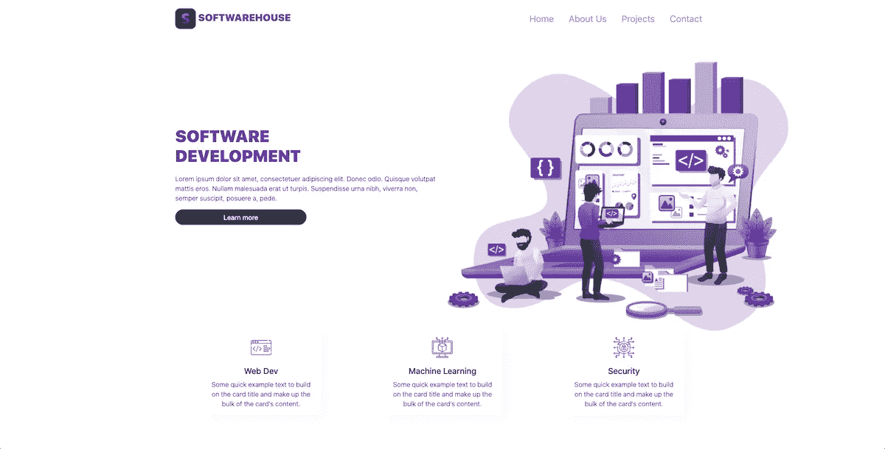
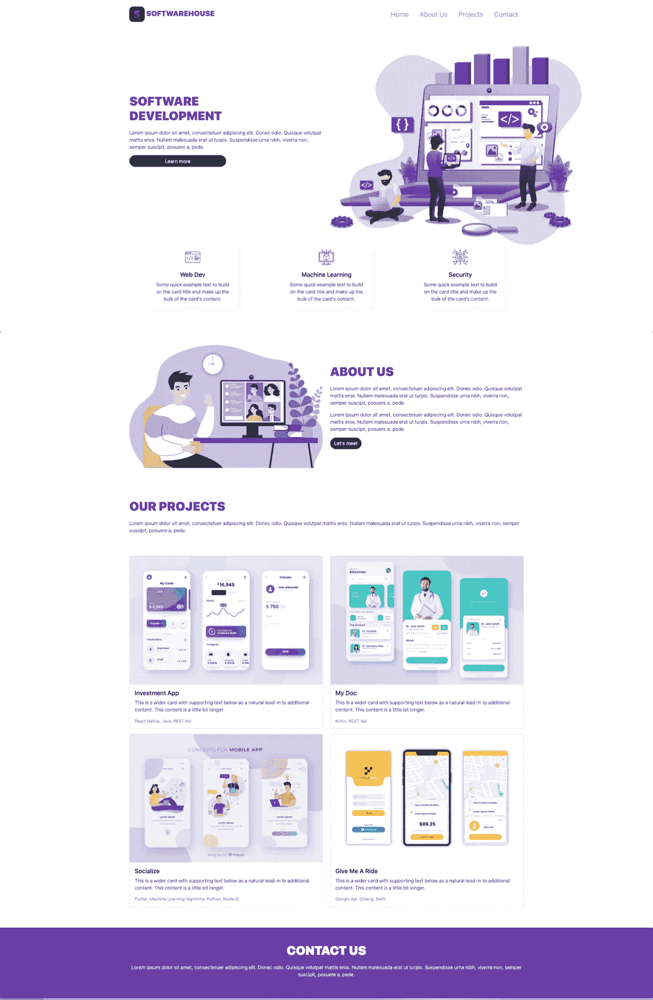

# Bootstrap 5 教程:如何使用 Bootstrap 5 创建一个简单的网页

> 原文：<https://itnext.io/bootstrap-5-tutorial-how-to-create-a-simple-web-page-using-bootstrap-5-28d851a2a08b?source=collection_archive---------2----------------------->


[Bootstrap 5 教程:如何使用 Bootstrap 5 创建一个简单的网页](https://www.blog.duomly.com/how-to-crate-simple-web-page-using-bootstrap-5/)

本文原载于[https://www . blog . duomly . com/how-to-crate-simple-web-page-using-bootstrap-5/](https://www.blog.duomly.com/how-to-crate-simple-web-page-using-bootstrap-5/)

# 使用 Bootstrap 创建简单的网页

几周前，Bootstrap 5 alpha 版本出现在市场上，这就是为什么今天我想介绍一下它的新特性，并使用 Bootstrap 5 创建一个简单的网页。

四月份，我们发布了关于 Bootstrap 4 的文章和视频，向您一步一步展示如何构建一个简单的仪表盘，因此，如果您错过了那一集和文章，请点击此处查看:

[如何在 Bootstrap 4 教程中构建仪表板](https://www.blog.duomly.com/bootstrap-tutorial/)

今天，我将向您展示如何使用 Bootstrap 5 为一家软件公司构建投资组合网站。

当然，一如既往，我也有一个视频教程给你，所以如果你是一个喜欢看，然后阅读的人，请访问我们的 Youtube 频道:

让我们从 Bootstrap 5 的新特性开始吧！

# Bootstrap 5 有什么新功能？

由于 Bootstrap 5 Alpha 将在几周内推出，我们可以讨论新版本带来的新特性。让我们来看看最重要的变化。

*   Bootstrap 曾经将 jQuery 用于弹出窗口或工具提示等元素。在第 5 版中，它不再使用 jQuery。相反，它适用于纯 Javascript。
*   Bootstrap 5 带来了 CSS 自定义属性，这要感谢对
*   互联网浏览器。让我们看一下他们的文档中提供的带有表引导的示例:

```
.table {
 — bs-table-bg: #{$table-bg};
 — bs-table-accent-bg: transparent;
 — bs-table-striped-color: #{$table-striped-color};
 — bs-table-striped-bg: #{$table-striped-bg};
 — bs-table-active-color: #{$table-active-color};
 — bs-table-active-bg: #{$table-active-bg};
 — bs-table-hover-color: #{$table-hover-color};
 — bs-table-hover-bg: #{$table-hover-bg};
} 
```

*   现在，在 Bootstrap 5 文档中，我们可以找到另一个选项卡—定制。它提供了关于主题化、定制以及用 Sass、更多颜色和其他选项扩展 Bootstrap 的信息。
*   完全定制的表单控件是 Bootstrap 5 版本的另一个特性。从现在开始，复选框或单选按钮的设计不再依赖于浏览器。
*   用于更好控制的新实用程序 API 是另一个特性。
*   除此之外，Bootstrap grid 得到了增强，现在我们可以使用一个新的类“xxl”,“gutter”被替换为“g*”实用程序；此外，他们还删除了列的默认值“position: relative”。

我们可以期待在下一个版本中有更多的变化。

所以，我认为是时候看看全新的引导版本是如何工作的了。

# 如何启动 Bootstrap 项目？

让我们开始创建我们的网站，通过创建一个文件夹，我们将放置它，在该文件夹中，让我们创建一个“index.html”文件。

在您喜欢的代码编辑器中打开我们的“index.html”文件后，让我们设置基本的 html 文件结构和所有需要的 cdn。

```
<!DOCTYPE>
<html>
 <head>
 <title>Portfolio Website</title>
 <! — CSS only →
 <link rel=”stylesheet” href=”[https://stackpath.bootstrapcdn.com/bootstrap/5.0.0-alpha1/css/bootstrap.min.css](https://stackpath.bootstrapcdn.com/bootstrap/5.0.0-alpha1/css/bootstrap.min.css)" integrity=”sha384-r4NyP46KrjDleawBgD5tp8Y7UzmLA05oM1iAEQ17CSuDqnUK2+k9luXQOfXJCJ4I” crossorigin=”anonymous”>
 <link rel=”stylesheet” href=”./styles.css”>
 <! — JavaScript and dependencies →
 <script src=”[https://cdn.jsdelivr.net/npm/popper.js@1.16.0/dist/umd/popper.min.js](https://cdn.jsdelivr.net/npm/popper.js@1.16.0/dist/umd/popper.min.js)" integrity=”sha384-Q6E9RHvbIyZFJoft+2mJbHaEWldlvI9IOYy5n3zV9zzTtmI3UksdQRVvoxMfooAo” crossorigin=”anonymous”></script>
 <script src=”[https://stackpath.bootstrapcdn.com/bootstrap/5.0.0-alpha1/js/bootstrap.min.js](https://stackpath.bootstrapcdn.com/bootstrap/5.0.0-alpha1/js/bootstrap.min.js)" integrity=”sha384-oesi62hOLfzrys4LxRF63OJCXdXDipiYWBnvTl9Y9/TRlw5xlKIEHpNyvvDShgf/” crossorigin=”anonymous”></script>
 </head>
 <body>
 </body>
</html>
```

好了，准备好之后，让我们为自定义样式再创建一个文件。姑且称之为' styles.css '，放在同一个文件夹里吧。

# 如何在 Bootstrap 5 中建立菜单？

现在，是时候开始我们的网站建设了。我们要创建的第一个元素是导航。在“body”标签中，我们将使用下面的代码。

```
 <! — Navbar →
<nav class=”py-3 navbar navbar-expand-lg fixed-top auto-hiding-navbar”>
 <div class=”container”>
 <a class=”navbar-brand”” href=”#”>
  SoftwareHouse
 </a>
 <button class=”navbar-toggler” type=”button” data-toggle=”collapse” data-target=”#navbarSupportedContent” aria-controls=”navbarSupportedContent” aria-expanded=”false” aria-label=”Toggle navigation”>
 <span class=”navbar-toggler-icon”></span>
 </button>
 <div class=”collapse navbar-collapse” id=”navbarSupportedContent”>
 <ul class=”navbar-nav ml-auto”>
 <li class=”nav-item”>
 <a class=”nav-link active” aria-current=”page” href=”#”>Home</a>
 </li>
 <li class=”nav-item”>
 <a class=”nav-link” href=”#”>About Us</a>
 </li>
 <li class=”nav-item”>
 <a class=”nav-link” href=”#”>Projects</a>
 </li>
 <li class=”nav-item”>
 <a class=”nav-link” href=”#”>Contact</a>
 </li>
 </ul>
 </div>
 </div>
</nav>
<! — End Navbar →
```

我们的网站需要一个标志。找到您想要用作徽标的任何图像或图标，并将其放入“网站”文件夹的“资源”文件夹中。我导入了我的 logo，作为一个‘logo . png’文件，所以要确保你的导入和你的图片以及它的位置是正确的。

接下来，我们将为我们的导航添加一些自定义样式。让我们打开“styles.css”文件，并添加以下代码。

```
body {
 display: block;
 overflow-x: hidden;
}
nav {
 background-color: white;
}
.navbar-brand img {
 max-height: 50px;
}
.navbar-brand {
 font-size: 24px;
 text-transform: uppercase;
 font-weight: 900;
 color: #683aa4;
}
nav ul li a {
 color: #a9a9a9;
 font-size: 22px;
 margin: auto 10px;
}
nav ul li a:hover {
 color: #683aa4;
}
```

太好了，你的菜单现在准备好了！

# Bootstrap 5 中如何构建英雄版块？

构建网页的下一步是创建一个英雄部分。在导航代码下面，让我们用图像、文本和三张卡片创建一个新的部分。

对于这一部分，你需要一个图像，我称之为“hero-img.png ”,和三个卡片图标。

```
<! — Hero section →
<section id=”hero”>
 <div class=”container”>
 <div class=”row”>
 <div class=”col”>
 <h1>Software<br>Development</h1>
 <p>Lorem ipsum dolor sit amet, consectetuer adipiscing elit. Donec odio. Quisque volutpat mattis eros. Nullam malesuada erat ut turpis. Suspendisse urna nibh, viverra non, semper suscipit, posuere a, pede.</p>
 <button type=”button” class=”btn btn-dark btn-large”>Learn more</button>
 </div>
 <div class=”col img-col”>
 
 </div>
 </div>
 <div class=”row cards”>
 <div class=”col-md-4 d-flex justify-content-center”>
 <div class=”card” style=”width: 18rem;”>
 <div class=”card-body”>
 
 <h5 class=”card-title”>Web Dev</h5>
 <p class=”card-text”>Some quick example text to build on the card title and make up the bulk of the card’s content.</p>
 </div>
 </div>
 </div>
 <div class=”col-md-4 d-flex justify-content-center”>
 <div class=”card” style=”width: 18rem;”>
 <div class=”card-body”>
 
 <h5 class=”card-title”>Machine Learning</h5>
 <p class=”card-text”>Some quick example text to build on the card title and make up the bulk of the card’s content.</p>
 </div>
 </div>
 </div>
 <div class=”col-md-4 d-flex justify-content-center”>
 <div class=”card” style=”width: 18rem;”>
 <div class=”card-body”>
 
 <h5 class=”card-title”>Security</h5>
 <p class=”card-text”>Some quick example text to build on the card title and make up the bulk of the card’s content.</p>
 </div>
 </div>
 </div>
  </div>
 </div>
</section>
<! — End Hero section →
```

为了让它看起来更好，我们还需要添加一些自定义的样式。因此，让我们打开我们的“styles.css”文件，并在其中放置以下代码。

```
section {
 padding-top: 50px;
 padding-bottom: 50px;
}
section h1 {
 text-transform: uppercase;
 font-weight: 900;
 color: #683aa4;
 text-align: left;
 margin-bottom: 20px;
}
section p {
 font-size: 16px;
 font-weight: 300;
}
button {
 max-width: 50%;
 border-radius: 50px !important;
}
#hero .col {
 justify-content: center; 
 flex-direction: column;
 display: flex;
}
#hero .img-col {
 justify-content: flex-end; 
 margin-top: 100px;
}
#hero img {
 max-width: 130% !important;
 width: 130%;
}
#hero .card {
 box-shadow: 11px 7px 16px #f9f9f9;
 border: 0;
 text-align: center;
}
#hero .icon {
 width: 50px;
 height: 50px;
 margin-bottom: 20px;
}
```

现在很好，你的网站应该看起来像下面的图片(只是有不同的照片)。



# 如何在 Bootstrap 5 中创建关于我们的部分？

我们要在网页上构建的下一个元素是“关于我们”部分。在这里，我们还将添加一个图像，因此请确保您的资产文件夹中有一个名为“about-us.png”的图像。

让我们转到“index.html”文件，在 hero 部分下面，添加以下代码。

```
<! — About us section →
<section id=”about-us”>
 <div class=”container”>
 <div class=”row align-items-center”>
 <div class=”col”>
 
 </div>
 <div class=”col text-col”>
 <h1>About Us</h1>
 <p>Lorem ipsum dolor sit amet, consectetuer adipiscing elit. Donec odio. Quisque volutpat mattis eros. Nullam malesuada erat ut turpis. Suspendisse urna nibh, viverra non, semper suscipit, posuere a, pede.</p>
 <p>Lorem ipsum dolor sit amet, consectetuer adipiscing elit. Donec odio. Quisque volutpat mattis eros. Nullam malesuada erat ut turpis. Suspendisse urna nibh, viverra non, semper suscipit, posuere a, pede.</p>
 <button type=”button” class=”btn btn-dark btn-large”>Let’s meet</button>
 </div>
 </div>
 </div>
</section>
<! — End About us section →
```

维奥拉，第二部分准备好了。

# 如何在 Bootstrap 5 中建立 portfolio 部分？

现在，每个软件之家页面最重要的部分来了。我们将创建一个项目部分，由两行四张卡片组成。

确保在你的资产文件夹中有另外 4 张图片，也许你可以使用你自己的项目来展示。

在“关于我们”部分下面，让我们添加以下代码。

```
<! — Projects section →
<section id=”projects”>
<div class=”container”>
 <div class=”row align-items-center projects”>
 <div class=”col”>
 <h1>Our Projects</h1>
 <p>Lorem ipsum dolor sit amet, consectetuer adipiscing elit. Donec odio. Quisque volutpat mattis eros. Nullam malesuada erat ut turpis. Suspendisse urna nibh, viverra non, semper suscipit, posuere a, pede.</p>
 </div>
 </div>
<div class=”row align-items-center”>
 <div class=”col”>
 <div class=”card mb-3">
 
 <div class=”card-body”>
 <h5 class=”card-title”>Investment App</h5>
 <p class=”card-text”>This is a wider card with supporting text below as a natural lead-in to additional content. This content is a little bit longer.</p>
 <p class=”card-text”><small class=”text-muted”>React Native, Java, REST Api</small></p>
 </div>
 </div>
 </div>
<div class=”col”>
 <div class=”card mb-3">
 
 <div class=”card-body”>
 <h5 class=”card-title”>My Doc</h5>
 <p class=”card-text”>This is a wider card with supporting text below as a natural lead-in to additional content. This content is a little bit longer.</p>
 <p class=”card-text”><small class=”text-muted”>Kotlin, REST Api</small></p>
 </div>
 </div>
 </div>
 </div>
<div class=”row align-items-center”>
 <div class=”col”>
 <div class=”card mb-3">
 
 <div class=”card-body”>
 <h5 class=”card-title”>Socialize</h5>
 <p class=”card-text”>This is a wider card with supporting text below as a natural lead-in to additional content. This content is a little bit longer.</p>
 <p class=”card-text”><small class=”text-muted”>Flutter, Machine Learning Algrithms, Python, NodeJS</small></p>
 </div>
 </div>
 </div>
 <div class=”col”>
 <div class=”card mb-3">
 
 <div class=”card-body”>
 <h5 class=”card-title”>Give Me A Ride</h5>
 <p class=”card-text”>This is a wider card with supporting text below as a natural lead-in to additional content. This content is a little bit longer.</p>
 <p class=”card-text”><small class=”text-muted”>Google Api, Golang, Swift</small></p>
 </div>
 </div>
 </div>
</div>
</div>
</section>
<! — End Projects section →
```

和一些 CSS 来使它看起来更好。

```
#projects .projects {
 margin-bottom: 50px;
}
```

还有一件事来完成我们的网站。我们将添加一个联系人部分，带有一些文本。让我们在“index.html”文件中添加以下代码。

```
<! — Contact section →
<section id=”contact”>
 <div class=”container”>
 <div class=”row align-items-center”>
 <div class=”col”>
 <h1>Contact US</h1>
 <p>Lorem ipsum dolor sit amet, consectetuer adipiscing elit. Donec odio. Quisque volutpat mattis eros. Nullam malesuada erat ut turpis. Suspendisse urna nibh, viverra non, semper suscipit, posuere a, pede.</p>
 </div>
 </div>
 </div>
</section>
<! — End Contact section →
```

最后一部分是添加最后的 CSS 代码。

```
#contact {
 text-align: center;
 background-color: #683aa4;
 color: white;
}
#contact h1 {
 text-align: center;
 color: white;
}
```

呜哇！我们的 Bootstrap 5 网页已经准备好了！这是我们代码的结果。



# 结论

祝贺您，您刚刚使用 Bootstrap 5 创建了一个投资组合登录页面。如果你想创建自己的作品集页面，请随意添加你喜欢的图片和文字，这样你就有一个现成的网站了。如果你想学习如何在 Bootstrap 中构建一个简单的仪表板，看看我们之前的 Bootstrap 教程。

[如何在 Bootstrap 4 教程中构建仪表板](https://www.blog.duomly.com/bootstrap-tutorial/)

除此之外，欢迎参加我们的 Duomly T1 课程，在这里你可以学习如何建立一个电子商务。


[Duomly —编程在线课程](https://www.duomly.com/?code=lifetime-80)

感谢您的阅读，
来自 Duomly 的安娜