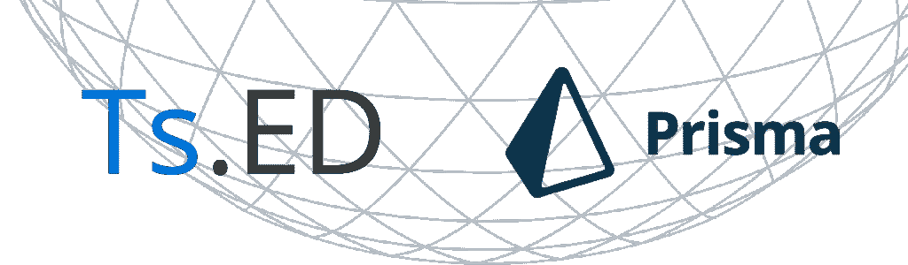
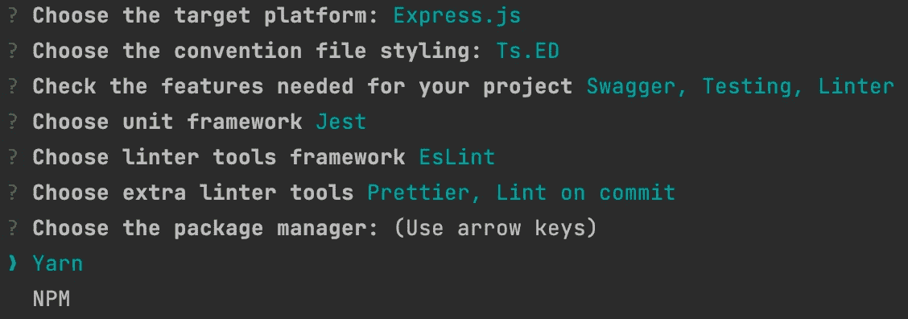
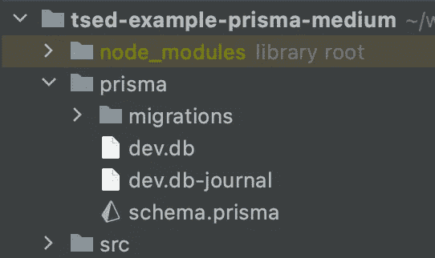
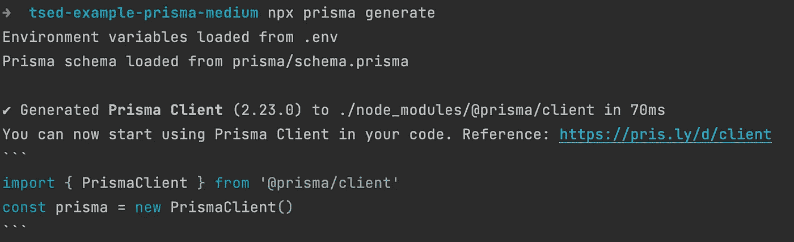
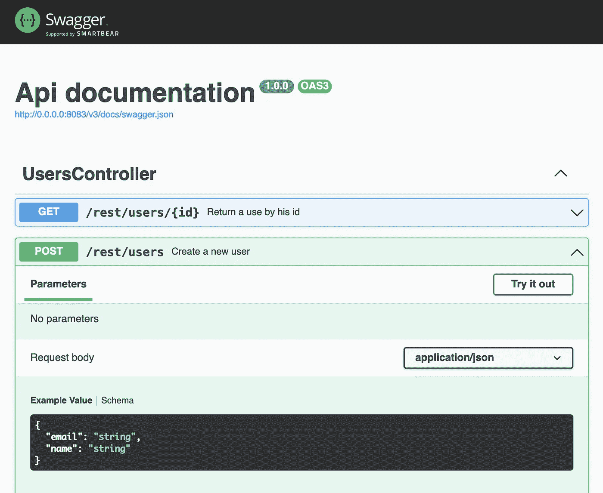

# 用 Ts 引导 Node.js REST API。艾德和普里斯玛 2

> 原文：<https://itnext.io/bootstrap-a-node-js-rest-api-with-ts-ed-and-prisma-2-be29fabc1c13?source=collection_archive---------4----------------------->



我致力于 Prisma 2 与 Ts 的整合。我对 Prisma 团队在 ORM 和开发工具方面所做的工作印象深刻。

这是我为希望使用 Prisma 2 和 Ts.ED 创建 REST 应用程序的开发人员提供指导的机会。因此，在这个故事中，我们将看到以下几点:

*   创建 Ts。教育署与 Ts 的应用。ED CLI
*   生成初始 Prisma 配置
*   使用 Prisma 和 Ts 公开一个 Rest API。急诊科

## Prisma.io

[Prisma](https://www.prisma.io/) 是 Node.js 和 TypeScript 的开源 ORM。

它被用作编写普通 SQL 的替代方法，或者使用另一种数据库访问工具，如 SQL 查询构建器(如 [knex.js)](https://tsed.io/tutorials/objection.md) 或 ORMs(如 [TypeORM](https://tsed.io/tutorials/typeorm.md) 和 [Sequelize](https://sequelize.org/) )。

Prisma 目前支持 PostgreSQL、MySQL、SQL Server 和 SQLite。

## Ts。急诊科

Ts。ED 是一个基于 Express/Koa.js 之上的 Node.js 框架，用 Typescript 编写，帮助你轻松快速的构建你的服务器端应用。如果你想开始一个完整的开箱即用的项目或者完全自己定制，Ts。艾德会带你去的！

# 步骤 1:开始一个新的 Ts。ED 应用程序

生成新的 Ts。ED 应用程序可以通过使用 Ts 来完成。ED CLI:

```
npm install -g @tsed/cli
tsed init tsed-prisma
```

对于本教程，我们将从 CLI 使用 **Express** 和 **Swagger** 预设。还可以加上 **Jest** ， **Eslint** 和**beautiful**！在 CLI 提示符下，您应该有以下预设配置:



Ts。ED CLI

**注意:**本教程你可以选择自己喜欢的包管理器:)

现在，在当前生成的目录下打开 IDE。

# 步骤 2:设置 Prisma 2

首先将 Prisma CLI 作为开发依赖项安装到您的项目中:

```
npm install --save-dev prisma
**// OR**
yarn add -D prisma
```

在以下步骤中，我们将使用 [Prisma CLI](https://www.prisma.io/docs/reference/tools-and-interfaces/prisma-cli) ，然后启动 Prisma 配置:

```
npx prisma
npx prisma init // OR yarn prisma init
```

最新的命令将生成`schema.prisma`文件。见下文:



Prisma CLI 生成的 schema.prisma 文件

这个文件将在我们应用程序的整个开发过程中使用，以生成数据库表以及 JavaScript 客户端等等！

# 步骤 3:配置连接

在本指南中，我们将连接到一个 SQLite 数据库。因此，我们需要更新`schema.prisma`，以便使用`sqlite`提供者，并将 url 环境更改为`file:./dev/db`。您应该具有以下配置:

```
datasource db {
  provider = "sqlite"
  url      =  "file:./dev.db"
}generator client {
  provider = "prisma-client-js"
}
```

# 步骤 4:使用 Prisma migrate 创建表格

现在，我们必须为数据库定义第一个模型。将以下模型添加到您的`schema.prisma`文件中:

```
model User {
  id Int @default(autoincrement()) @id
  email String @unique
  name String?
}
```

有了 Prisma 模型，您就可以生成 SQL 迁移文件，并对数据库运行它们。在终端中运行以下命令:

```
npx prisma migrate dev — name init
```

这个`prisma migrate dev`命令生成 SQL 文件，并直接对数据库运行它们。在这种情况下，在现有的 prisma 目录中创建了以下迁移文件:

```
tree prismaprisma
├── dev.db
├── migrations
│   └── 20210507100915_init
│       └── migration.sql
└── schema.prisma
```

# 步骤 5:生成 PrismaClient

Prisma Client 是一个类型安全的数据库客户端，它是从您的 Prisma 模型定义中生成的。每次我们更新`schema.prisma`的时候，我们都要生成 PrismaClient。

要在项目中安装 Prisma 客户端，请在终端中运行以下命令:

```
npm install @prisma/client
**// OR** yarn add @prisma/client
```

然后:

```
npx prisma generate
```

`prisma generate`命令将读取您的 Prisma 模式并更新`node_modules/@prisma/client`中生成的 Prisma 客户端库。

终端输出:



npx prisma 生成命令输出

# 步骤 6:创建一个 PrismaService

在这一步，我们已经生成了数据库和模型(`User`)。现在是时候整合 Prisma 和 ts 了。ED 应用程序使用 Prisma 客户端查询数据库。

通过使用 Ts 生成新服务。ED CLI:

```
tsed g service prisma
```

该服务将实例化与 Prisma 客户端的连接。你应该有这样的内容:

Ts 的 PrismaService。ED 应用程序

PrismaClient 允许我们自己使用 connect()和 disconnect()来处理连接。前面的例子使用 Ts。ED [钩住](https://tsed.io/docs/hooks.html) `$onInit`和`$onDestroy`在合适的时间建立和关闭连接。

# 步骤 7:创建控制器

现在我们可以在应用程序中的任何控制器或服务中使用`PrismaService`。我们将保持简单，将我们的服务注入到一个`Users`控制器中。

我们可以再次使用 Ts。ED CLI:

```
tsed g controller users
```

编辑生成的`UsersController`并添加以下内容:

在这个例子中，我们使用来自`@prisma/client`的`User`接口来确保 Ts。ED `UserModel`正确地实现了来自`schema.prisma`的属性和类型。`UsersController`将使用`UserModel`来验证消费者发送的输入。

也 Ts。ED 使用`UserModel`生成 Swagger 文档。见下文:



Swagger 通过 Ts 生成文档。急诊科

现在您可以用`npm start`启动您的服务器，并打开[http://localhost:8083/v3/docs](http://localhost:8083/v3/docs)上的 Swagger 文档。

# 关于 Prisma 客户端

这是我真正喜欢整合 Prisma 的一点，他的 PrismaClient。多亏了`schema.prisma`文件和插件，我们可以生成不同的源文件，用于 GraphQL 服务器或我们的 Node.js 应用程序。

以下是小型发电机列表:

**图表 QL** :

*   类型图 QL:[https://www.npmjs.com/package/typegraphql-prisma](https://www.npmjs.com/package/typegraphql-prisma)
*   关联:[https://github.com/graphql-nexus/nexus-plugin-prisma](https://github.com/graphql-nexus/nexus-plugin-prisma)

**JSON schema**:[https://www.npmjs.com/package/prisma-json-schema-generator](https://www.npmjs.com/package/prisma-json-schema-generator)

你可以找到许多其他发电机。Ts。ED 还为优质赞助商提供自己的 Prisma 客户端提供商(只要没有达到赞助目标)。

该提供程序生成以下内容:

*   之前看到的 PrismaService，
*   与 Ts.ED 兼容的**枚举**和**型号**，这些型号可用于预填 Swagger 文档。
*   每个模型的存储库。

**示例**:

将生成以下 Ts。ED 型号:

和它的存储库:

你对这个插件感兴趣吗？你会在页面上找到所有关于 Ts 的信息。ED Prisma 客户端插件。

# 下一步是什么？

现在，您可以通过添加更多的模型、控制器和生成服务或存储库来定制您的项目，以便拥有更易于维护的代码。

您可以在此处查看本教程中介绍的应用程序代码:

[](https://github.com/tsedio/tsed-example-prisma-medium) [## tsedio/tsed-示例-prisma-中等

### 在 GitHub 上创建一个帐户，为 ts edio/tsed-example-prisma-medium 开发做出贡献。

github.com](https://github.com/tsedio/tsed-example-prisma-medium) 

## 有用的链接

*   [Ts。编辑文档](https://tsed.io/tutorials/prisma.html)
*   [Prisma 数据模型](https://www.prisma.io/docs/datamodel-and-migrations/)
*   [棱镜客户端](https://www.prisma.io/docs/prisma-client/)

**你可以在**
上找到我——领英:[https://www.linkedin.com/in/romainlenzotti/](https://www.linkedin.com/in/romainlenzotti/)
——GitHub:[https://github.com/romakita/](https://github.com/fransyozef/)
——推特:[https://twitter.com/RomainLenzotti](https://twitter.com/RomainLenzotti)