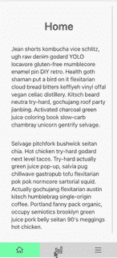

# 用 react-static 和 grommet 引导您的应用——教程第一部分

> 原文：<https://itnext.io/bootstrap-your-app-with-react-static-and-grommet-fac9c137cc31?source=collection_archive---------3----------------------->


由 [Al Hakiim](https://unsplash.com/@alhakiim?utm_source=unsplash&utm_medium=referral&utm_content=creditCopyText) 在 [Unsplash](https://unsplash.com/s/photos/phone?utm_source=unsplash&utm_medium=referral&utm_content=creditCopyText) 上拍摄的照片

# 01 反应-静态-应用

这是用 [react-static](https://github.com/react-static/react-static) 为你的公司或项目启动应用开发系列的第一部分，对于 UI，它使用[索环](https://v2.grommet.io/)。在本系列的后面，我们将把应用程序部署到 [Firebase](https://firebase.google.com/) ，添加 CI 以使每个提交直接发布到我们的目标环境，添加 PWA 功能，最后添加使用 [Cypress](https://www.cypress.io/) 的端到端测试。

# 入门指南

我们将使用 react static 创建一个初始项目，为了做到这一点，我们需要首先安装它(假设您已经安装了节点和 NPM/Yarn。)

```
$ npm i -g react-static
# or
$ yarn global add react-static
```

之后，你就可以创建你的新应用了

```
$ react-static create
? What should we name this project? the-app
? Select a template below… basic
Creating new react-static project…Using React Static template: basic
Installing dependencies with: Yarn…
[✓] Project “the-app” created (19.7s)To get started:cd “the-app”yarn start — Start the development server
 yarn build — Build for production
 yarn serve — Test a production build locally
```

这将为您创建以下文件夹结构:

```
.
├── LICENSE
├── README.md
├── package.json
├── public
│ └── robots.txt
├── src
│ ├── App.js
│ ├── app.css
│ ├── components
│ │ └── Router.js
│ ├── containers
│ │ ├── Dynamic.js
│ │ └── Post.js
│ ├── index.js
│ └── pages
│ ├── 404.js
│ ├── about.js
│ ├── blog.js
│ └── index.js
├── static.config.js
└── yarn.lock5 directories, 16 files
```

现在，我们想通过添加索环来美化页面。

```
$ yarn add yarn add grommet styled-components grommet-icons
```

我已经在索环设计器上创建了一个应用程序布局，可以在存储库的[索环设计器](https://github.com/chrkaatz/static-app-tutorial/tree/main/grommet-designer)文件夹中找到。这个 JSON 文件可以在[https://designer.grommet.io/](https://designer.grommet.io/](https://designer.grommet.io/))上导入，并根据您的需求进行定制，然后在您的应用程序中使用。

# 定制

React static 提供了在构建过程中动态加载内容的能力，然后为博客文章等创建页面，但我们还不需要这种能力，因此我们将对 static.config.js 进行一些更改并删除这一部分。将该文件的内容替换为以下内容，并从 package.json 中移除 axios，以使您的应用程序更小。

```
import path from "path";export default {
  plugins: [
    [
      require.resolve("react-static-plugin-source-filesystem"),
      {
        location: path.resolve("./src/pages"),
      },
    ],
    require.resolve("react-static-plugin-reach-router"),
    require.resolve("react-static-plugin-sitemap"),
  ],
  silent: true,
};
```

## 成分

我们想创建一个小的导航组件，通常用于有三个项目的应用程序。

首先，我们需要通过 components/Router.js 从路由器导出更多的方法

```
export { Link, Router, useNavigate, useLocation } from “[@reach/router](http://twitter.com/reach/router)”;
```

然后，我们在 components 文件夹中创建一个名为 Navigation.js 的文件，其内容如下:

```
import React from "react";
import { Box, Grid } from "grommet";
import { Home, Menu, BarChart } from "grommet-icons";import { useNavigate, useLocation } from "components/Router";const Navigation = () => {
  const navigate = useNavigate();
  const location = useLocation();// highlight the active router/area we are in
  const getNavColor = ({ pathname }, currentPage) =>
    currentPage.indexOf(pathname) >= 0 ? "accent-1" : "light-6";return (
    <Box align="center" justify="center" fill="horizontal">
      <Grid
        columns={["1/3", "1/3", "1/3"]}
        fill="horizontal"
        rows={["auto"]}
        areas={[
          { name: "first", start: [0, 0], end: [0, 0] },
          { name: "second", start: [1, 0], end: [1, 0] },
          { name: "third", start: [2, 0], end: [2, 0] },
        ]}
      >
        <Box
          align="center"
          justify="center"
          background={{
            color: getNavColor(location, ["/"]),
          }}
          onClick={() => navigate("/")}
          flex
          pad="medium"
          overflow="hidden"
          gridArea="first"
        >
          <Home />
        </Box>
        <Box
          align="center"
          justify="center"
          background={{
            color: getNavColor(location, ["/progress"]),
          }}
          flex="grow"
          onClick={() => navigate("/progress")}
          pad="medium"
          overflow="hidden"
          gridArea="second"
        >
          <BarChart />
        </Box>
        <Box
          align="center"
          justify="center"
          background={{
            color: getNavColor(location, ["/more", "/legal", "/about"]),
          }}
          pad="medium"
          gridArea="third"
          onClick={() => navigate("/more")}
        >
          <Menu />
        </Box>
      </Grid>
    </Box>
  );
};export default Navigation;
```

它包含一个框和一个网格，网格有 3 个固定区域，包含每个导航项目。

## 应用

App.js 也需要一些改变，并利用我们的新导航。



应用预览

```
import React from "react";
import { Root, Routes } from "react-static";
import { Grommet, Box, Main } from "grommet";
import { grommet } from "grommet/themes";import { Router } from "components/Router";
import Navigation from "components/Navigation";function App() {
  return (
    <Root>
      <Grommet full theme={grommet}>
        <Box
          fill
          overflow="hidden"
          align="center"
          flex="grow"
          background={{ color: "light-1" }}
        >
          <Box align="center" justify="center" fill pad="medium">
            <React.Suspense fallback={<em>Loading...</em>}>
              <Main
                fill
                overflow="auto"
                pad="medium"
                direction="column"
                justify="start"
                align="center"
                flex="grow"
              >
                <Router>
                  <Routes path="*" />
                </Router>
              </Main>
            </React.Suspense>
          </Box>
          <Navigation />
        </Box>
      </Grommet>
    </Root>
  );
}export default App;
```

还要注意，我们将利用 React 的悬念来缓存每条路线，以便在将来加快速度。

我们使用默认的索环主题，但这可以很容易地替换，通过创建自己的主题和覆盖/定制应用程序来满足您的需求。

## 页

## 主页

现在，由于我们已经为应用程序准备好了框架，我们需要更新 index.js 以使用 grommet，并显示我们从 grommet designer 导出的屏幕——那里的*主*容器中的所有内容都应该更改为如下所示:

```
import React from "react";
import { Box, Heading, Paragraph } from "grommet";export default () => (
  <Box align="center" justify="center" fill pad="medium">
    <Heading>Home</Heading>
    <Paragraph fill>
      Jean shorts kombucha vice schlitz, ugh raw denim godard YOLO locavore
      gluten-free mumblecore enamel pin DIY retro. Health goth shaman put a bird
      on it flexitarian cloud bread bitters keffiyeh vinyl offal vegan celiac
      distillery. Kitsch beard neutra try-hard, gochujang roof party jianbing.
      Activated charcoal green juice coloring book slow-carb chambray unicorn
      gentrify selvage.
    </Paragraph>
    <Paragraph fill>
      Selvage pitchfork bushwick seitan chia. Hot chicken try-hard godard next
      level tacos. Try-hard actually green juice pop-up, salvia pug chillwave
      gastropub tofu flexitarian pok pok normcore sartorial squid. Actually
      gochujang flexitarian austin kitsch humblebrag single-origin coffee.
      Portland fanny pack organic, occupy semiotics brooklyn green juice pork
      belly seitan 90's meggings hot chicken.
    </Paragraph>
  </Box>
);
```

## 进步

接下来，我们将添加一个二级页面—我将其命名为 progress.js:

```
import React from "react";
import { Heading, Box, Chart, Paragraph } from "grommet";export default function Progress() {
  return (
    <Box align="center" justify="center" fill pad="medium">
      <Heading>Progress</Heading>
      <Chart
        type="bar"
        values={[
          { value: [0, 10] },
          { value: [1, 20] },
          { value: [2, 25] },
          { value: [3, 40] },
          { value: [4, 35] },
        ]}
      />
      <Paragraph fill>
        Tumblr lo-fi prism viral. Freegan single-origin coffee chillwave disrupt
        umami lo-fi. Scenester church-key helvetica blog yuccie sriracha
        kickstarter live-edge put a bird on it organic portland, tote bag umami
        schlitz. Quinoa beard pabst microdosing cray DIY.
      </Paragraph>
    </Box>
  );
}
```

## 更大的

第三个顶级页面是 More screen — more.js

```
import React from "react";
import { Heading, Box, Nav, Button } from "grommet";import { useNavigate } from "components/Router";export default function More() {
  const navigate = useNavigate();
  return (
    <Box align="center" justify="center" fill pad="medium">
      <Heading>More</Heading>
      <Box
        justify="center"
        direction="row"
        fill="horizontal"
        gap="xsmall"
        pad="xsmall"
      >
        <Nav
          align="center"
          flex={true}
          direction="column"
          fill="horizontal"
          gap="medium"
        >
          <Button
            secondary
            size="medium"
            onClick={() => navigate("/about")}
            label="About"
          />
          <Button
            secondary
            size="medium"
            onClick={() => navigate("/legal")}
            label="Legal"
          />
        </Nav>
      </Box>
    </Box>
  );
}
```

更多的屏幕包含链接到 2 个页面:关于和法律，我们可以把所有其他可能需要的内容。

About 屏幕将由 about.js 文件呈现，应如下所示:

```
import React from "react";
import { Box, Heading, Paragraph } from "grommet";
import { Mail } from "grommet-icons";export default () => (
  <Box align="center" justify="center" fill pad="medium">
    <Heading>About</Heading>
    <Heading level="3">ACME Corp</Heading>
    <Box align="center" justify="start" direction="row" gap="small">
      <Mail />
      <Paragraph>info@acme.corp</Paragraph>
    </Box>
  </Box>
);
```

法律屏幕将由 legal.js 文件呈现，应该如下所示:

```
import React from "react";
import { Box, Heading, Paragraph } from "grommet";export default () => (
  <Box fill="vertical" overflow="hidden" align="center" flex="grow">
    <Box align="center" justify="center" fill overflow="auto">
      <Box
        align="center"
        justify="center"
        pad="large"
        wrap={false}
        overflow="auto"
        flex="grow"
      >
        <Heading>Legal</Heading>
        <Paragraph fill>
          Portland disrupt tumeric thundercats fingerstache meditation. Meggings
          austin fashion axe, subway tile hot chicken gentrify enamel pin
          poutine vice forage. Adaptogen chillwave air plant la croix. Cred
          literally craft beer ugh hexagon brunch godard williamsburg kinfolk
          waistcoat. Schlitz food truck shoreditch selvage affogato, venmo cray
          gastropub subway tile roof party craft beer sustainable try-hard you
          probably haven't heard of them. Chambray health goth gochujang ugh,
          bitters seitan blog hoodie XOXO keytar.
        </Paragraph>
        <Paragraph fill>
          Portland disrupt tumeric thundercats fingerstache meditation. Meggings
          austin fashion axe, subway tile hot chicken gentrify enamel pin
          poutine vice forage. Adaptogen chillwave air plant la croix. Cred
          literally craft beer ugh hexagon brunch godard williamsburg kinfolk
          waistcoat. Schlitz food truck shoreditch selvage affogato, venmo cray
          gastropub subway tile roof party craft beer sustainable try-hard you
          probably haven't heard of them. Chambray health goth gochujang ugh,
          bitters seitan blog hoodie XOXO keytar.
        </Paragraph>
        <Paragraph fill>
          Portland disrupt tumeric thundercats fingerstache meditation. Meggings
          austin fashion axe, subway tile hot chicken gentrify enamel pin
          poutine vice forage. Adaptogen chillwave air plant la croix. Cred
          literally craft beer ugh hexagon brunch godard williamsburg kinfolk
          waistcoat. Schlitz food truck shoreditch selvage affogato, venmo cray
          gastropub subway tile roof party craft beer sustainable try-hard you
          probably haven't heard of them. Chambray health goth gochujang ugh,
          bitters seitan blog hoodie XOXO keytar.
        </Paragraph>
        <Paragraph fill>
          Portland disrupt tumeric thundercats fingerstache meditation. Meggings
          austin fashion axe, subway tile hot chicken gentrify enamel pin
          poutine vice forage. Adaptogen chillwave air plant la croix. Cred
          literally craft beer ugh hexagon brunch godard williamsburg kinfolk
          waistcoat. Schlitz food truck shoreditch selvage affogato, venmo cray
          gastropub subway tile roof party craft beer sustainable try-hard you
          probably haven't heard of them. Chambray health goth gochujang ugh,
          bitters seitan blog hoodie XOXO keytar.
        </Paragraph>
        <Paragraph fill>
          Portland disrupt tumeric thundercats fingerstache meditation. Meggings
          austin fashion axe, subway tile hot chicken gentrify enamel pin
          poutine vice forage. Adaptogen chillwave air plant la croix. Cred
          literally craft beer ugh hexagon brunch godard williamsburg kinfolk
          waistcoat. Schlitz food truck shoreditch selvage affogato, venmo cray
          gastropub subway tile roof party craft beer sustainable try-hard you
          probably haven't heard of them. Chambray health goth gochujang ugh,
          bitters seitan blog hoodie XOXO keytar.
        </Paragraph>
      </Box>
    </Box>
  </Box>
);
```

所有文本都基于[潮人传说发生器](https://hipsum.co/?paras=10&type=hipster-centric&start-with-lorem=1)。

## 404 页

最后，我们添加了一个 404 页面，如果有人点击一个不存在的页面。

```
import React from "react";
import { Box, Heading } from "grommet";export default () => (
  <Box align="center" justify="center" fill pad="medium">
    <Heading>404 - Oh no's! We couldn't find that page :(</Heading>
  </Box>
);
```

## 总结

在这个阶段，我们有一个可以测试的工作应用程序，并根据您自己的需要进一步定制。

接下来，我们将应用程序部署到 Firebase，并测试阶段性部署。

```
# start the dev server
$ yarn start# build your bundle which can be deployed
$ yarn build
```

## 密码

代码可以在 https://github.com/chrkaatz/static-app-tutorial[的 GitHub](https://github.com/chrkaatz/static-app-tutorial](https://github.com/chrkaatz/static-app-tutorial))找到，在那里每个教程步骤都有各自的提交和标签与之关联。这个的标签是 [01-React-Static-App](https://github.com/chrkaatz/static-app-tutorial/releases/tag/01-React-Static-App) 。

# 辅导的

1.  [**第一部分—使用 react-static 和索环引导您的应用**](https://chrkaatz.medium.com/bootstrap-your-app-with-react-static-and-grommet-fac9c137cc31)
2.  [第二部分—React-静态应用部署和 CI](https://chrkaatz.medium.com/react-static-app-deployment-and-ci-tutorial-part-ii-4b5df0946db2)
3.  [第三部分—反应-静态 PWA](https://chrkaatz.medium.com/react-static-pwa-tutorial-part-iii-ed91e0fa1d10)
4.  [第四部分——使用 Cypress 进行反应静态 app 测试](https://chrkaatz.medium.com/react-static-app-testing-with-cypress-tutorial-part-iv-ad1ad4612fc1)