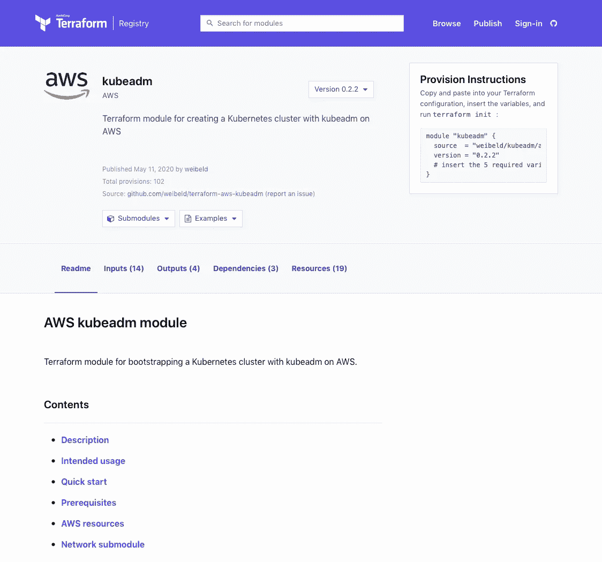
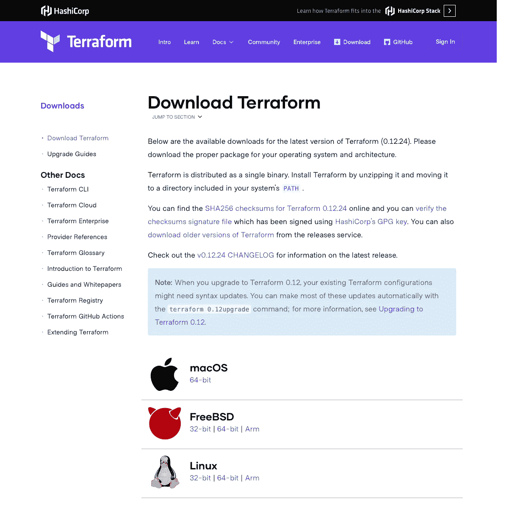

# 用 Terraform 引导 AWS 上的 Kubernetes 集群

> 原文：<https://itnext.io/bootstrapping-kubernetes-clusters-on-aws-with-terraform-b7c0371aaea0?source=collection_archive---------1----------------------->

本文展示了一个 Terraform 模块，用于在 AWS 上使用 kubeadm 创建基本的 Kubernetes 集群。

# 内容

1.  [**简介**](#c72c)
2.  [**托管 Kubernetes 服务**](#ba3b)
3.  [**Kubernetes 安装工具**](#6761)
4.  [**terra form kube ADM 模块**](#d283)
5.  [**什么是 Terraform？**](#ce4c)
6.  [**使用 Terraform 模块的先决条件**](#9403)
7.  [**创建单个集群**](#9403)
8.  [**连接到节点**](#7af1)
9.  [**使用专用 VPC**](#9689)
10.  [**创建多个集群**](#c99a)
11.  [**安装 CNI 插件**](#a66e)
12.  [**摧毁星团**](#9630)
13.  [**结论**](#4cbd)

# 介绍

创建 Kubernetes 集群有许多方法——从简单的集群安装工具，如 [kubeadm](https://kubernetes.io/docs/setup/production-environment/tools/kubeadm/create-cluster-kubeadm/) 到成熟的托管 Kubernetes 服务，如 [GKE](https://cloud.google.com/kubernetes-engine) 、 [EKS](https://aws.amazon.com/eks/) 或 [AKS](https://docs.microsoft.com/azure/aks/) 。

通常，可用选项在自动化和灵活性之间进行权衡:

*   托管 Kubernetes 服务使得创建集群变得非常容易，但是它们通常会应用许多您无法配置的默认设置。
*   在另一个极端，在没有任何脚本和工具的情况下手动安装 Kubernetes [允许您配置您想要的每个设置，但是它需要许多手动和容易出错的步骤。](https://github.com/kelseyhightower/kubernetes-the-hard-way)

通常，你想要的是这两个极端之间的中间地带。

例如以简单的方式创建一个非自以为是的集群——最好使用一个命令。

如果你想尝试某些低级的 Kubernetes 特性，比如 [CNI 插件](https://kubernetes.io/docs/concepts/extend-kubernetes/compute-storage-net/network-plugins/)——如果一个给定的集群安装方法默认安装了一个 CNI 插件，你就不能将它用于这个目的，因为你需要控制安装哪个 CNI 插件以及如何配置它。

*本文介绍了一种试图结合自动化和灵活性的方法。*

这是一个 [Terraform 模块](https://registry.terraform.io/modules/weibeld/kubeadm/aws)，它使用 [kubeadm](https://kubernetes.io/docs/setup/production-environment/tools/kubeadm/create-cluster-kubeadm/) 在 AWS 上创建一个简单的集群:


创建的集群是“最小可行集群”，因为它们是由 kubeadm 生成的，没有安装 CNI 插件，也没有应用自以为是的设置。

这样做的目的是提供一个基础，在这个基础上你可以运行受控的 Kubernetes 实验(比如测试 CNI 插件或者实验其他 Kubernetes 特性)。

你可以在 GitHub 上找到 Terraform 模块[的代码。](https://github.com/weibeld/terraform-aws-kubeadm)

*本文的剩余部分首先回顾创建 Kubernetes 集群的可用选项，然后介绍 Terraform 模块。*

# 托管 Kubernetes 服务

创建 Kubernetes 集群的选项可以分为两类:托管服务和安装工具。

托管 Kubernetes 服务为您创建和操作集群，并允许您访问它。

*他们允许你以软件即服务(SaaS)的方式使用 Kubernetes。*

托管 Kubernetes 服务提供了最高程度的自动化(创建和操作完全由您完成)，但灵活性最低(您只能配置服务提供商通过其 API 公开的那些设置)。

最受欢迎的托管 Kubernetes 服务由主要的云提供商提供:

*   [谷歌 Kubernetes 引擎(GKE)](https://cloud.google.com/kubernetes-engine)GCP
*   [亚马逊弹性库本内特服务(EKS)](https://aws.amazon.com/eks/) 由 AWS 提供
*   [Azure Kubernetes 服务(AKS)](https://docs.microsoft.com/azure/aks/) 由 Azure

# Kubernetes 安装工具

Kubernetes 安装工具允许您自己安装和管理 Kubernetes(无论是在内部还是在云中)。

它们允许你像使用传统的自我管理软件一样使用 Kubernetes。

安装工具提供了不同程度的自动化和灵活性，这取决于工具希望“让它适合您”的程度。

在撰写本文时，最流行的(也是官方支持的)Kubernetes 安装工具是:

*   [kops](https://kops.sigs.k8s.io/)
*   [**kubespray**](https://kubespray.io/)
*   [**kubeadm**](https://kubernetes.io/docs/setup/production-environment/tools/kubeadm/create-cluster-kubeadm/)

让我们简单地看一下它们中的每一个。

## 科普斯

在提供的三个工具中， [kops](https://kops.sigs.k8s.io/) 提供了最高程度的自动化，但也是最固执己见的一个。

kops 的特别之处在于，它不仅安装了 Kubernetes，还提供了集群运行的云基础设施(目前支持 AWS 和 GCP)。

这意味着，只需一个命令，您就可以从零开始运行集群。

另一方面，kops 为您预测了许多决策，因此降低了您对集群外观的灵活性。

例如，kops 要求集群的名称是有效的 DNS 名称，并要求您设置解析该名称的 DNS 记录。

此外，你必须为 kops 创建一个[亚马逊 S3 桶](https://aws.amazon.com/s3/)来存储它的状态。

## 库贝斯普雷

kubespray 是一个由 ansi ble T21 剧本组成的集合，可以在现有的基础设施上自动安装 Kubernetes。

这意味着，与 kops 不同的是，在使用 kubespray 之前，您需要已经有一个合适的基础设施(内部或云中)。

一旦有了基础设施，kubespray 就为配置 Kubernetes 安装提供了大量选项。

然而，并不是所有的选项都是可配置的——kube spray 试图创建一个“生产就绪”的集群，这导致它应用某些默认设置和功能(比如默认安装一个 CNI 插件)。

如果您真的想要一个生产就绪的集群，这是很好的，但是如果您想要的只是一个可以非常有选择地配置的“准系统”集群，那么 kubespray 善意的默认设置可能会妨碍您。

## kubeadm

[kubeadm](https://kubernetes.io/docs/setup/production-environment/tools/kubeadm/create-cluster-kubeadm/) 是所展示的三个集群安装工具中最基础、最底层的一个(实际上，kubespray 在幕后使用了 kubeadm)。

因此，kubeadm 提供的自动化程度最低，但灵活性最高。

kubeadm 是一个可执行文件，直接在将要安装集群的基础设施上运行。

与其他介绍的安装工具相比，kubeadm 没有对集群的用途做出任何强有力的假设，例如它应该是生产就绪的，或者是高度可用的。

具体来说，kubeadm 执行以下任务:

*   为各个 Kubernetes 组件(API server、etcd、scheduler 等)创建和分发客户端和服务器证书。)
*   为各个 Kubernetes 组件创建和分发 kubeconfig 文件(以便它们可以与 API 服务器对话)
*   将 kubelet 作为一个[系统和](https://systemd.io/)流程推出
*   通过 kubelet 在[主机网络](https://github.com/kubernetes/api/blob/master/core/v1/types.go#L2938)中启动剩余的 Kubernetes 组件

结果是一个“最小可行”的集群，您可以根据自己的需求自由定制。

此外，kubeadm 允许对单个集群设置进行精细控制——例如，您可以使用 [kubeadm 配置文件](https://pkg.go.dev/k8s.io/kubernetes/cmd/kubeadm/app/apis/kubeadm/v1beta2)直接为单个 Kubernetes 组件定义命令行参数。

*简而言之，如果您希望最大限度地控制集群的配置，kubeadm 是一个最佳解决方案。*

然而，另一方面，用 kubeadm 创建集群并不是一个单一命令的操作(kops 和 kubespray 就是这种情况)。

相反，它需要一系列手动步骤:

*   调配要在其上创建集群的基础架构
*   登录到每个节点，并在其上安装 kubeadm 和 Docker
*   在其中一个节点上运行`[kubeadm init](https://kubernetes.io/docs/reference/setup-tools/kubeadm/kubeadm-init/)`命令
*   在所有其他节点上运行`[kubeadm join](https://kubernetes.io/docs/reference/setup-tools/kubeadm/kubeadm-join/)`命令

此外，这些步骤相互依赖——例如，`kubeadm join`命令必须包含一个令牌和其他由初始`kubeadm init`命令生成的标识符。

总的来说，用 kubeadm 创建 Kubernetes 集群是一个费时费力的手工过程。

*这就是 Terraform kubeadm 模块的用武之地。*

# Terraform kubeadm 模块

[Terraform kubeadm 模块](https://registry.terraform.io/modules/weibeld/kubeadm/aws)自动操作 kubeadm，目标是提供自动化和灵活性。



然而，该模块不仅运行 kubeadm，还为集群提供基础设施。

> 目前，只有 AWS 作为基础设施提供商受到支持，但计划支持 GCP 和 Azure。

这意味着，使用 Terraform kubeadm 模块，您可以在几分钟内通过一个命令从零到一个正在运行的集群。

这为您带来了 kops 的便利，而不必处理您可能不需要的固执己见的特性。

使用 Terraform kubeadm 模块，您可以获得与手动运行 kubeadm 时完全相同的“最小可行”集群。

*以下章节简要介绍了 Terraform，然后展示了如何使用 Terraform kubeadm 模块。*

# 什么是 Terraform？

[Terraform](https://www.terraform.io/) 是由 Hashicorp 创建的开源基础设施代码(IaC)工具。

它允许以代码形式声明性地描述不同服务(例如 AWS、GCP、Cloudflare)的一组基础架构(例如计算实例、网络),然后自动将这种描述变为现实。

Terraform 代码用 [Hashicorp 配置语言(HCL)](https://www.terraform.io/docs/configuration/index.html) 编写，一组相关的 Terraform 代码文件称为 *Terraform 配置*。

为了将 Terraform 配置变为现实，Terraform 与相应服务的 API 进行对话(例如 AWS、GCP、Cloudflare)。

Terraform 的力量和多功能性来自于 [Terraform 供应商](https://www.terraform.io/docs/providers/index.html)。

Terraform 提供者是插件式组件，封装了与特定服务(如 AWS、GCP、Cloudflare)的 API 的交互，并将可通过该服务管理的资源作为 [Terraform 资源](https://www.terraform.io/docs/configuration/resources.html)公开。

地形资源是地形配置的基本构件。

例如，AWS 有一个 [Terraform 提供者，这个提供者定义了一个名为](https://www.terraform.io/docs/providers/aws/index.html)`[aws_instance](https://www.terraform.io/docs/providers/aws/r/instance.html)`的 Terraform 资源，它对应于一个 [Amazon EC2 实例](https://aws.amazon.com/ec2/)。

当您在 Terraform 配置中定义一个`aws_instance` Terraform 资源时，Terraform 将为您创建一个 EC2 实例。

此外，当您更改配置中的`aws_instance`资源的定义时，Terraform 会将相应的更改应用到您的 AWS 帐户中的实际 EC2 实例。

**有超过一百个** [**官方支持的平台提供商**](https://www.terraform.io/docs/providers/index.html) **和更多由社区** **提供的** [**。**](https://www.terraform.io/docs/providers/type/community-index.html)

地形配置可以组织成一个[地形模块](https://www.terraform.io/docs/modules/index.html)。

Terraform 模块封装了一部分 Terraform 配置，以便可以重用和共享。

Terraform 注册表是托管和共享 Terraform 模块的主要地方——你可以在那里浏览数百个免费的 Terraform 模块。

[Terraform kubeadm 模块](https://registry.terraform.io/modules/weibeld/kubeadm/aws)也可以在 Terraform 注册表上免费获得，以下部分解释了如何使用它。

*下一节描述使用模块的先决条件。*

# 使用 Terraform 模块的先决条件

## 1.安装地形

要在您的机器上使用 Terraform，您首先必须安装它。

> 如果您已经安装了 Terraform，请确保您至少安装了 Terraform v0.12，因为这是模块所需的最低版本。

Terraform 以静态链接、预编译的二进制文件(用 Go 编写)的形式发布，要安装它，您只需下载它并将其移动到您的`PATH`中的任何目录。

[Terraform 网站](https://www.terraform.io/downloads.html)包含所有支持的目标平台的最新版本的 Terraform 二进制文件:



下载你的平台对应的包，解压，将包含的二进制文件移动到你的`PATH`中的某个目录，比如`/usr/bin`。

在 macOS 上，您也可以安装 Terraform，带有:

```
**$ brew install terraform**
```

安装 Terraform 后，您可以使用以下命令验证安装:

```
**$ terraform version**
```

> 请确保您的版本至少为 0.12，因为这是 Terraform kubeadm 模块所需的最低版本。

## 2.配置 AWS 凭据

首先你需要一个 [AWS 账号](https://aws.amazon.com/)。

由于 Terraform kubeadm 模块将代表您创建 AWS 资源，因此它需要访问您的 AWS 帐户中的 [IAM 用户](https://docs.aws.amazon.com/IAM/latest/UserGuide/id_users.html)的[访问密钥 ID 和秘密访问密钥](https://docs.aws.amazon.com/general/latest/gr/aws-sec-cred-types.html#access-keys-and-secret-access-keys)。

如果你已经在使用 [AWS CLI](https://aws.amazon.com/cli/) 并且在你的机器上有一个`~/.aws/credentials`文件，那么你应该准备好了。

在所有其他情况下，您可以设置以下环境变量:

```
**$ export AWS_ACCESS_KEY_ID=<AccessKeyID>
$ export AWS_SECRET_ACCESS_KEY=<SecretAccessKey>**
```

您可以在 [AWS IAM 控制台](https://console.aws.amazon.com/iam/home)中找到您的 AWS 账户中所有 IAM 用户的访问密钥 ID 和秘密访问密钥

> 在 AWS IAM 控制台中，如果无法检索现有的访问密钥 ID 和秘密访问密钥，还可以为任何 IAM 用户生成新的访问密钥 ID 和秘密访问密钥。

如果您使用的是具有有限权限的 IAM 用户，请确保至少附加了以下 [IAM 策略](https://docs.aws.amazon.com/IAM/latest/UserGuide/access_policies.html):

*   `AmazonEC2FullAccess`
*   `AmazonVPCFullAccess`

## 3.确保默认的 OpenSSH 密钥

Terraform kubeadm 模块将通过使用 OpenSSH 的默认密钥对来设置对集群节点的 SSH 访问:

*   `~/.ssh/id_rsa`(私钥)
*   `~/.ssh/id_rsa.pub`(公钥)

如果您的本地计算机上目前没有这些文件，您可以使用以下命令生成它们:

```
**$ ssh-keygen**
```

*你现在可以使用 Terraform kubeadm 模块了！*

# 创建单个集群

在下面的内容中，您将在 AWS 上创建一个由一个主节点和两个工作节点组成的最小集群。

首先创建一个新目录:

```
**$ mkdir terraform-kubeadm
$ cd terraform-kubeadm**
```

在这个目录下，创建一个名为`main.tf`的文件，内容如下:

```
provider "aws" {
  region = "eu-central-1"
}module "cluster" {
  source  = "weibeld/kubeadm/aws"
  version = "~> 0.2"
}
```

> 注意`eu-central-1`是将在其中创建集群的 [AWS 区域](https://docs.aws.amazon.com/AWSEC2/latest/UserGuide/using-regions-availability-zones.html)。您可以将它替换为您喜欢的任何其他区域。

以上是调用 [Terraform kubeadm 模块](https://registry.terraform.io/modules/weibeld/kubeadm/aws)的 Terraform 配置。

*这就是创建一个最小的 Kubernetes 集群需要编写的所有代码。*

但在此之前，您必须在当前工作目录中初始化 Terraform，如下所示:

```
**$ terraform init**
```

`[terraform init](https://www.terraform.io/docs/commands/init.html)`将 AWS provider 和 Terraform kubeadm 模块下载到当前工作目录中名为`.terraform`的子目录中。

现在，您可以开始将您的配置变为现实了:$

```
**$ terraform apply**
```

`[terraform apply](https://www.terraform.io/docs/commands/apply.html)`命令首先向您显示一个所谓的[执行计划](https://www.terraform.io/docs/commands/plan.html)，它是 Terraform 将创建、修改或删除的资源的汇总。

在您的情况下，因为您是从零开始，所以应该只创建资源。

该命令会提示您是否要继续，您可以通过键入`yes`来确认。

Terraform 现在通过在您的 AWS 帐户中创建必要的 AWS 资源，将执行计划变为现实。

你可以往后靠，等待 Terraform 创建你的集群！

*不会超过 3-4 分钟。*

当该命令完成时，您的集群应该已经启动并运行了！

在您当前的工作目录中，您现在应该有一个带有随机昵称(比如`real-hedgehog`)和`.conf`扩展名的文件:

```
**$ ls *.conf**
real-hedgehog.conf
```

这是用于连接到新创建的集群的 [kubeconfig](https://kubernetes.io/docs/concepts/configuration/organize-cluster-access-kubeconfig/) 文件。

您可以使用它通过 kubectl 访问集群，如下所示:

```
**$ kubectl --kubeconfig real-hedgehog.conf get pods --all-namespaces**
```

> 请用您的 kubeconfig 文件的名称替换`real-hedgehog.conf`。

您应该会看到集群的系统窗格。

*祝贺您，您刚刚创建了您的第一个集群！*

> 您可以在 [AWS EC2 控制台](https://console.aws.amazon.com/ec2/v2/home)中看到 Terraform 在您的 AWS 帐户中创建的 EC2 实例(和其他资源)。

*因此，看起来您现在有了一个正在运行的集群。*

然而，如果您仔细观察上面的输出，您应该看到`coredns`窗格是`Pending`:

```
**$ kubectl --kubeconfig real-hedgehog.conf get pods --all-namespaces**
NAMESPACE    NAME                      READY  STATUS  RESTARTS AGE
kube-system  coredns-66bff467f8-j2mmc  0/1    Pending  0       4m2s
kube-system  coredns-66bff467f8-n265d  0/1    Pending  0       4m2s
```

如果集群的节点应该是`NotReady`:

```
**$ kubectl --kubeconfig real-hedgehog.conf get nodes** NAME       STATUS     ROLES    AGE     VERSION
master     NotReady   master   8m57s   v1.18.2
worker-0   NotReady   <none>   8m41s   v1.18.2
worker-1   NotReady   <none>   8m41s   v1.18.2
```

*不用担心！*

这并不意味着有什么问题，这是意料之中的行为！

原因是您的集群还没有安装 [CNI 插件](https://kubernetes.io/docs/concepts/extend-kubernetes/compute-storage-net/network-plugins/)——这使节点保持在`NotReady`状态，并阻止 Pod 网络中的任何 Pod 被调度。

> 如果你想知道为什么其他 Pod 都是`Running`:那是因为这些 Pod 运行在[主机网络](https://github.com/kubernetes/api/blob/master/core/v1/types.go#L2938)(即它们将`.spec.hostNetwork`设置为`true`)而不是 Pod 网络，后者不依赖于 CNI 插件。

您的集群没有安装 CNI 插件的原因是 kubeadm 没有默认安装 CNI 插件——而是让用户自己选择。

这篇文章将展示如何在你的集群中安装 CNI 插件。

现在，让我们先多了解一下这个集群。

# 连接到节点

在下面的内容中，您将通过 SSH 进入集群的一个节点。

为此，您需要知道该节点的公共 IP 地址。

您可以通过转到 [AWS EC2 控制台](https://console.aws.amazon.com/ec2/v2/home)并查找对应于该节点的 EC2 实例的公共 IP 地址来实现。

然而，Terraform kubeadm 模块提供了一种更简单的方法来获取这些信息。

该模块具有一组[输出值](https://registry.terraform.io/modules/weibeld/kubeadm/aws?tab=outputs)，用于向用户传达有关集群的内部信息。

其中一个输出名为`cluster_nodes`，它包含集群中各个节点的信息，包括它们的公共 IP 地址。

您可以将此输出包括在 Terraform 配置中，如下所示(添加的行将突出显示):

```
provider "aws" {
  region = "eu-central-1"
}module "cluster" {
  source  = "weibeld/kubeadm/aws"
  version = "~> 0.2"
}**output "nodes" {
  value = module.cluster.cluster_nodes
}**
```

要显示这个输出，您必须再次运行`terraform apply`:

```
**$ terraform apply --auto-approve**
```

> `--auto-approve`标志自动批准执行计划，因此您不需要键入`yes`。

该命令完成后，您应该会看到类似如下的输出:

```
nodes = [
  {
    "name" = "master"
    "private_ip" = "172.31.43.251"
    "public_ip" = "3.127.72.79"
    "subnet_id" = "subnet-a95feed4"
  },
  {
    "name" = "worker-0"
    "private_ip" = "172.31.41.249"
    "public_ip" = "3.127.39.172"
    "subnet_id" = "subnet-a95feed4"
  },
  {
    "name" = "worker-1"
    "private_ip" = "172.31.32.223"
    "public_ip" = "18.197.147.253"
    "subnet_id" = "subnet-a95feed4"
  },
]
```

正如您所看到的，它包含了关于集群中每个节点的一些信息，包括它的公共 IP 地址。

有了这些信息，您现在可以 SSH 到集群的任何节点，如下所示:

```
**$ ssh -i ~/.ssh/id_rsa ubuntu@<NODE-PUBLIC-IP>**
```

> 注意`~/.ssh/id_rsa`是默认的 OpenSSH 私有密钥，Terraform kubeadm 模块默认使用它来设置对集群节点的 SSH 访问。它是允许您连接到集群的所有节点的凭证。

现在您应该登录到节点，在这里您可以做各种有趣的事情，比如列出正在运行的容器:

```
**$ sudo docker ps**
```

但是现在，只要回到您的本地机器:

```
**$ exit**
```

*有一种方法可以改善您的集群基础设施！*

# 使用专用的 VPC

默认情况下，kubeadm 模块在指定 AWS 区域的[默认 VPC](https://docs.aws.amazon.com/vpc/latest/userguide/default-vpc.html) 中创建集群。

这意味着，该集群与该 VPC 中的其他 AWS 资源共存。

在某些情况下，这不是问题，但一般来说，将不相关的应用程序分离到单独的 VPC 中是个好主意。

Terraform kubeadm 模块允许您为集群动态创建专用的 VPC。

为此，按如下方式编辑 Terraform 配置(突出显示添加的行):

```
provider "aws" {
  region = "eu-central-1"
}**module "network" {
  source  = "weibeld/kubeadm/aws//modules/network"
  version = "~> 0.2"
}**module "cluster" {
  source    = "weibeld/kubeadm/aws"
  version   = "~> 0.2"
 **vpc_id    = module.network.vpc_id
  subnet_id = module.network.subnet_id**
}output "nodes" {
  value = module.cluster.cluster_nodes
}
```

上面的配置增加了对[网络子模块](https://github.com/weibeld/terraform-aws-kubeadm/tree/master/modules/network)的调用。

网络子模块作为 kubeadm 模块的一部分进行分发，它创建了一个 VPC，适合于托管由 kubeadm 模块创建的集群。

该配置将创建的 VPC 及其子网的 id 传递给 kubeadm 模块的`vpc_id`和`subnet_id` [输入变量](https://registry.terraform.io/modules/weibeld/kubeadm/aws?tab=inputs)。

这将导致 kubeadm 模块在指定的 VPC 和子网中创建集群，这意味着您的集群将运行这个新的专用 VPC。

因为您添加了一个新的模块调用，所以在应用配置之前，您首先需要运行`terraform init`:

```
**$ terraform init**
```

这会将网络子模块下载到您的本地目录。

现在您可以应用您的新配置了:

```
**$ terraform apply**
```

Terraform 现在计算出如何从当前状态进入新规范，并向您展示执行计划。

如果您密切关注执行计划，您可以看到`aws_instance`资源被销毁和重新创建——这意味着 Terraform 将有效地销毁现有集群，并在新的 VPC 中创建新集群。

要确认执行计划，请键入`yes`。

该命令完成后，您应该有一个新的 VPC 和一个新的集群在其中运行。

> 你可以在 [AWS VPC 控制台](http://localhost:4000/https.//console.aws.amazon.com/vpc/home)中看到 Terraform 创建的 VPC。

让我们测试一下您是否还能访问这个新集群:

```
**$ kubectl --kubeconfig real-hedgehog.conf get pods --all-namespaces**
```

*宾果！*

您应该会像之前一样看到系统面板列表。

但是现在您的集群运行在自己的 VPC 中，与任何其他 AWS 资源隔离开来！

# 创建多个集群

到目前为止，您只创建了一个集群，但是如果您想要多个集群呢？

*例如，如果你想在多个集群上并行运行一系列实验？*

在下面的内容中，您将集群扩展到总共三个集群。

为此，请按如下方式编辑您的配置(突出显示更改的行):

```
provider "aws" {
  region = "eu-central-1"
}module "network" {
  source  = "weibeld/kubeadm/aws//modules/network"
  version = "~> 0.2"
}module "cluster" {
  source    = "weibeld/kubeadm/aws"
  version   = "~> 0.2"
  vpc_id    = module.network.vpc_id
  subnet_id = module.network.subnet_id
}**module "cluster_2" {
  source    = "weibeld/kubeadm/aws"
  version   = "~> 0.2"
  vpc_id    = module.network.vpc_id
  subnet_id = module.network.subnet_id
}****module "cluster_3" {
  source    = "weibeld/kubeadm/aws"
  version   = "~> 0.2"
  vpc_id    = module.network.vpc_id
  subnet_id = module.network.subnet_id
}**output "nodes" {
 **value = {
    (module.cluster.cluster_name)   = module.cluster.cluster_nodes
    (module.cluster_2.cluster_name) = module.cluster_2.cluster_nodes
    (module.cluster_3.cluster_name) = module.cluster_3.cluster_nodes
  }**
}
```

上述配置的主要变化在于增加了两次对 kubeadm 模块的调用。

这个配置现在包含了三个对 kubeadm 模块的调用，这导致 Terraform 创建了三个集群。

在当前的配置中，所有集群使用相同的设置，但是您可以通过为 kubeadm 模块的单独调用指定不同的[输入变量](https://registry.terraform.io/modules/weibeld/kubeadm/aws?tab=inputs)来单独配置每个集群。

> 您还可以通过添加网络子模块的额外调用，为每个集群创建一个专用的 VPC。

如果这个配置有效，那么在应用它之后，您应该有三个正在运行的集群。

由于您添加了额外的模块调用，您首先需要运行`terraform init`:

```
**$ terraform init**
```

现在，您可以使用`terraform apply`应用配置:

```
**$ terraform apply**
```

如果您注意 Terraform 呈现给您的执行计划，您应该看到它包括属于两个新集群的资源的创建。

这意味着 Terraform 将创建两个新集群，而保持现有集群不变，这是因为您只是在配置中添加了两个新集群规范，而没有修改现有的规范。

*用* `yes` *确认提示后，命令完成，现在应该有三个正在运行的集群了！*

现在，您的当前工作目录中应该还有三个 kubeconfig 文件，每个集群一个:

```
**$ ls *.conf** growing-cattle.conf
obliging-eft.conf
real-hedgehog.conf
```

让我们测试一下您是否可以访问每个集群:

```
**$ kubectl get nodes --kubeconfig growing-cattle.conf
$ kubectl get nodes --kubeconfig obliging-eft.conf
$ kubectl get nodes --kubeconfig real-hedgehog.conf**
```

所有命令都应该成功！

这意味着三个集群都在运行。

*恭喜你，你刚刚创建了一支由三个库伯内特星团组成的舰队！*

# 安装 CNI 插件

您现在有三个集群，但是有些事情可能仍然会让您感到有些困扰。

他们没有安装 CNI 插件，这导致节点被`NotReady`并阻止任何 pod 被调度。

让我们来解决这个问题！

拥有三个新引导的集群实际上是在受控环境中比较不同 CNI 插件的好机会。

三个最流行的 CNI 插件是:

*   [**印花棉布**](https://www.projectcalico.org/)
*   [**织网**](https://www.weave.works/docs/net/latest/overview/)
*   [**纤毛**](https://cilium.io/)

因此，让我们在每个集群上安装一个。

[在第一个集群上安装印花棉布](https://docs.projectcalico.org/getting-started/kubernetes/quickstart):

```
**$ kubectl apply \
  -f https://docs.projectcalico.org/manifests/calico.yaml \
  --kubeconfig growing-cattle.conf**
```

[在第二组上安装编织网](https://www.weave.works/docs/net/latest/kubernetes/kube-addon/):

```
*# Identify Kubernetes version* **$ K8S_VERSION=$(kubectl version --kubeconfig obliging-eft.conf | base64 | tr -d '\n')** *# Install CNI plugin* **$ kubectl apply \
  -f "https://cloud.weave.works/k8s/net?k8s-version=$K8S_VERSION" \
  --kubeconfig obliging-eft.conf**
```

并将[纤毛](https://docs.cilium.io/en/stable/gettingstarted/k8s-install-default/)安装在第三簇上:

```
**$ kubectl apply \
  -f** [**https://raw.githubusercontent.com/cilium/cilium/1.7.0/\**](https://raw.githubusercontent.com/cilium/cilium/1.7.0/\) **install/kubernetes/quick-install.yaml \
  --kubeconfig real-hedgehog.conf**
```

现在，给 CNI 插件一些时间来初始化。

然后再次查询集群的节点:

```
**$ kubectl get nodes --kubeconfig growing-cattle.conf
$ kubectl get nodes --kubeconfig obliging-eft.conf
$ kubectl get nodes --kubeconfig real-hedgehog.conf**
```

*宾果！*

现在所有节点应该都是`Ready`！

如果你列出吊舱，他们现在也应该都是`Running`。

*CNI 插件确实完成了你的集群的设置，并使它们功能齐全。*

此时，您可以在集群中启动更多的 pod 并做更多的实验。

# 摧毁集群

当您试验完集群后，您应该删除它们，因为不幸的是，在 AWS 上运行集群是要花钱的。

幸运的是，Terraform 使这变得非常容易。

您只需发出以下命令:

```
**$ terraform destroy**
```

`[terraform destroy](https://www.terraform.io/docs/commands/destroy.html)`从您的配置中删除当前正在运行的所有资源。

这意味着与您的集群对应的所有 AWS 资源都将被删除。

该命令还向您展示了一个执行计划，指定了将要删除的资源的确切集合，您可以使用`yes`来确认。

当该命令完成时，您的 AWS 帐户将处于与您第一次运行`terraform apply`之前完全相同的状态！

# 结论

本文介绍了 [Terraform kubeadm 模块](https://registry.terraform.io/modules/weibeld/kubeadm/aws)，它允许在 AWS 上自动创建 Kubernetes 集群。

从这里你可以走向不同的方向:

*   本文只介绍了该模块最基本的用法。该模块有各种[输入变量](https://registry.terraform.io/modules/weibeld/kubeadm/aws?tab=inputs)，允许以不同的方式配置集群。
*   例如，您可以定义工作节点的数量和类型、Pod 网络的 CIDR 块或可能访问您的群集的 IP 地址，以防止不必要的访问。
*   该模块仍处于早期开发阶段，将来会添加新功能，如新的输入变量。
*   GCP 和 Azure 的等效模块的未来工作正在计划中。
*   您可以[在 GitHub 上提出问题并为模块](https://github.com/weibeld/terraform-aws-kubeadm)创建拉请求。