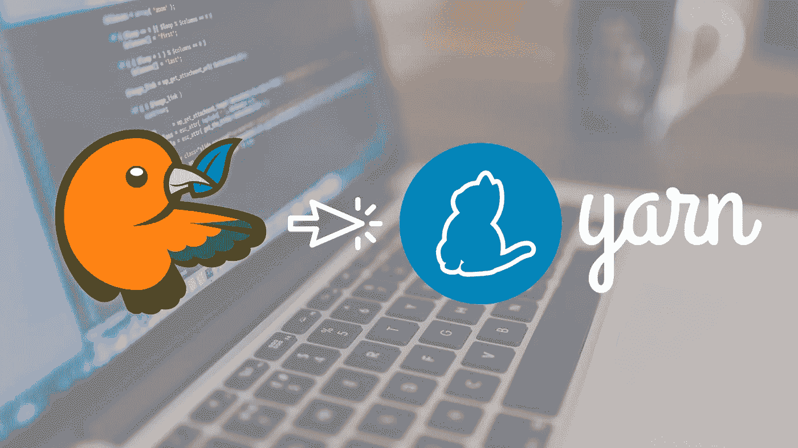

# Bower 至纱线迁移(简单步骤)

> 原文：<https://itnext.io/bower-to-yarn-migration-simple-steps-2a5ad0c43281?source=collection_archive---------1----------------------->

> [点击这里在 LinkedIn 上分享这篇文章](https://www.linkedin.com/cws/share?url=https%3A%2F%2Fitnext.io%2Fbower-to-yarn-migration-simple-steps-2a5ad0c43281%3Futm_source%3Dmedium_sharelink%26utm_medium%3Dsocial%26utm_campaign%3Dbuffer)

因此，目前我的团队正在升级项目基础，我们在客户端使用带有 bower 的 MEAN stack。我们的团队看到了很多文章，比如“[为什么我们应该停止使用凉亭](https://gofore.com/en/stop-using-bower-and-how-to-do-it/)”、“[如何远离凉亭？](https://bower.io/blog/2017/how-to-migrate-away-from-bower/)”等。

离开凉亭的最佳选择是纱线，有许多文章可以证明这一点。不需要太多的细节，这里是要遵循的步骤。

*注意——在继续之前，创建一个新分支并继续。另外，在终端或 Windows Powershell 上使用 root 用户来避免不必要的错误。*

步骤 1 —安装纱线

**npm i 纱-g**

使用上述命令全局安装 yarn，然后通过运行 **yarn -v** 命令验证安装。

步骤 2 —安装 bower-away

**npm i bower-away -g**

我们还需要全局安装 bower-away 包，然后导航到您的项目目录并运行以下命令

**退场**

这一步将检查 **bower.json** 并将 bower_components 移动到 **package.json** 文件，并为用户预览做准备。

第 3 步—预览更改

鲍尔-远离-迪夫

上述命令将显示 package.json 更改的预览，如下所示:

在终端或命令提示符下，附加内容将以绿色文本显示。所有 bower 组件将使用“@bower_components”前缀进行移动，然后“yarn”将被添加到引擎中，“postinstall”将被添加到脚本中。

第 4 步—应用更改

**拒绝申请**

现在使用上面的命令应用更改，然后我们需要从我们的项目中删除 **bower_components** 文件夹。

对于 Mac/Linux — **rm -rf 客户端\bower_components**

对于 Windows — **移除-项目-路径。\ client \ bower _ components \-Force**

步骤 5 —安装新模块

**纱线**

现在运行上面的命令来使用 yarn 命令安装软件包。此命令需要的时间取决于您的项目大小。

万事如意！