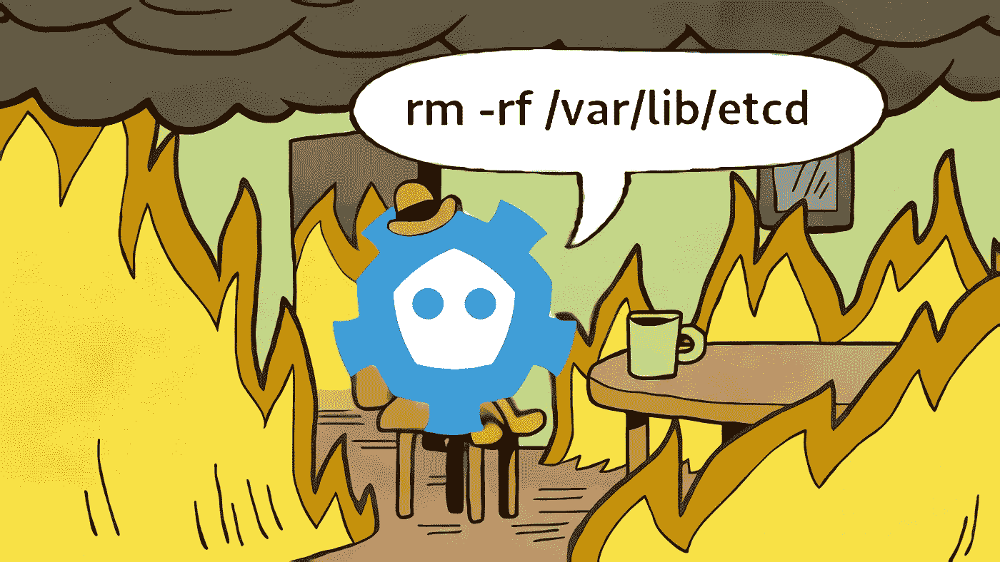
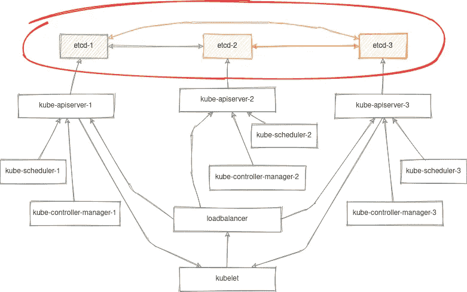

# 分解和修复 etcd 集群

> 原文：<https://itnext.io/breaking-down-and-fixing-etcd-cluster-d81e35b9260d?source=collection_archive---------0----------------------->



etcd 是一个快速、可靠、容错的键值数据库。它是 Kubernetes 的核心，也是其控制平面不可或缺的一部分。拥有备份和恢复单个节点和整个 etcd 集群的可操作性的经验非常重要。

在[上一篇文章](/breaking-down-and-fixing-kubernetes-4df2f22f87c3)中，我们详细讨论了为 Kubernetes 重新生成 SSL 证书和静态清单，以及与恢复其控制平面的可操作性相关的问题。本文将完全致力于恢复 etcd 集群。

首先，我应该做一个保留，我们将只考虑一个特定的情况，当 etcd 在 Kubernetes 的一部分被部署和直接使用时。本文中给出的例子假设您的 etcd 集群是使用静态清单部署的，并在容器中运行。

为了清楚起见，让我们采用来自[上一篇文章](/breaking-down-and-fixing-kubernetes-4df2f22f87c3)的堆叠控制平面节点方案:



(箭头表示客户端到服务器的连接)

下面建议的命令也可以使用 kubectl 执行，但是在我们的例子中，我们将尝试从 Kubernetes 控制平面中抽象出来，并考虑使用 crictl 本地管理容器化 etcd 集群的选项。

即使在 Kubernetes API 不工作的情况下，这项技能也将有助于修复 etcd。

# 准备

因此，我们要做的第一件事是在一个主节点上通过 ssh 登录，并找到我们的 etcd 容器:

```
CONTAINER_ID=$(crictl ps -a --label io.kubernetes.container.name=etcd --label io.kubernetes.pod.namespace=kube-system | awk 'NR>1{r=$1} $0~/Running/{exit} END{print r}')
```

让我们还设置一个别名，不要在每个 our 命令中传递证书选项:

```
alias etcdctl='crictl exec "$CONTAINER_ID" etcdctl --cert /etc/kubernetes/pki/etcd/peer.crt --key /etc/kubernetes/pki/etcd/peer.key --cacert /etc/kubernetes/pki/etcd/ca.crt'
```

*以上命令是临时的。在使用 etcd 进行操作之前，您每次都需要运行它们。当然，你可以把它们加到* ***。为了您的方便，bashrc*** *。但是，这已经超出了本文的范围。*

> *如果有什么地方出错了，并且您不能执行到一个正在运行的容器中，请查看 etcd 日志:*
> 
> `*crictl logs "$CONTAINER_ID"*`
> 
> *还要确保您有一个静态清单和所有证书，以防容器不存在。有时候阅读 kubelet 日志也非常有用。*

# 检查集群状态

在这一点上很简单:

```
# etcdctl member list -w table
+------------------+---------+-------+---------------------------+---------------------------+------------+
|        ID        | STATUS  | NAME  |        PEER ADDRS         |       CLIENT ADDRS        | IS LEARNER |
+------------------+---------+-------+---------------------------+---------------------------+------------+
| 409dce3eb8a3c713 | started | node1 | https://10.20.30.101:2380 | https://10.20.30.101:2379 |      false |
| 74a6552ccfc541e5 | started | node2 | https://10.20.30.102:2380 | https://10.20.30.102:2379 |      false |
| d70c1c10cb4db26c | started | node3 | https://10.20.30.103:2380 | https://10.20.30.103:2379 |      false |
+------------------+---------+-------+---------------------------+---------------------------+------------+
```

每个 etcd 实例都知道彼此的一切。关于成员的信息存储在 etcd 内部，因此其中的任何变化也会更新集群的其他实例。

**重要提示**,`member list`命令只显示配置状态，而不是具体实例的状态。为了检查实例的状态，有一个`endpoint status`命令。但是，它需要明确指定要检查的集群的所有端点。

```
ENDPOINTS=$(etcdctl member list | grep -o '[^ ]\+:2379' | paste -s -d,)
etcdctl endpoint status --endpoints=$ENDPOINTS -w table
```

如果有任何端点不可访问，您将会看到以下错误:

```
Failed to get the status of endpoint https://10.20.30.103:2379 (context deadline exceeded)
```

# 移除故障节点

有时会发生其中一个节点无法运行的情况。而你需要恢复 etcd 集群的可操作性，那么该怎么做呢？

首先，您需要删除失败的成员:

```
etcdctl member remove d70c1c10cb4db26c
```

在继续之前，让我们确保 etcd 容器不再在故障节点上运行，并且该节点不再包含任何数据:

```
rm -rf /etc/kubernetes/manifests/etcd.yaml /var/lib/etcd/
crictl rm "$CONTAINER_ID"
```

上面的命令将删除 etcd 的静态 pod 和节点上的数据目录`/var/lib/etcd`。

当然，你也可以使用`kubeadm reset`命令作为替代。但是，它也将从该节点中删除所有与 Kubernetes 相关的资源和证书。

# 添加新节点

现在我们有两种方法:

**在第一种情况下**，我们可以使用标准的`kubeadm join`机制简单地添加一个新的控制平面节点:

```
kubeadm init phase upload-certs --upload-certs
kubeadm token create --print-join-command --certificate-key <certificate_key> 
```

上述命令将生成一个命令来加入 Kubernetes 中的一个新控制平面节点。该案例在【Kubernetes 官方文档中有详细描述，无需澄清。

当您从头开始部署一个新节点或执行`kubeadm reset`命令后，此选项最方便。

**第二个选项**更准确，因为它允许您考虑并做出仅用于 etcd 的必要更改。节点上的其他容器不会受到影响。

首先，让我们确保我们的节点拥有 etcd 的有效 CA 证书:

```
/etc/kubernetes/pki/etcd/ca.{key,crt}
```

如果它不存在，请从集群的其他节点复制它。现在让我们为节点生成其余的证书:

```
kubeadm init phase certs etcd-healthcheck-client
kubeadm init phase certs etcd-peer
kubeadm init phase certs etcd-server
```

并加入集群:

```
kubeadm join phase control-plane-join etcd --control-plane
```

为了便于理解，上述命令将执行以下步骤:

1.  向现有 etcd 集群添加新成员:
    `etcdctl member add node3 --endpoints=https://10.20.30.101:2380,https://10.20.30.102:2379 --peer-urls=https://10.20.30.103:2380`
2.  用选项
    `--initial-cluster-state=existing
    --initial-cluster=node1=https://10.20.30.101:2380,node2=https://10.20.30.102:2380,node3=https://10.20.30.103:2380`为 etcd `**/etc/kubernetes/manifests/etcd.yaml**`生成一个新的静态清单

这些选项将允许我们的节点自动添加到现有的 etcd 集群中。

# 创建快照

现在，让我们来看看如何从备份中创建和恢复 etcd。

通过在任何 etcd 节点上执行以下命令，可以非常简单地创建备份:

```
etcdctl snapshot save /var/lib/etcd/snap1.db
```

注意，我故意使用了`/var/lib/etcd`，因为这个目录已经被传递到 etcd 容器中(您可以在静态清单文件`/etc/kubernetes/manifests/etcd.yaml`中找到它)

执行此命令后，您将找到一个快照，其中包含指定路径上的数据。让我们将它保存在一个安全的地方，并看看从备份过程中恢复。

# 从快照恢复

现在让我们来看一个案例，当所有东西都损坏了，我们最终需要从备份中恢复集群。

我们在前面的步骤中创建了一个快照文件 **snap1.db** 。现在，让我们从所有节点中完全删除所有 etcd 静态 pod 和数据:

```
rm -rf /etc/kubernetes/manifests/etcd.yaml /var/lib/etcd/member/
crictl rm "$CONTAINER_ID"
```

我们现在又有两条路:

**第一个选项**是创建一个节点 etcd 集群，并根据上述过程将其余节点加入其中。

```
kubeadm init phase etcd local
```

该命令将使用选项为 etcd 生成静态清单:

```
--initial-cluster-state=new
--initial-cluster=node1=https://10.20.30.101:2380
```

这样，我们将在一个节点上获得一个全新的 etcd 集群。

```
# etcdctl member list -w table
+------------------+---------+-------+---------------------------+---------------------------+------------+
|        ID        | STATUS  | NAME  |        PEER ADDRS         |       CLIENT ADDRS        | IS LEARNER |
+------------------+---------+-------+---------------------------+---------------------------+------------+
| 1afbe05ae8b5fbbe | started | node1 | https://10.20.30.101:2380 | https://10.20.30.101:2379 |      false |
+------------------+---------+-------+---------------------------+---------------------------+------------+
```

让我们在第一个节点上恢复备份:

```
etcdctl snapshot restore /var/lib/etcd/snap1.db \
  --data-dir=/var/lib/etcd/new
  --name=node1 \
  --initial-advertise-peer-urls=https://10.20.30.101:2380 \
  --initial-cluster=node1=https://10.20.30.101:2380

mv /var/lib/etcd/member /var/lib/etcd/member.old
mv /var/lib/etcd/new/member /var/lib/etcd/member
crictl rm "$CONTAINER_ID"
rm -rf /var/lib/etcd/member.old/ /var/lib/etcd/new/
```

在其余节点上，我们将运行命令来加入集群:

```
kubeadm join phase control-plane-join etcd --control-plane
```

**第二个选项**是立即恢复集群所有节点上的备份。为此，请将快照文件复制到所有节点，并执行上述恢复过程。但是在这种情况下，我们需要在 etcdctl 命令的选项中指定集群的所有节点，例如:

对于**节点 1** :

```
etcdctl snapshot restore /var/lib/etcd/snap1.db \
  --data-dir=/var/lib/etcd/new \
  --name=node1 \
  --initial-advertise-peer-urls=https://10.20.30.101:2380 \
  --initial-cluster=node1=https://10.20.30.101:2380,node2=https://10.20.30.102:2380,node3=https://10.20.30.103:2380 
```

对于**节点 2** :

```
etcdctl snapshot restore /var/lib/etcd/snap1.db \
  --data-dir=/var/lib/etcd/new \
  --name=node2 \
  --initial-advertise-peer-urls=https://10.20.30.102:2380 \
  --initial-cluster=node1=https://10.20.30.101:2380,node2=https://10.20.30.102:2380,node3=https://10.20.30.103:2380
```

对于**节点 3** :

```
etcdctl snapshot restore /var/lib/etcd/snap1.db \
  --data-dir=/var/lib/etcd/new \
  --name=node3 \
  --initial-advertise-peer-urls=https://10.20.30.103:2380 \
  --initial-cluster=node1=https://10.20.30.101:2380,node2=https://10.20.30.102:2380,node3=https://10.20.30.103:2380
```

# 法定人数的丧失

有时会发生这样的情况，您已经失去了集群中的大部分节点，etcd 进入了不起作用的状态。您将无法在集群中删除或添加新成员，也无法创建快照。

这种情况是有出路的。你只需要编辑静态清单文件，并添加`--force-new-cluster`键到 etcd:

```
/etc/kubernetes/manifests/etcd.yaml
```

此后，etcd 实例将在具有单个实例的集群中重启:

```
# etcdctl member list -w table
+------------------+---------+-------+---------------------------+---------------------------+------------+
|        ID        | STATUS  | NAME  |        PEER ADDRS         |       CLIENT ADDRS        | IS LEARNER |
+------------------+---------+-------+---------------------------+---------------------------+------------+
| 1afbe05ae8b5fbbe | started | node1 | https://10.20.30.101:2380 | https://10.20.30.101:2379 |      false |
+------------------+---------+-------+---------------------------+---------------------------+------------+
```

现在，您需要清理剩余的节点并将其添加到集群中，如上所述。完成这些操作后，请不要忘记取下`--force-new-cluster`键；-)