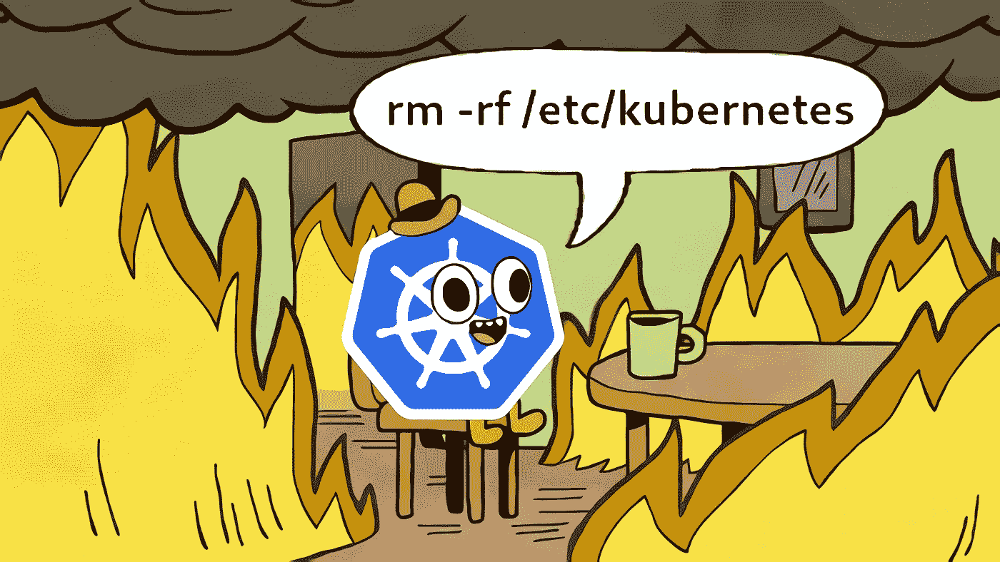
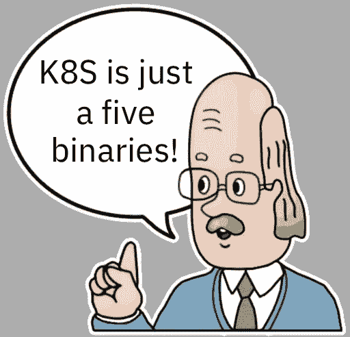
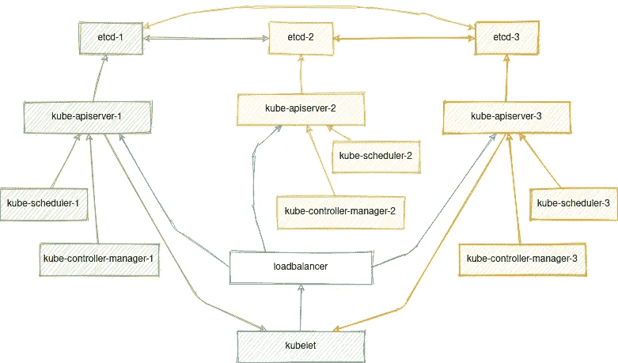

# 分解和修复 Kubernetes

> 原文：<https://itnext.io/breaking-down-and-fixing-kubernetes-4df2f22f87c3?source=collection_archive---------1----------------------->



**Kubernetes** 是一个用于容器编排和其他一切的伟大平台。最近，Kubernetes 在功能性、安全性和弹性方面遥遥领先。Kubernetes 架构允许您轻松应对各种故障，并始终保持运行。今天，我们将中断集群、删除证书、重新加入活动节点，并在不中断已在运行的服务的情况下完成所有这些花哨的工作。



所以让我们开始吧。主控制平面 Kubernetes 仅由几个组件组成:

*   **etcd** —用作数据库
*   **kube-apiserver** —我们集群的 API 和核心
*   **kube-controller-manager**—对 Kubernetes 资源执行操作
*   **kube-调度器** —主调度器
*   **kube lets**——它们是节点上的起始容器

这些组件中的每一个都受到客户端和服务器的一组 TLS 证书的保护。它们用于在组件之间进行身份验证和授权。除了某些情况，它们并不存储在 Kubernetes 数据库中的某个地方，而是以常规文件的形式出现:

```
# tree /etc/kubernetes/pki/
/etc/kubernetes/pki/
├── apiserver.crt
├── apiserver-etcd-client.crt
├── apiserver-etcd-client.key
├── apiserver.key
├── apiserver-kubelet-client.crt
├── apiserver-kubelet-client.key
├── ca.crt
├── ca.key
├── CTNCA.pem
├── etcd
│   ├── ca.crt
│   ├── ca.key
│   ├── healthcheck-client.crt
│   ├── healthcheck-client.key
│   ├── peer.crt
│   ├── peer.key
│   ├── server.crt
│   └── server.key
├── front-proxy-ca.crt
├── front-proxy-ca.key
├── front-proxy-client.crt
├── front-proxy-client.key
├── sa.key
└── sa.pub
```

组件在主服务器上被描述和运行为来自`/etc/kubernetes/manifests`目录的[静态 pods](https://kubernetes.io/docs/tasks/configure-pod-container/static-pod/)

我们将不详细讨论这一点，因为这是一个单独文章的好主题。在我们的例子中，我们主要感兴趣的是如何从所有这些东西中得到一个工作的集群。但是首先，让我们稍微抽象一下，想象我们有上面的 Kubernetes 组件，它们以某种方式相互通信。

通常情况下，基本情况是这样的:



(箭头表示客户端到服务器的连接)

对于通信，他们需要 TLS 证书，这也可以带到一个单独的抽象级别。所以让我们依靠你的部署工具，它可以是 **kubeadm** ， **kubespray** 或者其他任何东西。在本文中，我们将使用 kubeadm ,因为它是最常见的 Kubernetes 部署工具，也经常在其他解决方案中使用。

假设我们已经部署了一个集群。让我们从最有趣的开始:

```
rm -rf /etc/kubernetes/
```

在主节点上，该目录包含:

-一套用于 etcd 的证书和 CA(在`/etc/kubernetes/pki/etcd`上)

Kubernetes 的一套证书和证书(在`/etc/kubernetes/pki`上)

-用于集群管理、kube 控制器管理、kube 调度和 kubelet 的 Kubeconfigs(每个都有一个 base64 编码的 CA 证书，用于`/etc/kubernetes/*.conf`上的集群)

etcd、kube-apiserver、kube-scheduler 和 kube-controller-manager 的一组静态清单(在`/etc/kubernetes/manifests`上)

假设我们一下子失去了一切。

# 固定控制平面

为了避免混淆，让我们也确保我们所有的控制面板也停止:

```
crictl rm $(crictl ps -aq)
```

> **注意**:默认情况下，kubeadm 不会覆盖现有的证书和 kubeconfigs，为了重新颁发它们，您必须首先手动删除旧的。

让我们从恢复 etcd 开始。如果您有一个仲裁(3 个或更多主节点)，etcd 集群将无法访问，直到大多数节点联机。

```
kubeadm init phase certs etcd-ca
```

上面的命令将为我们的 etcd 集群生成一个新的 CA。由于所有其他证书都必须由其签名，我们还会将其和私钥复制到其他主节点:

```
/etc/kubernetes/pki/etcd/ca.{key,crt}
```

现在，让我们在所有控制平面节点上为它重新生成其余的 etcd 证书和静态清单:

```
kubeadm init phase certs etcd-healthcheck-client
kubeadm init phase certs etcd-peer
kubeadm init phase certs etcd-server
kubeadm init phase etcd local
```

在这个阶段，您应该已经有了一个工作的 etcd 集群:

```
# crictl ps
CONTAINER ID        IMAGE               CREATED             STATE               NAME                ATTEMPT             POD ID
ac82b4ed5d83a       0369cf4303ffd       2 seconds ago       Running             etcd                0                   bc8b4d568751b
```

现在让我们做同样的任务，但是对于 Kubernetes 服务，**在一个**主节点上执行:

```
kubeadm init phase certs all
kubeadm init phase kubeconfig all
kubeadm init phase control-plane all
cp -f /etc/kubernetes/admin.conf ~/.kube/config
```

上述命令将为 Kubernetes 生成所有 SSL 证书，以及 Kubernetes 服务的静态 pods 清单和 kubeconfigs。

如果使用 kubeadm 加入 kubeletes，还需要更新 kube-public 名称空间中的 cluster-info 配置，因为它仍然包含旧 CA 的散列。

```
kubeadm init phase bootstrap-token 
```

由于其他实例上的所有证书也必须由单个 CA 签名，让我们将其复制到**其他控制平面节点**，并在每个节点上重复上述命令**。**

```
/etc/kubernetes/pki/{ca,front-proxy-ca}.{key,crt}
/etc/kubernetes/pki/sa.{key,pub}
```

顺便说一下，作为手动复制证书的替代方法，您也可以使用 Kubernetes API，例如下面的命令:

```
kubeadm init phase upload-certs --upload-certs
```

将加密证书并上传到 Kubernetes，持续 2 小时，因此您可以按如下方式注册 masters:

```
kubeadm join phase control-plane-prepare all kubernetes-apiserver:6443 --control-plane --token cs0etm.ua7fbmwuf1jz946l     --discovery-token-ca-cert-hash sha256:555f6ececd4721fed0269d27a5c7f1c6d7ef4614157a18e56ed9a1fd031a3ab8 --certificate-key 385655ee0ab98d2441ba8038b4e8d03184df1806733eac131511891d1096be73
kubeadm join phase control-plane-join all
```

注意，Kubernetes API 有另一个配置，它保存前端代理客户机的 CA 证书。它用于认证从 apiserver 到 webhooks 和聚合层服务的请求。幸运的是，kube-apiserver 会自动更新它。

但是，您可能希望手动将其从旧证书中清除:

```
kubectl get cm -n kube-system extension-apiserver-authentication -o yaml
```

无论如何，在这个阶段我们已经有了一个完全工作的控制平面。

# 修理工人

该命令将列出集群中的所有节点，尽管目前所有节点的状态都是`NotReady`:

```
kubectl get node
```

这是因为他们仍然使用旧的证书，并期待来自旧 CA 签名的 apiserver 的请求。为了解决这个问题，我们将使用 kubeadm，并将节点重新加入集群。

虽然主节点可以访问主 CA，但它们可以在本地加入:

```
systemctl stop kubelet
rm -rf /var/lib/kubelet/pki/ /etc/kubernetes/kubelet.conf
kubeadm init phase kubeconfig kubelet
kubeadm init phase kubelet-start
```

但是要加入工人节点，我们必须生成一个新的令牌:

```
kubeadm token create --print-join-command
```

并对它们中的每一个运行以下命令:

```
systemctl stop kubelet
rm -rf /var/lib/kubelet/pki/ /etc/kubernetes/pki/ /etc/kubernetes/kubelet.conf 
kubeadm join phase kubelet-start kubernetes-apiserver:6443  --token cs0etm.ua7fbmwuf1jz946l     --discovery-token-ca-cert-hash sha256:555f6ececd4721fed0269d27a5c7f1c6d7ef4614157a18e56ed9a1fd031a3ab8
```

> **注意:**您不需要删除主节点上的`/etc/kubernetes/pki/`目录，因为它已经包含了所有需要的证书。

上述过程会将您的所有 kubelets 重新加入集群。它不应该影响任何已经在上面运行的容器。然而，如果您在集群中有许多节点，但没有同时执行，您可能会面临这样的情况:当**控制器-管理器**开始从未就绪节点重新创建容器，并尝试在活动节点上重新调度它们。

为了防止这种情况，我们可以暂时停止主服务器上的控制器管理器窗格:

```
rm /etc/kubernetes/manifests/kube-controller-manager.yaml
crictl rmp $(crictl ps --name kube-controller-manager -q)
```

需要最后一个命令只是为了确保控制器管理器真的停止了。一旦集群中的所有节点都加入进来，您就可以为控制器管理器生成一个静态清单。

为此，在所有主节点上运行以下命令:

```
kubeadm init phase control-plane controller-manager
```

> 请注意，您需要在已经生成加入令牌的阶段执行这些步骤。否则，加入过程将在尝试从 cluster-info configmap 读取令牌时挂起。

如果 kubelets 被配置为请求由您的 CA 签名的证书(选项`serverTLSBootstrap: true`，您还需要批准您的 kubelets 的 CSR

```
kubectl get csr
kubectl certificate approve <csr>
```

# **修复服务账户**

还有一件事，自从我们失去了`/etc/kubernetes/pki/sa.key`。该密钥用于为集群中的所有 ServiceAccounts 签署 jwt 令牌。因此，我们必须为它们每个重新创建令牌。

这可以通过从所有具有`kubernetes.io/service-account-token`类型的秘密中移除**令牌**字段来非常简单地完成:

```
kubectl get secret --all-namespaces | awk '/kubernetes.io\/service-account-token/ { print "kubectl patch secret -n " $1 " " $2 " -p {\\\"data\\\":{\\\"token\\\":null}}"}' | sh -x
```

之后，kube-controller-manager 将自动生成用新密钥签名的新令牌。

不幸的是，并不是所有的微服务都能够动态更新令牌，最有可能的是，您需要手动重启所有使用它的容器

```
kubectl get pod --field-selector 'spec.serviceAccountName!=default' --no-headers --all-namespaces | awk '{print "kubectl delete pod -n " $1 " " $2 " --wait=false --grace-period=0"}'
```

例如，此命令将生成一个命令列表，使用非默认的 serviceAccount 删除所有 pod。我建议从`kube-system`命名空间开始，因为那里安装了 kube-proxy 和 CNI 插件。它们对于处理微服务之间的通信至关重要。

此时，可以认为集群恢复过程已经完成。感谢关注！在下一篇文章的[中，我们将进一步了解如何备份和恢复 etcd 集群。](/breaking-down-and-fixing-etcd-cluster-d81e35b9260d)