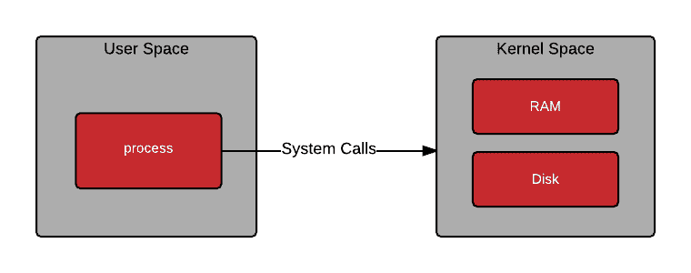
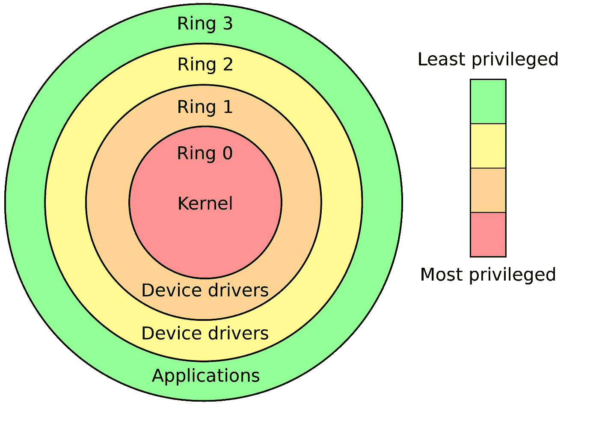
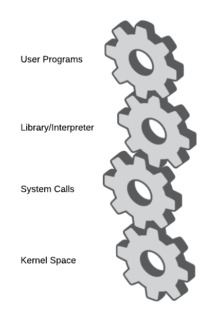
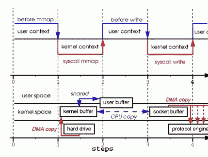
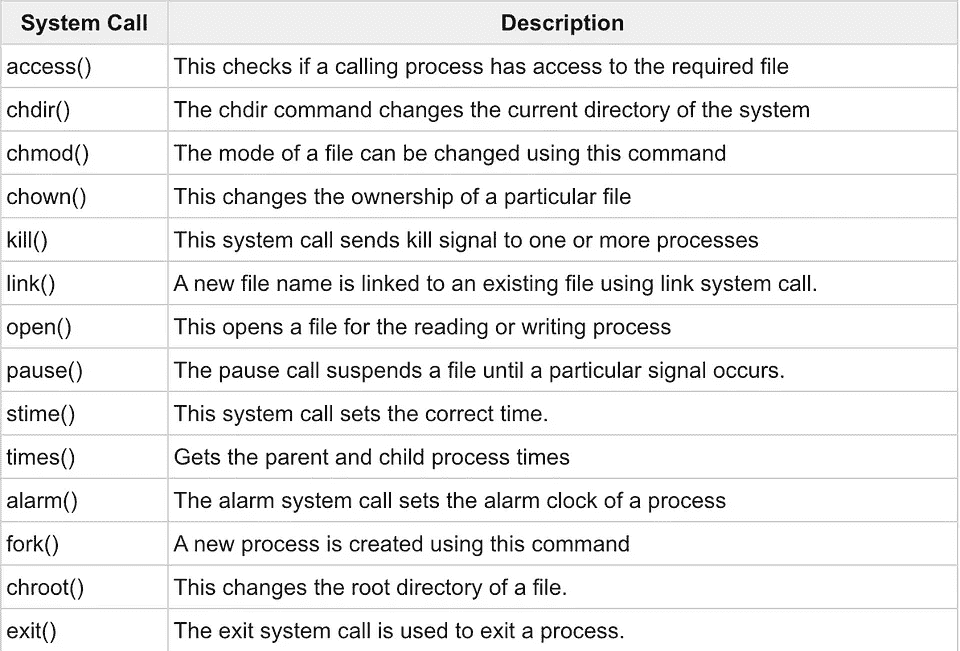
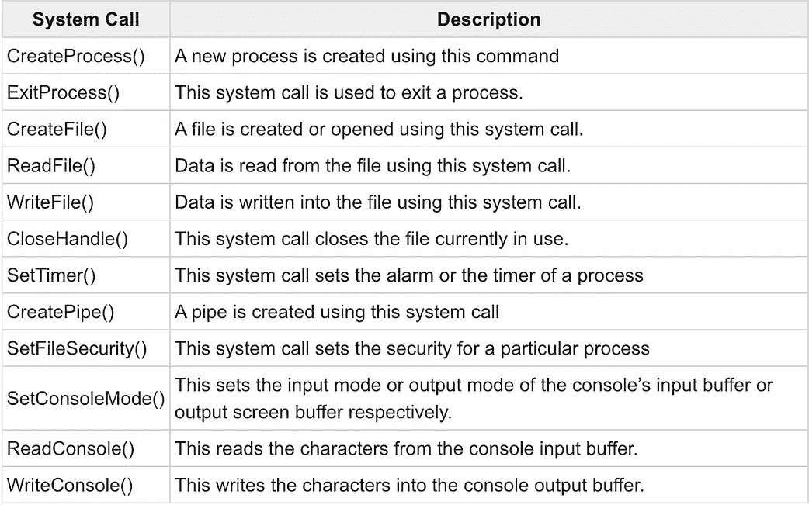
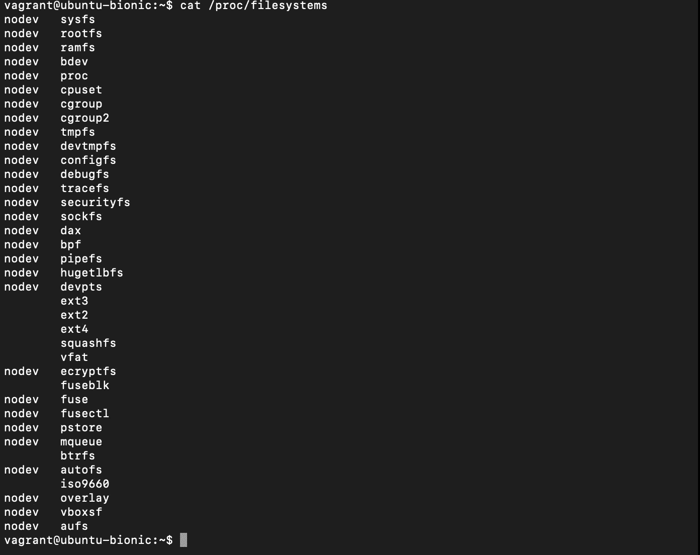
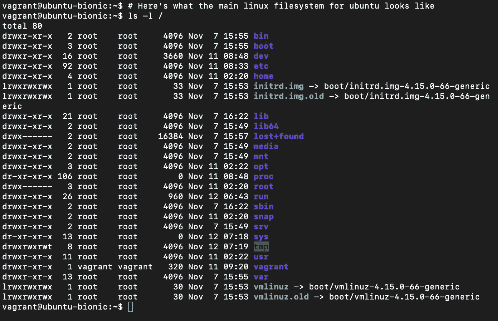
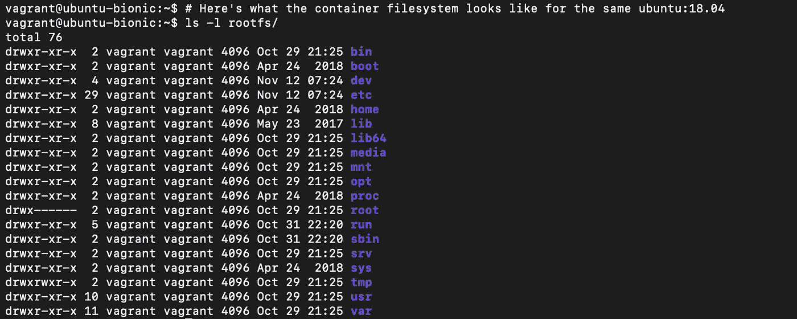
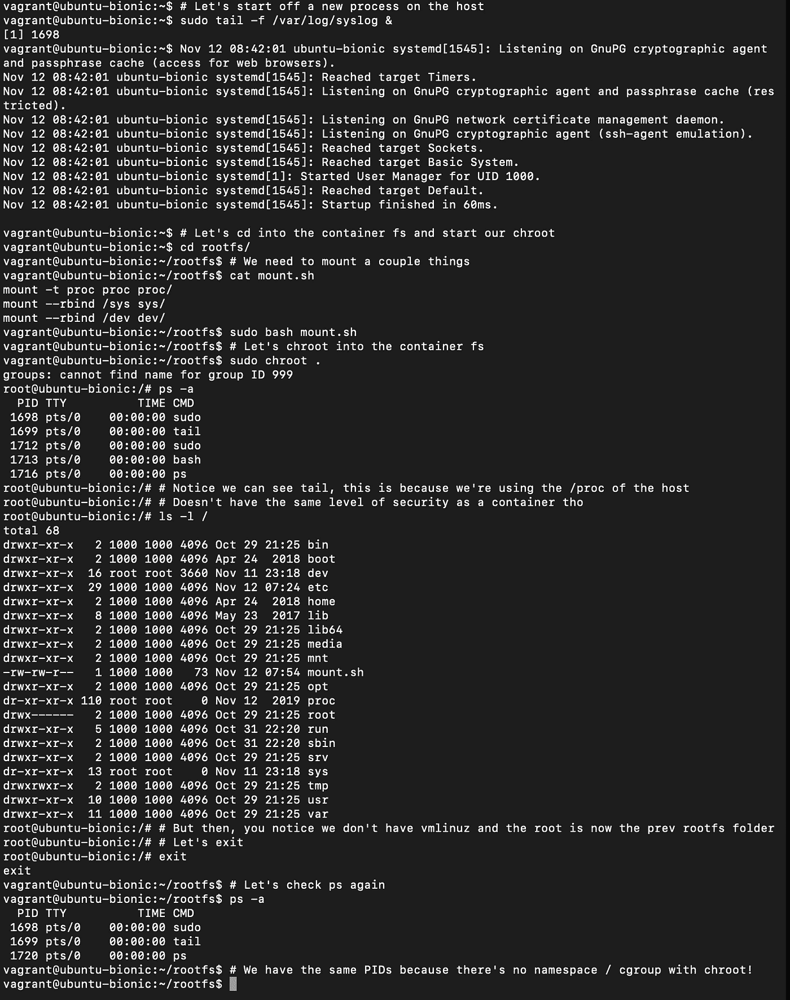

# 分解容器|第 0 部分—系统架构

> 原文：<https://itnext.io/breaking-down-containers-part-0-system-architecture-37afe0e51770?source=collection_archive---------0----------------------->

本文中需要注意的事项

```
1\. This is not an absolute beginner article on Containers, you've read too many of them. This is more of a past beginner intro.
2\. You're not learning about Docker and what it does in its simplest form here, you're learning about containers and container runtimes.
3\. Pre-requisite knowledge of Linux is important but not necessary.
4\. Are you using Windows as a developer in 2019??????
5\. I cover a lot more about linux system architecture here, do take a moment or two to read on something new!
6\. There will be code demos in C following other tutorials, nothing complex but just a heads up!
```

# 什么是容器？

随着 Kubernetes、Docker Compose、Mesos OS、Consul 等的出现，容器成了这些云计算时代的头条新闻。

要真正理解容器的骨架组合，首先需要知道几件事:

1.  Linux 内核用户和系统空间
2.  系统调用和功能
3.  Cgroups
4.  名称空间
5.  EIAF(一切都是文件)，对基于 Unix 的文件系统的描述

这 5 件事对于真正理解容器如何工作以及为什么我们需要一个 Linux VM 在 Windows 和 Mac 上运行容器很重要，尽管 [Mac 内核](https://en.wikipedia.org/wiki/MacOS#Architecture)是 POSIX 兼容的并且基于 OpenBSD。

# 为什么我会这样开始？

我打算深入研究，因为关于容器的文章关注的是 Docker、Dockerfiles 和臭名昭著的命令`docker build -t .`之类的东西，这些都很琐碎。基本部分仍然会在后面的部分中出现，但它们如何工作背后的底层是我将在接下来的系列中讨论的内容。

所以我采用了一种不同的方法，直奔容器的工作原理以及它们的结构和功能。

让我们从理解 Linux 内核系统和用户空间开始，以便更好地做出决策，并深入了解容器真正做了什么。

# Linux 内核空间

在 Linux 中，我们有两个应用程序通常运行的空间，内核系统空间和用户空间。通常，在默认内核配置下，用户空间占用 0–3GB 空间，而内核空间占用 3–4GB 空间，更多详细信息[在此](http://linux.it/~rubini/docs/ksys/)。

内核空间是我们为内核上运行的低级应用程序提供系统内存的地方。用户空间是用户处理功能和执行的环境。



用户空间如何通过系统调用与内核空间交互

> 来源:[https://red hat . com/en/blog/architecting-containers-part-1-why-understanding-user-space-vs-kernel-space-matters](https://redhat.com/en/blog/architecting-containers-part-1-why-understanding-user-space-vs-kernel-space-matters)

这两个内存空间由一个被称为[环](https://en.wikipedia.org/wiki/Protection_ring)的微调权限层分隔开。这些环定义了在某个操作被授权之前，一个应用程序的需求需要有多高的特权或无特权。



X86 系统的环形层

> 来源:[https://en.wikipedia.org/wiki/Protection_ring](https://en.wikipedia.org/wiki/Protection_ring)

这些环并不是 Linux 所特有的，而是操作系统中定义良好的布局，尽管每一级的功能区域都是根据操作系统在上运行的 [CPU 架构来分配的。为了在用户空间和内核空间之间切换，我们通过一个系统调用来应用一个操作，简称为 syscall。](https://unix.stackexchange.com/a/368313)

这使用可从用户空间应用程序访问的定义的内核函数来请求对内核级功能的访问。下图很好地解释了这个订单是如何定义的。



操作系统层的分层概述

每当应用程序向内核级函数发出请求时，就会发送一个中断，告诉处理器停止正在做的任何事情，去处理那个特定的请求，如果这样更容易理解的话，你可以把它想象成上下文切换。假设用户空间应用程序具有相关的许可，则存在到内核空间的上下文切换，在上下文切换已经开始并且内核空间中所需的程序/功能通过适当的中断处理程序的帮助被执行之后，用户空间应用程序等待返回的响应。

```
tmp_buf = mmap(file, len); # mmap here is from a C library# This is called a memory map and it's a C function
# It allocates a certain amount of memory for a task, file etc.
# Since memory is a kernel space resource, a syscall is made to the mmap syscall in the linux kernel to make this request possible
```



mmap 零拷贝的内核到用户空间操作的例子

> 来源:[https://web . archive . org/web/20190808074654/https://www . linuxjournal . com/article/6345](https://web.archive.org/web/20190808074654/https://www.linuxjournal.com/article/6345)

# 接下来是系统调用和功能

系统调用(又名 syscall)是一个 API，它允许内核功能的一小部分**暴露给用户级应用程序。一小部分是为了告诉读者，系统调用是有限的，并且是通用的。它们在不同的操作系统中并不相同，在定义和访问模式上都有所不同。**



分别针对 Unix 和 Windows 的系统调用

> 来源:[https://www . tutorialspoint . com/system-calls-in-UNIX-and-windows](https://www.tutorialspoint.com/system-calls-in-unix-and-windows)

追溯到前面的 mmap 示例，它没有在映像中列出，因为这只是一个小列表，linux 中系统调用的完整列表可以在这里[获得](http://man7.org/linux/man-pages/man2/syscalls.2.html)。

有时，我们想要将一组系统调用组合在一起，我们使用一个叫做 Capabilities 的 linux 内核特性来实现。这些是预定义的特权集，一个正在运行的程序可以访问这些特权，或者受到这些特权的限制。

功能进一步增强了系统调用，方法是将相关的系统调用分组到可以立即授予或拒绝的已定义的特权中。这甚至可以防止根级别的应用程序利用带有保留权限的受限内核空间。

有几个 linux 功能，大部分将在后面的文章中介绍，它们如何使用 SecComp 之类的配置文件和更具体的 LSM(Linux 安全模块)如 AppArmor、SELinux 等与容器集成。但是您可以在这里参考手册页[中的列表。](http://man7.org/linux/man-pages/man7/capabilities.7.html)

# Cgroups

```
Control groups, usually referred to as cgroups, are a Linux kernel
feature which allow processes to be organized into hierarchical
groups whose usage of various types of resources can then be limited
and monitored.  The kernel's cgroup interface is provided through a
pseudo-filesystem called cgroupfs.  Grouping is implemented in the
core cgroup kernel code, while resource tracking and limits are
implemented in a set of per-resource-type subsystems (memory, CPU,
and so on).
```

> 来源:[http://man7.org/linux/man-pages/man7/cgroups.7.html](http://man7.org/linux/man-pages/man7/cgroups.7.html)

简单来说，cgroups 控制我们可以使用什么。它们的功能列表如下所示:

*   **资源限制:**可以对组进行配置，使其不超过指定的内存限制，或使用超过所需数量的处理器，或仅限于特定的外围设备。
*   **优先级:**可以配置一个或多个组来利用更少或更多的 CPU 或磁盘 I/O 吞吐量。
*   **会计:**监控和测量集团的资源使用情况。
*   **控制:**可以冻结或停止多组流程，并重新启动。

> 来源:[https://web . archive . org/web/20190808230154/https://www . Linux journal . com/content/everything-you-need-know-about-Linux-containers-part-I-Linux-control-groups-and-process](https://web.archive.org/web/20190808230154/https://www.linuxjournal.com/content/everything-you-need-know-about-linux-containers-part-i-linux-control-groups-and-process)

Cgroups 通过使用修改进程运行时环境的子系统/控制器来发挥作用。v1 和 v2 两个版本中有多种控制器可用。

在 v1 控制器领域，我们有以下内容:

*   `blkio` —该子系统设置物理驱动器(磁盘、固态硬盘或 USB)等块设备的输入/输出访问限制。
*   `cpu` —该子系统使用调度程序向 CPU 提供 cgroup 任务访问。
*   `cpuacct` —该子系统自动生成关于 cgroup 中任务使用的 CPU 资源的报告。
*   `cpuset` —该子系统将单个 CPU(在多核系统上)和内存节点分配给 cgroup 中的任务。
*   `devices` —该子系统允许或拒绝 cgroup 中的任务访问设备。
*   `freezer` —该子系统暂停或恢复 cgroup 中的任务。
*   `memory` —该子系统为 cgroup 中的任务设置内存使用限制，并自动报告这些任务使用的内存资源。
*   `net_cls` —该子系统使用类别标识符(classid)标记网络数据包，该标识符允许 Linux 流量控制器(`tc`)识别源自特定 cgroup 任务的数据包。
*   `net_prio` —该子系统提供了一种为每个网络接口动态设置网络流量优先级的方法。
*   `ns`—*命名空间*子系统。
*   `perf_event` —该子系统识别任务的 cgroup 成员，并可用于性能分析。
*   `*hugetlb*` —支持限制 cgroups 使用大页面。
*   `*pids*` —该控制器允许限制在 cgroup(及其后代)中创建的
    进程的数量。
*   `*rdma*`—RDMA(远程 DMA)控制器允许限制每个 cgroup 使用 RDMA / IB 专用资源。

对于 v2 控制器空间，我们有 v1 的一些功能，因为一些控制组没有实现，linux 系统可以使用这两者，但是 v2 系统更精简，cgroups 更少。

*   `io` —这是版本 1 blkio 控制器的后继产品。
*   `memory` —这是第 1 版内存控制器的继任者。
*   `pids` —这与版本 1 的 pids 控制器相同。
*   `perf_event` —与版本 1 的 perf_event 控制器相同。
*   `rdma` —与版本 1 rdma 控制器相同。
*   `cpu` —这是第 1 版 cpu 和 cpuacct 控制器的后继产品。

正如您所注意到的，就功能而言，它与版本 1 的控制器相同。每个 cgroup 都提供限制一个或多个资源的功能。围绕这一点的库和工具将在接下来的部分中重新讨论。

# 现在名称空间

@jpetazzo 是我在这个主题上最喜欢的开发者，这篇 tweets 总结了 cgroups、namespaces 和基于文件的进程文件系统之间的关系，我将在下一节中介绍。

要深入了解名称空间和 cgroups 在容器中的作用，请观看此视频:

cgroups、名称空间和容器的完整分类

现在回到名称空间，名称空间使容器认为它们存在于一个完全隔离的环境中，而不是在主主机系统中。更具体地说，容器中的进程认为自己是系统中唯一的进程。

你可以认为它是在一个盒子里，当你在一个盒子里的时候，你认为你拥有这个盒子，但你只是在另一个人的盒子里玩梦境游戏，那个人实际上拥有这两个盒子。由于这个特性，在容器中运行容器是可能的，尽管还有一些问题，我将在后面讨论。

对于名称空间特性，它嵌入在 linux 的构成中。

```
 ***Name .    CLONE FLAG .   MAN DOC .             FUNCTION .*** IPC       **CLONE_NEWIPC    ipc_namespaces**(7)     System V IPC,
                                               POSIX message  queuesNetwork   **CLONE_NEWNET    network_namespaces**(7) Network devices,
                                                stacks, ports, etc.Mount     **CLONE_NEWNS     mount_namespaces**(7)   Mount pointsPID       **CLONE_NEWPID    pid_namespaces**(7)     Process IDsUser      **CLONE_NEWUSER   user_namespaces**(7)    User and group IDsUTS       **CLONE_NEWUTS    uts_namespaces**(7)     Hostname and NIS
                                                  domain name
```

> 来源:[http://man7.org/linux/man-pages/man7/namespaces.7.html](http://man7.org/linux/man-pages/man7/namespaces.7.html)

这些名称空间提供不同的功能。

`IPC` —隔离进程间通信，这是一个很大的词，意味着进程可以沿着通道或管道在彼此内部共享消息，就像水通过管道流动一样。如果没有名称空间，就像我们的主要管道，一个容器(进程)可以使用同一管道向其他进程提供数据。对于名称空间，管道是独特的，并且仅限于名称空间内的某些进程。在 linux 中，这是使用`/dev/shm(shared memory)`或`/dev/mqueue(message queue)`块文件从主机共享的。

> 注意:`/dev/mqueue`块文件在基于队列的应用程序中被大量使用，你可以创建自己的队列，这非常简单！。详情[此处](https://www.youtube.com/watch?v=JbmOegG9-J0)，手册页[此处](http://man7.org/linux/man-pages/man7/mq_overview.7.html)，使用本[指南](https://forums.cranksoftware.com/viewtopic.php?f=5&t=39)验证您是否拥有 mqueue 支持

`Network` —负责隔离 ip 地址、接口、网络请求、端口等。

`Mount` —限制主机上的卷和外部数据装载的使用。命名空间中的进程在其自己的本机文件系统中运行。

`PID` —隔离进程运行时，在主机上的进程和命名空间中的进程之间给出纯粹的限制。因此，主机上的 bash 实例不同于容器中的实例。这是允许我们在不在主机上的容器中运行应用程序的一个奇特的例子。

`User` —限制容器用户的 UID(用户标识)和 GID(组标识)分配。这有效地允许主机是安全的，因为容器不能从主机读取。

`UTS` —用于设置或获取主机名，非常简单。

所有这些名称空间都使用 [unshare](http://man7.org/linux/man-pages/man2/unshare.2.html) 系统调用来隔离资源。

# 最后是 Linux 文件系统

在 linux 中首先要注意的是，所有东西都是一个文件。我不骗你，从存储、串行设备等等都是`/dev/*`到`/proc/fileystems`中的文件系统列表，甚至一直到运行在主机上的组。不同文件系统之间的大部分交互是由虚拟文件系统驱动程序(VFS)处理的，但是这是另外一个话题。



我的流浪箱中所有支持的文件系统列表

因为所有的东西都是一个文件，所以我可以通过`cat`(这是一个将所有文本放到一个文件中的命令)来查看所支持的配置。

> 那么这是从哪里装入容器的呢？

前面提到的容器是流程。我们都知道容器和虚拟机之间的区别，容器共享主机的内核和一些资源。这里的主要提示是**资源**，容器使用不同的根文件系统来启动它们自己的操作，容器(提示:它们是进程)用来启动的实际文件系统是映像。

映像是一个 linux 文件系统，在需要运行之前大部分都被压缩了，从这里它使用一些 [COW](https://stackoverflow.com/questions/628938/what-is-copy-on-write) (写时复制)文件系统来执行，比如 AUFS、设备映射器、Btrfs、XFS 等等……有几个。

对于那些安装了 docker 的用户，你可以运行下面的命令来查看 docker 镜像的内部结构(不是容器，容器是**进程，运行镜像等等。)**

> mkdir rootfs && \
> 
> docker export $(docker create Ubuntu:18.04)| tar-C rootfs-xvf-



Ubuntu 上的 Linux 虚拟机:18.04

主要的 linux 文件系统很特别，你会注意到 **vmlinuz** 和 **initrd.img** ，稍后我会回头再讨论它们。



Ubuntu 18.04 实例映像的文件系统映像，与主机相同

这里我们注意到我们没有主文件系统上看到的 **initrd** 和 **vmlinuz** 文件，这是因为这两个文件是内核文件。

`InitRD` —初始化 Ram 磁盘

> *初始 RAM 磁盘(initrd)* 是一个初始根文件系统，在真正的根文件系统可用之前安装。initrd 绑定到内核，并作为内核引导过程的一部分加载。然后，内核挂载这个 initrd，作为两阶段引导过程的一部分，以加载模块，使真正的文件系统可用，并获得真正的根文件系统。
> 
> 来源:https://developer.ibm.com/articles/l-initrd/

VMLinuz—**V**I virtual**M**emory**LINU**x g**Z**IP

> vmlinuz 是 Linux 内核可执行文件的名称。vmlinuz 是一个压缩的 Linux 内核，它能够将操作系统加载到内存中，以便计算机变得可用，应用程序可以运行。

在 linux 上，您可能会遇到 vmlinux 或 vmlinuz。它们是一样的，但是其中一个被压缩了。

vmlinuz =**V**I virtual**M**emory**LINU**x g**Z**IP =压缩的 Linux 内核可执行文件

VM linux =**V**I virtual**M**emory**LINU**X =非压缩的 Linux 内核可执行文件

vmlinuz 和 initrd 文件都在引导时使用。

> 在这个内核映像(vmlinuz)的头部是一个例程，它进行一些最少量的硬件设置，然后解压缩内核映像中包含的内核，并将其放入高内存中。如果存在一个初始 RAM 磁盘映像(initrd ),这个例程将它移动到内存中(或者我们可以说将压缩的 RAM 磁盘映像提取到实际内存中),并记录下来供以后使用。然后例程调用内核，内核启动开始。
> 
> 来源:[https://developer.ibm.com/articles/l-initrd/](https://developer.ibm.com/articles/l-initrd/)

如果“容器文件系统”的音节太多，这就是我们在容器文件系统或映像中没有这两个文件的主要原因。

> 容器使用主机内核！

它不需要引导序列来获得内核，来自容器内的应用程序的所有可能的请求都是通过主机内核经由通过 rings、capabilities、seccomp、LSMs 等强制执行的系统调用来进行的，就像任何普通的 linux 程序一样。

这里的主要思想是容器只是使用完全不同的文件系统，但是它们共享相同的 linux 内核。对于我们这些稍微了解 linux 的人来说，我们知道我们可以 **chroot** 到一个外来的 linux 文件系统中，并在其中操作，就像文件系统已经启动一样，只要主机上所有必需的文件都通过 bind 安装在那个文件夹中。



chroot 与实际容器不同的一个清晰的例子

如果你已经完成了其中的某些部分，你会发现容器只是用名称空间、cgroups 和许多其他很酷的特性打包的类固醇，以使应用程序沙箱在同一主机上尽可能安全。

# 总而言之，什么是容器？

容器是在名称空间内执行的运行时进程，该名称空间由 cgroups 和各种其他 LSM 和安全功能进行资源管理，以确保运行时完全的进程隔离。容器中的这些过程是自动化的，其中包括 Docker 之类的容器运行时，它简化了许多讨论的内容，但是我已经解释过的主要底层仍然是相同的。

那么接下来呢？

在下一部分(第 1 部分)中，我将更深入地讨论名称空间和 cgroup，什么是 unshare，以及各种 cgroup 如何组合在一起帮助进程隔离，这样我们就不会在下一个 pseudo chroot kinda exec 中看到 tail。

[](/breaking-down-containers-part-1-namespaces-9668b86d003d) [## 分解容器|第 1 部分—名称空间

### 在继续之前，有一些事情需要注意

itnext.io](/breaking-down-containers-part-1-namespaces-9668b86d003d) 

# 资源

[https://www . kernel . org/doc/Documentation/file systems/proc . txt](https://www.kernel.org/doc/Documentation/filesystems/proc.txt)

[https://www . kernel . org/doc/Documentation/file systems/sys fs . txt](https://www.kernel.org/doc/Documentation/filesystems/sysfs.txt)

 [## POSIX.4 消息队列

### 本章讨论:POSIX 消息队列允许一个有效的、优先级驱动的 IPC 机制，它具有多个…

users.pja.edu.pl](https://users.pja.edu.pl/~jms/qnx/help/watcom/clibref/mq_overview.html) [](https://developer.ibm.com/articles/l-initrd/) [## Linux 初始 RAM 磁盘(initrd)概述

### Linux 初始 RAM 磁盘(initrd)是一个临时的根文件系统，它在系统引导期间被挂载以支持…

developer.ibm.com](https://developer.ibm.com/articles/l-initrd/) [](https://superuser.com/questions/165116/mount-dev-proc-sys-in-a-chroot-environment) [## 在 chroot 环境中挂载 dev、proc、sys？

### 我正在尝试创建一个带有自定义精选包的 Linux 映像。我想做的是手工制作包装，我…

superuser.com](https://superuser.com/questions/165116/mount-dev-proc-sys-in-a-chroot-environment) [](https://access.redhat.com/documentation/en-us/red_hat_enterprise_linux_atomic_host/7/html/container_security_guide/linux_capabilities_and_seccomp) [## 第八章。Linux 功能和 sec comp Red Hat Enterprise Linux Atomic Host 7 | Red Hat 客户…

### 名称空间是 docker 格式的容器所使用的隔离的构建块之一。他们提供了这样一个…

access.redhat.com](https://access.redhat.com/documentation/en-us/red_hat_enterprise_linux_atomic_host/7/html/container_security_guide/linux_capabilities_and_seccomp) [](http://www.linux.it/~rubini/docs/ksys/) [## 内核系统调用

### 本文是理解 kHTTPd 如何扮演网络角色的第一步…

www.linux.it](http://www.linux.it/~rubini/docs/ksys/) [](http://man7.org/linux/man-pages/man2/unshare.2.html) [## unshare(2) - Linux 手册页

### UNSHARE(2) Linux 程序员手册 UNSHARE(2)UNSHARE——解除流程执行上下文部分的关联 unshare()…

man7.org](http://man7.org/linux/man-pages/man2/unshare.2.html) [](http://man7.org/linux/man-pages/man7/capabilities.7.html) [## 功能(7) - Linux 手册页

### 功能(7) Linux 程序员手册功能(7)功能-概述 Linux 的功能…

man7.org](http://man7.org/linux/man-pages/man7/capabilities.7.html) [](https://www.redhat.com/en/blog/architecting-containers-part-1-why-understanding-user-space-vs-kernel-space-matters) [## 架构容器第 1 部分:为什么理解用户空间和内核空间很重要

### 也许您负责开发基于容器的应用程序基础设施？如果是这样，你很可能…

www.redhat.com](https://www.redhat.com/en/blog/architecting-containers-part-1-why-understanding-user-space-vs-kernel-space-matters) [](https://www.usna.edu/Users/cs/aviv/classes/ic221/s16/lec/11/lec.html) [## Lec 11:用户空间、内核空间和系统调用 API

### 到目前为止，在这个类中，我们还没有直接使用系统调用接口，而是使用了 C 标准…

www.usna.edu](https://www.usna.edu/Users/cs/aviv/classes/ic221/s16/lec/11/lec.html) [](https://stackoverflow.com/questions/5957570/what-is-the-difference-between-the-kernel-space-and-the-user-space) [## 内核空间和用户空间有什么区别？

### 问内核空间和用户空间有什么区别？内核空间、内核线程、内核…

stackoverflow.com](https://stackoverflow.com/questions/5957570/what-is-the-difference-between-the-kernel-space-and-the-user-space) [](https://stackoverflow.com/questions/6710040/cpu-privilege-rings-why-rings-1-and-2-arent-used) [## CPU 特权环:为什么不使用环 1 和环 2？

### 作为一个业余操作系统作家，我发现因为分页(现代保护模型的主要部分)只…

stackoverflow.com](https://stackoverflow.com/questions/6710040/cpu-privilege-rings-why-rings-1-and-2-arent-used) [](https://en.wikipedia.org/wiki/Protection_ring) [## 保护环

### 在计算机科学中，分级保护域，通常称为保护环，是保护数据和数据的机制

en.wikipedia.org](https://en.wikipedia.org/wiki/Protection_ring) [](https://access.redhat.com/documentation/en-us/red_hat_enterprise_linux/6/html/resource_management_guide/ch01) [## 第一章。控制组(Cgroups)介绍 Red Hat Enterprise Linux 6 | Red Hat 客户…

### Red Hat Enterprise Linux 6 提供了一个新的内核特性:控制组，用它们的简称来称呼…

access.redhat.com](https://access.redhat.com/documentation/en-us/red_hat_enterprise_linux/6/html/resource_management_guide/ch01) [](http://man7.org/linux/man-pages/man7/cgroups.7.html) [## cgroups(7) - Linux 手册页

### 在 cgroups v1 下，每个控制器可以安装在一个单独的 cgroup 文件系统上，该文件系统提供自己的…

man7.org](http://man7.org/linux/man-pages/man7/cgroups.7.html) [](https://www.oreilly.com/library/view/understanding-the-linux/0596005652/ch12s01.html) [## 了解 Linux 内核，第 3 版

### 虚拟文件系统(VFS)的作用虚拟文件系统(也称为虚拟文件系统交换机或 VFS)是一个…

www.oreilly.com](https://www.oreilly.com/library/view/understanding-the-linux/0596005652/ch12s01.html)