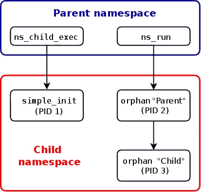

# 分解容器|第 1 部分—名称空间

> 原文：<https://itnext.io/breaking-down-containers-part-1-namespaces-9668b86d003d?source=collection_archive---------6----------------------->



子进程和父进程的名称空间可以不同

在继续之前，有一些事情需要注意

```
1\. This is not an introductory article, kindly learn about containers from the Part 0 article
2\. Containers are not Docker, Docker is not a Container
3\. Docker is a container runtime and there are more tools like docker: runc, runv etc
4\. Docker wasn't the first container runtime, it was the easiest to use due to it's configuration file called the Dockerfile which had almost english like reference to already generic scripts and its automated resolve for configurations I would outline in parts 3 & 4.
5\. Code samples for this and subsequent articles are available in the following link: [https://github.com/Tiemma/oci-containers/tree/master/container](https://github.com/Tiemma/oci-containers/tree/master/container)
6\. Follow up on the command line exercises to understand the content outlined here
```

在阅读第 1 部分之前，请继续阅读第 0 部分，以理解这里讨论的内容:

[](/breaking-down-containers-part-0-system-architecture-37afe0e51770) [## 分解容器|第 0 部分—系统架构

### 本文中需要注意的事项

itnext.io](/breaking-down-containers-part-0-system-architecture-37afe0e51770) 

对于这一点，我们将在下面详细介绍:

1.  系统调用
2.  过程文件系统
3.  克鲁特
4.  名称空间

# 系统调用

在我们开始这篇文章之前，我想概述一些事情来帮助理解为什么这篇文章要向 C 方向发展，因为受过更多教育的读者已经知道，使用这些 API 的大多数命令不需要编写代码就可以使用，例如 chroot。

Linux 内核是用 C 编写的，因此，许多通过 API 公开的系统和内核级功能都是用 C 编写的。当我说 API 时，我并不是指 web REST 或 GraphQL，它们似乎掩盖了它的真正含义。

API 是一种功能的抽象，它隐藏了该功能的所有复杂性，并通过允许单个接入点来使用它而使其更易于使用。例如，勺子是一种 API，用于食用盘中的食物，同时为食物从盘中到嘴提供通道。没有勺子，我们吃东西会有困难，因为我们的嘴不适合直接从盘子里吃东西。

在这种情况下，系统调用是内核的 API，允许对内核级功能进行功能性访问。在 Linux 编程中，这些 API 是使用 C 库公开的

> 公开 chroot 系统调用的 API 示例。
> 
> **#包含<unistd . h>**
> 
> **int ch root(const char ****path***)；**

你可以从这个网站上看到一些 Linux 系统调用

 [## Linux/i386 系统调用

### 版权所有(C) 1999-2000 由康斯坦丁 Boldyshev 这份名单还没有准备好，并正在大力建设中，很多…

asm.sourceforge.net](http://asm.sourceforge.net/syscall.html) 

如果查看 Linux 系统调用，您会看到一些命令引用，如 umount、chown，甚至更简单的命令，如 **mkdir** 。

为了访问系统调用并确保清楚地展示容器的一些特性，使用 C 来展示深入的容器功能以及 Docker 和其他容器运行时所基于的其他 linux 衍生工具。

# **进程文件系统<进程文件系统>**

在 Linux 中，正如第 0 部分所述，一切都是文件。因此，Linux 使用与进程文件系统相同的概念来管理进程数据，对于进程文件系统，运行进程的所有配置及其配置都可以通过写入进程文件来管理。

 [## /proc

### proc 非常特殊，因为它也是一个虚拟文件系统。它有时被称为流程信息…

web.archive.org](https://web.archive.org/web/20190429231927/http://www.tldp.org/LDP/Linux-Filesystem-Hierarchy/html/proc.html) 

这包含了一个包含进程数据的虚拟文件系统。linux 机器上的每个进程都有一个进程 ID；在这个文件系统中，我们可以使用进程 ID 从文件系统中检索每个进程的详细信息并配置详细信息。

```
**vagrant@ubuntu-bionic**:**~**$ ls /proc**1**     **1095**  **1153**  **1201**  **13**    **17**    **1838**  **1900**  **20**   **21**   **26**   **30**   **335**  **37**   **419**  **429**  **468**  **8**   **89**   **947**        cgroups   devices      fb           ioports    keys         loadavg  modules  pagetypeinfo  **self**      **sys**            **tty**                vmstat**10**    **11**    **1189**  **122**   **14**    **1704**  **1857**  **1929**  **203**  **210**  **27**   **31**   **336**  **4**    **42**   **433**  **6**    **85**  **9**    **96**         cmdline   diskstats    filesystems  **irq**        kmsg         locks    **mounts**   partitions    slabinfo  sysrq-trigger  uptime             zoneinfo**1032**  **1105**  **1193**  **1222**  **15**    **1714**  **1858**  **1930**  **204**  **22**   **28**   **32**   **34**   **40**   **420**  **45**   **7**    **86**  **90**   **acpi**       consoles  dma          **fs**           kallsyms   kpagecgroup  mdstat   **mpt**      sched_debug   softirqs  **sysvipc**        version**1038**  **1106**  **1195**  **1256**  **16**    **18**    **1892**  **1933**  **206**  **24**   **283**  **327**  **35**   **41**   **421**  **453**  **765**  **87**  **913**  buddyinfo  cpuinfo   **driver**       interrupts   kcore      kpagecount   meminfo  mtrr     schedstat     stat      **thread-self**    version_signature**105**   **1141**  **12**    **1274**  **1695**  **1836**  **19**    **2**     **207**  **25**   **29**   **33**   **36**   **418**  **428**  **454**  **789**  **88**  **933**  **bus**        crypto    execdomains  iomem        key-users  kpageflags   misc     **net**      **scsi**          swaps     timer_list     vmallocinfo**vagrant@ubuntu-bionic**:**~**$
**vagrant@ubuntu-bionic**:**~**$ cat /proc/cgroups#subsys_name hierarchy num_cgroups enabledcpuset 9 1 1cpu 2 36 1cpuacct 2 36 1blkio 8 36 1memory 4 64 1devices 3 36 1freezer 5 1 1net_cls 6 1 1perf_event 7 1 1net_prio 6 1 1hugetlb 11 1 1pids 10 41 1rdma 12 1 1
```

这里我们看到一个数字列表和其他文件，记下我们要返回的组。请记住，在第 0 部分中，容器是进程，因此在 cgroups 中运行的所有容器都将在主机上显示为进程。

```
**vagrant@ubuntu-bionic**:**~**$ # Now let us start a long running process**vagrant@ubuntu-bionic**:**~**$ tail -f main.c & echo $![1] 19301930
```

在 Linux 中，我们有特殊的参数可以用来提取某些信息。我们用 **$？**为进程退出代码，但这里我们使用 **$！**获取进程 ID。

更多详情请点击此处:

 [## 特殊参数(Bash 参考手册)

### 3.4.2 特殊参数 shell 对几个参数进行了特殊处理。这些参数只能被引用…

www.gnu.org](https://www.gnu.org/software/bash/manual/html_node/Special-Parameters.html) 

```
**vagrant@ubuntu-bionic**:**~**$ # Let's get the process ID**vagrant@ubuntu-bionic**:**~**$ export PID=$!**vagrant@ubuntu-bionic**:**~**$ echo $PID1930**vagrant@ubuntu-bionic**:**~**$ echo $?0
**vagrant@ubuntu-bionic**:**~**$ ls /proc/$PID**attr**       auxv    clear_refs  comm             cpuset  environ  **fd**      gid_map  limits    **map_files**  mem        mounts      **net**  numa_maps  oom_score      pagemap      personality  **root**   schedstat  setgroups  smaps_rollup  stat   status   **task**    timerslack_ns  wchanautogroup  cgroup  cmdline     coredump_filter  **cwd**     **exe**      **fdinfo**  io       loginuid  maps       mountinfo  mountstats  **ns**   oom_adj    oom_score_adj  patch_state  projid_map   sched  sessionid  smaps      stack         statm  syscall  timers  uid_map**vagrant@ubuntu-bionic**:**~**$
```

我们可以检查进程的状态，如果我在 **top** 上运行一个用于显示正在运行的程序的详细信息的 strace，我们注意到它同样使用了 proc 文件系统。这是因为所有过程细节都存储在文件中，即每个过程 ID 文件夹中的 **statm** 和 **status** 文件。

> **/proc/PID/statm**
> 
> 处理内存状态信息。
> 
> **/进程/PID/状态**
> 
> 人类可读形式的流程状态。

```
**vagrant@ubuntu-bionic**:**~**$ strace top | grep proc...# Checks if the process folder exists along with its details using the stat system call
# [http://man7.org/linux/man-pages/man2/stat.2.html](http://man7.org/linux/man-pages/man2/stat.2.html) stat("/proc/1193", {st_mode=S_IFDIR|0555, st_size=0, ...}) = 0openat(AT_FDCWD, "/proc/1193/stat", O_RDONLY) = 9read(9, "1193 (unattended-upgr) S 1 1193 "..., 2048) = 187close(9)                                = 0# Openat is the same as the open syscall but is relative to the directory it's called in
# [https://linux.die.net/man/2/openat](https://linux.die.net/man/2/openat) openat(AT_FDCWD, "/proc/1193/statm", O_RDONLY) = 9read(9, "46919 5099 3119 948 0 4194 0\n", 2048) = 29close(9)                                = 0openat(AT_FDCWD, "/proc/1193/status", O_RDONLY) = 9read(9, "Name:\tunattended-upgr\nUmask:\t002"..., 2048) = 1296close(9)...**vagrant@ubuntu-bionic**:**~**$ cat /proc/$PID/statusName: tailUmask: 0002State: S (sleeping)Tgid: 1930Ngid: 0Pid: 1930PPid: 1838TracerPid: 0Uid: 1000 1000 1000 1000Gid: 1000 1000 1000 1000FDSize: 256Groups: 999 1000NStgid: 1930NSpid: 1930NSpgid: 1930NSsid: 1838VmPeak:     7960 kBVmSize:     7960 kBVmLck:        0 kBVmPin:        0 kBVmHWM:      780 kBVmRSS:      780 kBRssAnon:       64 kBRssFile:      716 kBRssShmem:        0 kBVmData:      176 kBVmStk:      132 kBVmExe:       64 kBVmLib:     2112 kBVmPTE:       60 kBVmSwap:        0 kBHugetlbPages:        0 kBCoreDumping: 0Threads: 1SigQ: 0/3841SigPnd: 0000000000000000ShdPnd: 0000000000000000SigBlk: 0000000000000000SigIgn: 0000000000000000SigCgt: 0000000000000000CapInh: 0000000000000000CapPrm: 0000000000000000CapEff: 0000000000000000CapBnd: 0000003fffffffffCapAmb: 0000000000000000NoNewPrivs: 0Seccomp: 0Speculation_Store_Bypass: vulnerableCpus_allowed: 3Cpus_allowed_list: 0-1Mems_allowed: 00000000,00000000,00000000,00000000,00000000,00000000,00000000,00000000,00000000,00000000,00000000,00000000,00000000,00000000,00000000,00000000,00000000,00000000,00000000,00000000,00000000,00000000,00000000,00000000,00000000,00000000,00000000,00000000,00000000,00000000,00000000,00000001Mems_allowed_list: 0voluntary_ctxt_switches: 1nonvoluntary_ctxt_switches: 1
```

上面的细节是流程的状态细节，像 Seccomp 这样的活动都嵌入在流程状态中。

如果我们对 cgroup 文件进行 cat，我们将获得第 0 部分中概述的 cgroup 列表的以下详细信息。这里我们开始了解 linux 是如何管理 cgroups 的。当我们在一个名称空间下设置启用了 cgroups 的流程时，我们会看到这种差异。

```
**vagrant@ubuntu-bionic**:**~**$ cat /proc/$PID/cgroup12:rdma:/11:hugetlb:/10:pids:/user.slice/user-1000.slice/session-1.scope9:cpuset:/8:blkio:/user.slice7:perf_event:/6:net_cls,net_prio:/5:freezer:/4:memory:/user.slice3:devices:/user.slice2:cpu,cpuacct:/user.slice1:name=systemd:/user.slice/user-1000.slice/session-1.scope0::/user.slice/user-1000.slice/session-1.scope
```

如果我们对名称空间`ns`做同样的事情，我们会得到随机过程的以下细节

```
**vagrant@ubuntu-bionic**:**~**$ sudo ls -l /proc/1900/nstotal 0lrwxrwxrwx 1 root root 0 Dec 15 15:03 cgroup -> 'cgroup:[4026531835]'lrwxrwxrwx 1 root root 0 Dec 15 15:03 ipc -> 'ipc:[4026531839]'lrwxrwxrwx 1 root root 0 Dec 15 15:03 mnt -> 'mnt:[4026531840]'lrwxrwxrwx 1 root root 0 Dec 15 15:03 net -> 'net:[4026531993]'lrwxrwxrwx 1 root root 0 Dec 15 15:03 pid -> 'pid:[4026531836]'lrwxrwxrwx 1 root root 0 Dec 15 15:03 pid_for_children -> 'pid:[4026531836]'lrwxrwxrwx 1 root root 0 Dec 15 15:03 user -> 'user:[4026531837]'lrwxrwxrwx 1 root root 0 Dec 15 15:03 uts -> 'uts:[4026531838]'
```

如果我们对自己的流程做同样的事情，我们会得到同样的结果。这就是我们如何识别这两个进程在同一个名称空间中运行，尽管前一个进程由不同的用户 **root 所有。**

```
# You can also use the **readlink** command to view the details about the individual namespace of a process**vagrant@ubuntu-bionic**:**~/oci-containers/container**$ readlink /proc/$PID/ns/mntmnt:[4026531840]
```

名称空间不是用户定义的，事实上我们可以在不同用户环境中的程序间共享不同的名称空间。

```
**vagrant@ubuntu-bionic**:**~**$ sudo ls -l /proc/$PID/nstotal 0
**# Notice it's vagrant and not root here**lrwxrwxrwx 1 vagrant vagrant 0 Dec 15 15:03 cgroup -> 'cgroup:[4026531835]'lrwxrwxrwx 1 vagrant vagrant 0 Dec 15 15:03 ipc -> 'ipc[4026531839]'lrwxrwxrwx 1 vagrant vagrant 0 Dec 15 15:03 mnt -> 'mnt[4026531840]'lrwxrwxrwx 1 vagrant vagrant 0 Dec 15 15:03 net -> 'net[4026531993]'lrwxrwxrwx 1 vagrant vagrant 0 Dec 15 15:03 pid -> 'pid[4026531836]'lrwxrwxrwx 1 vagrant vagrant 0 Dec 15 15:03 pid_for_children ->'pid:[4026531836]'lrwxrwxrwx 1 vagrant vagrant 0 Dec 15 15:03 user -> 'user:[4026531837]'lrwxrwxrwx 1 vagrant vagrant 0 Dec 15 15:03 uts -> 'uts[4026531838]'
```

当我们开始在名称空间中运行进程并使用 cgroups 限制资源时，我们将回头讨论所有这些和其他细节。

# **CHROOT**

这意味着“ **CH** 安歌 **ROOT** ”，它提供了一种将文件系统的根目录更改为另一个的方法。

在 Linux 中，我们在 **unistd.h** 库下有 chroot 库。

[](http://man7.org/linux/man-pages/man0/unistd.h.0p.html) [## unistd.h.0p - Linux 手册页

### unistd.h(0P) POSIX 程序员手册 unistd.h(0P)该手册页是 POSIX 程序员手册的一部分。的…

man7.org](http://man7.org/linux/man-pages/man0/unistd.h.0p.html) 

Chroot 允许我们将根从我们的文件系统更改到另一个文件系统。因为 chroot 使用 linux 文件系统，这是一个用于一堆文件夹的时髦词汇，所以我们需要准备一个基本的 linux 文件系统。要做到这一点，我们可以使用图像，而不是 docker 图像。映像是包含 linux 文件系统的压缩文件夹。您可以使用以下命令从 docker 容器中提取一个:

> RM-r ./root fs；mkdir rootfsdocker export $(docker create alpine)| tar-C rootfs-xvf-

为了使代码入口点过程更容易，我用 C 编写了一个入口点，这里有到 repo 的链接

[](https://github.com/Tiemma/oci-containers/tree/master) [## tiemma/OCI-集装箱

### 这个报告是在这里的功能内容的容器，有关容器运行时，OCI 规范和如何…

github.com](https://github.com/Tiemma/oci-containers/tree/master) 

> 流浪起来
> 
> 流浪宋承宪

由于所使用的库，代码不仅在 Linux 机器上工作，在 POSIX 兼容的系统上也可以使用 C 库。更多受过教育的读者知道，由于其 POSIX API 兼容性，它可以在 Mac 和其他操作系统上使用，但它不具有与 linux 库变体相同的标志。我默认为流浪者，以确保环境复制，因为这在测试中的问题较少。

 [## 用于安装的 Mac OS X 手册页(2)

### 本文档是 Mac OS X 手册页。手册页是一种提供文档的命令行技术。你…

developer.apple.com](https://developer.apple.com/library/archive/documentation/System/Conceptual/ManPages_iPhoneOS/man2/mount.2.html)  [## 可移植性操作系统接口

### 可移植操作系统接口(POSIX)是由 IEEE 计算机协会为…

en.wikipedia.org](https://en.wikipedia.org/wiki/POSIX#POSIX-oriented_operating_systems) 

一个浮动文件可以用来启动一个配置为使用 **ubuntu 18:04** 的 linux 机器，并且还可以提供实例。

一旦进入流浪者外壳，你就可以访问位于 **oci-containers/container** 文件夹中代码库旁边的终端。在本文的整个期间，这将是代码库的参考报告。

让我们开始测试，我们首先编译 **C** 代码并得到二进制代码

```
# You can change **chroot** to be any name you desirecd oci-containers/container/gcc main.c -o containers
```

这将编译代码并构建一个名为 **containers** 的二进制文件。为了测试 chroot，让我们使用一个 alpine 二进制文件< apk >来访问我们的 linux 映像上没有的功能，它是一个**a**lpine**p**AC**k**年龄管理器。

```
 **vagrant@ubuntu-bionic**:**~**$ apk**# Without chroot, we get this**Command 'apk' not found, did you mean:command 'apm' from snap atom (1.41.0)command 'ark' from snap ark (19.08.0)command 'apf' from deb apf-firewallcommand 'apg' from deb apgcommand 'awk' from deb gawkcommand 'awk' from deb mawkcommand 'awk' from deb original-awkcommand 'ark' from deb arkcommand 'ask' from deb askcommand 'apm' from deb apmdcommand 'apt' from deb aptcommand 'ack' from deb ackSee 'snap info <snapname>' for additional versions.
```

让我们使用我们设计的脚本来访问 alpine 映像并运行 apk 命令。

```
**vagrant@ubuntu-bionic**:**~/oci-containers/container**$ sudo ./containers image mount chroot image: 210716097704Extracting base image for chroot using Docker and command: {rm -r ./rootfs; mkdir rootfs; docker export $(docker create alpine) | tar -C rootfs -xvf -}Executing command: rm -r ./rootfs; mkdir rootfs; docker export $(docker create alpine) | tar -C rootfs -xvf -Output:.dockerenvbin/
**...some other files...**var/tmp/ mount: 210720935288Mounting directories for chroot {proc sys dev}Mounting directory /proc on ./rootfs/procNo errors happened, talk about a lucky run!Mounted directory /proc on ./rootfs/proc successfully**... some other outputs ....**chroot: 6953391102356Chrooting into environmentNo errors happened, talk about a lucky run!Chrooted into directory ./rootfs successfully **Executing command: ls**Output:bin
**...some other files...**var**Executing command: apk** **# Notice this command works after a chroot**Output:apk-tools 2.10.4, compiled for x86_64. **...some other outputs...**Use apk <command> --help for command-specific help.Use apk --help --verbose for a full command listing.This apk has coffee making abilities. **# Here we exit the chroot environment** **Running 'exit' on the next prompt to get out of chroot>>>>****Executing command: exit****Output:****Exiting chroot environments** **Executing command: apk****# Notice this command now works even after exiting the shell which means we are still in the chroot**Output:apk-tools 2.10.4, compiled for x86_64.Installing and removing packages:**...some other outputs...**Use apk <command> --help for command-specific help.Use apk --help --verbose for a full command listing.This apk has coffee making abilities.>>>>>>**Sike!, You can't exit out of the chroot cause that'd be a jail break and you'd access the main shell of the user**
```

为了继续，现在让我们手动进入 chroot 并运行 apk，您会注意到我们得到了确切的响应，但是这次 shell 关闭了。我们得到它是因为我们在主外壳中运行。

```
**vagrant@ubuntu-bionic**:**~/oci-containers/container**$ sudo chroot rootfs/ apkapk-tools 2.10.4, compiled for x86_64.Installing and removing packages:**...some other outputs...**Use apk <command> --help for command-specific help.Use apk --help --verbose for a full command listing.This apk has coffee making abilities.
```

> 为什么我要做这一切？

这是为了展示 chroot 相对于 docker exec 的威力。您会注意到，我们没有隔离的运行时环境，因为资源没有在名称空间中隔离。
我们使用 **ifconfig** 检查这一点，看看我们是如何没有网络隔离的，即使没有安装 **proc** 。

```
**vagrant@ubuntu-bionic**:**~/oci-containers/container**$ sudo ./containers unmountunmount: 229485381690395Unmounting directories for chroot {proc sys dev}Errors for mounts:No errors happened, talk about a lucky run! Mount: SuccessUnmounted directory /proc on ./rootfs/proc successfully Errors for mounts:No errors happened, talk about a lucky run! Mount: SuccessUnmounted directory /sys on ./rootfs/sys successfully Errors for mounts:No errors happened, talk about a lucky run! Mount: SuccessUnmounted directory /dev on ./rootfs/dev successfully**vagrant@ubuntu-bionic**:**~/oci-containers/container**$ sudo chroot rootfs/ ifconfigifconfig: **/proc/net/dev:** No such file or directorydocker0   Link encap:Ethernet  HWaddr 02:42:D8:C2:F1:8Einet addr:172.17.0.1  Bcast:172.17.255.255  Mask:255.255.0.0UP BROADCAST MULTICAST  MTU:1500  Metric:1enp0s3    Link encap:Ethernet  HWaddr 02:7C:06:17:A1:8Binet addr:10.0.2.15  Bcast:10.0.2.255  Mask:255.255.255.0UP BROADCAST RUNNING MULTICAST  MTU:1500  Metric:1lo        Link encap:Local Loopbackinet addr:127.0.0.1  Mask:255.0.0.0UP LOOPBACK RUNNING  MTU:65536  Metric:1
```

# 名称空间

从前面 chroot 的上下文中，我们可以看到，我们现在可以使用来自非本地文件系统的命令，尽管这不允许将 exec 之外的文件系统隔离到外部文件系统中。

```
**vagrant@ubuntu-bionic**:**~/oci-containers/container**$ sudo ./containers namespacenamespace: 249899181367082546Exec into a shell in a new namespaceExecuting command: rm -r /newrootOutput:Exec command: Successmkdir: Success Mounting tmpfs filesystem for pivot_rootErrors for mounts:No errors happened, talk about a lucky run!Mount: Success Executing command: find . -depth -xdev -print | cpio -pd --quiet /newrootOutput:Exec command: Successpivot_root: SuccessErrors for chroot:No errors happened, talk about a lucky run!chroot: SuccessChrooted into directory / successfully **# The Chroot doesn't protect me from isolating my network configurations for example, all my adapters are shared if I don't unshare first.**/ # **ifconfig**ifconfig: /proc/net/dev: No such file or directorydocker0   Link encap:Ethernet  HWaddr 02:42:92:BD:5F:2Binet addr:172.17.0.1  Bcast:172.17.255.255  Mask:255.255.0.0UP BROADCAST MULTICAST  MTU:1500  Metric:1enp0s3    Link encap:Ethernet  HWaddr 02:7C:06:17:A1:8Binet addr:10.0.2.15  Bcast:10.0.2.255  Mask:255.255.255.0UP BROADCAST RUNNING MULTICAST  MTU:1500  Metric:1lo        Link encap:Local Loopbackinet addr:127.0.0.1  Mask:255.0.0.0UP LOOPBACK RUNNING  MTU:65536  Metric:1
```

名称空间是我们用来定义我们可以看到什么，从而隔离我们不希望共享的环境。在上一篇文章中，我们介绍了不同种类的名称空间，这里已经对它们进行了概述。

现在，是时候看看它们的实际应用了，它们对你看待容器的方式产生了巨大的改变。

我们从定义希望使用的名称空间开始。linux 中的名称空间是由 sched.h 库中的 unshare 提供的。

[](http://man7.org/linux/man-pages/man2/unshare.2.html) [## unshare(2) - Linux 手册页

### UNSHARE(2) Linux 程序员手册 UNSHARE(2)UNSHARE——解除流程执行上下文部分的关联 unshare()…

man7.org](http://man7.org/linux/man-pages/man2/unshare.2.html)  [## sched.h 源代码[include/sched.h] - Woboq 代码浏览器

### 版权所有(C) 1996-2017 自由软件基金会。

code.woboq.org](https://code.woboq.org/gcc/include/sched.h.html) 

为了开始了解名称空间，让我们记下进程的当前名称空间。我们需要验证我们确实改变了名称空间。

```
**vagrant@ubuntu-bionic**:**~/oci-containers/container**$ tail -f run.h &[1] 2238**vagrant@ubuntu-bionic**:**~/oci-containers/container**$ ls -l /proc/$!/nstotal 0lrwxrwxrwx 1 vagrant vagrant 0 Dec 21 10:23 **cgroup** -> **'cgroup:[4026531835]'**lrwxrwxrwx 1 vagrant vagrant 0 Dec 21 10:23 **ipc** -> **'ipc:[4026531839]'**lrwxrwxrwx 1 vagrant vagrant 0 Dec 21 10:23 **mnt** -> **'mnt:[4026531840]'**lrwxrwxrwx 1 vagrant vagrant 0 Dec 21 10:23 **net** -> **'net:[4026531993]'**lrwxrwxrwx 1 vagrant vagrant 0 Dec 21 10:23 **pid** -> **'pid:[4026531836]'**lrwxrwxrwx 1 vagrant vagrant 0 Dec 21 10:23 **pid_for_children** -> **'pid:[4026531836]'**lrwxrwxrwx 1 vagrant vagrant 0 Dec 21 10:23 **user** -> **'user:[4026531837]'**lrwxrwxrwx 1 vagrant vagrant 0 Dec 21 10:23 **uts** -> **'uts:[4026531838]'**
```

下一件事是初始化名称空间。为此，我们可以使用方便的 chroot 脚本传递 unshare 参数来设置名称空间。

检查 **unshare_command** 函数，我们可以看到这些标志在起作用。

```
case 'i':
    flags |= CLONE_NEWIPC;
    yellow("Added IPC flag");
    break;
case 'm':
    flags |= CLONE_NEWNS;
    yellow("Added mount flag");
    break;
case 'n':
    flags |= CLONE_NEWNET;
    yellow("Added network flag");
    break;
case 'p':
    flags |= CLONE_NEWPID;
    yellow("Added PID flag");
    break;
case 'u':
    flags |= CLONE_NEWUTS;
    yellow("Added UTS flag");
    break;
case 'U':
    flags |= CLONE_NEWUSER;
    yellow("Added user flag");
    break;
case 'c':
    flags |= CLONE_NEWCGROUP;
    yellow("Added cgroup flag");
    break;
default:
    printf("\nInvalid flag supplied: %d", opts[i]);
    break;
}
```

在这里，我们添加了标志，以便能够为希望运行的进程创建特定的名称空间。

```
**vagrant@ubuntu-bionic**:**~/oci-containers/container**$ gcc main.c -o containers**vagrant@ubuntu-bionic**:**~/oci-containers/container**$ sudo ./containers unshareunshare: 229485388532699Setting up namespaces**# We execute a command to make the root directory private
# In linux, pivot_root doesn't work with a shared subtree for a root mount point
# We can fix this by making the root mount point private
# mount("none", "/", NULL, MS_REC|MS_PRIVATE, NULL);**Executing command: mount --make-rprivate /Output:Exec command: Success**# Here's where we define the namespace flags for the unshare command
# Unshare is what we use to define which namespaces we'd like to define for our processes to run in```main.c** char opts[9] = "inmuc";
unshare_command(opts);```Adding namespace flagsAdded IPC flagAdded network flagAdded mount flagAdded UTS flagAdded cgroup flag Running the unshare command, return status: 0New PID after unshare is 2332unshare: Success
```

非共享标志是我们用来定义我们想要应用的名称空间的标志。

参考第 0 部分中的详细信息，我们得到了下表:

```
 ***CLONE FLAG .   MAN DOC .             FUNCTION .***      **CLONE_NEWIPC    ipc_namespaces**(7)     System V IPC,
                                               POSIX message         
**CLONE_NEWNET    network_namespaces**(7) Network devices,
                                                stacks, ports,    
**CLONE_NEWNS     mount_namespaces**(7)   Mount points      
**CLONE_NEWPID    pid_namespaces**(7)     Process IDs
**CLONE_NEWUSER   user_namespaces**(7)    User and group IDs       **CLONE_NEWUTS    uts_namespaces**(7)     Hostname and NIS
```

> 【http://man7.org/linux/man-pages/man7/namespaces.7.html】来源:[](http://man7.org/linux/man-pages/man7/namespaces.7.html)

*在这种情况下，我们省略了 **CLONE_NEWPID** 和 **CLONE_NEWUSER** 标志，因为 CLONE_NEWPID 与我们为设置 pivot_root 和 CLONE_NEWUSER 的命令创建新进程相冲突，它为我们提供了一个没有权限在我们的名称空间中运行进程的新用户。它们将在安装过程的后期运行。*

*从这里，我们可以继续到 chroot，但是这次是在名称空间中。我们再次运行 chroot 脚本，但是这次使用了 unshare 标志。这创建了一个 tmpfs 文件系统供我们挂载。 **pivot_root** 要求挂载一个有效的 linux 文件系统，并且旧根目录的文件夹(我们当前的 ubuntu os)位于该文件夹下。*

```
***vagrant@ubuntu-bionic**:**~/oci-containers/container**$ sudo ./containers unshare namespaceunshare: 229485388532699Setting up namespaces**# We execute a command to make the root directory private
# In linux, pivot_root doesn't work with a shared subtree for a root mount point
# We can fix this by making the root mountpoint private
# mount("none", "/", NULL, MS_REC|MS_PRIVATE, NULL);**Executing command: mount --make-rprivate /Output:Exec command: Success**# Here's where we define the namespace flags for the unshare command
# Unshare is what we use to define which namespaces we'd like to define for our processes to run in**Adding namespace flagsAdded IPC flagAdded network flagAdded mount flagAdded UTS flagAdded cgroup flagRunning the unshare command, return status: 0New PID after unshare is 2332unshare: Successnamespace: 249899181367082546Exec into a shell in a new namespace**# Here we delete the folder and recreate it, nothing fancy!**Executing command: rm -r /newrootOutput:Exec command: Success **# Here we created the newroot and newroot/oldroot folders** mkdir: Success **# We then mount the tmpfs filesystem to newroot**Mounting tmpfs filesystem for pivot_rootErrors for mounts:No errors happened, talk about a lucky run!Mount: Success**# We copy the filesystem from rootfs to /newroot**Executing command: find . -depth -xdev -print | cpio -pd --quiet /newrootOutput:Exec command: Successpivot_root: Success **# And we finally chroot****Errors for chroot:****No errors happened, talk about a lucky run!****chroot: Success** **# We unmount the oldroot folder so only the container exists**Chrooted into directory / successfullyUnmounting oldrootunmount: SuccessSetting up PID namespacesAdding namespace flagsAdded PID flag Running the unshare command, return status: 0New PID after unshare is 2149unshare: Successunshare_pid: Success / #*
```

*从这里，你会注意到我们像以前一样进入了一个壳。让我们像以前一样检查这个环境。通常的 **apk** 命令和以前一样工作，但是有所改变。*

```
*/ # apkOutput:apk-tools 2.10.4, compiled for x86_64.**...some other outputs...**Use apk <command> --help for command-specific help.Use apk --help --verbose for a full command listing.This apk has coffee making abilities./ # ls**bin**      **dev**      **etc**      **home**     **lib**      **media**    **mnt**     **opt**      **proc**     **root**     **run**      **sbin**     **srv**      **sys**      **tmp**     **usr**      **var***
```

*还记得我们为命名空间添加的标志吗*

```
*Added IPC flagAdded network flagAdded mount flagAdded UTS flagAdded cgroup flagAdded PID flag*
```

*让我们像以前一样启动尾部进程，检查网络标志和其他名称空间*

```
***As opposed to the previous ifconfig, we get nothing here because the network namespace was applied. As opposed to the previous run without a namespace, this isolates the network configuration**/ # ifconfig/ # touch file/ # tail -f file &/ # psPID   USER     TIME  COMMAND1 root      0:00 sh12 root      0:00 tail -f file13 root      0:00 ps/ # echo $!12/ # ls -l /proc/$!/ns/total 0lrwxrwxrwx    1 root     root             0 Dec 21 15:19 **cgroup** -> cgroup:[**4026532178**]lrwxrwxrwx    1 root     root             0 Dec 21 15:19 **ipc** -> ipc:[**4026532177**]lrwxrwxrwx    1 root     root             0 Dec 21 15:19 **mnt** -> mnt:[**4026532175**]lrwxrwxrwx    1 root     root             0 Dec 21 15:19 **net** -> net:[**4026532180**]lrwxrwxrwx    1 root     root             0 Dec 21 15:19 **pid** -> pid:[**4026531836**]lrwxrwxrwx    1 root     root             0 Dec 21 15:19 **pid_for_children** -> pid:[**4026531836**]lrwxrwxrwx    1 root     root             0 Dec 21 15:19 **user** -> user:[4026531837]lrwxrwxrwx    1 root     root             0 Dec 21 15:19 **uts** -> uts:[**4026532176**]*
```

*与我们之前的结果相比:*

```
***vagrant@ubuntu-bionic**:**~/oci-containers/container**$ ls -l /proc/2238/nstotal 0lrwxrwxrwx 1 vagrant vagrant 0 Dec 21 10:23 **cgroup** -> **'cgroup:[4026531835]'**lrwxrwxrwx 1 vagrant vagrant 0 Dec 21 10:23 **ipc** -> **'ipc:[4026531839]'**lrwxrwxrwx 1 vagrant vagrant 0 Dec 21 10:23 **mnt** -> **'mnt:[4026531840]'**lrwxrwxrwx 1 vagrant vagrant 0 Dec 21 10:23 **net** -> **'net:[4026531993]'**lrwxrwxrwx 1 vagrant vagrant 0 Dec 21 10:23 **pid** -> **'pid:[4026532234]'**lrwxrwxrwx 1 vagrant vagrant 0 Dec 21 10:23 **pid_for_children** -> **'pid:[4026532234]'**lrwxrwxrwx 1 vagrant vagrant 0 Dec 21 10:23 **user** -> **'user:[**4026531837**]'**lrwxrwxrwx 1 vagrant vagrant 0 Dec 21 10:23 **uts** -> **'uts:[4026531838]'***
```

*您会注意到 mnt、cgroup、ipc、net、pid 和 uts 名称空间是不同的，它们被加粗以便于查看。因此，你会意识到我们现在对这些资源有了命名空间。*

*为了最终确定这一点，让我们退出，看看我们的主机是否发生了变化。*

```
***vagrant@ubuntu-bionic**:**~/oci-containers/container**$ tail -f run.h &[1] 2043**vagrant@ubuntu-bionic**:**~/oci-containers/container**$         perror("Error executing command");}while (fgets(line, sizeof line, fp)){blue(line);}pclose(fp);perror("Exec command");printf("\n");}**vagrant@ubuntu-bionic**:**~/oci-containers/container**$ ls -l /proc/$!/nstotal 0lrwxrwxrwx 1 vagrant vagrant 0 Dec 21 15:27 **cgroup** -> **'cgroup:[4026531835]'**lrwxrwxrwx 1 vagrant vagrant 0 Dec 21 15:27 **ipc** -> **'ipc:[4026531839]'**lrwxrwxrwx 1 vagrant vagrant 0 Dec 21 15:27 **mnt** -> **'mnt:[4026531840]'**lrwxrwxrwx 1 vagrant vagrant 0 Dec 21 15:27 **net** -> **'net:[4026531993]'**lrwxrwxrwx 1 vagrant vagrant 0 Dec 21 15:27 **pid** -> **'pid:[4026531836]'**lrwxrwxrwx 1 vagrant vagrant 0 Dec 21 15:27 **pid_for_children** -> **'pid:[4026531836]'**lrwxrwxrwx 1 vagrant vagrant 0 Dec 21 15:27 **user** -> **'user:[4026531837]'**lrwxrwxrwx 1 vagrant vagrant 0 Dec 21 15:27 **uts** -> **'uts:[4026531838]'***
```

*从这里，你会发现它们和上面的一样。这是在名称空间中运行进程的一个例子。来自 unshare 的以前的 shell 与我们自己的环境完全不同，在那里执行的所有进程只能在对某些资源的访问受限的环境中安全地运行。*

> *那么我在哪里使用它，它和 Docker 有什么不同吗？*

*让我们来看看这个叫做**的另一部分。这就是我们理解像`docker exec`这样的命令如何工作的地方。***

*我们可以启动容器，通过检查外壳的进程 id 来记录外壳返回的 pid。这是在容器启动时由 docker 自动处理的。*

*为了测试这一点，让我们再次启动我们的容器，但这次让我们在后台运行它。我制作了一个名为`nsenter.sh`的奇特脚本来帮助在那之后访问容器。*

*现在打开另一个选项卡并运行 nsenter 命令*

```
***# Let's run the command for starting the container in a different tty, /dev/tty2****vagrant@ubuntu-bionic**:**~/oci-containers/container**$ sudo openvt -c 2 -f ./containers unshare namespace
 **vagrant@ubuntu-bionic**:**~/oci-containers/container**$ ps -aPID TTY          TIME CMD3123 tty2     00:00:00 sh  **# This is our container and it's a process :-)**3140 pts/1    00:00:00 ps**vagrant@ubuntu-bionic**:**~/oci-containers/container**$ cat nsenter.sh#!/bin/bash run_command_ns(){nsenter -t $PID -G $GROUP_ID -S $USER_ID -a "$1"}USER_ID=0GROUP_ID=0PID=$(ps -a | grep "\ssh$" | head -n1 | awk '{split($0,a," "); print a[1]}')echo "PID: $PID" echo "Viewing the namespaces of the container, remember that containers are processes"ls -l "/proc/$PID/ns"echo "Enter nsenter for container with PID $PID"# echo "65534 0 4294967295" > /proc/$PID/uid_map# echo "65534 0 4294967295" > /proc/$PID/gid_map run_command_ns "$1"**vagrant@ubuntu-bionic**:**~/oci-containers/container**$ sudo bash nsenter.sh apk**Viewing the namespaces of the container, remember that containers are processes**total 0lrwxrwxrwx 1 root root 0 Dec 22 08:26 cgroup -> 'cgroup:[4026532178]'lrwxrwxrwx 1 root root 0 Dec 22 08:26 ipc -> 'ipc:[4026532177]'lrwxrwxrwx 1 root root 0 Dec 22 08:26 mnt -> 'mnt:[4026532175]'lrwxrwxrwx 1 root root 0 Dec 22 08:26 net -> 'net:[4026532180]'lrwxrwxrwx 1 root root 0 Dec 22 08:26 pid -> 'pid:[4026531836]'lrwxrwxrwx 1 root root 0 Dec 22 08:27 pid_for_children -> 'pid:[4026531836]'lrwxrwxrwx 1 root root 0 Dec 22 08:26 user -> 'user:[4026531837]'lrwxrwxrwx 1 root root 0 Dec 22 08:26 uts -> 'uts:[4026532176]'Enter nsenter for container with PID 3123apk-tools 2.10.4, compiled for x86_64.**...some other outputs...**Use apk <command> --help for command-specific help.Use apk --help --verbose for a full command listing.This apk has coffee making abilities.*
```

*同样，我可以通过给 **nsenter.sh** 脚本指定一个参数来更改我想要使用的命令。*

```
***vagrant@ubuntu-bionic**:**~/oci-containers/container**$ sudo bash nsenter.sh <command_to_run>*
```

*如果您知道，这看起来非常类似于 docker exec 命令，在这里您传递希望在容器中执行的命令。*

```
*docker exec -it ubuntu_bash bash
# Docker would substitute the "**bash**" command with the PID of the bash command in the ubuntu_bash container 
# This is one of the reasons why you need a running container to exec, it has to use the context of the initial container to run the needed commandSource code here: [https://sourcegraph.com/github.com/docker/docker-ce@d49c4ca453ce4d1161ce5fb2482be7538bf73e07/-/blob/components/engine/daemon/exec.go#L263](https://sourcegraph.com/github.com/docker/docker-ce@d49c4ca453ce4d1161ce5fb2482be7538bf73e07/-/blob/components/engine/daemon/exec.go#L263)systemPid, err := d.containerd.Exec(ctx, c.ID, ec.ID, p, cStdin != nil, ec.InitializeStdio)*
```

*试着输入一个 alpine 中没有的命令，比如 **bash** ,看看它是否不起作用。*

```
***vagrant@ubuntu-bionic**:**~/oci-containers/container**$ sudo bash nsenter.sh bashViewing the namespaces of the container, remember that containers are processestotal 0lrwxrwxrwx 1 root root 0 Dec 22 08:26 cgroup -> 'cgroup:[4026532178]'lrwxrwxrwx 1 root root 0 Dec 22 08:26 ipc -> 'ipc:[4026532177]'lrwxrwxrwx 1 root root 0 Dec 22 08:26 mnt -> 'mnt:[4026532175]'lrwxrwxrwx 1 root root 0 Dec 22 08:26 net -> 'net:[4026532180]'lrwxrwxrwx 1 root root 0 Dec 22 08:26 pid -> 'pid:[4026531836]'lrwxrwxrwx 1 root root 0 Dec 22 08:27 pid_for_children -> 'pid:[4026531836]'lrwxrwxrwx 1 root root 0 Dec 22 08:26 user -> 'user:[4026531837]'lrwxrwxrwx 1 root root 0 Dec 22 08:26 uts -> 'uts:[4026532176]'Enter nsenter for container with PID 2419nsenter: failed to execute bash: No such file or directory*
```

*这是一个在名称空间中运行命令并通过 chroot 和名称空间使用映像来完成文件系统以外的任务的示例。*

# *那么下一步是什么？*

*在下一部分(第 2 部分)中，我将更深入地讨论 cgroups，各种 cgroups 如何联合起来帮助解决资源限制问题。*

# *资源*

 *[## Linux/i386 系统调用

### 版权所有(C) 1999-2000 由康斯坦丁 Boldyshev 这份名单还没有准备好，并正在大力建设中，很多…

asm.sourceforge.net](http://asm.sourceforge.net/syscall.html)*  *[## pivot_root(2) - Linux 手册页

### pivot_root()改变调用进程的挂载名称空间中的根挂载。更准确地说，它移动了根…

man7.org](http://man7.org/linux/man-pages/man2/pivot_root.2.html)* *[](http://man7.org/linux/man-pages/man2/syscalls.2.html) [## 系统调用(2) - Linux 手册页

### 系统调用是应用程序和 Linux 内核之间的基本接口。系统调用和库…

man7.org](http://man7.org/linux/man-pages/man2/syscalls.2.html) [](http://man7.org/linux/man-pages/man7/namespaces.7.html) [## 名称空间(7) - Linux 手册页

### 命名空间(7) Linux 程序员手册命名空间(7)命名空间——Linux 命名空间概述命名空间包装了一个…

man7.org](http://man7.org/linux/man-pages/man7/namespaces.7.html) [](http://man7.org/linux/man-pages/man2/unshare.2.html) [## unshare(2) - Linux 手册页

### UNSHARE(2) Linux 程序员手册 UNSHARE(2)UNSHARE——解除流程执行上下文部分的关联 unshare()…

man7.org](http://man7.org/linux/man-pages/man2/unshare.2.html) [](http://man7.org/linux/man-pages/man2/setns.2.html) [## setns(2) - Linux 手册页

### SETNS(2) Linux 程序员手册 SETNS(2) setns -在给定文件描述符的情况下，将线程与名称空间重新关联…

man7.org](http://man7.org/linux/man-pages/man2/setns.2.html) [](http://man7.org/linux/man-pages/man5/proc.5.html) [## proc(5) - Linux 手册页

### PROC(5) Linux 程序员手册 PROC(5) proc -进程信息伪文件系统 PROC 文件系统是一个

man7.org](http://man7.org/linux/man-pages/man5/proc.5.html) [](http://man7.org/linux/man-pages/man1/nsenter.1.html) [## nsenter(1) - Linux 手册页

### 这个页面是 util-Linux(Linux 实用程序的随机集合)项目的一部分。关于项目的信息可以…

man7.org](http://man7.org/linux/man-pages/man1/nsenter.1.html)*