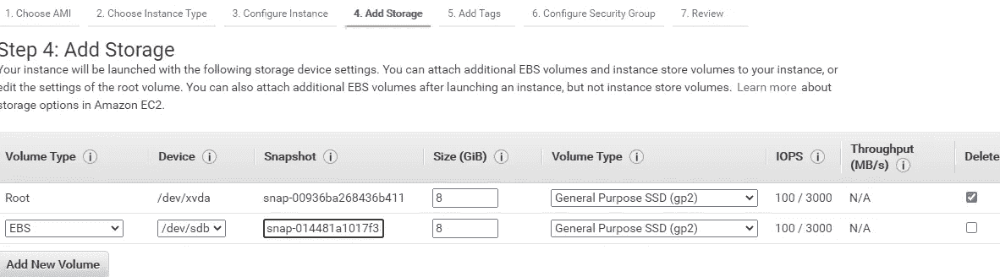
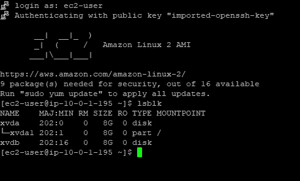
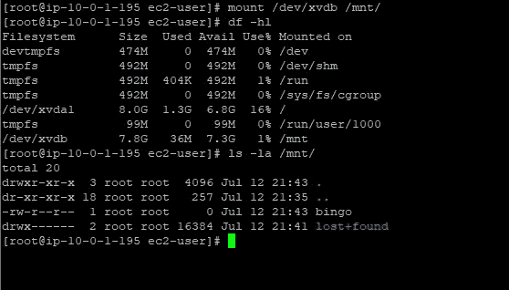

# 闯入 EC2 实例

> 原文：<https://itnext.io/breaking-in-to-a-ec2-instance-c01443f61ce9?source=collection_archive---------0----------------------->

## 实用开发工具

你曾经放错过你的私人钥匙吗？

照片由 [Samantha Lam](https://unsplash.com/@contradirony?utm_source=medium&utm_medium=referral) 在 [Unsplash](https://unsplash.com?utm_source=medium&utm_medium=referral) 上拍摄

## TL；DR；

即使您丢失了私钥，也可以快速简便地恢复数据。

## 我们是怎么到这里的？

照片由[珍·西奥多](https://unsplash.com/@jentheodore?utm_source=medium&utm_medium=referral)在 [Unsplash](https://unsplash.com?utm_source=medium&utm_medium=referral) 拍摄

让我们面对现实吧，有时你会搞砸…但有时你只是继承了已经运行了天知道多长时间的基础设施的一部分，没有人知道登录/密码组合。在物理时代，一切都运行在坚固的专用硬件上，这是事实。虽然，在那个时候，有时会对丢失登录/密码的关键机器进行特殊考虑。在数据中心放置特殊的限制/图形标志来保持人们的警觉，以免由于错误地触发重启或其他更糟糕的事情而使糟糕的情况变得更糟，这种情况并不是没有听说过。这个问题在今天仍然存在，也许在使用云时更是如此。尤其是如果您没有使用某种形式的系统来保护您的私有密钥并让您的所有团队成员使用相同的系统。

💡使用具有团队功能的密码管理器！

所以我继承了一个 EC2 实例，它已经运行了大约 4 年，没有人知道私钥在哪里。我们查看了他们应该在哪里，以及我们认为他们可能在哪里，但没有成功。技术团队中没有人登录过这个系统，负责设置的人几年前就离开了。

听起来很熟悉？

> …如果运行在基础设施的加固层中的软件决定放弃，那你就不走运了。

这个特定的服务器有一个简单的任务:将应用程序指标转发给外部服务。这是一个运行 Node.js 应用程序的小型服务器(t2.micro)， [Statsd](https://github.com/statsd/statsd) 。或者说我们是这样认为的，无法登录并验证这一点使得这个特定的服务分数在我的即将毁灭的高分数列表中相当高。如果该服务器发生故障，重新安装和恢复将是一个漫长的过程。当然，在云的世界中，存在各种方法来处理可能发生的一些问题。快照、备份、创建 AMI 映像等等。但是，如果在基础设施的加固层中运行的软件决定放弃，你就不走运了。

## 加密、传输中和静态。

关于信息加密，需要理解的一件重要事情是加密发生的时间和地点。有两个独立解决的主要领域。线上加密，即对两个服务器/实体之间传输的流量进行加密。当信息从 A 点流向 B 点时，这种信息加密被称为传输中加密，通常使用某种非对称加密方案来完成。AWS 目前使用 2048 位 SSH-2 RSA 密钥来保证没有人窃听您和 EC2 服务器之间的通信。这个密钥有两个部分(所有非对称密钥都有)，一个私有部分和一个公共部分。私密部分由**尤**保密。公共部分存储在服务器上。

对我来说，正是这个私钥丢失了，因此我们无法访问服务器。

## 静态加密

另一方面，静态加密处理信息到达目的地后的存储方式。无论信息以何种格式存储，关系数据库中的一行、硬盘上的纯文本文件、静态加密都会告诉您信息是如何以及是否被安全存储的。这与它在硬盘、磁带或其他介质上的状态无关。

那么什么时候加密在途和在途呢？现在，几乎没有什么好的理由不对受控基础架构之外的所有传输流量进行加密。原因很容易理解，流量在到达目的地之前会流经互联网上的未知元素，所有这些都可以窃听有效载荷，无论是私人谈话还是金融交易。不这样做的唯一原因是，这会导致一些额外的负载和处理成本。在大多数实际应用中，这些可以被认为是微不足道的，但当低延迟流量需求可能提供时，有一些用途。

然而，静态加密并不是一成不变的，经常被搁置不用。使用公共云服务时，人们通常会认为提供商的保护层已经足够了。一些法规可能要求所有信息都在静态下进行安全存储和加密。

(在与实施存储服务的云提供商打交道时，还有另外一层复杂性，那就是处理服务器和存储服务之间的数据传输。存储服务负责将数据存储到磁盘。这在 EC2 服务器和 EBS 服务之间引入了额外的数据块传输层。(这当然可以)

迈克尔·泽兹奇在 [Unsplash](https://unsplash.com?utm_source=medium&utm_medium=referral) 上的照片

回到我需要侵入的 EC2 实例。文件系统(卷)没有加密。使用 AWS，即使该卷已经加密，我仍然有机会访问用于加密它的密钥，因为这是一个托管服务(KMS)。因此，只要您有 a)一个未加密的卷或 b)一个可以访问密钥的加密卷，这种方法就可以工作。

> 我们可以重新创建服务器，将卷复制到新的服务器上，然后使用新的服务器。

现在我们知道了用于连接到 EC2 实例的 PEM 密钥经常丢失，原因很简单:我们自己负责保管它们，这会影响与服务器**的通信，但不会影响服务器上的内容**，我们可以重新创建服务器，将卷复制到新服务器，并使用这个新服务器。

## AWS 破门而入 101

1.创建 EC2 实例正在使用的连接卷的快照

💡请注意，如果您正在拍摄繁忙卷的快照，可能会发生数据丢失和/或损坏。然而，这可能是再次进入该系统的合理代价。

2.用这个快照启动一个新的 EC2 实例。
在启动实例向导- >的第三步"**添加存储**"中，选择"**添加新卷**"并输入您在第一步中获得的快照 ID，可以通过 ID 或通过快照字段中的描述进行搜索。

3.等待服务器联机。登录并检查您是否有权访问从快照创建的新卷。

4.将宗卷装载到您可以使用其内容的地方:

5.…不要弄丢了你的新钥匙。