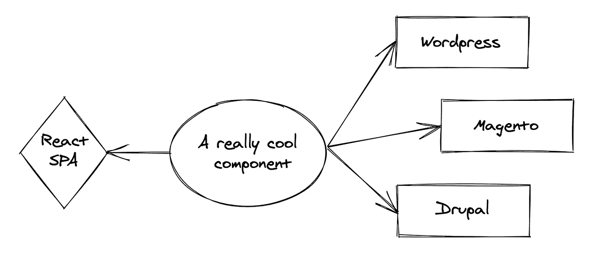
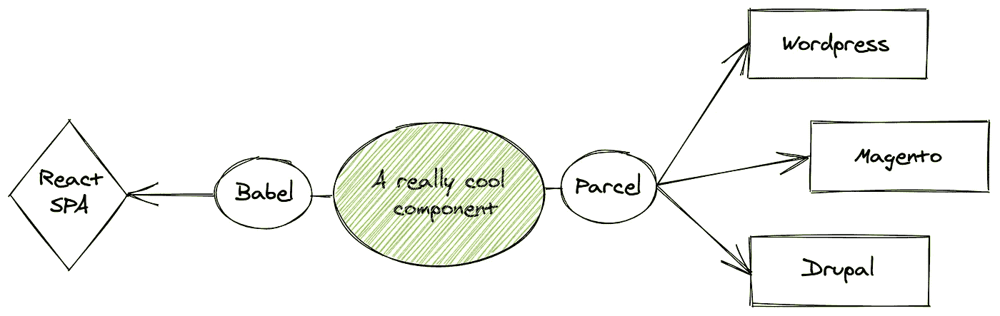
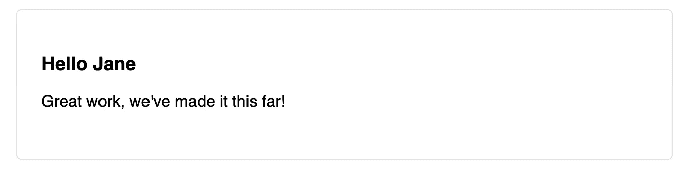
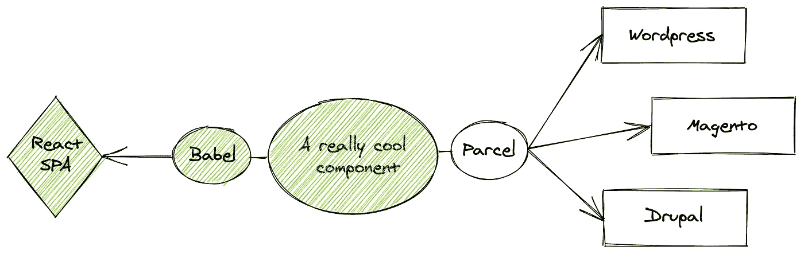
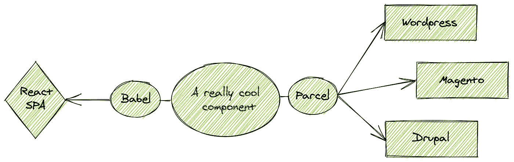
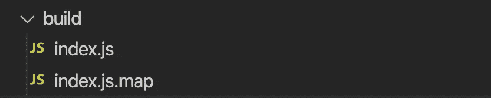

# 用 ParcelJS 搭建绿地和棕色地块应用的桥梁

> 原文：<https://itnext.io/bridging-green-and-brownfield-apps-with-parceljs-ed3b287083cd?source=collection_archive---------5----------------------->


web 开发最棒的事情之一是它发展的速度，这也是它最大的痛点:拥有代码库的棕色地带是很难的。

在某些时候，你必须在某些时候做出选择；

a)把一切都折射成艺术的状态
B)在丹·阿布拉莫夫没有谈到的东西中定居和发展。

有一个非常棒的中间地带——让我们来谈谈吧！

# 啊？什么？嗯怎么做？

首先让我们谈谈我们想要达到的目标

为了支持我们的旧代码库，我们希望创建一些可以无缝使用的东西，既可以用在你的最新闪亮部分，也可以用在你的旧代码库中。



a)首先编写一个新的超级酷的组件
b)使用 Babel 将该组件编译成一个 ES6 模块，我们可以在 SPA 中将其用作导入
c)使用 ParcelJS 编译一个通用模块定义(UMD ),可以在任何旧代码库中使用。

你可能已经非常了解 UMD 了 jQuery 就是一个很好的例子，你可以通过添加一个`<script src="path/to/jquery.js">`标签来实现它，这个标签会注册一个全局变量`$`,并附带一些函数

```
$("button.continue").html("Next Step…")
```

幸运的是，这很容易用 [ParcelJS](https://parceljs.org/) 来设置。ParcelJS 是一个零配置捆绑器，它总是需要一点配置——但稍后会有更多的配置！

## Web 组件荣誉奖

我想简单提一下试图解决和标准化这个问题的 Web 组件。虽然它确实非常有趣，但是它也有一些缺点，比如浏览器支持和一般的复杂性。这里有一个链接到[了解更多关于他们的](https://www.webcomponents.org/introduction)。

# 说够了，让我们开始编码吧！



让我们首先用[https://createapp.dev/parcel](https://createapp.dev/parcel)创建一个反应地块项目

然后添加一个非常酷的组件

让我们通过在控制台运行`npm start`来点燃这个坏男孩



相当酷。

## **构建 ES 模块的时间**



对于我们的 SPA，我们需要一个常规的 ES 模块，因此我们可以像这样导入它:

```
import ReallyCoolComponent from 'really-cool-component' 
```

从安装一些东西开始

```
npm i save-dev [@babel/cli](http://twitter.com/babel/cli) [@babel/preset-typescript](http://twitter.com/babel/preset-typescript)
```

然后在 package.json 中添加一个额外的脚本

```
"build-es": "babel src — out-dir lib — extensions \".ts,.tsx\" — source-maps inline"
```

这将使用 babel 将您喜欢的类型脚本文件转换成可以由您的 spa 导入的常规 javascript。最后把你的“主要”改成:

```
main: "lib/index.js"
```

这将使新传输的文件成为 npm 包的入口点。最终的`package.json`可能是这样的:

就这样，现在您已经准备好将库发布到 npm，并将其作为常规的 ES6 模块使用🔥

## **构建 UMD 并在 CMS 中运行它**

最后一步是使用 Parcel 生成一个我们可以在任何旧代码库中使用的 UMD。



首先将我们的`index.tsx`改为

Parcel 接受在入口文件中导出的任何函数，并在 package.json 中定义的全局变量中公开它。

```
"build-umd": "parcel build src/index.tsx — global coolComponentName — out-dir build"
```

运行此命令会产生两个新文件:



在像 [Zeit 这样的地方举办这个活动之后。现在](https://zeit.co/)或 [Netlify](https://www.netlify.com/) 您已经准备好在您正在使用的 CMS 中运行您的组件了:

coolComponentName 是您在 package.json 脚本部分中定义的名称

不要担心，如果你在这个过程中错过了什么，我已经把完整的项目上传到这里的 [GitHub](https://github.com/icew1nd/umdparcelexample) 。

# 最后几句话

在现代网络开发中，将绿地项目与棕色地块应用联系起来正成为一个越来越大的问题，而且随着技术的快速发展和公司的成熟，这个问题只会越来越严重。虽然这种方法肯定不是唯一的，但它是处理非常复杂的事情的一种相当简单和直接的方法

如果你有类似的问题，我很乐意在评论中听到你的想法！💚

# 进一步阅读

*   [ParcelJS 的入门指南](https://parceljs.org/getting_started.html)
*   [发布 npm 包](https://zellwk.com/blog/publish-to-npm/)
*   [部署到 Zeit。现在](https://zeit.co/docs)
*   [UMD 格式](https://github.com/umdjs/umd)
*   [巴别-CLI 文档](https://babeljs.io/docs/en/6.26.3/babel-cli)
*   [Web 组件入门](https://www.webcomponents.org/introduction)

👋嘿！我是 Thomas kjr-Rasmussen，一个喜欢写有趣的科技事物的人。如果你有任何问题、评论或其他任何事情，请在[推特](https://twitter.com/ThomasR______)或以下联系我！