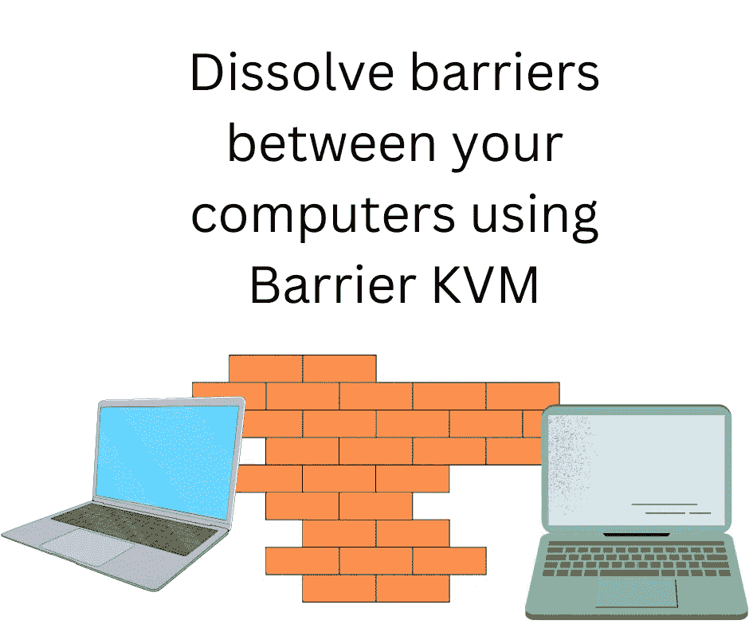
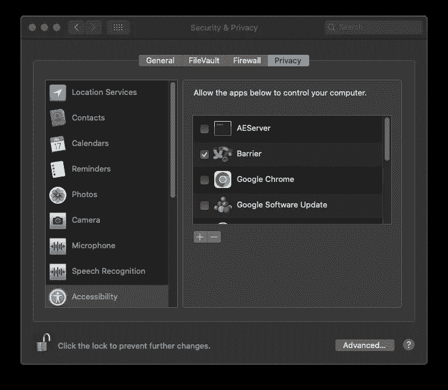
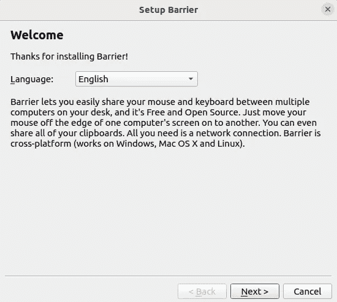
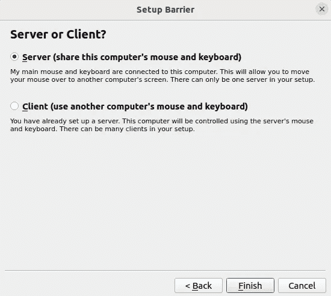
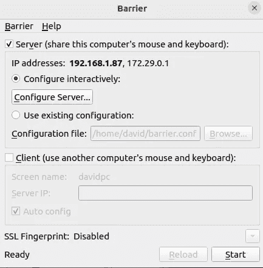
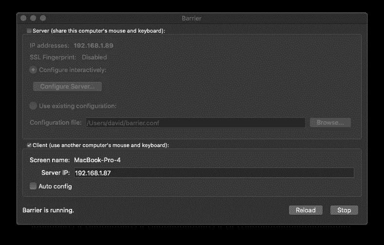
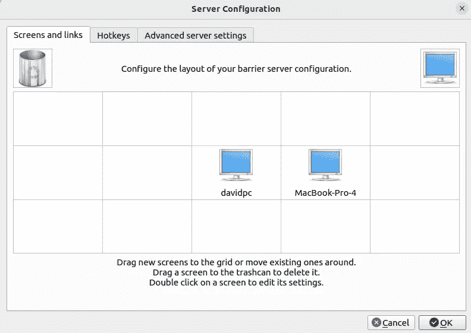
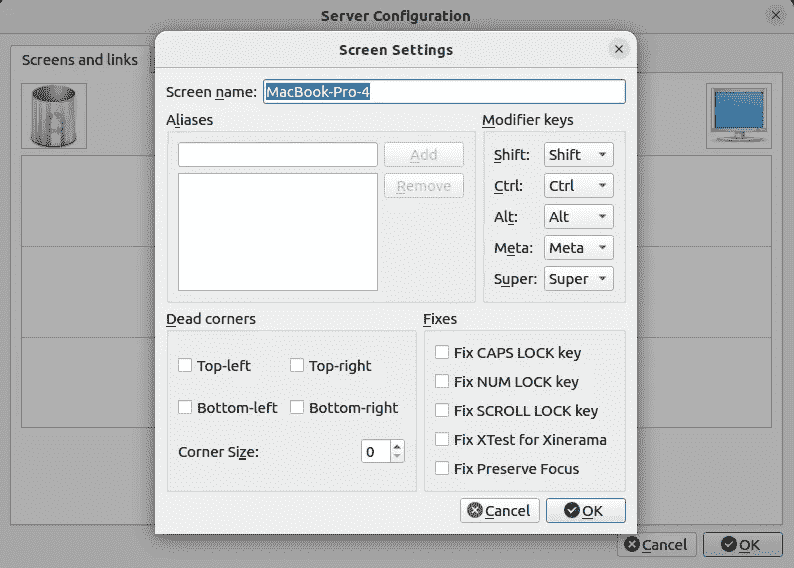
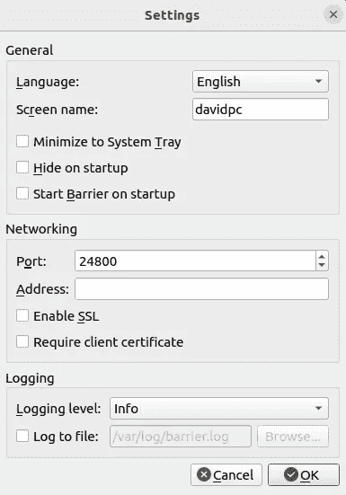

# 安装 Barrier KVM，让您的办公桌焕然一新

> 原文：<https://itnext.io/bring-sanity-to-your-desk-by-installing-the-barrier-kvm-4df3f2026306?source=collection_archive---------0----------------------->

## LINUX 桌面

## 拥有多台电脑很棒，除了处理多种键盘和鼠标。屏障是易于使用和安装的软件伪 KVM 控制多台计算机从一个键盘/鼠标。



作者图片

我们有时需要同时使用多台电脑。想想在电影《T2》《黑客帝国》T3 中，尼奥终于见到了建筑师。他在这间狭小的办公室里，无数的信息屏幕连接着一切。当然，我们大多数人不会同时使用那么多电脑，但是你应该明白。也许你的家庭工作区有一台公司提供的笔记本电脑用于远程工作，加上你的个人电脑，还有一台电脑用于你的兼职工作。那是三台电脑，对吗？

就我而言，我有一台英特尔 NUC (Ubuntu)，一台运行 Ubuntu 的笔记本电脑和一台运行 macOS 的 MacBook Pro。我可以很容易地同时使用它们，但我想保持一个活跃的键盘和鼠标。

我们中的许多人都面临着同样的问题，现有的硬件设备可以解决这个问题。

我多年来一直使用的是一个可以被称为*的 USB 开关选择器*，至少那是

[我在亚马逊上找到的产品名称](https://www.amazon.com/Selector-Switcher-Computers-Keyboard-Controller/dp/B09W94MP9D?keywords=keyboard%20mouse%20switch%204%20computers&qid=1665725694&qu=eyJxc2MiOiIzLjYwIiwicXNhIjoiMi42MSIsInFzcCI6IjEuMzAifQ%3D%3D&sprefix=keyboard%20mouse%20switch%2Caps%2C215&sr=8-21&linkCode=ll1&tag=thereikipage&linkId=3125ae1650e4fb485049590e43dc8e7a&language=en_US&ref_=as_li_ss_tl)(赞助商)，但我的设备自称为 *USB 4 端口开关*。我将 USB 设备连接到输入端口，以便连接键盘和鼠标。有四个 USB 输出端口，最多可连接四台电脑。按下设备上的按钮在这些计算机之间进行选择，并将我的 USB 集线器连接到选定的计算机。

换句话说，您可以在多达四台电脑之间快速切换键盘/鼠标。

KVM 是一种类似类型的设备，其中 KVM 代表*键盘、视频和鼠标* ( [浏览 KVM 设备示例](https://www.amazon.com/s?k=keyboard%20video%20mouse%20switch&crid=PEPON735O8T3&sprefix=keyboard%20video%20mouse%20switch%2Caps%2C193&linkCode=ll2&tag=thereikipage&linkId=5b03bd80c5d6d78ccd748ffad341acdf&language=en_US&ref_=as_li_ss_tl) —赞助商)。硬件 KVM 与虚拟化软件使用的 Linux 中的 KVM 特性没有任何关系，但是因为具有相同的缩写会在它们之间产生混淆。它们类似于刚才描述的 USB 开关，但也支持切换视频信号。换句话说，输入端是视频和 USB 两个端口，输出端是几对视频和 USB 端口。连接视频电缆和 USB 电缆，然后按下盒子上的开关，在连接的电脑之间进行选择。

我非常喜欢 USB 开关，但有一点需要注意——记住哪个选项对应哪个计算机。NUC 在 3 号端口还是 4 号端口？但另一个问题是，当您在一台计算机上有数据，而您只是想复制并粘贴到另一台计算机上时，该怎么办？也许这是第一世界的问题，因为数据可以相当容易地保存到一个文件中，然后通过局域网传输到另一台计算机，但是能够在计算机之间直接复制/粘贴更方便。

一个相关的问题是 HDMI 的硬件 KVM 非常昂贵。现代电脑显示器都是 HDMI 或者 DisplayPort。

幸运的是，开源世界有一个很棒的软件解决方案。

# 障碍—消除障碍的软件 KVM 解决方案

屏障产品是模拟 KVM 交换机功能的软件。正如我上面所说，这通常需要一个硬件，可能非常昂贵。在软件中，Barrier 将几台计算机显示器配置成一个大型虚拟显示器，分布在多台计算机上。您的鼠标可以自由地从一台计算机漫游到另一台计算机，并且键盘交互发生在您的鼠标所指向的计算机上。

这比 USB 或 KVM 开关更好，因为您可以轻松地将鼠标指针从一台计算机移动到另一台计算机。此外，它还处理计算机之间的复制/粘贴。

这需要在您希望与之交互的每台计算机上安装屏障软件。

您将在您的一台计算机上使用键盘/鼠标。安装在那台电脑上的屏障将被称为*服务器*。其他计算机将被配置为屏障*客户端*。

该软件可从[https://github.com/debauchee/barrier](https://github.com/debauchee/barrier)获得

顺便说一句——为了将这个 URL 粘贴到本文中，我在另一台计算机上使用了一个 web 浏览器来读取 Barrier GitHub 库。我只是把鼠标移到那台笔记本电脑上，按 COMMAND-C (macOS)来复制网址。然后，我将鼠标移回包含编辑器的计算机屏幕，在编辑器窗口中单击，然后键入 CONTROL-V (Linux)将 URL 粘贴到编辑器中。它又快又简单，我可以想象我会越来越喜欢这个软件。

当我说“把鼠标移到那台笔记本电脑上”的时候，我就是这么做的。键盘/鼠标连接到 Ubuntu 笔记本电脑，并将鼠标指针移过屏幕边缘，移到 macOS 笔记本电脑的屏幕上。是那种液体。

Barrier 有一个限制，因为它不是硬件 KVM 设备。它不支持与尚未启动的计算机进行交互。相反，它需要运行 Barrier 客户端，这意味着操作系统运行良好，足以启动应用程序。如果您必须与启动过程进行交互，那么您需要一个硬件 KVM 解决方案。

# 安装屏障软件

对于 Windows 和 macOS，建议转到 GitHub 存储库，点击 Releases 链接。导航到最新版本——在我写这篇文章的时候是 v 2 . 4 . 0——你会找到 Windows 的 EXE 安装程序和 macOS 的 DMG 软件包。因为您可能是一个有经验的计算机用户，所以您知道在 Windows 上双击 EXE 来运行安装程序，在 macOS 上双击 DMG 来浏览其内容，然后将应用程序拖到 Applications 文件夹中。

然而，在 Windows 和 macOS 上都有一个替代方案。在 macOS 上，我在 MacPorts 找到了 Barrier，在 Windows 上，我在 Chocolatey 找到了它。两者都是软件包管理系统，允许在各自的系统上安装开源软件。

对于 Linux，你可能会在你喜欢的发行版的包管理系统中发现障碍。

在我的 Ubuntu 笔记本电脑上，我简单地输入了这个:

```
$ sudo apt-get install barrier
```

Barrier 网站上有每个发行版的包名列表。

# 为两台或多台计算机配置屏障

设置障碍很容易，但我发现它不直观，而且有几个障碍需要克服。

在 macOS 上，屏障包没有正确签名。因此，当你第一次双击 Barrier 应用程序时，你会被告知 macOS 不信任它，它会将该应用程序移到垃圾箱。不要那样做。相反，右键单击屏障图标，然后选择打开。您将看到一个类似的对话框，但这次它将有一个打开按钮。点击打开按钮，屏障将启动。一旦你做到了这一点，macOS 将在未来推出 Barrier。

一旦你在 macOS 上启动 Barrier，你将被要求给它辅助功能权限。



作者图片

要对此进行配置，请单击底部的锁图标并输入您的密码。然后，选择列表中 Barrier 旁边的复选框。

我没有在 Windows 上安装 Barrier，不知道是否需要任何特殊设置。在 Linux 上，不需要特殊的设置。

在每台计算机上，启动 Barrier 应用程序。您将首先看到一个如下所示的窗口:



作者图片

该屏幕为您提供了一个概述，并让您选择语言。准备好后点击*下一个*。

您看到的下一个窗口如下所示:



作者图片

正如它所解释的那样，*服务器*是键盘和鼠标所连接的计算机，*客户端*在所有其他计算机上。

在我的例子中，键盘/鼠标连接到 Ubuntu 笔记本电脑，因此它被声明为服务器，而 macOS 笔记本电脑是客户端。



作者图片

下一个屏幕将是这样的。但是，您将为服务器或客户端计算机配置不同的屏幕。

这个特例是针对服务器的，我的 Ubuntu 笔记本电脑。记下显示的 IP 地址。暂时不要点击*开始*按钮。

在客户端电脑上，您会看到以下版本的窗口:



作者图片

记下 IP 地址和屏幕名称。您需要在服务器计算机上恢复屏幕名称。现在，确保选中客户端部分，不要选择*自动配置*。相反，请输入服务器的 IP 地址，如下所示。暂时不要点击*开始*按钮。

配置完客户端电脑后，返回到服务器电脑。点击*配置*按钮，将显示该窗口。



作者图片

最初，唯一显示的图标是用于服务器窗口的。要获得其他图标，请将右上角的计算机图标向下拖动到网格中的一个框中。

网格设置每台计算机上每台显示器的相对屏幕位置。



作者图片

双击刚刚添加的图标，打开此窗口。

所需的步骤是输入屏幕名称，如下所示。如果你想改变键映射，还有其他的设置。

点击*确定*保存该配置，然后在地图窗口点击*确定*，你将返回主窗口。

对您希望使用 Barrier 控制的每台计算机重复客户端设置。

此时，您可以单击开始按钮

理想情况下，它会自动启动，一切都会正常运行。

在我的例子中，它没有启动，在 macOS 客户端上，日志包含以下消息:

```
[2022-10-13T22:19:39] INFO: OpenSSL 1.1.1g  21 Apr 2020
[2022-10-13T22:19:39] ERROR: ssl error occurred (system call failure)
[2022-10-13T22:19:39] ERROR: failed to connect secure socket
```

在栅栏用户界面中查看日志搜索菜单，并选择*显示日志*。该日志包含如下有用的状态消息。

在这种情况下，它表示无法使用 SSL 连接进行连接。Hurm..

经过一番搜索，发现 Barrier 可以在计算机之间使用 SSL 连接。这对于安全性来说是一个很好的主意，因为 SSL 可以确保数据被加密。如果你和其他人共享一个网络——比如在办公室环境中——加密屏障服务器和客户端进程之间的连接是一个很好的主意。

这里的 *ssl 错误*失败意味着 ssl 证书没有设置。一个快速/简单的解决方法是禁用 SSL。



作者图片

您可以关闭 SSL 支持，如下所示。请确定它在所有电脑上都已关闭。

你会在找到*显示日志*的同一菜单中找到*设置*选项。点击它进入这个对话框。

这个问题是一个障碍。难道它不应该提供一种生成 SSL 证书的方法吗？屏障库不应该包含关于生成 SSL 证书的文档吗？我确信有一个简单的命令可以使用`openssl`包中的一个命令来运行，但是我不知道那是什么，你们大多数阅读这篇文章的人也不知道。

# 使用 macOS 和 Linux 之间的屏障

我无法在 Windows 上测试使用情况，因为我的 Windows 笔记本电脑是双重启动到 Ubuntu 的，我只在 Ubuntu 上使用它。因此，我不能对 Windows 上的使用发表评论。

要尝试的场景:

*   将鼠标从一台计算机移动到另一台计算机，享受自由
*   在电脑上的应用程序中键入文本
*   在您的电脑之间复制/粘贴文本
*   将文件从一台电脑拖到另一台电脑

我能够轻松地完成前三个实验。但是，最后一条不行。

在“配置服务器”窗口中，您会发现一个标签为*高级服务器设置*的选项卡。有几个有趣的设置，包括一个允许拖放文件的设置。我选择了这个，但是文件的拖放不起作用。

相反，在 macOS 笔记本电脑上，我启用了*文件共享*，并选择了 *Public* 文件夹作为共享目录。该目录可以很容易地安装在 Ubuntu 笔记本电脑上，然后它将作为一个地方将文件从一台计算机传递到另一台计算机。

另一个问题是，macOS 笔记本电脑上的鼠标控制有几次出现了问题。每次我走到 macOS 机器的主屏障窗口，点击*重新加载*按钮。这样做后，老鼠开始表现正常。

最后一个问题与通过窗口跳转的 COMMAND-TAB 有关。在 Ubuntu 上，ALT-TAB 和 COMMAND-TAB 都用于在窗口中切换，而在 macOS 上则使用 COMMAND-TAB。我用的是带命令键的苹果键盘。我相信在 WINDOWS 键盘上，Windows 键也有同样的功能。

记住我的服务器是 Ubuntu 笔记本电脑。预期是当鼠标在 macOS 屏幕上时，COMMAND-TAB 将导致 macOS 屏幕上的窗口切换。相反，窗口切换发生在 Ubuntu 屏幕上。Barrier 中可能有一个设置来解决这个问题，但我还不明白关键的映射内容。

# 摘要

Barrier 是一款易于安装和设置的开源软件，用于控制多台计算机的键盘/鼠标。它运行良好，功能良好。但是有一些粗糙的地方，其中一些我在上面提到过。

我之前没有提到的一个问题是，必须手动设置 Barrier 客户端和服务器之间的连接，这看起来是不是太繁琐了？客户端不应该自动发现服务器吗？

将图标拖到网格中并在配置对话框中键入客户端计算机的屏幕名称并不难。因此，抱怨手动设置有点像第一世界的问题。相反，我应该关注使用 Barrier 的乐趣，而不是像这样相对次要的问题。

但是，真的，自动发现？拜托了。

底线是 Barrier 是一个强烈推荐的控制多台计算机的应用程序。最终结果是你不需要多个键盘/鼠标，因为一个键盘/鼠标就足够了。算是吧。在设置过程中，你可能需要一个额外的键盘/鼠标，但这是不可避免的。让我们转而关注使用 Barrier 的乐趣，将鼠标从一个计算机屏幕自然地移动到另一个屏幕的自由，以及轻松地来回复制东西，就好像你的几台计算机是一个统一的计算环境一样。

*最初发表于*[*【https://techsparx.com】*](https://techsparx.com/linux/tools/barrier.html)*。*

## 关于作者


[***大卫·赫伦***](https://davidherron.com/)**:大卫·赫伦是一位专注于技术明智使用的作家和软件工程师。他对太阳能、风能和电动汽车等清洁能源技术特别感兴趣。David 在硅谷从事了近 30 年的软件工作，从电子邮件系统到视频流，再到 Java 编程语言，他已经出版了几本关于 Node.js 编程和电动汽车的书籍。**