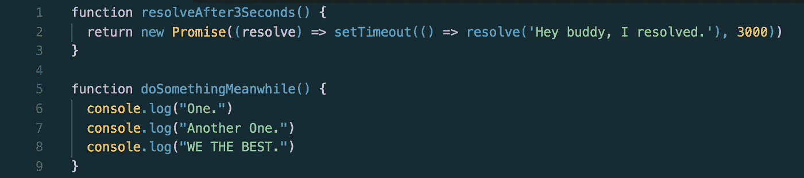
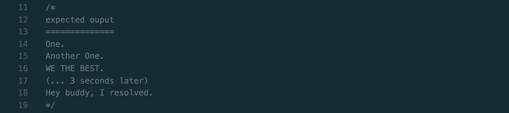
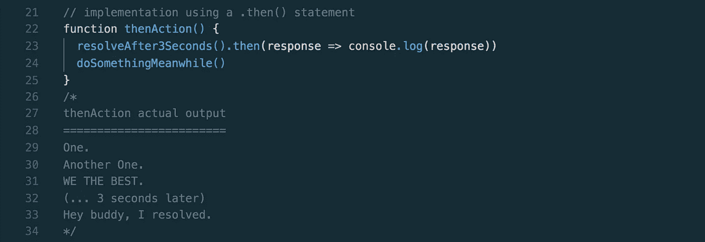
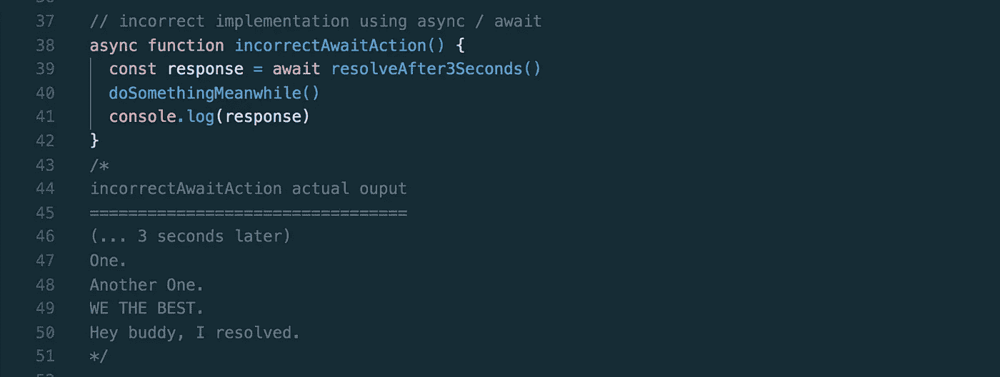
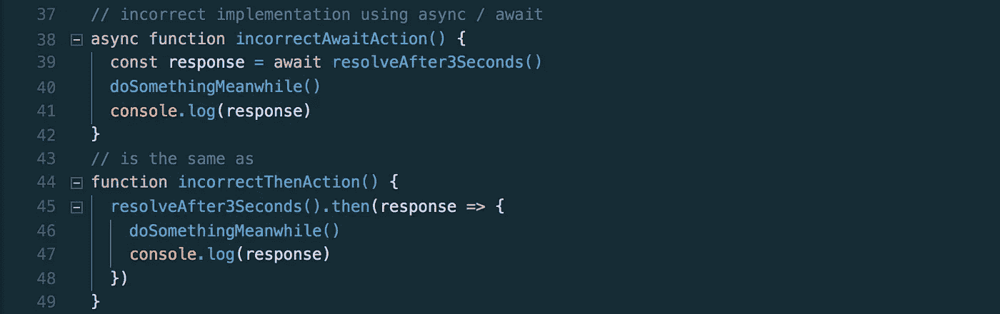
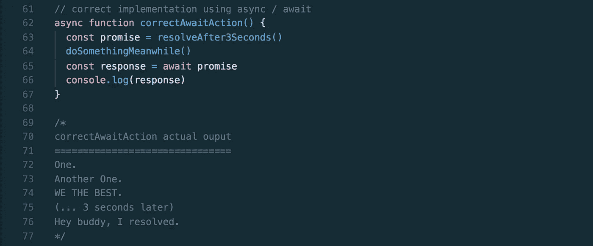

# 失信…

> 原文：<https://itnext.io/broken-promises-85331b22c4d3?source=collection_archive---------4----------------------->

一个关于我如何错误使用 javascript 的`async / await`的悲伤故事。

[觉吞](https://unsplash.com/photos/4wQ6Y-jyeME?utm_source=unsplash&utm_medium=referral&utm_content=creditCopyText)在 [Unsplash](https://unsplash.com/search/photos/broken?utm_source=unsplash&utm_medium=referral&utm_content=creditCopyText) 上拍摄的照片

[*点击这里在 LinkedIn*](https://www.linkedin.com/cws/share?url=https%3A%2F%2Fitnext.io%2Fbroken-promises-85331b22c4d3) 上分享这篇文章

我记得当我第一次学习 javascript 时，遇到了异步代码和承诺；我在使用承诺链的过程中跌跌撞撞——首先将所有事情放入一个`then()`语句中，然后学习如何将工作划分到多个`.then()`语句中。

`.then()`我了解了`async / await`。我喜欢语法让一切看起来都是同步的方式，我发现这更容易推理。所以后来我开始到处用`async / await` 。我在等待所有的事情。

但那是个错误。

直到最近我和一个朋友聊天，他指出来，我才完全明白`async / await`到底是怎么工作的。

因此，我在这里分享我学到的东西，以防你自己遇到这个问题——你可以想到我，以及你是如何阅读这篇文章的，它可能会有所帮助。

**我们将通过比较** `**then()**` **和** `**async / await.**`来了解一些异步的东西，以及如何实现我们的目标

我们有一个异步函数，它返回一个在 3 秒钟后解析的承诺，还有一个函数，它在我们等待我们的承诺解析时做一些事情:

我们的两个功能

这是我们的预期输出:

预期产出

不如我们先用一个`.then()`语句来解决这个问题。我是这样做的:

使用。然后()

# 这个管用！

我们调用`resolveAfter3Seconds`并继续`doSomethingMeanwhile()`。3 秒钟后，`.then()`语句执行并安慰我们的`response`。耶。

现在，让我们试着用`async / await`重写这段代码。我将首先向您展示我的**错误实现**，这样您就可以看到我做错了什么。这不是我们寻求的解决方案。

下面是使用`async / await`的**错误实现**:

这是不对的。不要这样。

# 啊哦。

这是怎么回事？我们的`doSomethingMeanwhile()`函数在我们的承诺兑现之前不会被调用。

嗯……原来`async / await`就是这么运作的。我们将等待`resolveAfter3Seconds()`的回应，然后我们将继续进行。

这与我们的第一个实现不同，因为在第一个例子中，我们没有暂停代码的执行…我们能够继续前进，并在响应返回时记录响应。

# 比较

让我们通过重写我们的`incorrectAwaitAction()`来进行比较，使用一个`then()`语句，这样你就可以看到真正发生了什么。这可能更容易理解为什么我们的第一个例子和这个例子是不等价的。

比较等待和然后

如您所见，这就是`async / await`在这个实现中的表现。希望这能更清楚地说明为什么我们的前两个例子是不等价的！

# 包扎

这留给我们最后一个问题，我们如何使用`async / await` 语法？这是我想到的。很想知道你是否知道更好的方法。

await 的工作示例

# 下次见！

> 嘿！我是[法拉兹](https://twitter.com/farazamiruddin)。
> 
> 我是一名软件工程师，也是@ [SHOgigs](https://www.shogigs.com) 的联合创始人。
> 
> 我写自己感兴趣的东西，目前包括 react、react native、javascript、篮球、生活、电影、篮球。
> 
> 如果你喜欢这篇文章，请推荐并分享！
> 
> 感谢阅读。