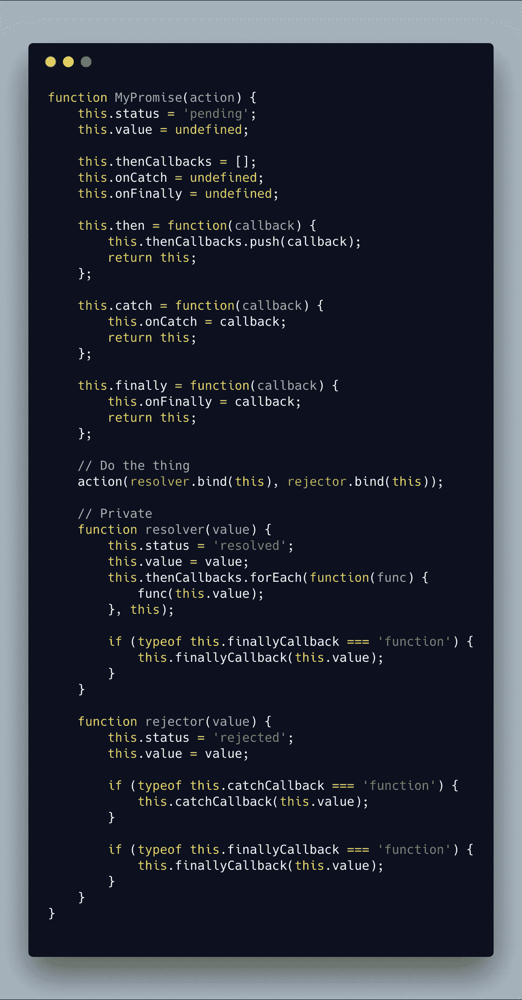
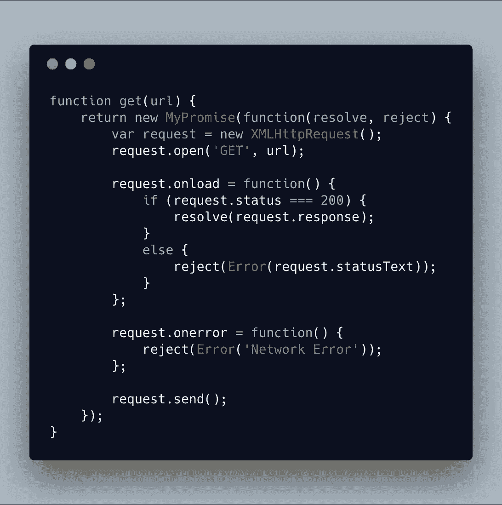
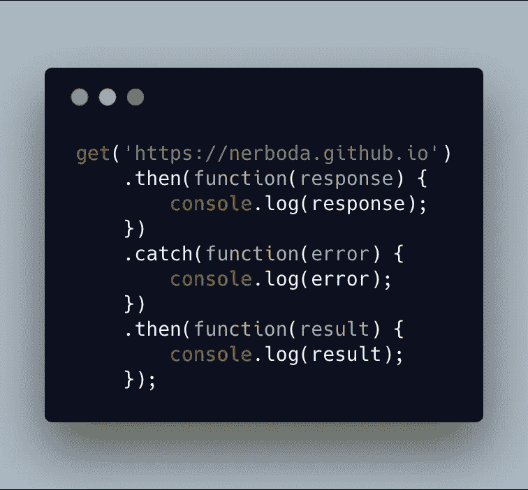

# 破碎的承诺:从零开始构建 JavaScript 承诺

> 原文：<https://itnext.io/broken-promises-a-barely-working-implementation-of-js-promises-ed7f99071f54?source=collection_archive---------1----------------------->

标题中破碎的承诺部分实际上指的是我放弃的周末计划，为了呆在家里深入研究 Javascript 承诺的内部。您在下面看到的是 Javascript Promises 的一个有限但有效的实现，以及一个模仿的 fetch API(名为`get`)来证明它是有效的。

首先，快速回顾一下什么是承诺，承诺有什么作用。

**编辑:** [**詹姆斯·布朗宁**](https://medium.com/u/a4951bc68f93?source=post_page-----ed7f99071f54--------------------------------) **在评论中指出，我的承诺版本在一些重要方面有所欠缺。建议看看他的评论。**

# 承诺

用最简单的话来说，Promise 允许您异步运行一些代码(不阻塞程序其余部分的执行)，然后在代码完成后运行其他代码，并依赖于结果(无论是失败还是成功)。

更重要的是，它避免了 JS 开发人员多年来所说的“回调地狱”。

## 术语

我在上面使用了“完成”、“失败”和“成功”这些词，但这些并不是承诺实际使用的术语。而是分别使用“已解决”、“已拒绝”和“已解决”等词。在承诺“解决”之前，它被称为“待定”。

## 承诺建造者

承诺是使用构造器模式创建的。Promise 构造函数采用 1 个参数，该函数具有以下签名:

`function(**resolveCallback**, **rejectCallback**)`

*   resolveCallback —承诺解决时要调用的函数。
*   rejectCallback —承诺被拒绝时调用的函数。

*注:有关构建传递给构造函数的函数体的详细信息，请参见下面的* ***使用承诺*** *一节。*

构造函数返回一个 Promise 对象，该对象跟踪它的状态(status ),并且只能处理一次。这意味着 resolver 和 rejector 功能一起只能接收一个呼叫，并且状态不能从 resolved 更改为 rejected，反之亦然。

## 界面

Promises 实现了**enable**接口(实际上我相信他们是这个术语的创始人)，这仅仅意味着你可以在它们完成后调用`then`来运行代码。

`**then**` **:功能**

*   接受解析时调用的回调。
*   回调应该接受一个参数，即解析器返回的值。
*   返回自身，以便可以链接方法。

他们还公开了一个`catch`方法，该方法类似于`then`,只是它只在 promise 拒绝时运行。

`**catch**` **:功能**

*   接受拒绝时调用的回调。
*   回调应该有一个参数，即 rejector 返回的值。
*   返回自身，以便可以链接方法。

最后，它们公开了一个`finally`方法，该方法在承诺解决之后被调用，并且`then`或`catch`回调被调用，不管它是拒绝还是解决。

`**finally**` **:功能**

*   等待承诺完成并等待`then`或`catch`回调运行。
*   无论如何都要调用回调。

## 我的实现

my promise——JS Promises 的准系统实现

## 利用承诺

如果你是一名 javascript 开发人员，你会意识到承诺，并且在使用类似于`fetch` API 的东西时，你几乎肯定会从中受益。然而，不太可能的是，您已经直接创建了一个。让我们改变这一点。

如上所述，Promise 构造函数接受一个参数，这个函数本身接受两个回调函数。该函数的内部逻辑是重要的部分，该逻辑是:什么时候应该调用`resolve`回调，什么时候应该调用`reject`回调。

让我们看看如何使用`MyPromise`来实现这一点(这将与使用 Javascript 提供的原生 Promise 没有什么不同)。

get——一个使用 MyPromise 的模仿获取 API

理解我在这里做什么应该很简单:我定义了一个 XMLHttpRequest 对象，并给它附加了几个事件侦听器。如果响应的状态为 200，我将它传递给`resolve`回调，否则它的状态将在一个错误对象中传递给`reject`。如果请求本身抛出一个错误，我会将一个带有消息“网络错误”的错误传递给`reject`。

让我们来测试一下。

快看，这东西能用！

我写这篇博文主要是为了提高我自己对 JS Promises 内部的理解，但我希望它对你也有帮助。如果我遗漏了什么重要的东西或者使用了误导性的术语，请告诉我。

感谢阅读！