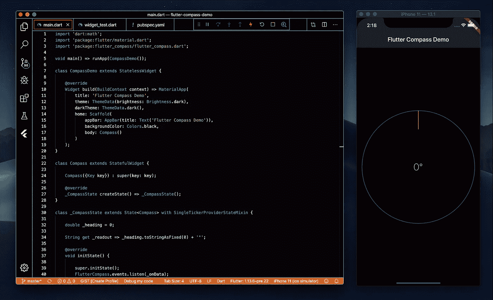
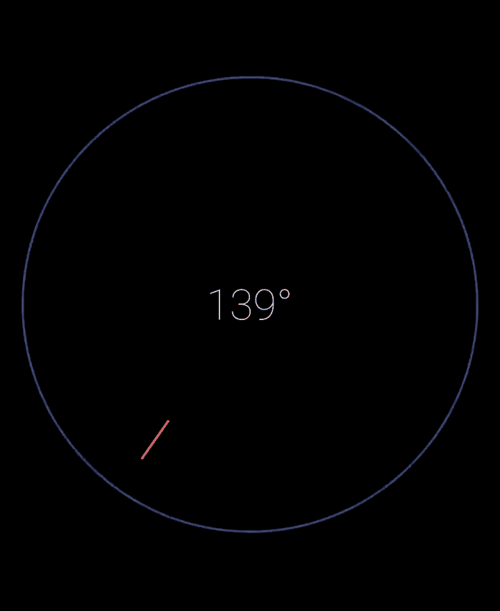

# 在 Flutter 中构建一个指南针应用程序

> 原文：<https://itnext.io/build-a-compass-app-in-flutter-b49a78aa951d?source=collection_archive---------2----------------------->

## 如何用 Dart 和 Flutter 构建一个简单的指南针 App

模拟器上指南针应用程序的屏幕截图，0 度(N)

## 介绍

在本文中，我们将看看一个用 Flutter 构建的基本 compass 应用程序，这是一个用于跨平台 UI/UX 开发的流行 SDK。Flutter 为快速原型化新概念和想法，以及将这些原型转化为可靠的生产就绪组件和应用程序提供了强大的功能。

如果你还没有 Flutter SDK，从他们的[安装页面](https://flutter.dev/docs/get-started/install)为你的操作系统抓取一个副本。这个项目的源代码可以从 Github 库获得。

## 项目设置

项目配置包含在标准 **pubspec.yaml** 中:

对于这个项目，导入了 [flutter_compass](https://pub.dev/packages/flutter_compass) 包，这是一个简单的插件，带有返回 0 到 360°方向的事件流。这些数据将被捕获并用于旋转指南针，使其始终指向北方。

## 主应用程序文件

这个简单应用程序的完整源代码可以在 [lib/main.dart](https://gist.github.com/kenreilly/9da1b3a71cded9b21db40855fd7d212e) 中找到:

Dart 数学库和`flutter_compass`包一起被导入。`CompassDemo`类构建了一个带有标准标题、主题和主屏幕的`MaterialApp`，它由一个带有`AppBar`的`Scaffold`和一个作为主体的`Compass`小部件的实例组成。

Compass 类本身是一个 [StatefulWidget](https://api.flutter.dev/flutter/widgets/StatefulWidget-class.html) 的实现，这个 Widget 可以保留可变的[状态](https://api.flutter.dev/flutter/widgets/State-class.html)数据。这个 compass 类的 state 有一个`_heading`属性和一个用于`readout`的访问器，它以度数格式的字符串形式返回航向。`initState`方法在罗盘插件上设置了一个事件监听器，当航向改变时(即用户移动和罗盘角度改变)会调用这个监听器。当插件事件处理程序用新值调用`onData`时，`setState`被调用来更新标题并触发组件 UI 的重绘。

使用`_style` 属性上的`TextStyle`设置读数的样式，小部件的`build`方法返回一个 [CustomPaint](https://www.google.com/search?client=safari&rls=en&q=dart+custompaint&ie=UTF-8&oe=UTF-8) 对象，该对象将使用`CompassPainter`作为前景绘制器来呈现标题的文本读数，以及圆规和指针。

`CompassPainter`类是`CustomPainter`的一个实现，它接受一个`angle`参数并计算要应用于指南针的旋转(以弧度为单位)。_brush 访问器返回一个新的 Paint 对象，该对象用作要扩展的默认画笔。`paint`方法为`circle`和`needle`定义画笔对象，然后计算`radius, center, start,`和`end`值。应用一个`translate`函数来居中旋转偏移，然后应用一个`rotate`函数来匹配上面定义的`rotation`值。使用`drawLine`和`drawCircle`绘制罗盘“外壳”和“指针”,这将在旋转的画布上绘制这些内容，使指针指向磁北。

## 结论

Flutter 是一个很棒的 SDK，用于构建各种跨平台的应用程序，这些应用程序利用设备硬件来获得丰富的交互体验。这个演示应用程序展示了在一个 Dart 文件中创建基本的事件驱动的 UX 是多么容易。

感谢您的阅读，祝您的下一个颤振项目好运！

> 肯尼斯·雷利(8 位黑客)是 LevelUP 的首席技术官