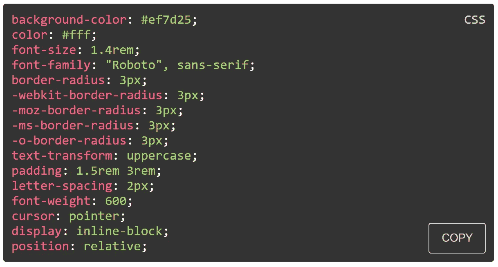

# 用 React 和 Styled 组件构建 CSS 语法荧光笔

> 原文：<https://itnext.io/build-a-css-syntax-highlighter-with-react-and-styled-components-75121d07605b?source=collection_archive---------8----------------------->

我最近用 GatsbyJS 创建了一个风格指南，需要提供 CSS 块作为例子。我想块有语法突出，易于阅读，并有一个快速复制功能，为那些使用指南。我找不到一个具有我需要的所有特性的组件，所以我决定用[风格的组件](https://www.styled-components.com/)来制作自己的组件。

完成的组件可以在这个 Gist 中找到:[https://Gist . github . com/to managle/4c 2 ffaa 2 b 2 aeffc 020 f 7 fa 7 EB 7 ba 6 fa 7](https://gist.github.com/tomanagle/4c2ffaa2b2aeffc020f7fa7eb7ba6fa7)

该组件将接受一个 CSS 字符串，分割它，遍历它，并为每个片段添加样式化的包装。

一行 CSS 有四个部分:规则(宽度、字体大小、边距等)、冒号分隔符(:)、值和结束符(；).

第一步是检查渲染道具是否是字符串类型，我们可以用下面的函数来完成。

下一步是分裂和地图功能。

四个部分中的每一个都应该单独包装和设计。这是我使用样式组件的地方，但是您可以使用任何您喜欢的样式模块。

map 函数输出包装在其组件中的每个段，后跟一个 break 标记。

复制按钮创建了一个文本区域，将渲染属性值放入文本区域，选择文本区域的值，复制该值并从 DOM 中移除文本区域。

我还为复制按钮创建了一个样式化的组件。

为了安全起见，我将输出函数包装在一个 try-catch 中，这样，如果用户错误地使用了组件，我可以向用户输出一个适当的错误，或者我可以针对不同的用例调整组件。

完成后，整个组件将如下所示:

要使用该组件，请将您的 CSS 包装在新的 CSS 组件中。

## 🌎让我们保持联系

[在 YouTube 上订阅](https://www.youtube.com/TomDoesTech)
[不和](https://discord.gg/4ae2Esm6P7)
[推特](https://twitter.com/tomdoes_tech)
[抖音](https://www.tiktok.com/@tomdoestech)
[脸书](https://www.facebook.com/tomdoestech)
[insta gram](https://www.instagram.com/tomdoestech)
[给我买杯咖啡](https://www.buymeacoffee.com/tomn)