# 用 OutSystems 为 Microsoft Outlook 构建一个 DeepL 翻译插件

> 原文：<https://itnext.io/build-a-deepl-translate-add-in-for-microsoft-outlook-with-outsystems-a59a9dd34e3e?source=collection_archive---------2----------------------->

当您想到 [OutSystems](https://www.outsystems.com) 时，您通常会想到 web 和移动应用程序，但您也可以开发 Microsoft Office Web Add-Ins，而且它甚至相对简单，但正如我们将看到的那样，有一些限制。本教程通过一个示例插件来解释这些步骤，该插件在 [DeepL](https://www.deepl.com) 的帮助下翻译电子邮件。我们还负责身份验证，并学习如何在办公主机和我们的应用程序之间实现单点登录。

# 外部系统

OutSystems 是低代码应用平台。支持整个应用程序开发生命周期的可视化开发环境。低代码意味着您仍然可以使用自定义代码，无论是前端的 JavaScript 还是服务器端的 C#。你可以在他们的网站上了解更多关于 [OutSystems 的信息。](https://www.outsystems.com)

# DeepL

DeepL 是一个支持超过 25 种语言的在线文本和文档翻译服务。它以翻译文本的高准确性而闻名，并远远超过其他语言的翻译服务。

# Microsoft Office 加载项

使用自定义 Office 加载项，可以扩展 Microsoft Office 应用程序并与 Office 文档中的内容进行交互。无论是在桌面应用还是在网络上。

[Office 插件平台概述— Office 插件| Microsoft 文档](https://docs.microsoft.com/en-us/office/dev/add-ins/overview/office-add-ins)

# 摘要

在本教程中，我们将为 Microsoft Outlook 构建一个简单的任务窗格外接程序，在阅读邮件时使用。在我们的任务窗格(或侧边栏)中，我们要求用户选择一种目标语言，然后我们获取当前邮件的内容，用 DeepL 翻译并显示结果。我们还将看到如何使用 Office 主机应用程序用户凭证来自动登录我们的 OutSystems 应用程序。

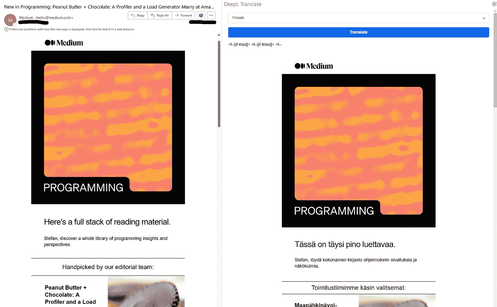

已完成的加载项

# 限制

用 OutSystems 构建 Office 插件有一些缺点

*   使用**目的地**或**重定向到另一个屏幕**不起作用。Javascript API 函数 **$public 也是如此。Navigation.navigateTo()** 。

默认重定向是使用**推状态**写入浏览器历史。在 Office Online IFRAME 或 Outlook 桌面应用程序 WebView 控件中运行时，这将引发异常( **pushState** 不是函数)。

> 这是一个真正的问题，因为它影响了很多功能。当您到达本教程中的身份验证步骤时，您会注意到我们不会使用 SecurityException 处理程序重定向到登录屏幕，而是在任务窗格屏幕上执行所有操作。在撰写本文时，我仍在等待外部系统支持如何解决这个问题的回复。

*   Outlook Online 中的**任务窗格**无法调整大小。它非常狭窄，尤其是当你翻译 HTML 格式的电子邮件时，它是不可用的。在 Outlook 桌面中，可以调整**任务窗格**的大小。

# 你需要什么

要遵循本教程，您需要

*   外部系统开发环境。([一个人的环境就够了](https://www.outsystems.com/PartnerSignup/GetStarted.aspx?PartnerId=bdbab3cf-076f-49e2-91ac-a9157081eace&utm_source=ISD%20FENIQS%20GmbH&utm_medium=partner&utm_campaign=partner-personal-environment&utm_content=personal-environment))
*   至少一个[免费的 DeepL 开发者账号](https://www.deepl.com/de/pro-api?cta=header-pro-api/)。注册后，进入您的账户页面，复制**认证密钥**。
*   访问您的生命周期环境和配置安全设置的权利。我们必须设置 Cookie SameSite 设置，以便外接程序正常工作。
*   【OutSystems Forge 的 DeepL 连接器。这将您的应用程序与 DeepL REST API 连接起来。
*   [来自 OutSytems Forge 的 Microsoft Office AddIn SSO 连接器](https://www.outsystems.com/forge/component-overview/13166/microsoft-office-addin-sso-connector)。登录连接器提供从办公室主机检索用户访问令牌和执行外部系统登录的操作。
*   你的插件图标。Microsoft Office 加载项需要三种大小的 jpg 或 png 格式的图标。16x16、32x32 和 80x80(例如 DeepL80.png、DeepL80.png 和 DeepL80.png)。你也可以在这里下载这组图标。
*   对您的 Azure Active Directory 租户的访问权限以及添加应用程序注册的权限。要在 Microsoft Office 和您的外部系统应用程序之间执行单点登录，这是一项必要的任务。
*   您还需要一个类似 Visual Studio 代码的文本编辑器来创建 Office AddIn 清单 xml 文件。

# 外部系统锻造

OutSystems Forge 主机 OutSystems 和社区创建的可重用组件。免费下载。DeepL 和 Microsoft Office 主机登录连接器都由我在 ISD FENIQS 的团队维护。如果您想了解更多关于我们组件的信息，请访问 Anvil。Anvil 是我们所有外部系统组件的专用微型网站。

# 逐步地

**步骤 1 —配置终身安全设置**

我们的 OutSystems 应用程序将嵌入 Outlook Web 上的 IFRAME 和桌面应用程序的 Web 视图容器中运行。Chrome 和 Edge 浏览器有一个名为 **SameSite** 的安全设置，默认设置为 **Lax** 。这可以防止跨域发送 cookies。

你可以阅读更多关于她的信息

*   [如何处理 Chrome 浏览器中的 SameSite cookie 变更—微软 Entra |微软 Docs](https://docs.microsoft.com/en-us/azure/active-directory/develop/howto-handle-samesite-cookie-changes-chrome-browser?tabs=dotnet)
*   [Google Chrome cookie 处理即将发生的变化——out systems 支持](https://success.outsystems.com/Support/Enterprise_Customers/Maintenance_and_Operations/Upcoming_changes_in_cookie_handling_in_Google_Chrome?utm_source=ost-outsystems%20tools&utm_medium=ost-lifetime&utm_campaign=ost-docrouter&utm_content=ost-helpid-30237&utm_term=ost-contextualhelp)

在生存期中，我们可以为每个环境设置一个安全设置，告诉浏览器将其 **SameSite** 行为设置为 **None** ，从而允许跨域 cookie 请求。不幸的是，我们只能对每个环境这样做，而不能对每个应用程序这样做(至少我还没有找到这样做的方法。如果你知道如何做到这一点，我会感谢一个消息)。

你可以直接进入你的生活环境或者点击服务工作室中的**齿轮图标**。这将打开您的浏览器，并将您重定向到您环境的服务中心。

在服务中心，单击最右侧的**管理生命周期内的所有环境**。

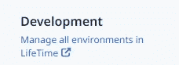

终生管理环境

在生命周期中，点击菜单中的**环境**选项卡。在需要更改安全设置的环境中，点击**更多安全设置**。

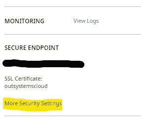

更多安全设置

在“安全设置”页面上，确保

*   **启用 HTTP 严格传输安全(HSTS)** 已启用，这将自动设置**在 Web 应用程序中强制 HTTPS**。

*您也可以禁用严格传输，只启用 Web 应用程序屏幕的强制 HTTPS。*

*   在**cookie**下，**安全**设置被启用。
*   **SameSite** 设置设为**无。**

点击**保存**。您可以忽略告诉您执行全部发布的消息。当我们创建我们的应用程序时，它会考虑这个设置，而所有现有的应用程序都不会，直到你重新发布它们。

**步骤 2——创建一个外部系统反应式 Web 应用程序**

在 Service Studio 中创建新的反应式 Web 应用程序(例如 OfficeAddIn)。创建默认的反应式 Web 模块并发布它。

在**主流程**中创建一个新的**屏幕**，并将其命名为**任务窗格。**

转到新**任务窗格**屏幕的小部件树，将布局设置为**布局空白**(移除不必要的占位符项目)。我们的插件不需要菜单，只需要一个简单的空白屏幕。

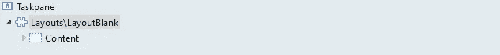

坯件布置

用 **Hello World** 为内容添加一个文本小部件🙂。

允许**匿名**角色访问任务窗格屏幕。

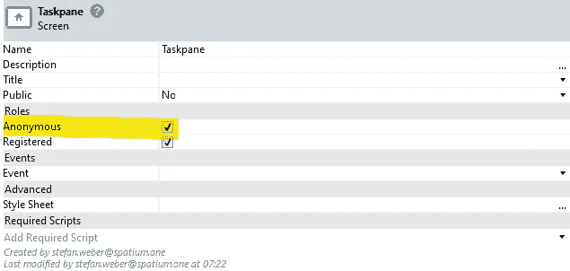

允许匿名角色

在 Service Studio 的**界面**选项卡上，在**图像**下新建一个文件夹**图标**。

将三个插件图标上传到文件夹并发布您的模块。让 Service Studio 和您的模块保持打开状态，我们将继续下一步。

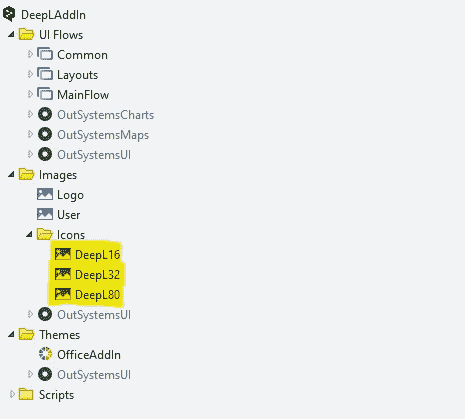

上传加载项图标

**步骤 3 —添加 Office Javascript**

Office 主机——在我们的例子中是 Microsoft Outlook——和您的应用程序可以通过 [Office Javascript 框架](https://docs.microsoft.com/en-us/office/dev/add-ins/reference/javascript-api-for-office)进行交互。该框架提供了一个大的 Api，如检索邮件正文，我们将在本教程中使用。

我们必须确保在尝试与办公室主机交互之前初始化框架。

在**步骤 2** 中，我们将任务栏屏幕的布局块更改为 **LayoutBlank** 。加载 Office Javascript 最简单的方法是在 **LayoutBlank** 块的 **OnReady** 事件处理程序中要求它。

在 Service Studio 中，转到**布局** UI 流程并选择**布局空白**块。

双击已经存在的 **OnReady** 事件处理程序。

在 **AddFavIcon** 动作下面添加一个新的**运行客户端动作**。选择**要求脚本**动作。使用配置 Url 属性

[https://appsforoffice.microsoft.com/lib/1/hosted/office.js](https://appsforoffice.microsoft.com/lib/1/hosted/office.js)

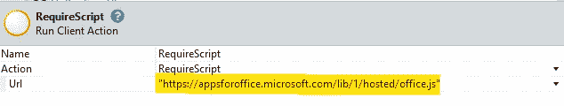

要求脚本配置

> 如果您找不到 RequireScript 客户端操作，那么您必须向它添加一个依赖项。RequireScript 是(系统)模块的一部分。

在 RequireScript 之后，添加一个包含以下脚本的 Javascript 元素

你的流程应该是这样的

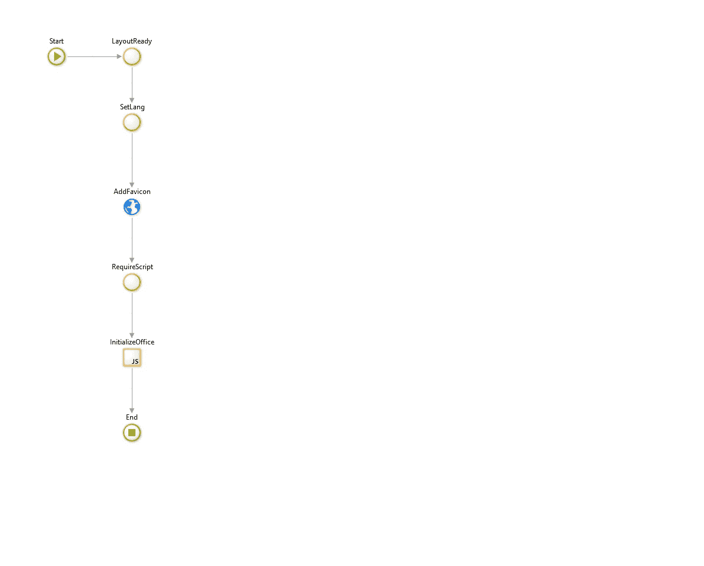

LayoutBlank 块的 OnReady 事件处理程序

发布您的应用程序。

**步骤 4——创建 Office 插件清单文件**

清单文件是对我们的 Office 外接程序的描述。XML 清单文件使 Office 插件能够执行以下操作(摘自[这里的](https://docs.microsoft.com/en-us/office/dev/add-ins/develop/add-in-manifests?tabs=tabid-1))

*   通过提供 ID、版本、描述、显示名称和默认区域设置来描述自身。
*   在 Office 应用程序功能区中指定用于标记加载项的图像和用于加载项命令的图标。
*   指定外接程序如何与 Office 集成，包括任何自定义用户界面，如外接程序创建的功能区按钮。
*   为内容外接程序指定要求的默认尺寸，为 Outlook 外接程序指定要求的高度。
*   声明 Office 外接程序所需的权限，如读取或写入文档。
*   对于 Outlook 外接程序，定义一个或多个规则，这些规则指定它们将被激活并与邮件、约会或会议请求项目交互的上下文。

清单很大，有很多选择。我们不会在本教程中详细介绍，但是你可以在这里进一步阅读关于可能性的内容。

这是我们清单文件的起始模板。将内容复制到您的本地文本编辑器中。

您必须更改的所有内容都包含方括号[]中的属性。这些是

*   **应用 Id** —创建一个新的 UUID 并将其放在这里
*   **提供商名称** —指定您的公司名称作为提供商
*   **默认区域设置** —更改为您的区域设置。
*   **显示名称和说明** —这是 Office 外接程序在外接程序目录中的显示方式。
*   **图标 Url** 和**高分辨率图标 Url** —将值设置为 DeepL32.png 和 DeepL80.png 的完整路径。该路径由您的环境 url 加上运行时路径组成，当您在 Service Studio 中单击相应的图像时会看到该路径

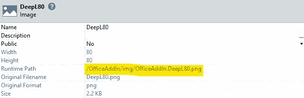

图像的运行时路径

*   AppDomain —设置为您的环境 url。
*   **FormSettings** —将 **SourceLocation** 属性设置为任务窗格屏幕的完整路径。完整路径由您的环境 url 加上您的 web 模块名(OfficeAddIn)和屏幕名组成。
*   **资源** —将**图标**值设置为图标图像的完整路径，并将 **Url** 值设置为任务窗格屏幕。

**步骤 5 —侧面加载 Office 插件**

通过侧加载，您可以测试 Office 加载项，而无需将其添加到租户的加载项目录中。

*   打开您的 Microsoft Outlook 桌面应用程序
*   在功能区中点击**获取插件**按钮
*   选择**我的附加模块**并找到自定义附加模块部分
*   点击**添加一个自定义插件**并从文件中选择
*   **上传您之前修改的清单**

**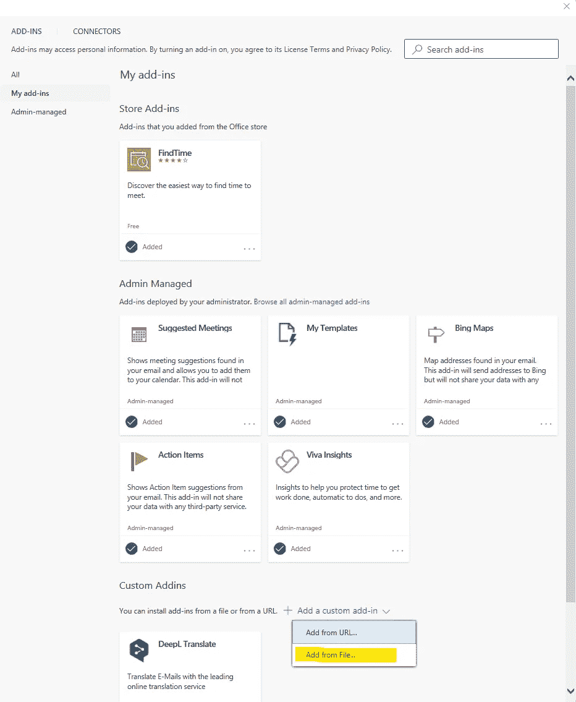**

**侧面加载自定义加载项**

**Office 会检查您的清单文件是否有效。如有必要，请更正错误并重新上传。**

**如果有效，您应该会在自定义加载项部分看到一个新条目。显示名称和描述，当然还有清单中的图标。**

**现在进入你的收件箱，选择一封邮件。现在，您应该会在外接程序的功能区中看到一个用于打开任务窗格的附加按钮。如果一切正常，你应该在任务窗格中看到 **Hello World** 。**

****步骤 6 —添加 DeepL 连接器****

**接下来，我们将所需的 DeepL 连接器依赖项添加到我们的应用程序中。从**你需要的 DeepL_Connect_IS** 模块**

*   ****DeepL_TextTranslate** 服务器动作**
*   **所有的**静态实体**(它们是帮助你选择服务器动作的正确配置选项的枚举)**

**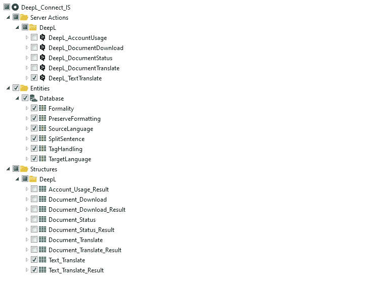**

**DeepL 连接器依赖关系**

****第 7 步—添加翻译****

**现在是时候给我们的插件添加翻译了。在用户启动我们的插件后，我们会询问目标语言。我们将用户的语言选择存储在一个客户端变量中。 **DeepL_Connect_IS** 模块已经包含一个具有所有目标语言的**静态实体**(**target language**)，我们将在客户端变量中存储该静态实体的标识符。**

**在 Service Studio 的**数据**选项卡中添加一个新的**客户端变量**并命名为 **TargetLanguageId** 。检查数据类型是否设置为**目标语言标识符**。**

**在 Service Studio 中的**界面**选项卡上，打开**任务窗格**屏幕。添加一个数据类型为 Text 的局部变量。**

*   ****MailOriginalBody** —它将保存我们检索到的邮件的当前内容。**

**向屏幕添加一个新的客户端动作，并将其命名为 **TranslateMailOnClick** 。我们暂时让它空着。**

**向您的屏幕添加一个新的集合(**从数据库**获取数据)。将 **TargetLanguage** 静态实体从 **DeepL_Connect_IS** 模块中拖到聚合中。将聚合命名为 **GetLanguages** 。**

**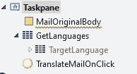**

**转到**任务窗格**屏幕的小部件树。**

**在**内容**占位符中添加一个**容器**小部件，并添加以下**样式类**。**

*   ****display-flex****
*   ****伸缩方向栏****
*   ****衬垫底座****

**在该容器内创建另一个**三个**容器。在第二个容器中添加一个**y 底座**。**

**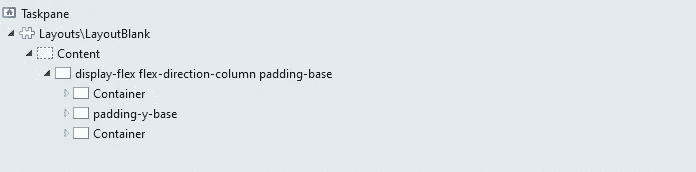**

****右击**第一个容器，添加一个**下拉小工具**。(注意，我们将变量设置为我们之前创建的客户端变量。**

**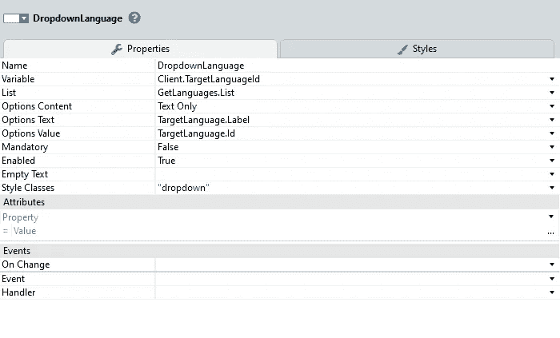**

**语言下拉列表**

****右击**第二个容器**并添加一个**按钮**(例如带有文本“翻译邮件”)。(注意**启用的**条件和额外的**样式类** **全角**和我们之前创建的**点击**处理程序)****

**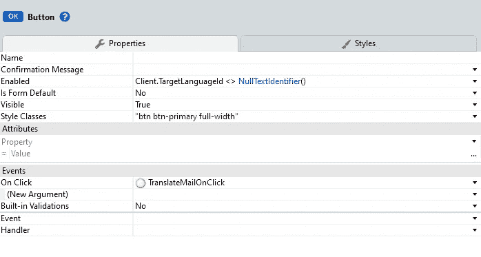**

**翻译按钮**

**添加一个**从其他来源获取数据**到您的屏幕。将输出变量(如结果)数据类型设置为 Text _ Translate _ Result(DeepL _ Connect _ IS 模块)的**列表。****

**将您的数据操作命名为 **GetTranslation** ，并将操作的 **Fetch** 属性设置为 **Only on demand** 。**

**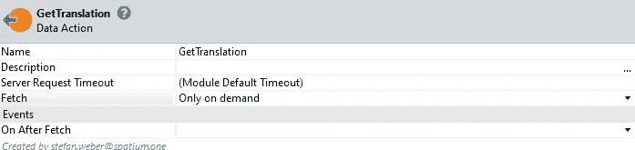**

**将 **DeepL_TranslateText** 服务器动作从 **DeepL_Connect_IS** 模块拖到数据动作流中，并将其属性设置为**

**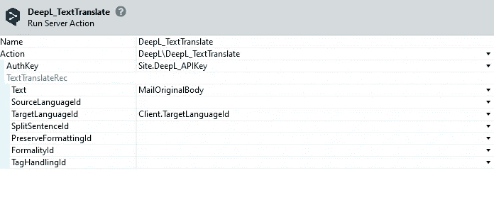**

> **DeepL 需要一个**认证密钥**，你可以从你的 DeepL 账户页面获得。您可以像上面的例子一样将密钥放在**站点属性**中(推荐),或者在字段中硬编码。**

**将操作的结果赋给数据操作的输出参数。你的流程应该是这样的。**

**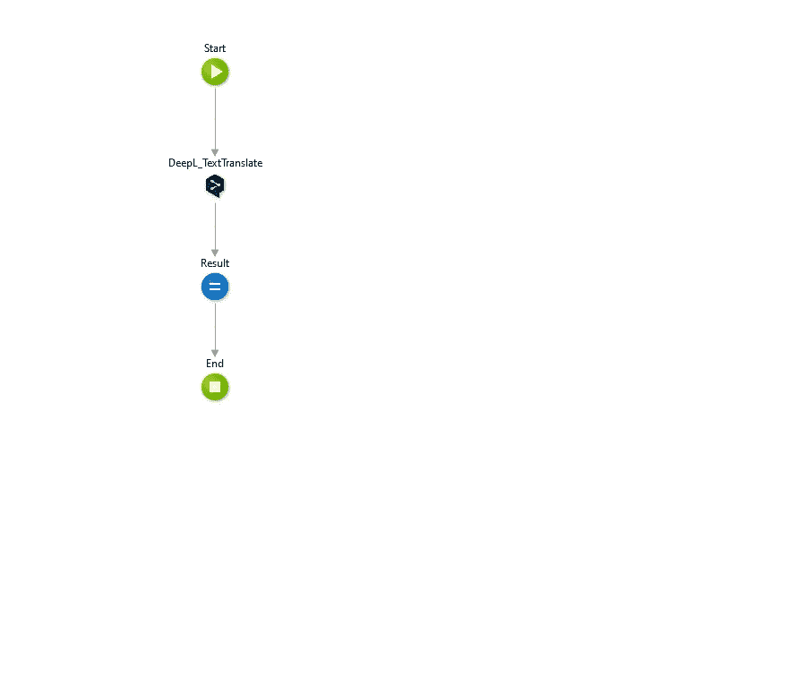**

**获取翻译数据操作流程**

**在**任务窗格**屏幕中打开**translate mailon 点击**客户端动作。**

**向流中添加一个 **Javascript** 元素。**

**为**数据类型文本**的 **Javascript** 元素创建一个新的输出属性，并将其命名为**主体**。**

**将以下脚本复制到 **Javascript** 元素。**

**该脚本执行以下操作**

*   **它在 Office Javascript 框架完全初始化时执行( **Office.onReady** )**
*   **以文本形式获取当前邮件项目的正文。我们稍后将处理 html。**
*   ****$resolve()** 是特定于等待直到承诺被履行的系统。**

**回到流程**中，将 Javascript 的输出**主体**分配给本地**mailroriginalbody**变量。****

**将 **GetTranslation 数据动作**拖到赋值下面，刷新数据源。**

**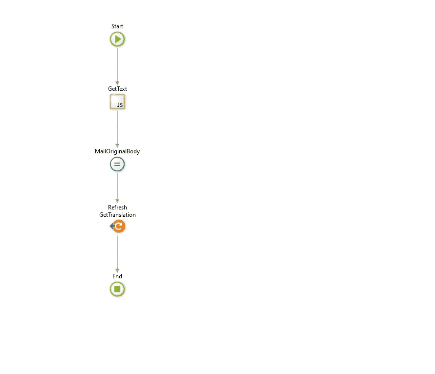**

**TranslateMailOnClick 客户端操作**

**回到你的任务窗格屏幕的窗口小部件树，添加一个**列表**窗口小部件到最后一个容器，并设置它的数据源为 **GetTranslation。结果****

**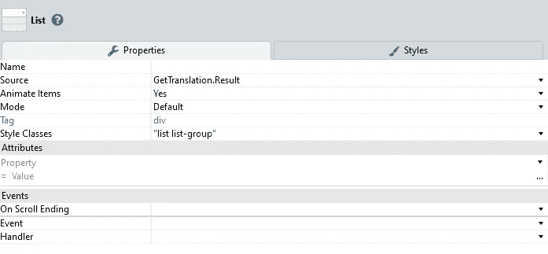**

**在列表中创建另一个容器，在该容器中添加一个**表达式**，并将其值设置为 **GetTranslation。结果.当前.文本****

> **DeepL 总是返回一个翻译数组。对于我们当前的方法，在包含整个翻译的数组中只有一项。**

**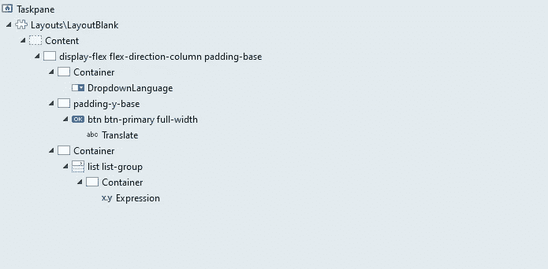**

**完整的任务窗格布局和小部件**

**是时候试试了。在 Microsoft Outlook 中，从收件箱中选择一个邮件项目。在功能区中，单击加载项的“翻译”按钮。**

**选择目标语言并点击翻译按钮。DeepL 返回结果后，您应该会在按钮下方看到翻译后的文本。**

> **当你试图翻译一封包含表格和图片的邮件时。你会注意到这导致了一个难以阅读的翻译。在我们的 Javascript 中，我们接收文本格式的主体，它去掉了所有的 html 内容。也有可能获得 HTML 中的主体，甚至 DeepL 支持在不破坏其结构的情况下翻译 HTML 文档。**

****步骤 8 —翻译 HTML 而不是文本邮件正文(可选步骤)****

**在这一步中，我们在 **TranslateMailOnClick** 客户端操作和 **GetTranslation** 数据操作中对 Javascript 做了一些小的修改。**

**在**translate mailonclick Javascript**元素中，将**office . context . mailbox . item . body . get async**的第一个参数改为“ **html** ”。**

**在 GetTranslation data 动作中，修改 **DeepL_TranslateText** 配置，并将 **TagHandlingId** 属性设置为**Entities.TagHandling.Html**。这告诉 DeepL 让 HTML 保持原样，只翻译文本。**

**如果您尝试这样做，您会注意到结果包含 HTML 输出。OutSystems 表达式不呈现 html，而只是把它当作文本。**

**在主 UI 流程中创建一个新的**块**，并将其命名为 **RenderHtml** 。**

**添加数据类型文本的输入属性 **Html** 。**

**将单个**容器**添加到块中，并将其名称设置为 **RenderContent** 。**

**向该块添加一个 **OnReady** 事件处理程序。**

**在 **OnReady** 事件处理程序中，使用以下输入参数添加一个新的 **Javascript** 元素。**

*   ****数据类型**文本**的 WidgetId****
*   ****Html** 的数据类型**文本****

**编写以下脚本**

**设置 Javascript 元素的输入属性**

*   **用于呈现内容的 WidgetId。身份**
*   ****Html** 到 Html 块的输入属性**

**在任务窗格屏幕小组件树中，删除列表中的表达式。**

**添加新块，并将其 **Html** 属性设置为 **GetTranslation。结果.当前.文本**。**

**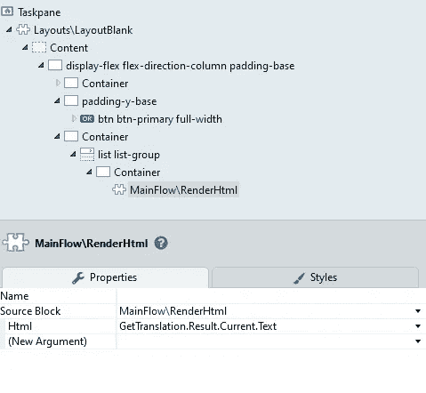**

**发布并尝试。邮件正文的内容现在应该呈现在 Html 中。您会注意到，由于一些图像没有显示，因此会有一些损失。**

# **证明**

**直到现在，我们的插件仍然不需要登录外部系统就可以运行。OutSystems 的默认设置是从屏幕上删除匿名角色。如果用户点击屏幕，则会引发安全异常，并由**通用**流程中的默认**异常处理程序处理。这里，用户被重定向到**登录屏幕**。我们不能使用默认重定向，更不能使用 JavaScript(window . location . href)重定向——这会抛出一个 **No Permission** 错误。****

**因此，我们将**匿名**角色留在我们的**任务窗格**屏幕上，并执行用户登录检查，然后登录我们屏幕上的 **OnReady** 处理程序。**

**Office Javascript 框架提供了一个接口，指示 Office 主机代表我们的应用程序从 Azure Active Directory 中检索访问令牌并返回它，以便我们可以使用它来执行外部系统登录。**

**这一部分包括以下步骤**

*   **在 Azure Active Directory 中注册我们的 Office 加载项应用程序**
*   **修改清单文件，并在 Azure Active Directory 中添加有关已注册应用程序的详细信息。**
*   **修改 OutSystems 登录。**

****第 9 步——在 Azure Active Directory 中注册应用****

**在[https://portal.azure.com](https://portal.azure.com)进入你的 Azure 门户网站**

> **以下内容摘自官方文件。**

**在顶部搜索栏中搜索应用程序注册，然后单击服务部分中的应用程序注册。**

**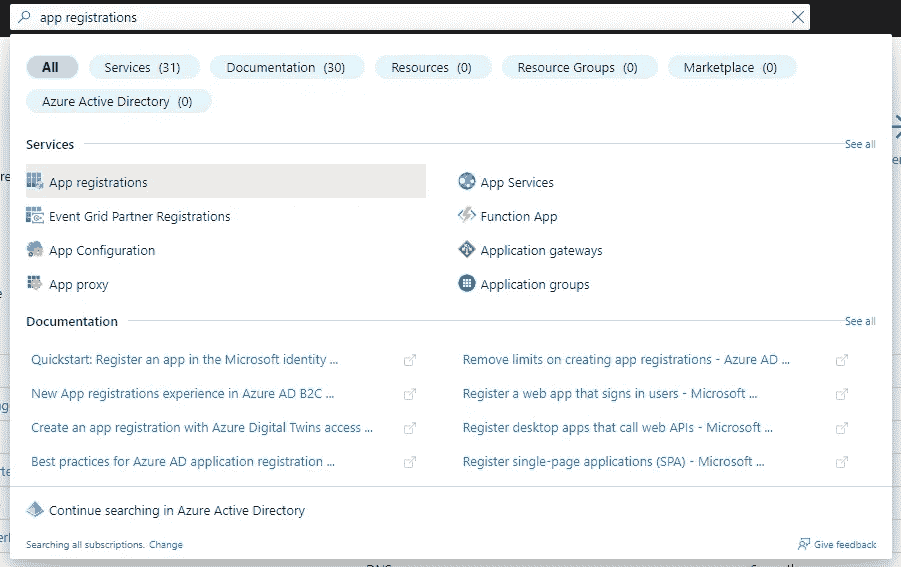**

**应用程序注册搜索**

**在应用程序注册列表屏幕中，单击新注册。**

*   **为您的应用程序提供一个有意义的名称**
*   **仅在该组织目录中选择**账户**。(我们只想允许来自我们自己组织的用户，而不是来自其他组织的用户)**
*   **让**重定向 URI** 为空**
*   **点击**注册****

**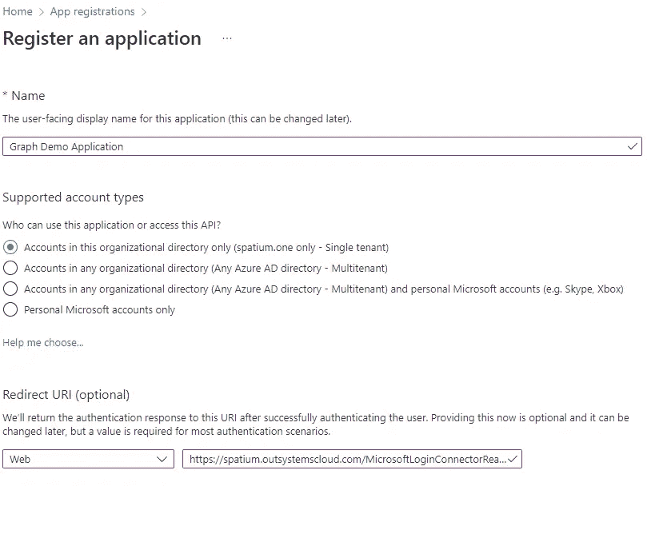**

**注册申请**

**复制**应用(客户端)ID** 和**目录(租户)ID** 的值。我们以后会需要的。**

**在左侧窗格的管理下，单击**证书&机密**。检查是否选择了**客户端机密**选项卡，并点击**新客户端机密**。**

**输入密码的描述和到期时间。然后点击**添加**。**

**在下面的屏幕中，立即**复制客户端密码(值)**非常重要。客户端密码在此屏幕上仅显示一次，以后无法检索。**

**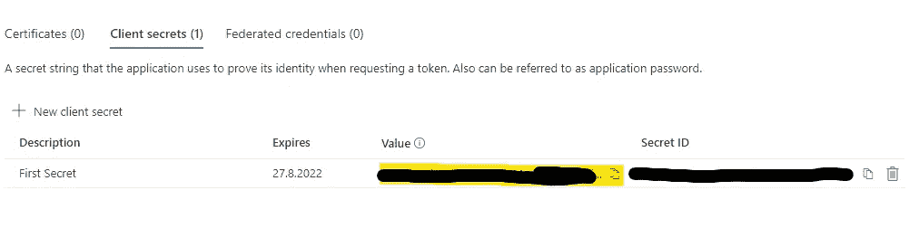**

**秘密**

**在管理下，选择**公开一个 API** ，选择**设置**链接。这将打开一个**设置应用 ID URI** 框，其中以 api:// <应用 id >的形式生成了应用 ID URI。在< application-id >之前插入您的外部系统环境的完全合格的域名。整个 ID 应该采用 api:// < OutSystems 环境 URL > > / <应用程序 id >的形式；比如 API://my personal . outsystemscloud . com/c 6 C1 f 32 b-5e 55–4997–881 a-753 C1 d 563 b 7。**

**选择**添加一个范围**。在打开的面板中，输入 **access_as_user** 作为作用域名称。**

**设定**谁能同意**？给**管理员和用户。****

**使用适合于 **access_as_user** 范围的值填写用于配置管理和用户同意提示的字段，这使得 Office 客户端应用程序能够使用您的外接程序的 web APIs，并具有与当前用户相同的权限。建议:**

*   **管理员同意显示名称:Office 可以充当用户。**
*   **管理员同意说明:使 Office 能够以与当前用户相同的权限调用外接程序的 web APIs。**
*   **用户同意显示名称:Office 可以充当您的角色。**
*   **用户同意说明:允许 Office 使用与您相同的权限调用外接程序的 web APIs。**

**确保**状态**设置为**使能**。然后**添加范围**。**

**在**授权的客户端应用程序**部分，输入以下 ID 对所有 Microsoft Office 应用程序端点进行预授权。**

> **ea5a 67 f 6-b6f 3–4338-b240-c 655 DDC 3c c8 e**

**选择**添加客户端应用**。在打开的面板中，将**客户端 ID** 设置为相应的 GUID，并选中 API://out systems environment URL/<application-ID>/access _ as _ user 复选框。**

**最后一步是配置权限。在左窗格中点击 **API 权限**。您会注意到已经有一个权限集**用户。读取委托类型的**。这是用户登录所需的最低权限。**

*   **点击**添加一个权限****
*   **选择**微软图形**和**委托权限****
*   **从权限列表中选择以下权限: **openid、配置文件、offline_access、文件。阅读.所有****
*   **点击**添加权限****

**如果您不希望您的用户给予同意，您也可以给予管理员同意。关于如何做到这一点，请看这里。**

**下一步需要来自**概览**页面的**应用 ID URI** 值。**

****步骤 10 —修改 Office 外接程序清单****

**我们需要修改我们的清单文件，以便 Office 主机知道如何与我们的应用程序注册交互。**

**在第二个**版本覆盖**标签的末尾添加以下 XML 部分。**

**将**应用 ID** 和**应用 ID URI** 值更改为您的注册值。**

**从 Office My Add-Ins 中移除当前的外接程序，并上载新的清单。(参见步骤 5)。**

****步骤 11——向您的外部系统应用程序添加依赖关系****

**为您的应用程序添加依赖项**

*   ****office host _ AccessTokenGet**客户端操作**
*   ****office host _ AccessTokenLogin**服务器操作**

**来自 **OfficeHost_SignOn_CS** 模块。**

****第 12 步—创建一个 Office 登录包装器****

**在 Service Studio 的“数据”选项卡中，创建一个数据类型为 text 的新站点属性 ApplicationIDURI。在此处设置 DefaultValue(不推荐),或者在服务中心将其发布并设置为 Azure Active Directory 应用注册中的应用 ID Uri。(API://[环境 Url]/[应用程序 ID]。**

**在 Service Studio 的**逻辑**选项卡中创建一个新的服务器动作 **DoOfficeLogin** 。**

**创建一个新的数据类型为 **text 的输入属性**标记**。****

**创建数据类型为**布尔**的输出属性 **IsSuccess** 。**

**创建数据类型为**文本**的输出属性**消息**。**

**将**office host _ AccessTokenLogin**服务器动作从 **OfficeHost_SignOn_CS** 模块拖到流程中。**

**将**令牌**属性设置为**令牌****

**将**受众**属性设置为您的站点属性**站点。应用程序 IDURI****

****将**office host _ AccessTokenLogin**的**issue access 和**消息**分配给**输出属性**。**

**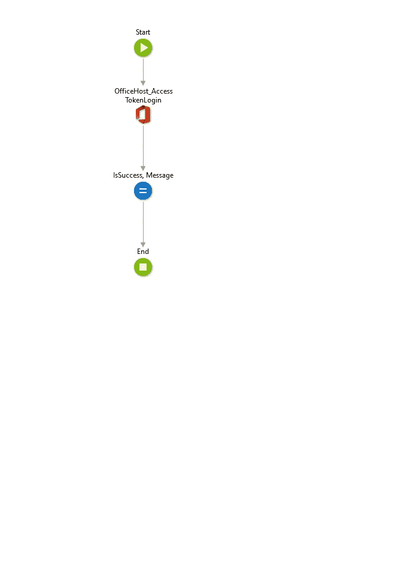**

**DoOfficeLogin 服务器操作**

****第 13 步—在 Ready 事件处理程序上添加任务窗格****

**在您的 **Taskpane** 屏幕中创建一个新的数据类型为 **Boolean** 的本地变量 **IsAuthenticated** ，并将其默认值**设置为**False。**

**将 **OnReady** 事件处理程序添加到您的任务窗格屏幕。**

**如果以**get userid()= null identifier()**为条件，将**添加到流中****

**在 **False** 分支上添加一个赋值并将 IsAuthenticated 变量设置为 True。**

**在**真**分支上添加来自 **OfficeHost_SignOn_CS** 模块的**office host _ AccessTokenGet**客户端动作。**

**就在它添加我们的 **DoOfficeLogin** 服务器动作并将令牌输入设置为**office host _ AccessTokenGet**的**Token o**output 之后。**

**如果带有 **DoOfficeLogin 的条件，则添加另一个**。发布成功******

**在**真**分支上添加另一个 **Assign** 为 **IsAuthenticated** 并将其设置为**真**。**

**在**假**分支上只加一个**端**。**

**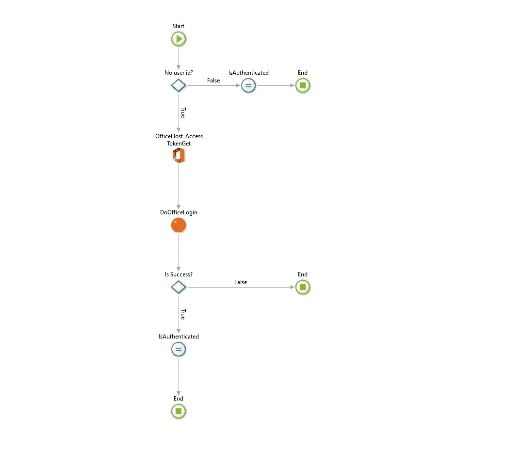**

**在任务窗格屏幕上阅读**

****第 14 步—修改用户界面****

**在 Taskpane 小部件树中，如果并将其条件设置为 **IsAuthenticated** ，则将整个内容包装在一个**中。****

**在 **False** 分支中添加一个**中心内容**小部件，并在中心占位符中放置一些有意义的内容。**

**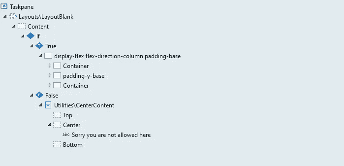**

**就是这样。发布您的应用程序并试用它。当然，这只是一个开始，许多事情都可以优化(例如，当认证失败时给出反馈，或者在登录 asf 时显示一个漂亮的动画。).**

**我希望你喜欢它的工作，因为我在创建它的乐趣。**

**如果您在启动和运行时遇到困难，请使用 OutSystems 论坛获得帮助。非常欢迎对如何改进这篇文章提出建议。通过我的 [OutSystems 档案](https://www.outsystems.com/profile/0qginuc0j5/overview)给我发消息，或者直接在 medium 上回复。低编码快乐！**