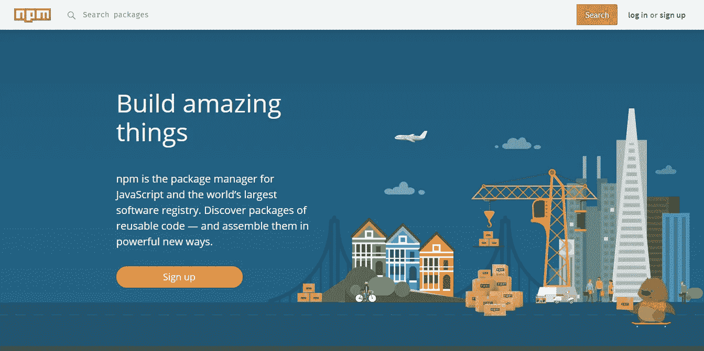
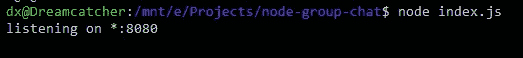
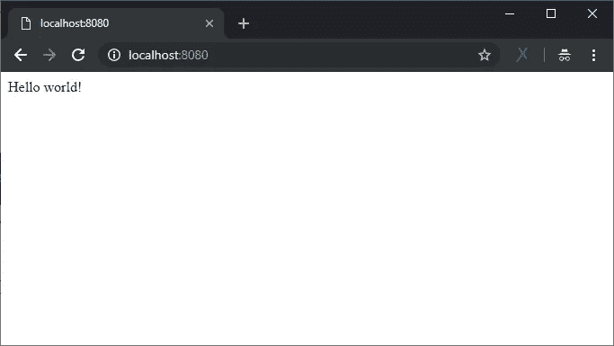
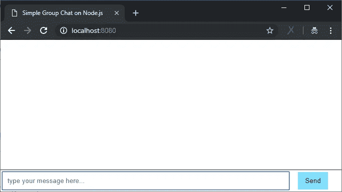

# 使用 Node.js 构建一个 30 行的群聊应用程序

> 原文：<https://itnext.io/build-a-group-chat-app-in-30-lines-using-node-js-15bfe7a2417b?source=collection_archive---------0----------------------->

## 这是一个简单的(希望)切中要点的教程，用不到 30 行代码就可以使用 Node.js 构建您的第一个群聊应用程序。

Node.js 可以说是当今大多数人用来构建服务器端应用程序的最强大的 JavaScript 运行时环境之一。Node.js 建立在 [Google V8 JavaScript 引擎](https://v8.dev/)之上，这是一个开源的高性能 JavaScript 和 WebAssembly 引擎。V8 实现了 [ECMAScript](https://tc39.github.io/ecma262/) 和 [WebAssembly](https://webassembly.github.io/spec/core/) ，可以在使用 x64、IA-32、ARM 或 MIPS 处理器的 Windows 7 或更高版本、macOS 10.12+和 Linux 系统上运行。V8 可以独立运行，也可以嵌入到任何 C++应用中。

感谢社区，有很多 Node.js 模块我们可以免费使用，它们将帮助(而不是加速)你完成任务。你可以使用强大的`npm install`来安装所有你需要的模块，在这里你可以浏览它们[这里](https://www.npmjs.com/)。本文不会讨论如何在你的本地机器上安装 Node.js 和 NPM，现在已经有数百万的教程了，[去找一个适合你的吧](http://lmgtfy.com/?q=how+to+install+node+js)。



NPM 官方网站

在本文中，我将展示如何使用 Node.js 和 Socket.io 模块构建您的第一个简单群聊。 [Socket.io](https://socket.io/) 是一个 Node.js 模块，支持实时、双向和基于事件的通信。它可以在任何平台、浏览器或设备上运行，同样注重可靠性和速度。一些 Socket.io 使用示例:

*   实时分析
*   二进制流
*   即时消息和聊天
*   文档协作(想想谷歌文档)

# 我们开始吧！

*注意:所有这些代码都在我的 GitHub 上，你可以在这里克隆它们:*[https://github.com/dkhd/node-group-chat](https://github.com/dkhd/node-group-chat)

在我们开始之前，我假设您已经理解并熟悉了*命令行界面(CLI)* ，因为我们将在本教程中使用它。如果你觉得不舒服，我告诉你，这是值得学习的。

## 1.创建工作目录

首先，让我们创建我们的工作目录，在那里我们将放置我们所有的代码和资产。使用此命令创建我们的工作目录:

`$ mkdir node-group-chat`

..然后将我们的目录更改为新创建的工作目录:

`$ cd node-group-chat`

## 2.启动项目

通过使用`npm`命令，我们可以轻松地启动我们的项目，创建一个名为`package.json`的文件。如果您想知道什么是`package.json`，它是一个项目清单文件，将存储项目相关信息，如作者姓名、版本等。

您可以通过键入以下命令启动项目:

`$ npm init`

..并按照终端上显示的指南进行操作。

## 3.安装模块

在这个项目中，我们将使用至少两个 Node.js 模块，我们可以使用 NPM 轻松安装它们。

*   ***Express***—Express 是 Node.js 的轻量级 web 应用框架，对于这个简单的群聊来说，没有必要使用 Express，但是如果你打算继续开发的话，有这个就不错了。
*   ***socket . io***—socket . io 是本教程中实现客户端与服务器实时通信的关键模块。
*   ***EJS***——EJS(嵌入式 JavaScript)是一种简单的模板语言，可以让你为你的前端生成 HTML 标记。

您可以使用以下命令安装这些模块:

`$ npm install express`

和

`$ npm install socket.io`

和

`$ npm install ejs`

所有这些过程完成后，你的模块将位于`node_modules/`目录下。

## 4.做代码

让我们把手弄脏吧。

创建一个名为`index.js`的文件(或者您在`package.json`中定义的任何文件)，并开始导入所需的模块:`express`、`http`和`socket.io`。

完成模块导入后，下一步是提供前端代码，并确保 Node.js 正在运行，我们可以从浏览器访问它(在这种情况下，我将使用端口`8080`)。

该功能..

```
app.get('/', function(req, res) {
    res.send('Hello world!');
});
```

..用于在用户每次访问我们的应用程序时为他们提供服务，并在他们的浏览器中显示`Hello world!`。

要启动该应用程序，您可以在终端中键入以下内容，然后点击 enter 按钮:

`$ node index.js`



这是我们运行应用程序时在终端中看到的内容

我们可以通过 web 浏览器访问我们的应用程序，网址是:`http://localhost:8080`



从浏览器访问我们的应用程序

但是在下一行代码中，我们将使用类似于`res.render('index.ejs');`的东西来代替`res.send('Hello World!');`，并且我们将使用 EJS 来构建我们的前端视图

现在，创建一个名为`views/`的新目录，并在`views/`目录中创建一个名为`index.ejs`的空文件。现在您可以将这几行代码放入新的`index.ejs`文件中。

> 不要忘记将`index.js`中的`res.send('Hello World!');`行改为`res.render('index.ejs');`，否则您的代码将无法运行。

上面的代码什么也没做，只是为我们提供了这样的基本聊天用户界面。



我们的聊天用户界面仍然不工作

在处理 Socket.io 时，我们同时处理两个文件:

*   服务器应用程序文件(例如 index.js)
*   客户端前端文件(例如 index.ejs)

通过使用 Socket.io，基本上我们在服务器和客户端之间创建了一个持续实时连接的“隧道”。在服务器文件中，只需输入以下代码:

```
io.sockets.on('connection', function(socket) {
    // write all the realtime communication functions here
});
```

所以我们的完整`index.js`看起来是这样的:

*服务器端 Node.js 代码不超过 30 行吧？*😉

而现在，我们要修改我们的前端文件，所以它会在用户打开页面时询问用户名，并打开与服务器 app 的通信套接字。

所以我们的`index.ejs`看起来是这样的:

## 5.结果呢

如果您已经完成了代码，请尝试使用以下代码运行您的代码:

`$ node index.js`

打开浏览器，打开`http://localhost:8080`。您可以打开多个标签来查看它是如何工作的，或者查看下面的 GIF:


群聊应用的结果

根据这一经验，您现在应该理解了使用 Node.js 和 Socket.io 的聊天应用程序的基础。您可以做许多事情来改进此代码，例如:

*   添加打字通知(*有人正在打字…* )
*   添加表情符号或表情
*   将其保存到数据库中
*   等等。极限是你的想象力。

你怎么想呢?请在下面留下您的评论。

GitHub 上的完整源代码:[https://github.com/dkhd/node-group-chat](https://github.com/dkhd/node-group-chat)