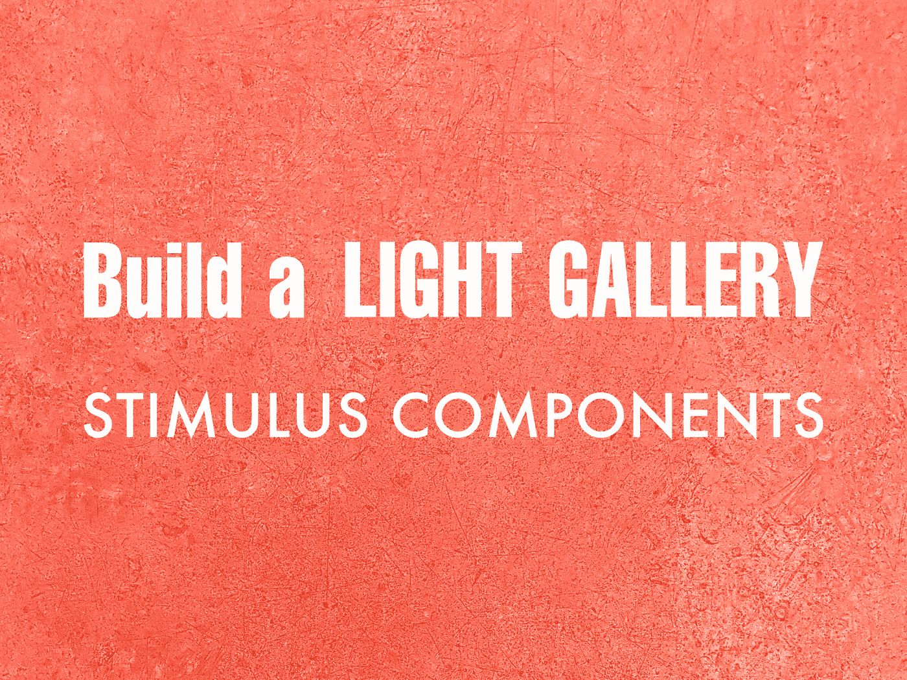
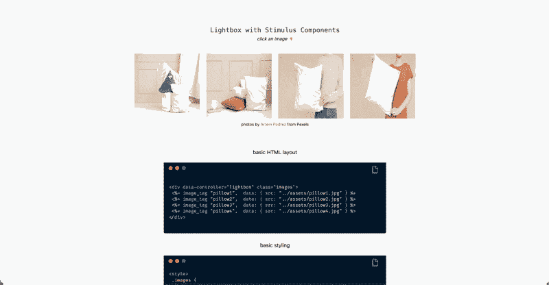

# 建立一个有刺激成分的光廊

> 原文：<https://itnext.io/build-a-light-gallery-with-stimulus-components-84ba56f3cee9?source=collection_archive---------1----------------------->

让你的刊登页或网上商店充满活力。

作者照片。

在这篇文章中，你将学习如何用[刺激](https://stimulus.hotwire.dev/)建立一个光画廊，这是一个为你已经有的 HTML 设计的适度的 JavaScript 框架。Stimulus 是 SPA 的一个强有力的替代方案，它使开发人员能够将 web 应用程序带入生活。

> 刺激。一个适中的 JavaScript 框架。

Stimulus Components 是一个开源项目，托管了一组用于典型 JavaScript 行为的可定制组件。[一个组件](https://stimulus-components.netlify.app/docs/components/stimulus-lightbox/)帮助你在项目中创建一个功能丰富的灯光画廊，而无需编写任何定制的 JavaScript。参见 [lightgallery.js](https://sachinchoolur.github.io/lightgallery.js/) 了解阅读本文后可以构建什么。

刺激是后端和框架不可知的。将它与您首选的后端框架一起使用。在本教程中，Ruby on Rails 是所选择的后端框架。

# 我们将建造什么

枕头店的灯光画廊。

照片由 [Artem Podrez](https://www.pexels.com/@artempodrez) 从 Pexels 拍摄

# 开始之前

确保你安装了刺激装置。检查`package.json`文件或运行`yarn why stimulus`。如果尚未安装刺激装置，请遵循[文档](https://stimulus.hotwire.dev/handbook/installing)。

Rails 用户可以看一集[go rails](https://www.notion.so/Make-sure-you-have-Stimulus-installed-Check-package-json-file-or-run-yarn-why-stimulus-If-stimul-79f82350d58b4baaaca65d130ba25784)。使用 webpack 时，就像运行`rails webpacker:install:stimulus`一样简单。

# 创建您的图库

# 1.安装软件包

在终端运行`yarn add stimulus-lightbox`。

# 2.添加刺激灯箱库

# 3.导入样式表

# 4.添加基本 HTML 布局

lightgallery.js 库查找 data-scr 属性。默认情况下，rails image tage 不提供这种功能。在 HTML 中手动添加 data-src 属性。

# 5.为图像添加基本样式

# 6.添加标题

通过在每张图片的底部添加一个小的、信息丰富的文本，使灯光画廊具有描述性。

# 7.添加附加选项

启用照片库的附加功能。选项的完整列表[在这里](https://sachinchoolur.github.io/lightgallery.js/docs/api.html#lg-thumbnail)。

*   即视觉导航选项
*   即无限循环

如果你想避免在 HTML 中编写任何数据灯箱选项，你可以选择[扩展功能](https://stimulus-components.netlify.app/docs/components/stimulus-lightbox/#-extending-controller)库并添加默认的 lightgallery 选项。

就这样，你的图库准备好了！

# 结论

Stimulus 通过在页面上散布 JavaScript 来证明它的价值，而不需要完全成熟的 SPA。利用预构建组件，开发人员可以轻松地为 HTML 主导的 web 应用程序带来交互性。

感谢阅读！

这篇文章对你有帮助吗？
你可能也会喜欢我的其他刺激文章:

*   [用刺激组件建造光廊](/build-a-light-gallery-with-stimulus-components-84ba56f3cee9?sk=927f8f7753ae4f073be84feaa8ac313e)
*   [搜索自动完成刺激](/search-autocomplete-stimulus-4e941df54d39?sk=a09dbf0e1ca8cd2f544ba34b78f739f0)