# 用 Kotlin 构建一个现代 Android 聊天应用

> 原文：<https://itnext.io/build-a-modern-android-chat-app-with-kotlin-8af05bbeafaa?source=collection_archive---------5----------------------->

听说过“沟通是关键”这句话吗？

交流在解决世界问题中起着重要的作用。每天，我们都在努力寻找更快或更好的交流方式。让我们觉得彼此更亲近。向全世界发送信息。致力于这些解决方案的公司之一是 **CometChat**

CometChat 是一个平台，可以帮助您快速将语音、视频和短信功能集成到您的网络和移动应用程序中。

在本教程中，我们将构建一个由 CometChat 支持的简单 Android 聊天应用程序:

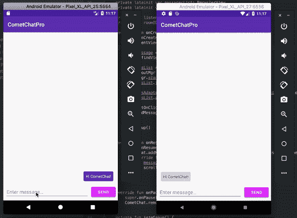

我鼓励你继续学习，但是如果你想直接跳到代码，你可以在 GitHub 上找到这个应用程序的完整代码。

# 创建一个 Android Studio 项目

启动一个新的 Android Studio 项目并选择**空活动**:

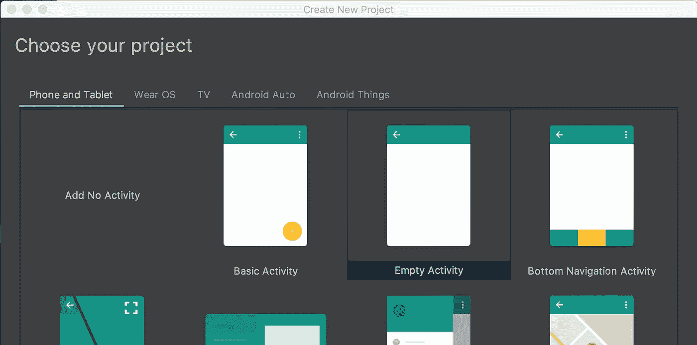

为您的应用程序输入一个名称，我将我的应用程序命名为“CometChat ”,并保留**该项目将支持即时应用程序**和**使用 AndroidX 工件**未选中:

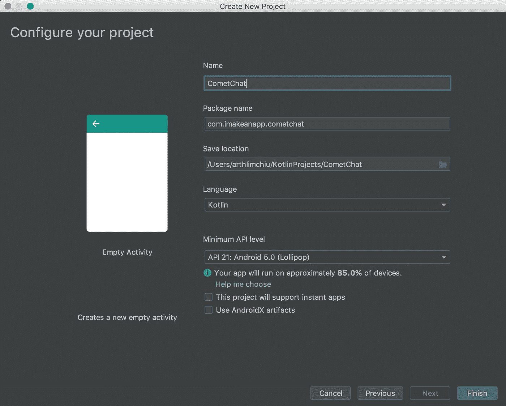

# 在我们的应用程序中设置 CometChat

让我们先安装 CometChat Pro SDK，以便我们使用它的服务。

1.打开您的`build.gradle`文件并添加这些 URL:

```
allprojects {
    repositories {
        google()
        jcenter()
        maven {
            url "https://dl.bintray.com/cometchat/pro"
        }
        maven {
            url "https://github.com/jitsi/jitsi-maven-repository/raw/master/releases"
        }
    }
}
```

为了下载 CometChat SDK，我们必须首先添加这些存储库。

2.在同一个`build.gradle`文件中，将这些行添加到`android`块中

```
android {
    compileSdkVersion 28
    defaultConfig {
        ...
    }
    compileOptions {
        sourceCompatibility JavaVersion.VERSION_1_8
        targetCompatibility JavaVersion.VERSION_1_8
    }
    buildTypes {
        ...
    }
}
```

CometChat SDK 使用 Java 8 语言特性，因此我们必须配置我们的项目来启用它。

3.同样在 build.gradle 文件中，将这些行添加到`dependencies`块中

```
dependencies {
    implementation fileTree(dir: 'libs', include: ['*.jar'])
    implementation "org.jetbrains.kotlin:kotlin-stdlib-jdk7:$kotlin_version" // Support
    implementation 'com.android.support:appcompat-v7:28.0.0'
    implementation 'com.android.support:design:28.0.0'
    implementation 'com.android.support.constraint:constraint-layout:1.1.3'
    implementation 'com.android.support:recyclerview-v7:28.0.0' // CometChat
    implementation 'com.cometchat:pro-android-chat-sdk:1.0.+' // Test
    testImplementation 'junit:junit:4.12'
    androidTestImplementation 'com.android.support.test:runner:1.0.2'
    androidTestImplementation 'com.android.support.test.espresso:espresso-core:3.0.2'
}
```

4.点击右上角的**立即同步**


# 把用户界面的东西去掉

现在我们已经安装了依赖项，让我们提前定义一些与 UI 相关的值。

1.打开应用程序/资源/值

2.更换`color.xml`:

```
<?xml version="1.0" encoding="utf-8"?>
<resources>
    <color name="colorPrimary">#673AB7</color>
    <color name="colorPrimaryDark">#512DA8</color>
    <color name="colorAccent">#E040FB</color>
    <color name="gray">#DDDDDD</color>
</resources>
```

这是我们为应用程序设置颜色的地方。如果你愿意，你可以把它定制成你想要的任何颜色。要获得灵感，请查看[材质调色板。](https://www.materialpalette.com/)

3.编辑`styles.xml`:

```
<resources>
    <!-- Base application theme. -->
    <style name="AppTheme" parent="Theme.MaterialComponents.Light.DarkActionBar">
        <!-- Customize your theme here. -->
        <item name="colorPrimary">@color/colorPrimary</item>
        <item name="colorPrimaryDark">@color/colorPrimaryDark</item>
        <item name="colorAccent">@color/colorAccent</item>
    </style></resources>
```

替换您的`parent`主题，使用我们在应用程序中设置 CometChat 时使用`implementation 'com.android.support:design:28.0.0`导入的材料设计主题。

4.编辑 **strings.xml**

您的`strings.xml`文件将包含您的 CometChat 应用 ID 和 API 密钥，我们将在下一节中创建:

```
<resources>
    <string name="app_name">CometChatPro</string>
    <string name="username">Username</string>
    <string name="join_chat">Join Chat</string>
    <string name="send">Send</string>
    <string name="enter_message">Enter message…</string>
    <string name="appID">YOUR_APP_ID_HERE</string>
    <string name="apiKey">YOUR_API_KEY_HERE</string>
</resources>
```

同样，现在不要担心你的 APP_ID_HERE 和你的 API_KEY_HER E。我们将在下一步中改变这一点。

# 创建并设置一个 CometChat Pro 帐户

1.如果您还没有，请[创建一个 CometChat 帐户](http://app.cometchat.com/#/login)

2.注册并登录后，前往您的[仪表盘](https://app.cometchat.com/#/login)

3.创建一个名为“CometChatPro”的新应用程序

4.创建 API 密钥:

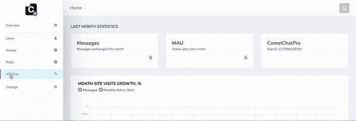

5.返回到您的`strings.xml`，粘贴您的应用 ID 和 API 密钥

```
<resources>
    ...
    <string name="appID">2179fddc591bf</string>
    <string name="apiKey">6cb3aa84e2c066ed8bb34d3a58b3d6904d829b6e</string>
</resources>
```

现在我们已经完成了所有这些设置，让我们测试一下是否可以启动到 CometChat Pro API 的连接。

# 在我们的应用程序中初始化 CometChat

现在我们已经创建了一个 API 密钥，让我们初始化应用程序中的 CometChat SDK，以便与 CometChat 服务器建立连接。

1.在`cometchat/cometchatpro`下创建一个名为`App.kt`的新类，并粘贴以下代码:

```
import android.support.v7.widget.RecyclerView
import android.view.LayoutInflater
import android.view.View
import android.view.ViewGroup
import android.widget.TextView
import com.cometchat.pro.models.BaseMessage
import com.cometchat.pro.models.TextMessageclass MessagesAdapter(private val uid: String,
                      private var messages: MutableList<BaseMessage>)  : RecyclerView.Adapter<MessagesAdapter.MessageViewHolder>() { companion object {
        private const val SENT = 0
        private const val RECEIVED = 1
    } override fun onCreateViewHolder(parent: ViewGroup, viewType: Int): MessageViewHolder {
        val view = when (viewType) {
            SENT -> {
                LayoutInflater.from(parent.context).inflate(R.layout.item_sent, parent, false)
            }
            else -> {
                LayoutInflater.from(parent.context).inflate(R.layout.item_received, parent, false)
            }
        }
        return MessageViewHolder(view)
    } override fun getItemCount() = messages.size override fun onBindViewHolder(holder: MessageViewHolder, position: Int) {
        holder.bind(messages[position])
    } override fun getItemViewType(position: Int): Int {
        return if (messages[position].sender?.uid!!.contentEquals(uid)) {
            SENT
        } else {
            RECEIVED
        }
    } fun updateMessages(messages: List<BaseMessage>) {
        this.messages = messages.toMutableList()
        notifyDataSetChanged()
    } fun appendMessage(message: BaseMessage) {
        this.messages.add(message)
        notifyItemInserted(this.messages.size - 1)
    } inner class MessageViewHolder(itemView: View) : RecyclerView.ViewHolder(itemView) { private val messageText: TextView = itemView.findViewById(R.id.message_text) fun bind(message: BaseMessage) {
            if (message is TextMessage) {
                messageText.text = message.text
            }
        }
    }
}
```

4.打开`AndroidManifest.xml`并添加我们新创建的应用程序类:

```
<manifest xmlns:android="http://schemas.android.com/apk/res/android"
          package="com.cometchat.cometchatpro">
    <application
            android:name=".App"
            android:allowBackup="true"
            android:icon="@mipmap/ic_launcher"
            android:label="@string/app_name"
            android:roundIcon="@mipmap/ic_launcher_round"
            android:supportsRtl="true"
            android:theme="@style/AppTheme">
        ...
    </application>
</manifest>
```

在模拟器或您自己的设备上运行应用程序。检查日志，您应该会看到文本“初始化完成:初始化成功”:

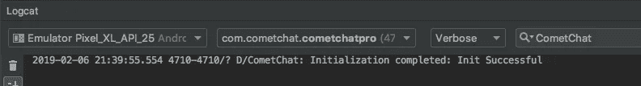

既然我们已经与 CometChat Pro 服务建立了联系，是时候让我们与它互动了。

在每一个聊天应用程序中，都有用户参与其中并相互交流。因此，让我们首先创建一个登录屏幕来验证我们的用户。

# 创建我们的身份验证用户界面

对于应用程序的每个用户，您需要创建一个 CometChat 用户。每个用户都有一个用户名和一个唯一的 ID (UID)。或者，您可以将其他元数据(如个人资料图片)与用户相关联，但这不是我们在此讨论的内容。你可以在[官方文档](https://prodocs.cometchat.com/docs/concepts#section-users)中阅读更多关于 CometChat 用户的信息。

使用 [CreateUser API](https://prodocs.cometchat.com/reference#createuser) 可以用代码创建 CometChat 用户。然而，为了简单起见，我们将通过 CometChat 仪表板来创建用户。

因为我们将手动创建用户，所以我们将只使用用户的 UID 登录。我们将为我们的 UID 创建一个文本字段，并创建一个用于登录的按钮。

1.在 res/layout 文件夹下，打开`activity_main.xml`，粘贴以下代码:

```
<?xml version="1.0" encoding="utf-8"?>
<android.support.constraint.ConstraintLayout 
    xmlns:android="http://schemas.android.com/apk/res/android"
    xmlns:app="http://schemas.android.com/apk/res-auto"
    android:layout_width="match_parent"
    android:layout_height="match_parent"> <EditText
        android:id="@+id/username"
        android:layout_width="0dp"
        android:layout_height="wrap_content"
        android:layout_marginStart="24dp"
        android:layout_marginTop="8dp"
        android:layout_marginEnd="24dp"
        android:layout_marginBottom="8dp"
        android:hint="@string/username"
        app:layout_constraintBottom_toBottomOf="parent"
        app:layout_constraintEnd_toEndOf="parent"
        app:layout_constraintStart_toStartOf="parent"
        app:layout_constraintTop_toTopOf="parent" /> <Button
        android:id="@+id/join_chat"
        android:layout_width="128dp"
        android:layout_height="wrap_content"
        android:layout_marginTop="8dp"
        android:text="@string/join_chat"
        app:layout_constraintEnd_toEndOf="@+id/username"
        app:layout_constraintStart_toStartOf="@+id/username"
        app:layout_constraintTop_toBottomOf="@+id/username" />
</android.support.constraint.ConstraintLayout>
```

2.运行应用程序，你应该有类似这样的东西

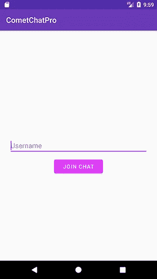

# 实现我们的验证码

在您创建了用于身份验证的 UI 之后，让我们通过使用 CometChat 服务器进行身份验证来添加登录功能。

1.打开您的`MainActivity.class`，粘贴以下代码:

```
class MainActivity : AppCompatActivity() { private lateinit var join: Button
    private lateinit var username: EditText override fun onCreate(savedInstanceState: Bundle?) {
        super.onCreate(savedInstanceState)
        setContentView(R.layout.activity_main) username = findViewById(R.id.username) join = findViewById(R.id.join_chat)
        join.setOnClickListener {
            disableAuthField()
            login()
        }
    } private fun disableAuthField() {
        join.isEnabled = false
        username.isEnabled = false
    } private fun login() {
        CometChat.login(username.text.toString(), getString(R.string.apiKey), object : CometChat.CallbackListener() {
            override fun onSuccess(user: User) {
                username.setText("")
                enableAuthField()
                Toast.makeText(this@MainActivity, "Login successful", Toast.LENGTH_SHORT).show()
            } override fun onError(e: CometChatException) {
                Toast.makeText(this@MainActivity, "Error or username doesn't exist.", Toast.LENGTH_SHORT).show()
                enableAuthField()
            }
        })
    } private fun enableAuthField() {
        join.isEnabled = true
        username.isEnabled = true
    }
}
```

但是等等！您可能会问自己“我如何创建用户？”。为了使本教程简单，我们将使用[仪表板](https://app.cometchat.com/#/apps)创建一个用户。对于实际的生产应用程序，您应该使用 [CreateUser API](https://prodocs.cometchat.com/reference#createuser) 来创建用户。

# 创建用户

转到您的[仪表盘](https://app.cometchat.com/#/apps)并点击 CometChatPro 应用程序下方的**探索**按钮

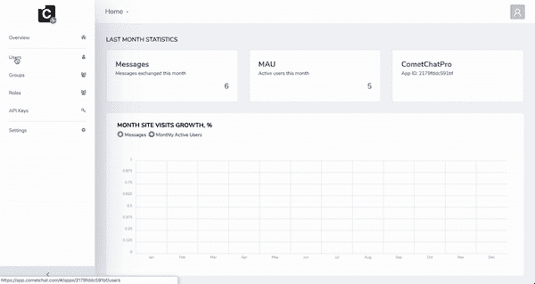

如您所见，CometChat 提供了一组现有的示例用户。您也可以使用这个，但是创建用户也非常简单。

记下您刚刚创建的用户的 UID，因为我们将使用它来登录我们的应用程序。

# 登录 CometChat

使用我们刚刚创建的用户的 UID“user 1”。

1.运行应用程序

2.在用户名输入中，输入“用户 1”

3.点击**登录**，你会看到一个提示“登录成功”的提示

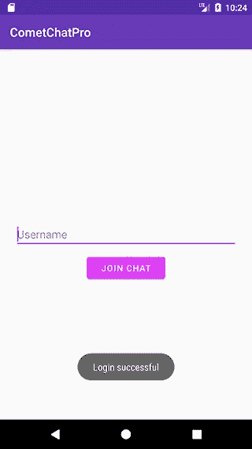

现在我们可以登录了，让我们进入本教程最精彩的部分，开发聊天功能！

我们将学习如何使用 CometChat 实时发送、获取和监听消息。😎

# 使用 CometChat 群组创建聊天室

它有很多名字——对话、聊天室或群组。重要的是，对于用户来说，要相互交流，他们必须有相互传递信息的方法。

这就是 CometChat 组的用武之地。把群组想象成一个聊天室，让用户发送他们的信息，也让群组中的其他人接收信息。

出于本教程的目的，我们将使用 CometChat 仪表板进行分组。如果您愿意，也可以用代码动态创建一个组。更多信息请点击。

1.在侧边栏中，点击**群组**:

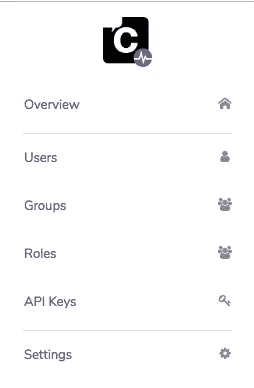

2.CometChat 为您提供了一个名为“超群”的样本群。创建自己的群也很容易。


3.点击**创建群组**

4.输入 **GUID、名称和类型**

5.单击**创建组**并记下 GUID，因为我们将在后面的步骤中使用它

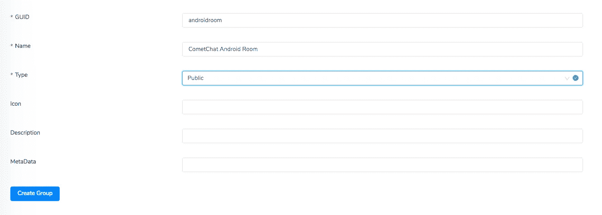

# 创建我们的消息屏幕用户界面

现在我们已经创建了一个组，我们将创建发送和显示聊天消息的 UI。

1.在`cometchat/cometchatpro`下创建一个名为`MessagesActivity`的新的空活动

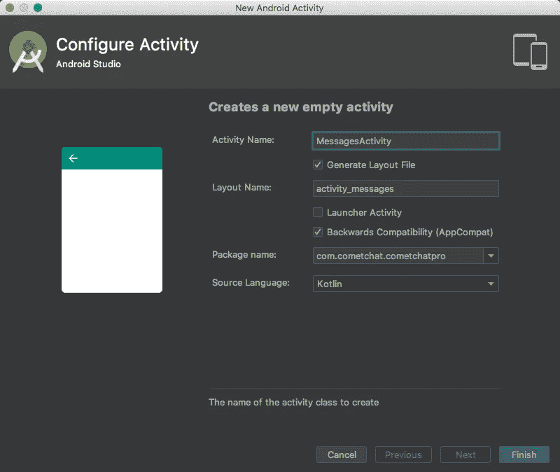

2.打开您的`activity_messages.xml`布局并粘贴以下代码:

```
<?xml version="1.0" encoding="utf-8"?>
<android.support.constraint.ConstraintLayout
    xmlns:android="http://schemas.android.com/apk/res/android"
    xmlns:app="http://schemas.android.com/apk/res-auto"
    android:layout_width="match_parent"
    android:layout_height="match_parent"> <android.support.v7.widget.RecyclerView
        android:id="@+id/messages"
        android:layout_width="0dp"
        android:layout_height="0dp"
        android:layout_marginStart="8dp"
        android:layout_marginTop="8dp"
        android:layout_marginEnd="8dp"
        android:layout_marginBottom="8dp"
        app:layout_constraintBottom_toTopOf="@+id/enter_message"
        app:layout_constraintEnd_toEndOf="parent"
        app:layout_constraintStart_toStartOf="parent"
        app:layout_constraintTop_toTopOf="parent" /> <EditText
        android:id="@+id/enter_message"
        android:layout_width="0dp"
        android:layout_height="wrap_content"
        android:layout_marginStart="8dp"
        android:layout_marginEnd="8dp"
        android:layout_marginBottom="8dp"
        android:hint="@string/enter_message"
        app:layout_constraintBottom_toBottomOf="parent"
        app:layout_constraintEnd_toStartOf="@+id/send_message"
        app:layout_constraintHorizontal_bias="0.5"
        app:layout_constraintStart_toStartOf="parent" /> <Button
        android:id="@+id/send_message"
        android:layout_width="wrap_content"
        android:layout_height="wrap_content"
        android:layout_marginEnd="8dp"
        android:text="@string/send"
        app:layout_constraintBottom_toBottomOf="@+id/enter_message"
        app:layout_constraintEnd_toEndOf="parent"
        app:layout_constraintHorizontal_bias="0.5"
        app:layout_constraintStart_toEndOf="@+id/enter_message"
        app:layout_constraintTop_toTopOf="@+id/enter_message" /></android.support.constraint.ConstraintLayout>
```

3.如果登录成功，打开您的`MainActivity.class`并启动我们的`MessagesActivity`

```
private fun login() {
  CometChat.login(username.text.toString(), getString(R.string.apiKey), object : CometChat.CallbackListener() {
    override fun onSuccess(user: User) {
      username.setText("")
      enableAuthField()
      val intent = Intent(this@MainActivity, MessagesActivity::class.java)
      startActivity(intent)
    }
    ...
  })
}
```

运行应用程序，当我们以“用户 1”的身份登录时，它应该会启动我们的`MessagesActivity`


# 发送消息

在 CometChat 中，有两种消息: [TextMessage](https://prodocs.cometchat.com/docs/android-appendix#section-textmessage) 和 [MediaMessage](https://prodocs.cometchat.com/docs/android-appendix#section-mediamessage) 。在本教程中，我们将只关注文本消息。

1.在 res/drawable 文件夹下，创建两个新的 drawable:

`item_received_background.xml`:

```
<?xml version="1.0" encoding="utf-8"?>
    <shape xmlns:android="http://schemas.android.com/apk/res/android">
        <solid android:color="@color/gray" />
        <corners android:radius="4dp" />
    </shape>
```

`item_sent_background.xml`:

```
<?xml version="1.0" encoding="utf-8"?>
<shape xmlns:android="http://schemas.android.com/apk/res/android">
    <solid android:color="@color/colorPrimary" />
    <corners android:radius="4dp" />
</shape>
```

2.在 res/layout 文件夹下，创建两个新布局:

`item_received.xml`:

```
<?xml version="1.0" encoding="utf-8"?>
    <LinearLayout
        xmlns:android="http://schemas.android.com/apk/res/android"
        android:layout_width="match_parent"
        android:layout_height="wrap_content"
        android:orientation="vertical">
        <TextView
            android:id="@+id/message_text"
            android:layout_width="wrap_content"
            android:layout_height="wrap_content"
            android:layout_margin="8dp"
            android:background="@drawable/item_received_background"
            android:gravity="center"
            android:padding="8dp" />
    </LinearLayout>
```

`item_sent.xml`:

```
<?xml version="1.0" encoding="utf-8"?>
<LinearLayout
    xmlns:android="http://schemas.android.com/apk/res/android"
    android:layout_width="match_parent"
    android:layout_height="wrap_content"
    android:orientation="vertical">
    <TextView
        android:id="@+id/message_text"
        android:layout_width="wrap_content"
        android:layout_height="wrap_content"
        android:layout_gravity="end"
        android:layout_margin="8dp"
        android:background="@drawable/item_sent_background"
        android:gravity="center"
        android:padding="8dp"
        android:textColor="@android:color/white" />
</LinearLayout>
```

3.创建一个新类— `MessagesAdapter`并粘贴以下代码:

```
import android.support.v7.widget.RecyclerView
import android.view.LayoutInflater
import android.view.View
import android.view.ViewGroup
import android.widget.TextView
import com.cometchat.pro.models.BaseMessage
import com.cometchat.pro.models.TextMessageclass MessagesAdapter(private val uid: String,
                      private var messages: MutableList<BaseMessage>)  : RecyclerView.Adapter<MessagesAdapter.MessageViewHolder>() { companion object {
        private const val SENT = 0
        private const val RECEIVED = 1
    } override fun onCreateViewHolder(parent: ViewGroup, viewType: Int): MessageViewHolder {
        val view = when (viewType) {
            SENT -> {
                LayoutInflater.from(parent.context).inflate(R.layout.item_sent, parent, false)
            }
            else -> {
                LayoutInflater.from(parent.context).inflate(R.layout.item_received, parent, false)
            }
        }
        return MessageViewHolder(view)
    } override fun getItemCount() = messages.size override fun onBindViewHolder(holder: MessageViewHolder, position: Int) {
        holder.bind(messages[position])
    } override fun getItemViewType(position: Int): Int {
        return if (messages[position].sender?.uid!!.contentEquals(uid)) {
            SENT
        } else {
            RECEIVED
        }
    } fun updateMessages(messages: List<BaseMessage>) {
        this.messages = messages.toMutableList()
        notifyDataSetChanged()
    } fun appendMessage(message: BaseMessage) {
        this.messages.add(message)
        notifyItemInserted(this.messages.size - 1)
    } inner class MessageViewHolder(itemView: View) : RecyclerView.ViewHolder(itemView) { private val messageText: TextView = itemView.findViewById(R.id.message_text) fun bind(message: BaseMessage) {
            if (message is TextMessage) {
                messageText.text = message.text
            }
        }
    }
}
```

4.打开你的`MessagesActivity.class`，粘贴以下代码。确保将`roomID`字段设置为“androidroom ”,这是我们之前创建的:

```
import android.os.Bundle
import android.support.v7.app.AppCompatActivity
import android.support.v7.widget.LinearLayoutManager
import android.support.v7.widget.RecyclerView
import android.util.Log
import android.widget.Button
import android.widget.EditText
import com.cometchat.pro.constants.CometChatConstants
import com.cometchat.pro.core.CometChat
import com.cometchat.pro.exceptions.CometChatException
import com.cometchat.pro.models.TextMessageclass MessagesActivity : AppCompatActivity() { private lateinit var enterMessage: EditText
    private lateinit var send: Button
    private lateinit var messagesList: RecyclerView
    private lateinit var messagesAdapter: MessagesAdapter private val roomID = "androidroom" override fun onCreate(savedInstanceState: Bundle?) {
        super.onCreate(savedInstanceState)
        setContentView(R.layout.activity_messages) enterMessage = findViewById(R.id.enter_message)
        send = findViewById(R.id.send_message) messagesList = findViewById(R.id.messages)
        val layoutMgr = LinearLayoutManager(this)
        layoutMgr.stackFromEnd = true
        messagesList.layoutManager = layoutMgr messagesAdapter = MessagesAdapter(CometChat.getLoggedInUser().uid, mutableListOf())
        messagesList.adapter = messagesAdapter send.setOnClickListener {
            sendMessage()
        }

        joinGroup()
    } private fun joinGroup() {
        CometChat.joinGroup(
            roomID,
            CometChatConstants.GROUP_TYPE_PUBLIC,
            "",
            object : CometChat.CallbackListener<String>() {
                override fun onSuccess(successMessage: String) {
                    Log.d("CometChat", "Group join successful")
                } override fun onError(e: CometChatException) {
                    e.code?.let {
                        // For now, we'll just keep on attempting to join the group
                        // because persistence is out of the scope for this tutorial
                        if (it.contentEquals("ERR_ALREADY_JOINED")) {
                            Log.d("CometChat", "Already joined the group")
                        }
                    }
                }
            })
    } private fun sendMessage() {
        val textMessage = TextMessage(
            roomID,
            enterMessage.text.toString(),
            CometChatConstants.MESSAGE_TYPE_TEXT,
            CometChatConstants.RECEIVER_TYPE_GROUP
        ) CometChat.sendMessage(textMessage, object : CometChat.CallbackListener<TextMessage>() {
            override fun onSuccess(message: TextMessage) {
                enterMessage.setText("")
                messagesAdapter.appendMessage(message)
                scrollToBottom()
            } override fun onError(e: CometChatException) {
                Log.d("CometChat", "Message send failed: ${e.message}")
            }
        })
    } private fun scrollToBottom() {
        messagesList.scrollToPosition(messagesAdapter.itemCount - 1)
    }
}
```

注意`joinGroup()`功能。

我们必须先加入群，然后才能向群发送消息。暂时忽略`onError(…)`部分，因为我们将尝试继续加入该组，因为持久性现在超出了我们的范围。

5.运行应用程序并尝试发送消息。你应该有这样的东西。

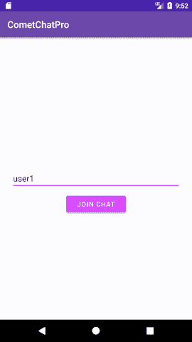

很棒吧？！😉

但是有一个问题。如果你把 app 杀了，重新登录，屏幕是空的。我们的信息去了哪里？继续下一步，找出答案

# 获取以前的消息

在上一步中，我们能够发送消息，但当我们再次打开应用程序时，屏幕是空的。

不要担心，我们的消息真的发送了，它存储在 CometChat 中。我们只需要一种方法来获取在组中发送的消息。

1.打开`MessagesActivity.class`并添加`fetchMessages()`功能

```
class MessagesActivity : AppCompatActivity() {
    ...
    override fun onCreate(savedInstanceState: Bundle?) {
        ...
    } private fun joinGroup() {
        CometChat.joinGroup(
            roomID,
            CometChatConstants.GROUP_TYPE_PUBLIC,
            "",
            object : CometChat.CallbackListener<String>() {
                override fun onSuccess(successMessage: String) {
                    fetchMessages()
                } override fun onError(e: CometChatException) {
                    e.code?.let {
                        // For now, we'll just keep on attempting to join the group
                        // because persistence is out of the scope for this tutorial
                        if (it.contentEquals("ERR_ALREADY_JOINED")) {
                            fetchMessages()
                        }
                    }
                }
            })
    } private fun fetchMessages() {
        val messagesRequest = MessagesRequest.MessagesRequestBuilder()
            .setGUID(roomID)
            .setLimit(30)
            .build() messagesRequest.fetchPrevious(object : CometChat.CallbackListener<List<BaseMessage>>() {
            override fun onSuccess(messages: List<BaseMessage>) {
                messagesAdapter.updateMessages(messages.filter { it is TextMessage })
                scrollToBottom()
            } override fun onError(e: CometChatException) {
                Log.d("CometChat", "Fetch messages failed: ${e.message}")
            }
        })
    }
    ...
}
```

2.运行应用程序，您应该会看到您不久前发送的消息🎉

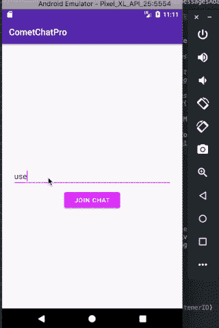

我知道你在想什么。

“老兄，我知道我现在可以发送消息并查看我的消息了。但自言自语会有点奇怪，对吧？”

不要担心！下一步，我们将学习如何实时接收来自其他真实人物的信息！

# 实时接收消息！

1.修改我们的`MessagesActivity.class`以收听新消息:

```
class MessagesActivity : AppCompatActivity() {
    ...
    private val listenerID = "MESSAGES_LISTENER" override fun onCreate(savedInstanceState: Bundle?) {
        ...
    } override fun onResume() {
        super.onResume()
        CometChat.addMessageListener(listenerID, object : CometChat.MessageListener() {
            override fun onTextMessageReceived(message: TextMessage) {
                messagesAdapter.appendMessage(message)
                scrollToBottom()
            }
        })
    } override fun onPause() {
        super.onPause()
        CometChat.removeMessageListener(listenerID)
    }
    ...
}
```

就这样？！是的，在 CometChat 中实时接收其他用户的消息就是这么简单。

2.在两个模拟器或设备中运行应用程序。以“用户 1”的身份登录第一个，以“超级英雄 1”的身份登录另一个 CometChat 提供的示例用户之一。这是你应该看到的:

恭喜🎉！您刚刚创建了您的第一个 Android 聊天应用程序！给自己一个鼓励。奖励自己。与你的朋友分享，如果你有时间，也教他们如何做一个。

如果你已经做到这一步，我们想说非常感谢你花时间真正完成教程。

我们希望你学到了一些东西，至少对你作为 Android 开发者的旅程有所影响。

# 接下来去哪里？

本教程只是你可以用 CometChat 做的事情的冰山一角。为了提高你的成绩，这里有一些资源可以帮助你:

[CometChat Pro Android 文档](https://prodocs.cometchat.com/docs/android-quick-start)

也可以查看其他平台的 CometChat Pro。

[CometChat Pro iOS 文档](https://prodocs.cometchat.com/docs/ios-quick-start)

[CometChat Pro Javascript 文档](https://prodocs.cometchat.com/docs/js-quick-start)