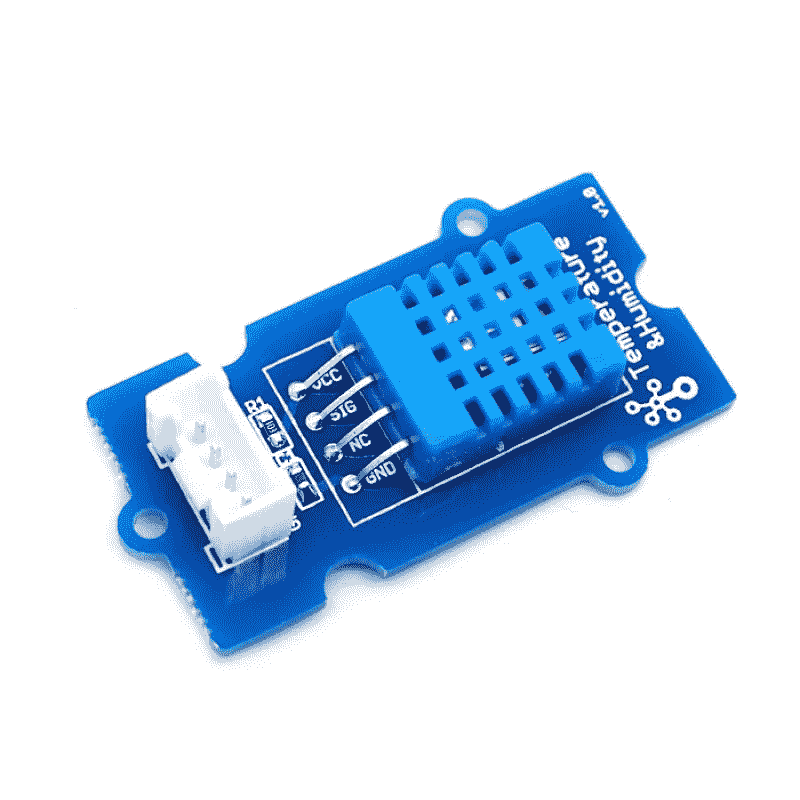
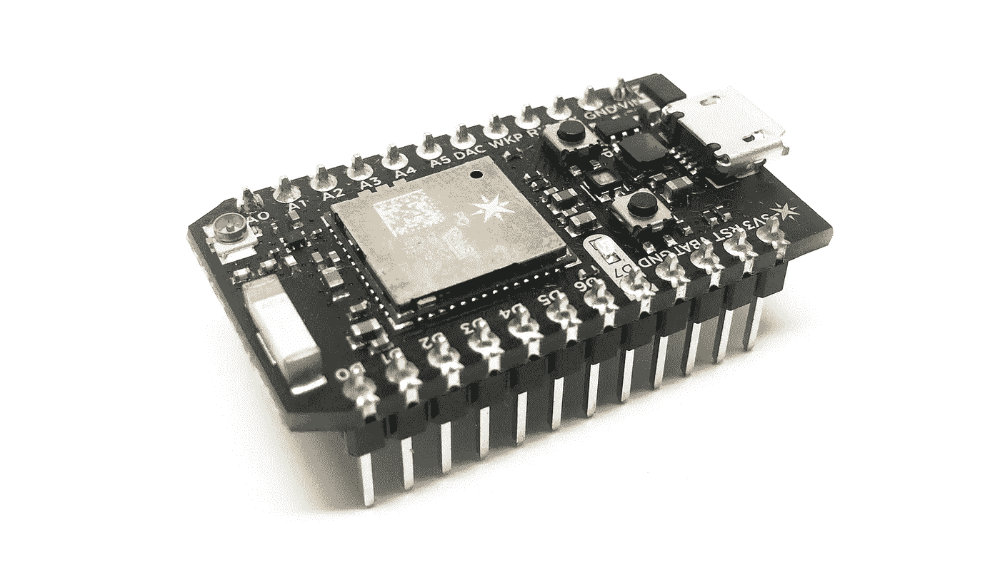
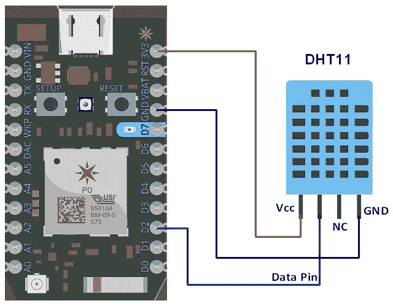
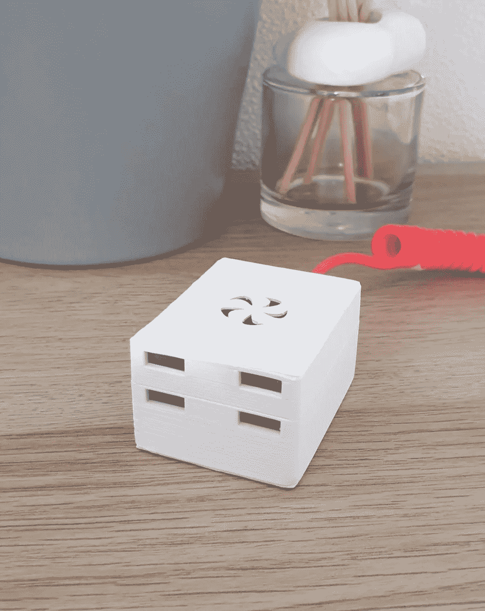
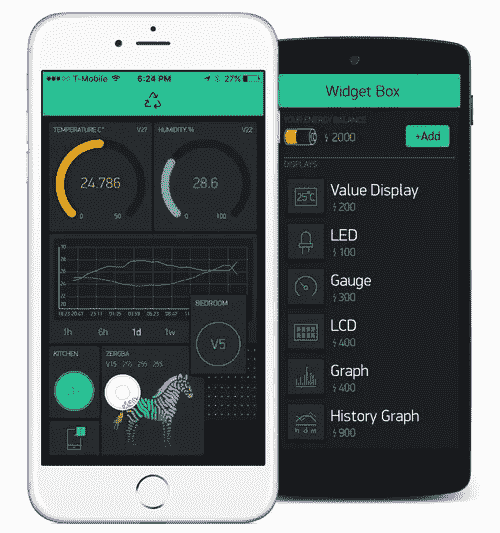
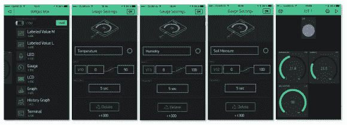

# 用粒子光子、Blynk 和 3D 打印的外壳构建一个好看的物联网设备。

> 原文：<https://itnext.io/build-a-neat-iot-product-with-the-particle-photon-blynk-and-a-3d-printed-enclosure-63d78d871778?source=collection_archive---------2----------------------->


几个月前，我在沙滩上散步，意识到我的软件工程生活道路主要是抽象的逻辑，而不是你可以触摸的东西，有点被海浪拍打海岸迷住，有点被这种物理愿望驱动，我决定建造一个物联网设备来监控我周围的环境，将赋予我平淡无奇的生活以意义。

所有这些的储存库在这里:[https://github.com/lucavallin/hytta](https://github.com/lucavallin/hytta)

# **项目简史**

我以前从未使用过这样的设备，从海边一回到家，我就开始研究这个话题，并想出了可能的解决方案。开始时，我的目标不仅是创造一个好的产品，而且将这一经历作为对我的技能的**练习，然而，我不得不审查我的计划几次，因为范围变得要么**太广，一个人完成需要太长时间**，要么最终产品会不那么令人满意(或复制成本太高)。对了，如果你想了解更多关于物联网的知识，这里有**两本我正在读或者已经读过的好书**:[设计物联网](https://www.wiley.com/en-us/Designing+the+Internet+of+Things-p-9781118430620)(基础)和[建筑师物联网](https://www.packtpub.com/hardware-and-creative/internet-things-architects)(高级)。**

以下是一些被放弃的计划:



*   **RaspberryPi 和 Grove 传感器**，两者都非常易于使用，Grove 传感器不需要焊接，是原型制作的良好选择。然而，最终的产品太过笨重，整体上很难看，不适合斯堪的纳维亚风格的室内装饰。产品也必须好看。此外， **RaspberryPi** 是一台成熟的电脑，我讨厌设置东西，Arduino 和类似的主板有更多我喜欢的即插即用风格。
*   我想提高我的 GoLang 技能，并认为在这个项目中使用它可能是一件有趣的事情，但事实证明，Python 似乎是这里的王(在 RaspberryPi 上),大多数传感器库不支持其他语言。我也不得不放弃这个计划，最终，满足于物联网世界中最常见的(也是理智的人的)选择: **C++** 。
*   起初，构建自己的 API 似乎是一个明智之举——只是我意识到自己做每件事要花多长时间，对我的周末来说太多了。我也考虑过使用 AWS IoT 或 Google Cloud 之类的工具，但最终一个完全托管的平台最有意义。
*   我本来打算只用一些**纸板和胶水来做外壳**，但这并不能真正提供光滑的外观，除非你能生产出谷歌纸板级别的东西。不是我的案子。

接下来是我经过几个月的尝试后得出的结论，我觉得它很棒。

# 粒子光子



粒子光子是一项真正令人惊叹的工程。它可以像 Arduino 一样编程，但它只有信用卡的一半大小，集成了 WiFi，在[他们的网站](https://store.particle.io/products/photon)或 [Seeed Studio](https://www.seeedstudio.com/Particle-Photon-SMALL-AND-POWERFUL-WI-FI-CONNECTED-MICROCONTROLLER-p-2527.html) 或[这里](https://www.kiwi-electronics.nl/photon-met-headers?lang=en)只需 20 欧元。

它的伟大之处在于:

*   [**粒子云**](https://console.particle.io/) **，**一个完全托管的云解决方案，您可以在其中检查电路板的状态，向其发送消息，调用固件中运行的功能，无线更新，一个可以转售给客户的白标门户，集成和认证提供商，以及一个 Web-IDE。如果你选择[任何支持蜂窝的板](https://store.particle.io/collections/cellular)，你甚至可以在那里管理 sim 卡。前 100 台设备完全免费，这真他妈的太棒了。
*   [**粒子 CLI**](https://docs.particle.io/reference/developer-tools/cli/) 让你设置(这是你要运行的第一个命令)设备的名称、操作系统(一个最小的固件，这样你可以管理板)、WiFi 连接和他们的云的授权密钥。还有许多其他命令可用，使您能够编译和刷新固件，或者检查主板中的任何错误。您还可以从资源库中搜索并安装要在您自己的设备中使用的库。
*   [**Particle work bench**](https://www.particle.io/workbench/)，一个 Visual Studio 代码扩展，可以与开发板和 CLI 无缝协作，允许您从 **IDE 做任何事情。**

关于它还有很多可以说的，但我只是建议你看看[粒子文档](https://docs.particle.io)中的**快速入门/教程/参考**部分。

# 感觉

由于上述原因，在抛弃了 Grove DHT 传感器( **DHT =数字湿度和温度**)之后，我花了几欧元给自己买了一个**宽松版****(没有“包装”，以便可以安装在试验板上——一个小的，这个项目有 170 个引脚)。**

****

**布线是直截了当的，但注意不要颠倒 Vcc 和 GND，因为传感器会爆炸起火(我知道，因为它发生了两次)。根据数据手册，**数据引脚**上还需要一个上拉电阻——我目前没有使用，也没有遇到任何问题，但我不是电子工程师，我可能错得很离谱。**

**重要的是，DHT11 传感器(我正在使用的)**不是很精确**，温度可能会相差 2 度(与 DHT22 相反，DHT 22 更贵、更大、更精确)。**

# **围场**

**我最近买了一台 3D 打印机(这个话题你可以**在这里阅读更多**关于[的内容)，这样我就可以用一个更复杂的盒子代替纸板和胶水的盒子，我可以在](https://medium.com/@lucavallin/getting-started-with-3d-printing-7115f1aa87f8) [Thingiverse](https://www.thingiverse.com/thing:1994442) 上找到这个盒子。**

****

**它的设计正好适合粒子光子和我的试验板，为 USB 电缆、通风和检查板上的状态 LED 留下了孔。我发现的唯一问题是，由于微控制器的原因，**里面的空气比外面的**要热一点，所以测量是不现实的。这可能会通过固件调整或增加更多的**通风**来解决。**

**无论如何，打印两个部分(底座和卡扣式盖子)**需要大约两个小时，并且不需要支架**，即使是侧面的开口。封面最好是上下颠倒印刷，尽管这会影响封面的质量——封面也有点太薄，容易翘曲。**

# **布林克**

**[Blynk](https://blynk.io/) 是一个与硬件无关的物联网平台，具有可定制的移动应用、私有云、设备管理、分析和机器学习。**

****

**它为构建联网设备提供了完整的解决方案，我选择它是因为它非常适合与 tom 一起工作，而且**你可以在几个小时内准备好一个完美的应用**，包括所有部分——我真的想不出更完整的概念。此外，还支持多种电路板和语言。**

*   ****Blynk 应用**可以从 App Store 和谷歌 Play 商店下载。您需要创建一个新项目，选择您希望使用的板，然后您将能够从广泛的组件中选择创建一个仪表板。每个组件都可以以多种方式进行配置，例如你可以定制标签和颜色，但最重要的是，**设备上的引脚**，它将从该引脚获取输入或提供输出(稍后将详细介绍)。他们还提供**白标计划**，所以你可以创建和销售一个基于 Blynk 的应用程序作为你的产品。**
*   **[**Blynk 库**](https://github.com/blynkkk/blynk-library) (这里是 C++版本)提供了你在应用和设备之间交换消息所需的所有工具。你需要一个**认证令牌(当你创建一个新项目时通过电子邮件提供)**来连接，其他的都在这里解释:[http://docs.blynk.cc/#blynk-firmware](http://docs.blynk.cc/#blynk-firmware)。关于 Blynk 最令人印象深刻的事实是，你可能**最终根本不写任何代码**，读取指令可以在应用程序中配置，一旦客户端在设备上启动，它将自动获取并运行那个**配置**。在这里阅读:http://docs.blynk.cc/#blynk-main-operations-virtual-pins。**

****

*   **[**Blynk 服务器**](http://docs.blynk.cc/#blynk-server) 处理与设备之间的通信，您可以使用他们的(有限制，小工具有价格，您也可以免费使用 3 或 4 个)或托管您自己的，以访问**无限的组件**。**

# **固件**

**最后，这里是设备固件的样子。首先，确保您在 Visual Studio 代码中安装了 **Particle Workberch** 扩展，并将 *project.properties* 文件放入项目目录(****目录结构遵循一组规则**，这些规则有助于保持所有粒子固件的标准和易于理解，请参见此处的文档:[https://docs . Particle . io/tutorials/developer-tools/CLI/# working-with-projects-and-libraries](https://docs.particle.io/tutorials/developer-tools/cli/#working-with-projects-and-libraries)****

```
**name=hytta
dependencies.blynk=0.5.4
dependencies.PietteTech_DHT=0.0.9**
```

****该配置除了设置项目名称之外，还定义了两个依赖项，Blynk 和从 DHT 传感器读取的库。****

******让我们来看看。现在的 ino 文件:******

```
**#include "PietteTech_DHT.h"
#include <blynk.h>

// Setup Blynk serial output for debug prints and auth
// (get the auth token in the Blynk app project settings)
#define BLYNK_PRINT Serial
char blynkAuth[] = "";
BlynkTimer timer;

// Setup DHT sensor DHT11/21/22/AM2301/AM2302 and digital pin (D0 cannot be used)
#define DHTTYPE DHT11
#define DHTPIN D4
PietteTech_DHT DHT(DHTPIN, DHTTYPE);**
```

****这里我包括了两个库并设置了 Blynk 客户端，这需要我之前提到的 **auth token** 。创建一个 BlynkTimer 对象，这将用于**定期调用我的读取和发送数据功能**。最后，DHT 阅读器按照库文档的规定进行设置(并避免引脚 D0，因为它不支持中断，所以与 PietteTech_DHT 不兼容**。******

```
**void setup()
{
  Serial.begin(9600);
  delay(5000);
  // Read sensor once per minute
  timer.setInterval(60000L, readDHT);
  Blynk.begin(blynkAuth);
  DHT.begin();
}**
```

******设置功能**建立串行通信，并在向定时器分配运行功能(每分钟一次)后，初始化 Blynk 客户端和 DHT 阅读器。****

******分配给定时器的 readDHT 函数如下:******

```
**// Blynk currently handles the waiting time, if this wasn't the case it would be
// a good rule to wait ~2500ms between each read according to the PietteTech_DHT library
void readDHT()
{
  int result = DHT.acquireAndWait(1000);

  switch (result)
  {
  case DHTLIB_OK:
    Serial.println("OK");
    Particle.publish("status", "OK", PRIVATE);
    break;
  case DHTLIB_ERROR_CHECKSUM:
    Serial.println("Error\n\r\tChecksum error");
    Particle.publish("status", "Checksum error", PRIVATE);
    break;
  case DHTLIB_ERROR_ISR_TIMEOUT:
    Serial.println("Error\n\r\tISR time out error");
    Particle.publish("status", "ISR time out error", PRIVATE);
    break;
  case DHTLIB_ERROR_RESPONSE_TIMEOUT:
    Serial.println("Error\n\r\tResponse time out error");
    Particle.publish("status", "Response time out error", PRIVATE);
    break;
  case DHTLIB_ERROR_DATA_TIMEOUT:
    Serial.println("Error\n\r\tData time out error");
    Particle.publish("status", "Data time out error", PRIVATE);
    break;
  case DHTLIB_ERROR_ACQUIRING:
    Serial.println("Error\n\r\tAcquiring");
    Particle.publish("status", "Acquiring", PRIVATE);
    break;
  case DHTLIB_ERROR_DELTA:
    Serial.println("Error\n\r\tDelta time too small");
    Particle.publish("status", "Delta time too small", PRIVATE);
    break;
  case DHTLIB_ERROR_NOTSTARTED:
    Serial.println("Error\n\r\tNot started");
    Particle.publish("status", "Not started", PRIVATE);
    break;
  default:
    Serial.println("Unknown error");
    Particle.publish("status", "Unknown error", PRIVATE);
    break;
  }

  // Get temperature and humidity, then send some data to serial
  // and the Particle cloud for debugging
  float temperature = DHT.getCelsius();
  Serial.print("Temperature (oC): ");
  Serial.println(temperature, 2);
  Particle.publish("temperature", String(temperature), PRIVATE);

  float humidity = DHT.getHumidity();
  Serial.print("Humidity (%): ");
  Serial.println(humidity, 2);
  Particle.publish("humidity", String(humidity), PRIVATE);

  // Send data to the Blynk API
  Blynk.virtualWrite(0, temperature);
  Blynk.virtualWrite(1, humidity);
}**
```

****首先，它从 DHT 传感器获取数据，处理一些“坏的”(和好的)结果，**然后获得实际数据**，连同一些调试信息，通过串行发送到带有***Particle . publish***的粒子云。在底部，我使用 virtualWrite 方法将值写入 Blynk 的虚拟引脚(当 Blynk 无法根据配置直接读取模拟/数字引脚**但需要更多处理时，用于替代模拟/数字引脚**，就像在这种情况下使用读取逻辑一样)。********

****最后，这是循环:****

```
void loop()
{
  Blynk.run();
  timer.run();
}
```

**在 Blynk 和 timer 上调用 **run** 方法，该方法将负责**处理与 Blynk 服务器**的通信，并按照规定读取温度和湿度值。**

**要让它真实，你需要编译固件，把粒子光子放在 [**DFU 模式**](https://docs.particle.io/tutorials/device-os/led/photon/#dfu-mode-device-firmware-upgrade-) 然后闪一下。过一会儿，你应该开始看到数据进入 Blynk 应用程序(和粒子云中)。**

# **一锤定音**

**从那天在海滩上开始，这是一段相当长的旅程，我学到了很多关于物联网、足球和传感器的知识。我再次认识到**坚持最普通的路径**(如在 C++和微控制器中)可以非常有助于实现更好的结果，而没有不必要的复杂性，毕竟如果大多数人都这样做是有原因的。**

****

**传感器可能看起来像神秘的物体，但最终它们被证明只是能够感知世界的**电子设备，这要归功于明确定义的物理现象**(如果你不在这个过程中烧掉它们)。**

**整个项目中最大的推动者是 Blynk，如果没有他，我会有太多的事情要做。与设备之间的通信、存储数据和在赏心悦目的仪表板中显示听起来像是一个提高技能的好挑战，但对一个人来说这真的需要很长时间。**

**3D 打印我自己的外壳**也非常令人满意**，这是我第一次能够完成一个看起来(几乎)像是在商店里买的真实世界的物理设备——很神奇吧？**

**希望你喜欢这个故事，也希望这篇文章能激励你创造出属于你自己的东西😃**

*****想了解更多关于物联网和创新的知识？退房***[https://www.linkedin.com/in/lucavallin/](https://www.linkedin.com/in/lucavallin/)**