# 使用 React 构建渐进式 Web 应用程序

> 原文：<https://itnext.io/build-a-progressive-web-app-using-react-d9784251e07e?source=collection_archive---------4----------------------->

**使用 React 的渐进式 Web 应用程序！**当我读到这里时，我想，为什么不自己造一个呢。如果你熟悉 React，并对它的生态系统有所了解，比如 Create-React-App utility，那么这个指南就是为你准备的。

如果你一天中至少有三分之一的时间是在互联网上度过的，那么你就会到处看到或读到进步的网络应用。*没有？* PWA 是专注于性能的 web 应用程序，特别适合移动设备。它们可以保存在设备的主屏幕上，并且往往由原生应用程序的感觉和外观组成。我在移动设备上使用的第一个 PWA 应用程序是几个月前发布的 Lite Twitter。如果你想试试的话，下面是链接:[https://lite.twitter.com/](https://lite.twitter.com/)。现在他们甚至支持推送通知和离线支持。

# 入门指南

让我们使用*Create-React-App*generator 创建一个基本的 React app，这是一个官方搭建工具，用于生成由*脸书*发布和维护的 *Reactjs* *App* 。要安装它，我们将使用我们的命令行工具:

安装过程完成后，转到所需的目录并创建一个空项目。从命令行界面运行:

继续，看看目录结构和 **package.json** 文件。看看这个搭建工具有哪些依赖关系。

CRA 或 Create React App 是我目前用来用 React 构建应用程序和原型的最省事的工具之一。它在幕后运行着所有那些巴别塔、网络包之类的东西。如果您想了解更多信息或想要定制流程，请阅读此处的。

我希望，不管时间表如何，您的 package.json 文件看起来像这样:

我们还需要一个依赖项，那就是 React-Router:回到您的终端:

现在，您可以尝试从终端运行应用程序，看看是否一切正常:

样板代码如下所示:

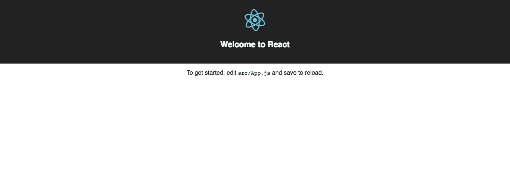

# 构建 PWA 应用程序

因为本指南的唯一目的是让您熟悉构建过程，所以我不打算开发一个复杂的应用程序。为了简单和您的宝贵时间，我们将构建一个简单的应用程序。转到`src/App.js`文件，进行如下修改:

在上面我们包含了两个使用`react-router-dom.`的页面，我们进一步定义了`src/components/`目录中关于组件的 **Home** 和**。使用这种方法并确保 react 组件简短易读始终是最佳实践。**

对于`Home.js`:

对于`About.js`:

现在看看是否一切正常，从你的终端窗口运行`npm start`，你会得到类似的结果:

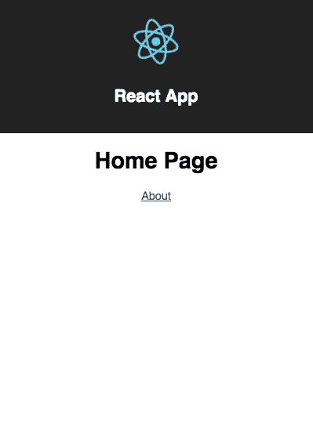

如果点击**关于**按钮/超链接，`react-router-dom`将呈现**关于**页面，而不改变在`App.js`中定义的公共标题部分。这是一个最简单的单页应用程序。

我们的主要工作还没有完成。让我们将这个简单的 React 应用程序转换成 PWA。

# 安装灯塔

Lighthouse 是谷歌的一款免费工具，可以根据他们的 PWA 清单评估你的应用。从[这里](https://developers.google.com/web/tools/lighthouse/)添加到你的 Chrome 浏览器。作为一个扩展安装后，我们可以通过点击右上角的灯塔来开始审核过程，在那里你的浏览器中可能存在其他扩展。点击图标，然后检查灯塔弹出窗口中显示的 URL，确保您在右边的选项卡上。此外，确保从终端创建-反应-应用程序的开发服务器正在运行。否则 Lighthouse 将无法生成报告。Lighthouse 生成的报告基于一个清单，可在此处查看。

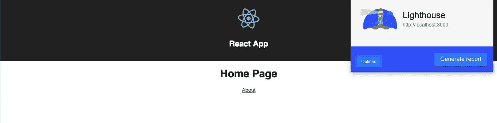

点击生成报告按钮。该过程完成后，将会打开一个新窗口，Lighthouse 在其中生成了一个报告。从表面上看，它并不讨灯塔的喜欢，也不像一个进步的网络应用。

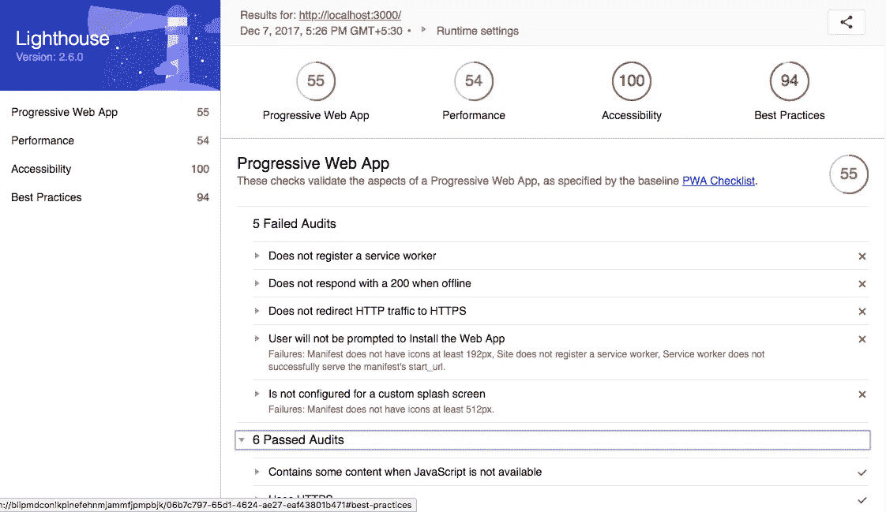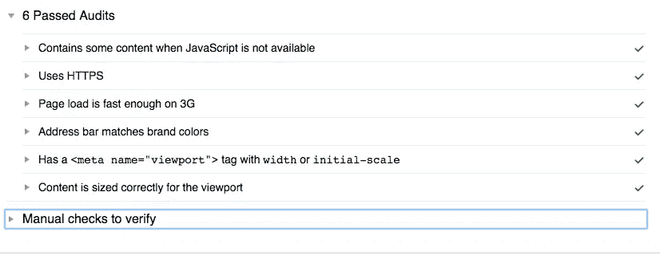

我们将逐一解决这些问题。

# 设置服务人员

让我们先设置一个服务人员。这是灯塔审计的第一件事。你会问，什么是服务人员？嗯，它是一个代理服务器，位于 web 应用程序、浏览器和网络之间。我们可以用它来让 React 应用离线工作(还记得我们之前讨论的那一点吗？渐进式的网络应用注重性能)。你肯定能在谷歌的网络基础文档上读到关于它的细节。

这是一个分两步走的过程。首先我们将创建一个`service-worker.js`文件(服务工作者，毕竟是 JavaScript 代码)，然后在我们的`index.html`中注册该工作者。

在我们 app strucutre 的`public`目录下，创建一个文件`service-worker.js`。我将使用 Addy Osmani 的服务人员配置，并且我将推荐您这样做，至少对于这个配置。你可以在这里找到完整的细节。要继续，请确保在`service-worker.js`文件中添加以下代码:

我们的下一步是通过加载我们刚刚在`service-worker.js`中编写的服务工作者来注册我们的服务工作者。在`index.html`中的结束`</body>`标签前添加此内容。

确保通过从终端运行`npm run start`来重启 dev 服务器。如果你打开 Chrome 的 DevTools >控制台，你一定会看到这一行:

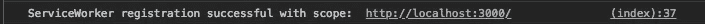

如果我们再次运行灯塔审计流程，我希望我们会得到一个更好的结果。

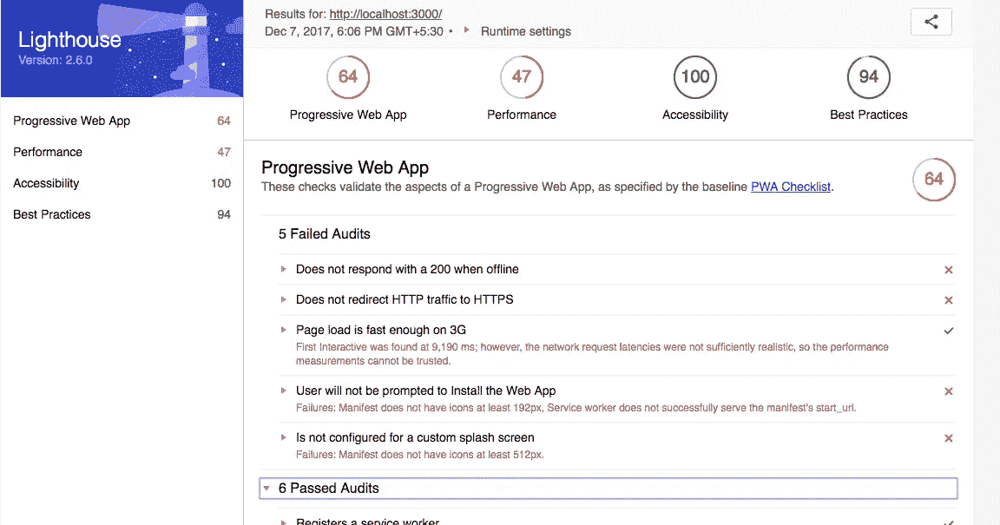

是的，您可以清楚地将上述内容与我们之前的审计进行比较。它已经改进了，我们之前的第一期现在已经通过了审核。现在让我们移动并添加一些增强。

# 添加渐进式增强

渐进式改进是改善应用程序/网站的方法，因为它无需加载任何 JavaScript 即可工作。现在，我们希望在 React 应用程序初始化 DOM 之前显示一条加载消息和一些 CSS 或无(您的选择)。让我们将所需的 CSS 和加载消息添加到我们的`index.html`中。为了提高性能，我还将我们所有的 CSS(即包含在`App.css`和`index.css`中的 CSS)添加到我们的`index.html`文件中。

我们现在可以从我们的项目目录中删除`App.css`和`index.css`文件，并从`App.js`和`index.js`中删除它们的导入引用。

上述过程将我们的应用程序的性能提高了 10 个点。尽管总体 PWA 分数是相同的:

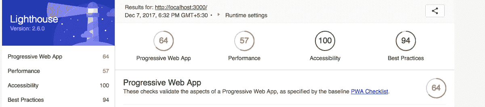

# 将它添加到设备的主屏幕

create-react-app 的创建者对我们非常好，他们已经在`public`目录中包含了一个`manifest.json`文件，并做了一些基本的配置。我们目前增加的这个功能允许用户在他们设备的主屏幕上保存我们的 PWA 网站页面。在未来，如果用户希望打开应用程序，他们可以通过使用 PWA 作为一个正常的应用程序，它将在手机的默认浏览器中打开。

为此，我们将编辑`public/manifest.json`:

让我们稍微讨论一下这个文件。`short_name`是将出现在设备主屏幕上的应用程序名称。`name`将出现在启动画面上。`icons`很重要，是我们应用程序的主要图标，将出现在主屏幕上的`short_name`旁边，就像一个本地移动应用程序一样。图标的大小必须是`192x192`。我没有尝试过其他图像格式，但是你可以。[这里的](https://i.imgur.com/RaN7Qey.png)是我们正在制作的这个演练的虚拟徽标的链接。将其添加到`public`目录中。512 设置用于闪屏，是审计过程中的一项要求。所以这里有[链接](https://i.imgur.com/TmblrhM.png)来下载。

接下来是`start_url`，通知应用程序从主屏幕启动。在它下面还有三个属性。`display`是应用程序的外观，我让`theme_color`和`background_color`相同，因为我想让应用程序匹配标题背景。

我们现在将解决之前审计中的一个问题。我们只剩下一些问题需要解决。

# 部署

首先，让我们打开缓存。在`service-worker.js`中，编辑第一行并将现有布尔值更改为`true`。

我将在这里使用 [Firebase](https://firebase.google.com/) 进行部署，因为它很容易与一个 web/移动应用程序连接，用于 IMO 原型开发。首先，在 Firebase 控制台中，创建一个新项目`pwa-example-1`。现在，安装我们部署 PWA 应用程序所需的 firebase 工具。我们将把这个依赖项作为一个全局模块来安装。

现在，CLI 工具将提示一些问题。为了清楚起见，我添加了一系列图像，请确保在提示时选择相同的答案。

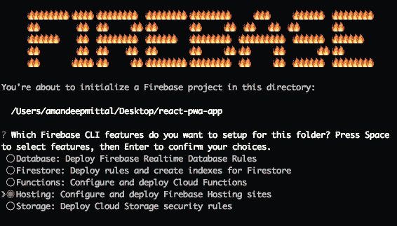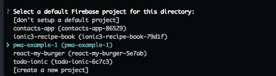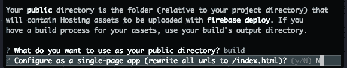

最后一次按回车键，您将得到一条成功消息和在您的项目目录中生成的两个 firebase 配置文件:`.firebaserec`和`firebase.json`。

现在，是时候部署我们的应用程序了。从终端运行:

上面的命令告诉 create-react-app 将我们的项目构建到 build/文件夹中，然后 Firebase CLI 工具将部署该文件夹。Firebase CLI 工具会返回一个 URL，保存后在 Chrome 中打开，然后最后一次运行我们的 Lighthouse 审计。托管 url 将类似于以下内容:

这解决了我们关于在 HTTP 上使用 https 的主要问题。这样，我们所有的问题都解决了，我们的 PWA 应用程序得到了 100/100 分。

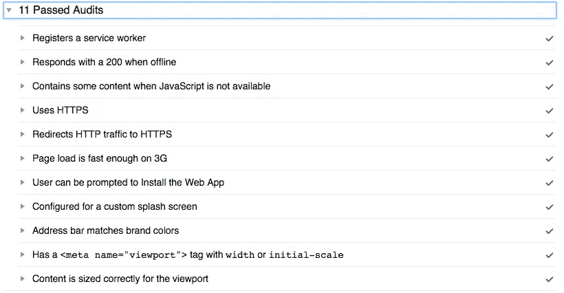

我觉得我们第一次申请的分数不错。我们的应用程序的上述性能指标可以改进，但有几种方法可以做到这一点。我不会深入讨论这个问题，因为这个应用程序的范围是为了学习。

你可以在[Github 库](https://github.com/amandeepmittal/react-pwa-app)找到完整的代码。继续克隆回购，不要忘记在项目目录中进行一次`npm install`，然后尝试前面提到的 PWA 技巧和技术。

说👋对我来说[推特](https://twitter.com/amanhimself)。

> [这篇文章最初发表在 Zeolearn 博客上](https://www.zeolearn.com/magazine/an-introduction-to-progressive-web-apps-pwa)