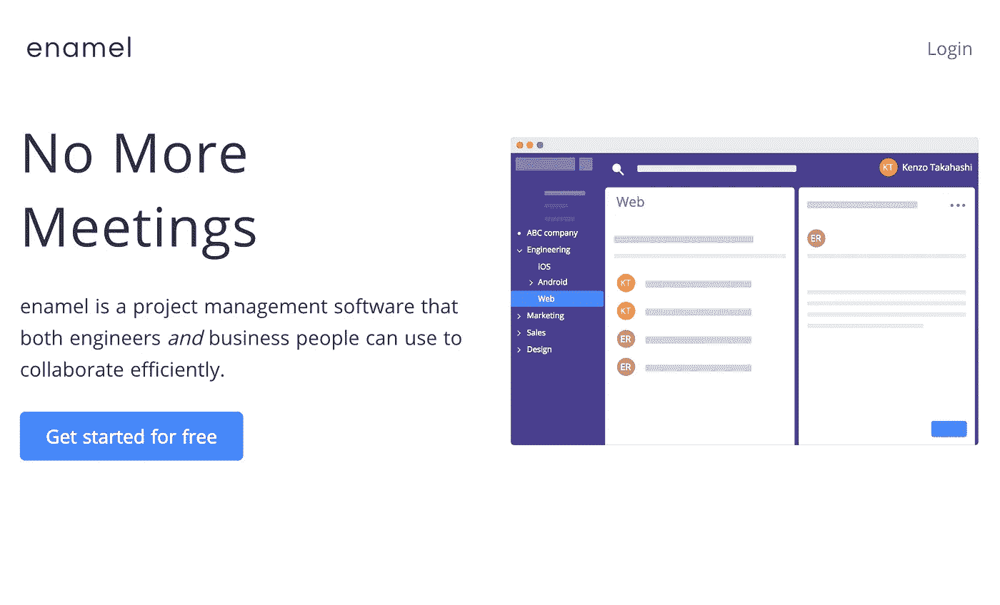
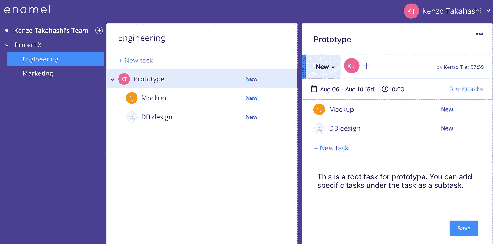
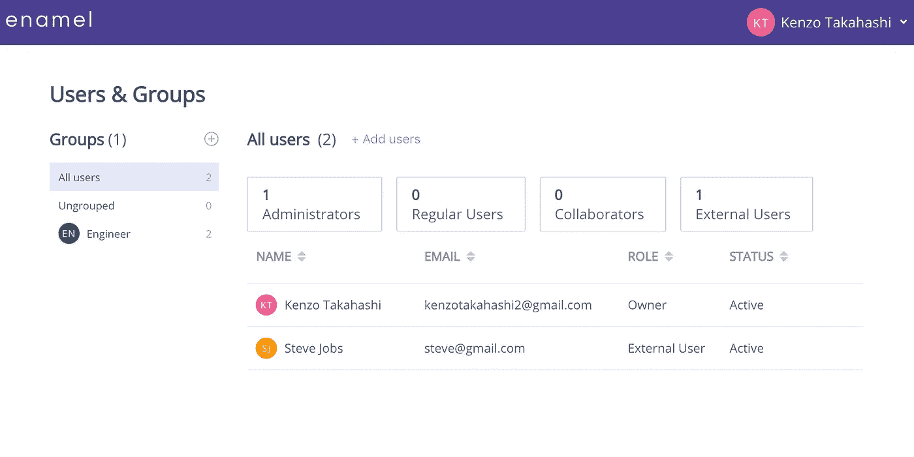
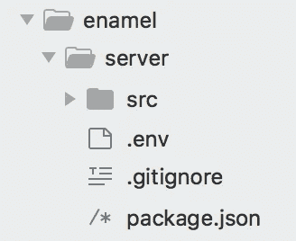
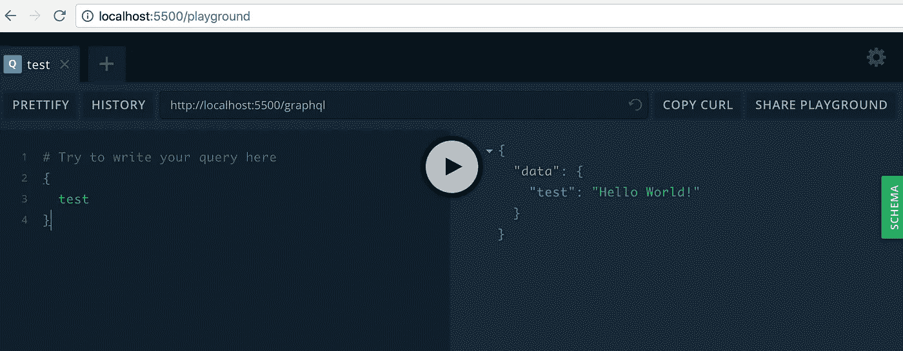

# 用 Vue.js、Node.js 和 Apollo 构建一个项目管理工具——第 1 部分

> 原文：<https://itnext.io/build-a-project-management-software-with-vue-js-and-apollo-part1-d12ee75a7641?source=collection_archive---------1----------------------->



最近，我创建了一个名为珐琅的项目管理工具。它现在被我的雇主使用，希望我能把它卖给更多的客户。

在这个系列教程中，我们将从头开始构建这个应用程序:

> 第 1 部分—构建一个简单的 GraphQL API(这一部分)
> 
> [第 2 部分—构建 MongoDB 模式和电子邮件表单](/build-a-project-management-tool-with-vue-js-node-js-and-apollo-part2-47fbe5dc2de4)
> 
> [第三部分——认证](/build-a-project-management-tool-with-vue-js-node-js-and-apollo-part-3-69a7bf9f2f1b)
> 
> [第四部分——打造工作空间](/build-a-project-management-tool-with-vue-js-node-js-and-apollo-part-4-40fbe0625d32)
> 
> [第 5 部分—文件夹的 CRUD 功能](/build-a-project-management-tool-with-vue-js-node-js-and-apollo-part-5-d59e6e345e39)

教我如何构建自己的产品听起来有点奇怪。教程结束时，你会知道如何建立我的产品，所以你可以成为我的竞争对手。但是建立一个企业不仅仅是一个产品。所以我一点也不担心。你可以随意使用代码。

我这样做的原因是我学到了很多东西，一路上也很开心，我想和你分享我的经验。

# 我们到底在建造什么？

我们正在构建的本质上是一个简化版的 Wrike。也和体式差不多。Wrike 有很多功能，但我们只开发了以下功能:

*   文件夹和子文件夹
*   任务和子任务
*   用户认证
*   组
*   设置状态、设置截止日期，并为任务分配成员
*   与团队、组或成员共享文件夹
*   记时间日志

还是很多啊！

这里有几个应用程序的截图。

工作区是应用程序的主视图。在左侧，您可以看到团队、文件夹和子文件夹。中间是所选文件夹中的任务列表。右边是任务细节。



工作空间

这是帐户页面，您可以在其中管理用户和组。用户有一个角色:管理员、普通用户、协作者或外部用户。Wrike 也有这些角色，但是对于我们的 app 来说，更简单。我将在以后的文章中解释每个角色之间的区别。我们也可以创建一个组。



帐户页面

# 技术堆栈

这是我们将要使用的技术堆栈。

前端— Vue.js，Vuex，Vue 路由器，Apollo

后端— node.js、Express、Apollo、graphql-yoga

DB — MongoDB

是典型的 fullstack JS 栈，除了 Apollo。Apollo 是 GraphQL 之上的一个库。我在客户端和服务器端都使用 Apollo，但是它们是独立的。如果你愿意，你可以只使用客户机或服务器。

# 要求

这是一个高级教程。要构建的东西太多了，所以我不打算详细解释每项技术。

你应该知道 Vue.js 和 MongoDB。Backend 只是一个简单的 API 服务器，所以只要你懂 javascript 和 ES6，我想你就没问题了。对 GraphQL 的基本理解是有帮助的，但是我将尽可能多地解释 Apollo，因为它不太为人所知，而且信息也不容易找到。

我还没有决定是否解释 CSS。通常一个 web 开发的教程要么用 CSS 框架，要么完全跳过讲解，这是合理的。但是当我开发这个应用的时候，实际上我最纠结的是 CSS。有太多的事情我不知道，我花了很多时间在谷歌上搜索。我将尝试解释棘手的部分，但除此之外，只要复制粘贴 CSS，你就可以了。

# 让我们构建后端

说够了。我们写点代码吧！我们打算先创建后端。

*完整的代码可以在*[*github*](https://github.com/kenzotakahashi/enamel/tree/part1)*上找到。*

创建一个根目录`enamel`并在其中创建一个`server`文件夹。

```
mkdir enamel && cd enamel
git init
mkdir server && cd server
```

在`server`中，用下面的代码创建`package.json`:

```
// server/package.json
{
  "name": "enamel_server",
  "version": "1.0.0",
  "description": "",
  "main": "app.js",
  "scripts": {
    "start": "node src/app.js",
    "dev": "./node_modules/nodemon/bin/nodemon.js src/app.js"
  },
  "author": "",
  "license": "ISC",
  "dependencies": {
    "bcrypt": "^2.0.1",
    "dotenv": "^6.0.0",
    "graphql": "^0.13.2",
    "graphql-yoga": "1.14.10",
    "jsonwebtoken": "^8.3.0",
    "moment": "^2.22.2",
    "mongoose": "^5.1.5",
    "nodemailer": "^4.6.7",
    "nodemon": "^1.17.5"
  }
}
```

这些都是后端的依赖项。不是很多，你不觉得吗？我是说，快递在哪？你在这里看不到 Express，因为 graphql-yoga 包含了它。graphql-yoga 是一种基于 Apollo 构建的 graphql 服务器框架。

继续安装依赖项。

```
yarn
```

或者你更喜欢 npm，

```
npm i
```

趁我还没忘记，补充一下`.gitignore`

```
// server/.gitignore
.DS_Store
node_modules/
npm-debug.log*
yarn-debug.log*
yarn-error.log*.env
```

如果还没有，下载 MongoDB 并运行这个过程。

```
mongod
```

在`server`中创建`.env`并放置 mongoDB URI:

```
MONGODB_URI=mongodb://localhost:27017/enamel
```

在`server`中创建`src`

```
mkdir src
```

现在，该目录如下所示:



# 应用代码

在`server/src`内部，创建`app.js`并粘贴这段代码。这个文件将来不会改变。

```
// server/src/app.js
const { GraphQLServer } = require('graphql-yoga')
const mongoose = require('mongoose')
require('dotenv').config()
const resolvers = require('./resolvers')mongoose.connect(process.env.MONGODB_URI, { useNewUrlParser: true })
const db = mongoose.connection
db.on("error", console.error.bind(console, "connection error"))
db.once("open", function(callback){
  console.log("Connection Succeeded")
})const server = new GraphQLServer({
  typeDefs: 'src/schema.graphql',
  resolvers,
  context: req => req,
})const options = {
  port: process.env.PORT || 5500,
  endpoint: '/graphql',
  subscriptions: '/subscriptions',
  playground: '/playground',
}server.start(options, ({ port }) => console.log(`Server is running on port ${port}`))
```

要创建 GraphQLServer，您需要 typeDefs 和解析器。我喜欢将 typeDefs 保存在一个单独的文件中，所以让我们创建`schema.graphql`并将这段伪代码:

```
// server/src/schema.graphql
type Query {
  test: String
}
```

和`resolvers.js`

```
// server/src/resolvers.js
const resolvers = {
 Query: {
  test (_, args, context) {
   return 'Hello World!'
    }
 }
}module.exports = resolvers
```

现在我们有了基本的代码集，让我们运行服务器:

```
yarn dev
```

去`localhost:5500/playground`你会看到一个漂亮的 GraphQL 游乐场。让我们运行刚刚定义的查询。在左侧键入查询，然后



我们使用 nodemon 在文件改变时自动重启。但是，默认情况下，它不会像`schema.graphql`那样观察非 js 文件上的文件变化。要解决这个问题，请在`package.json`的末尾添加以下内容

```
"nodemonConfig": {
  "ext": "js,json,graphql"
}
```

这就是第 1 部分！如果需要，可以查看 [github](https://github.com/kenzotakahashi/enamel/tree/part1) 作为参考。

在[第二部](https://medium.com/@kenzotakahashi2/build-a-project-management-tool-with-vue-js-node-js-and-apollo-part2-47fbe5dc2de4)中，我们将继续构建后端。

我不确定完成这个教程需要多少博客帖子，或者这个教程多快可以得到，但是如果你喜欢这个帖子，请给它一些掌声！它激励我写更多。

我将在下一篇文章中看到你！