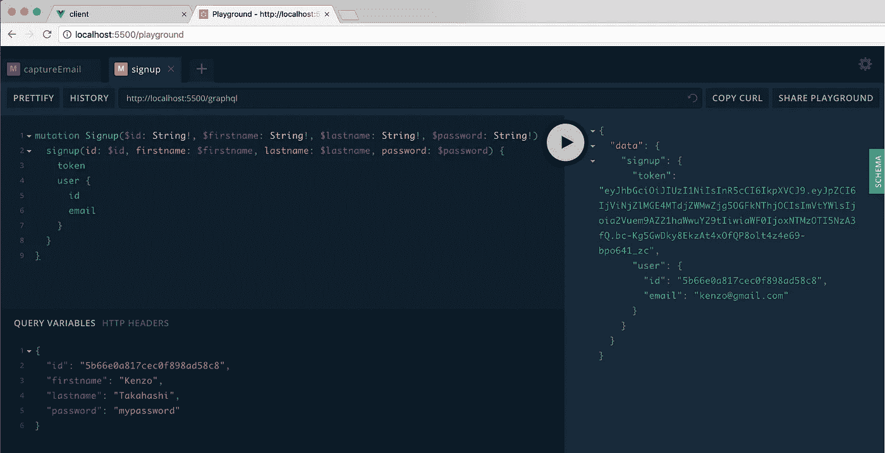
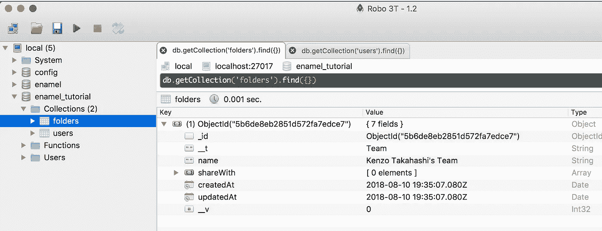
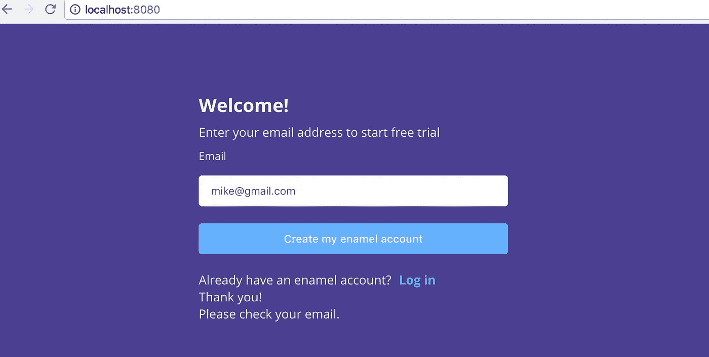
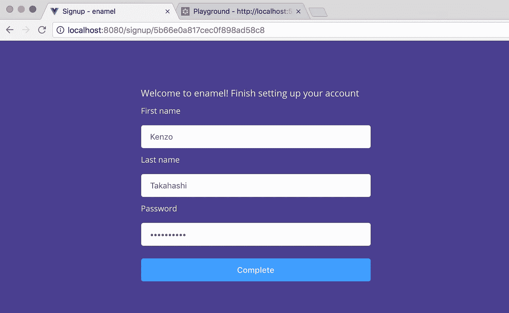
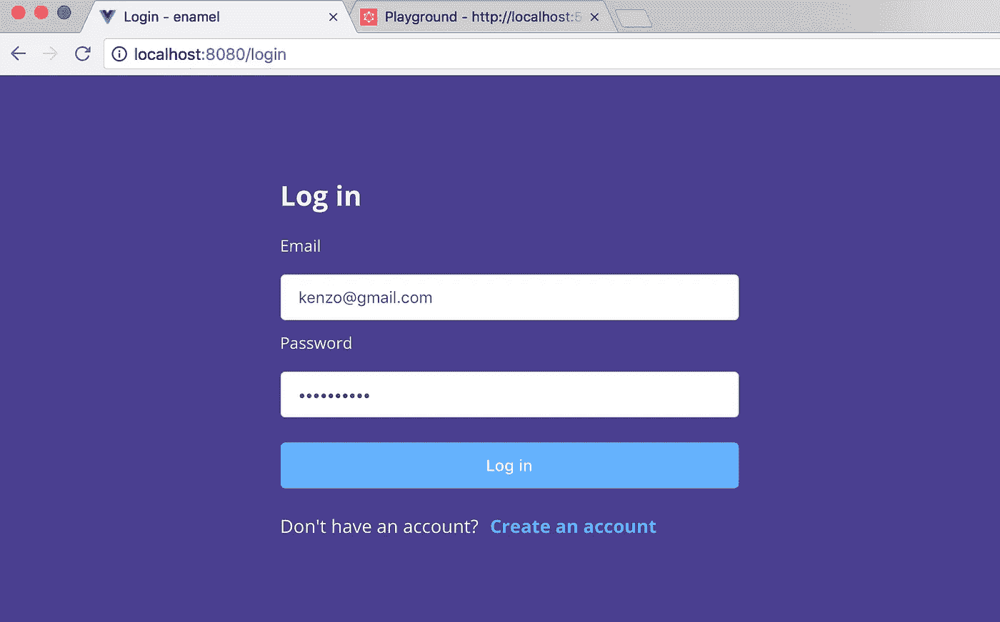

# 用 Vue.js、Node.js 和 Apollo 构建一个项目管理工具——第 3 部分

> 原文：<https://itnext.io/build-a-project-management-tool-with-vue-js-node-js-and-apollo-part-3-69a7bf9f2f1b?source=collection_archive---------3----------------------->

谢谢你给了我很多掌声！写这篇文章的时候，我总共得到了将近 300 个掌声。

> 在本系列的第 1 部分中，我们构建了一个简单的 GraphQL API。
> 
> 在本系列的第 2 部分中，我们构建了 MongoDB 模式和一个电子邮件表单。
> 
> 在这一部分，我们将完成身份验证。
> 
> [第 4 部分——构建工作空间](/build-a-project-management-tool-with-vue-js-node-js-and-apollo-part-4-40fbe0625d32)
> 
> [第 5 部分—文件夹的 CRUD 功能](/build-a-project-management-tool-with-vue-js-node-js-and-apollo-part-5-d59e6e345e39)

*本教程的代码可以在* [*这里*](https://github.com/kenzotakahashi/enamel/tree/part3) *找到。或者如果你想跟随，你可以在这里* *克隆 part2 分支* [*。*](https://github.com/kenzotakahashi/enamel/tree/part2)

# 注册

打开`server/src/resolver.js`并添加以下内容:

```
const { User, Team } = require('./models')const JWT_SECRET = process.env.JWT_SECRETfunction randomChoice(arr) {
  return arr[Math.floor(arr.length * Math.random())]
}const avatarColors = [
  "D81B60","F06292","F48FB1","FFB74D","FF9800","F57C00","00897B","4DB6AC","80CBC4",
  "80DEEA","4DD0E1","00ACC1","9FA8DA","7986CB","3949AB","8E24AA","BA68C8","CE93D8"
]const resolvers = {
  ...
  Mutation: {
    ...
    async signup (_, {id, firstname, lastname, password}) {
      const user = await User.findById(id)
      const common = {
        firstname,
        lastname,
        name: `${firstname} ${lastname}`,
        avatarColor: randomChoice(avatarColors),
        password: await bcrypt.hash(password, 10),
        status: 'Active'
      }
      if (user.role === 'Owner') {
        const team = await Team.create({
          name: `${common.name}'s Team`
        })
        user.set({
          ...common,
          team: team.id,
          jobTitle: 'CEO/Owner/Founder'
        })
      } else {
        user.set(common)
      }
      await user.save()
      const token = jwt.sign({id: user.id, email: user.email}, JWT_SECRET)
      return {token, user}
    },
  },
}
```

它找到在`captureEmail`中创建的用户数据，并设置一些字段。

*如你所见，我们从 10 种颜色中随机挑选一种头像颜色。这是一种懒惰的方法，因为即使只有几个成员，也有可能选择相同的颜色。我鼓励你写一个更好的算法，并在评论中分享。我很乐意将它纳入我的代码中。*

`signup`功能用于业主和其他用户。稍后，我们将建立帐户页面，您可以邀请其他用户。

如果用户是所有者，它还会创建一个团队。最后，它让用户登录并返回令牌和用户对象。

将`JWT_SECRET`环境变量添加到`.env`，我们准备测试它！确保重新启动服务器。

```
MONGODB_URI=mongodb://localhost:27017/enamel_tutorial
JWT_SECRET=thisissecret
```

打开操场，注册你上次创建的用户。您需要到数据库复制粘贴用户 id。



如果您去检查您的数据库，您应该看到您的团队已经创建。注意它在`folders`下面。这是因为团队是一种特殊类型的文件夹。



现在 API 正在工作，让我们构建一个注册表单。

`client/src/router.js`现在看起来像是:

```
import Vue from 'vue'
import Router from 'vue-router'
import Home from './views/Home.vue'
import Signup from './views/Signup.vue'Vue.use(Router)const router = new Router({
  mode: 'history',
  routes: [
    {
      path: '/',
      name: 'home',
      component: Home,
      meta: { title: 'enamel' }
    },
    {
      path: '/signup/:id',
      name: 'signup',
      component: Signup,
      meta: { title: 'Signup - enamel' }
    },
  ]
})router.afterEach((to, from) => {
  document.title = to.meta.title
})export default router
```

我添加了标题元字段，以便每条路径显示不同的文档标题。

将注册查询添加到`client/src/constants/query.gql`:

```
mutation Signup($id: String!, $firstname: String!, $lastname: String!, $password: String!) {
  signup(id: $id, firstname: $firstname, lastname: $lastname, password: $password) {
    token
    user {
      id
      email
    }
  }
}
```

这是注册 Vue 组件。这里没有什么太疯狂的。注册用户后，它将令牌和用户 id 保存到 localstorage。然后它应该把你带到 workplace，但是因为我们还没有构建，它现在把消息打印到控制台。

```
// client/src/views/Signup.vue
<template>
  <el-container>
    <el-header >
    </el-header><el-main>
      <div class="container-center">
        <div>Welcome to enamel! Finish setting up your account</div><div v-if="error" class="error">
          {{ error }}
        </div><el-form ref="form" :model="form">
          <el-form-item>
            <label>First name</label>
            <el-input v-model="form.firstname" placeholder="Your first name"></el-input>
            <label>Last name</label>
            <el-input v-model="form.lastname" placeholder="Your last name"></el-input>
            <label>Password</label>
            <el-input v-model="form.password" type="password" placeholder="Password"></el-input>
          </el-form-item>
          <el-form-item>
            <el-button type="primary" [@click](http://twitter.com/click)="signup">Complete</el-button>
          </el-form-item>
        </el-form></div></el-main>
  </el-container></template><script>
import { Signup } from '../constants/query.gql'export default {
  data() {
    return {
      error: false,
      form: {
        firstname: '',
        lastname: '',
        password: '',
      }
    }
  },
  methods: {
    async signup() {
      const { firstname, lastname, password } = this.form
      if (!(firstname && lastname && password)) {
        this.error = 'Please complete the form'
        return
      }
      this.$apollo.mutate({
        mutation: Signup,
        variables: {
          id: this.$route.params.id,
          firstname,
          lastname,
          password
        }
      }).then(({data: {signup}}) => {
        const id = signup.user.id
        const token = signup.token
        this.saveUserData(id, token) // this.$router.push({name: 'workspace'})
        console.log('success!') // For now just print
      }).catch((error) => {
        this.error = 'Something went wrong'
        console.log(error)
      })
    },
    saveUserData (id, token) {
      localStorage.setItem('user-id', id)
      localStorage.setItem('user-token', token)
      this.$root.$data.userId = localStorage.getItem('user-id')
    },
  }
}
</script><style scoped>.el-button {
  width: 100%;
}.error {
  padding-top: 10px;
}
</style>
```

那么我们如何到达注册页面呢？回想一下上一篇文章，在提交电子邮件表单后，您应该会看到一条消息，上面写着“请检查您的电子邮件”。



在制作过程中，我会发送一封带有注册链接的电子邮件。然而，你可能不想设置你的电子邮件。所以我要把这个 app 的邮件部分做成加分材料。

现在，把你的 id 复制粘贴到地址栏。



如果您提交表单，它将覆盖现有数据并创建另一个团队对象。这显然不是你想要的，但现在已经足够了。(实际上在生产中仍然是这样，但是，嘿，你必须动作快！)

# 注册

让我们不要重复同样的过程并创建一个登录功能。将此添加到`server/src/resolvers.js`:

```
async login (_, {email, password}) {
  const user = await User.findOne({email})
  if (!user) {
    throw new Error('No user with that email')
  }
  const valid = await bcrypt.compare(password, user.password)
  if (!valid) {
    throw new Error('Incorrect password')
  }
  const token = jwt.sign({id: user.id, email}, JWT_SECRET)
  return {token, user}
},
```

我几乎总是先用 playground 测试一个 GraphQL API，然后创建一个前端。由于这类似于注册，我们将跳过这一步，转到前端，但我鼓励你在操场上尝试。

路由器:

```
...
import Login from './views/Login.vue'Vue.use(Router)const router = new Router({
  mode: 'history',
  routes: [
    ...
    {
     path: '/login',
     name: 'login',
     component: Login,
     meta: { title: 'Login - enamel' }
    }
  ]
})
```

query.gql:

```
mutation Login($email: String!, $password: String!) {
  login(email: $email, password: $password) {
    token
    user {
      id
      email
    }
  }
}
```

Login.vue:

```
<template>
  <el-container>
    <el-header>
    </el-header><el-main>
      <div class="container-center">
        <h2>Log in</h2>

        <div v-if="error" class="error">
          {{ error }}
        </div><el-form ref="form" :model="form">
          <el-form-item>
            <label>Email</label>
            <el-input v-model="form.email" placeholder="Email"></el-input>
            <label>Password</label>
            <el-input v-model="form.password" type="password" placeholder="Password"></el-input>
          </el-form-item>
          <el-form-item>
            <el-button type="primary" [@click](http://twitter.com/click).once="login">Log in</el-button>
          </el-form-item>
        </el-form><div>
          <span>Don't have an account?</span>
          <router-link :to="{name: 'home'}" class="link">Create an account</router-link>
        </div>
      </div></el-main>
  </el-container></template><script>
import { Login } from '../constants/query.gql'export default {
  data() {
    return {
      error: false,
      form: {
        email: '',
        password: '',
      }
    }
  },
  methods: {
    async login() {
      const { email, password } = this.form
      if (email && password) {
        this.$apollo.mutate({
          mutation: Login,
          variables: { email, password }
        }).then(async (data) => {
          const login = data.data.login
          const id = login.user.id
          const token = login.token
          this.saveUserData(id, token)
          // this.$router.push({name: 'workspace'})
          console.log('success')
        }).catch((error) => {
          this.error = 'Invalid email or password'
          console.log(error)
        })
      }
    },
    saveUserData (id, token) {
      localStorage.setItem('user-id', id)
      localStorage.setItem('user-token', token)
      this.$root.$data.userId = localStorage.getItem('user-id')
    },
  }
}
</script><style scoped>
.el-button {
  width: 100%;
}
</style>
```

它应该像您预期的那样工作:



# 额外材料:发送电子邮件

对于那些真正想设置你的电子邮件的人，我将介绍一下代码。

最初我使用 SendGrid。SendGrid 有一个免费的计划和一个简单的 API。很好…直到他们封了我的账户。我联系了支持人员，但至今没有得到任何回应。我能想到的唯一原因是我把发件人设定为`noreply@enamel.tech`。我拥有该域名，但我没有商业电子邮件帐户。我以为只要我拥有这个域名，我就可以使用任何我想要的电子邮件地址。

反正我这个前期买商务邮箱太便宜了(记住，我只有 1 个付费客户)，所以我用我的个人邮箱和 nodemailer 结算。

我们已经安装了 nodemailer，所以我们只需要导入它。以下是为 gmail 设置 nodemailer 的方法:

```
const nodeMailer = require('nodemailer')
const { welcomeEmail } = require('./emails')const transporter = nodeMailer.createTransport({
    host: 'smtp.gmail.com',
    port: 465,
    secure: true,
    auth: {
      user: process.env.FROM_EMAIL,
      pass: process.env.GMAIL_PASSWORD
    }
})
```

创建一个新文件`server/src/emails.js`并添加以下代码:

```
const url = process.env.CLIENT_URL
const fromEmail = process.env.FROM_EMAILmodule.exports.welcomeEmail = function(email, user) {
  const text = `
Hi,
Thank you for choosing enamel! 
You are just one click away from completing your account registration.Confirm your email:\n
${url}/signup/${user.id}
`return {
    to: `${email}`,
    from: {
      address: fromEmail,
      name: 'enamel'
    },
    subject: 'Please complete your registration',
    text
  }
}
```

我们需要一个客户端 url 以及电子邮件和密码的环境变量。请确保在更改后重新启动服务器。

```
MONGODB_URI=mongodb://localhost:27017/enamel_tutorial
JWT_SECRET=thisissecret
CLIENT_URL=[http://localhost:80](http://localhost:8002)80
[FROM_EMAIL=youremail@gmail.com](mailto:FROM_EMAIL=youremail@gmail.com)
GMAIL_PASSWORD=mypassword
```

最后给`captureEmail`加一句台词:

```
async captureEmail (_, {email}) {
  const isEmailTaken = await User.findOne({email})
  if (isEmailTaken) {
    throw new Error('This email is already taken')
  }
  const user = await User.create({
    email,
    role: 'Owner',
    status: 'Pending'
  })
  // New code
  transporter.sendMail(welcomeEmail(email, user)) return user
},
```

如果您在电子邮件表单中输入您的电子邮件(确保没有用户使用相同的电子邮件)，您应该会收到您自己的电子邮件。

# 接下来:创建工作场所

第 3 部分到此为止！需要的话可以看看 [github](https://github.com/kenzotakahashi/enamel/tree/part3) 做参考。

现在，我们已经为这个应用程序建立了基础，我们可以从这里加速。我知道到目前为止有点无聊，所以谢谢你的耐心。我不会以这种方式为初学者组织我的教程。对于初学者来说，最好忽略后端，先创建 UI，这样你就可以快速了解应用程序的样子。但你不是初学者，对吧？

在[第 4 部分](/build-a-project-management-tool-with-vue-js-node-js-and-apollo-part-4-40fbe0625d32)中，我们将创建工作区，您可以在其中创建文件夹和任务。

*如果你喜欢这个帖子，请给它一些掌声！这激励我尽快写下一部分。*