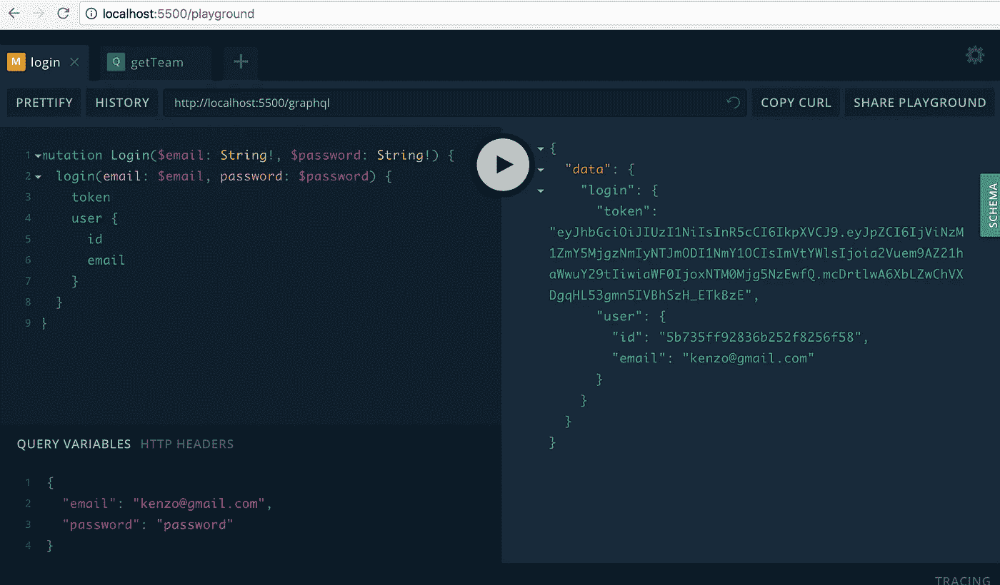
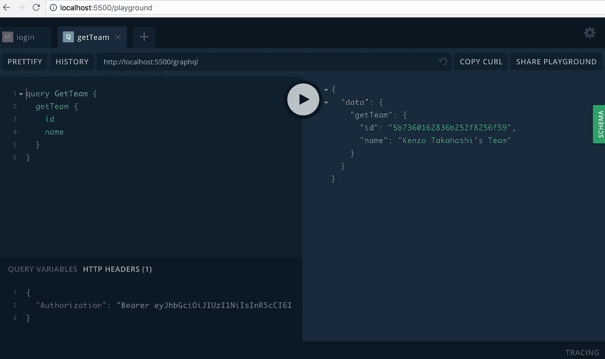
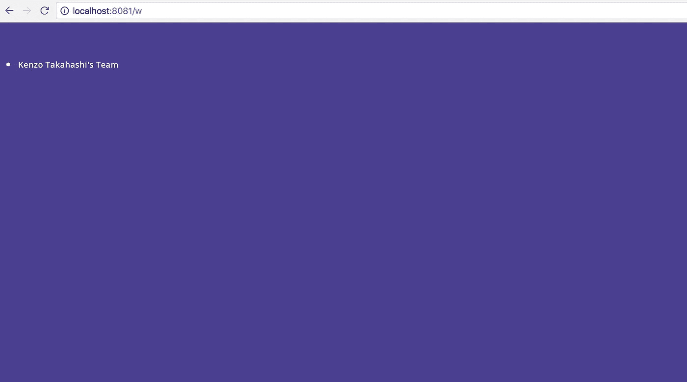
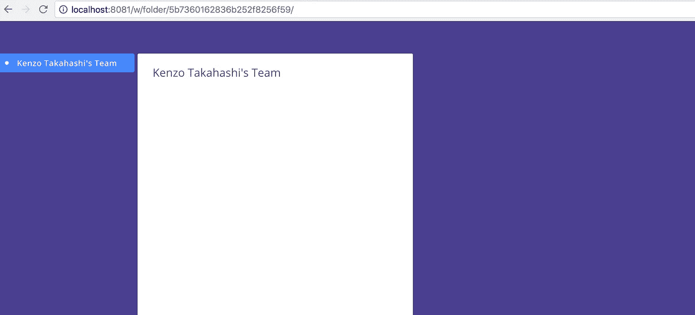

# 用 Vue.js、Node.js 和 Apollo 构建一个项目管理工具——第 4 部分

> 原文：<https://itnext.io/build-a-project-management-tool-with-vue-js-node-js-and-apollo-part-4-40fbe0625d32?source=collection_archive---------4----------------------->

欢迎回来！感谢你的支持，现在这个系列教程是下一个的一部分！我很高兴能接触到更多的观众，帮助更多的人。

在这一部分，我们将建立一个工作区。

> [第 1 部分—构建简单的 GraphQL API](/build-a-project-management-software-with-vue-js-and-apollo-part1-d12ee75a7641)
> 
> [第 2 部分—构建 MongoDB 模式和电子邮件表单](/build-a-project-management-tool-with-vue-js-node-js-and-apollo-part2-47fbe5dc2de4)
> 
> [第 3 部分—认证](/build-a-project-management-tool-with-vue-js-node-js-and-apollo-part-3-69a7bf9f2f1b)
> 
> 第 4 部分—构建工作空间(这一部分)
> 
> [第 5 部分—文件夹的 CRUD 功能](/build-a-project-management-tool-with-vue-js-node-js-and-apollo-part-5-d59e6e345e39)

*本教程的代码可在* [*这里*](https://github.com/kenzotakahashi/enamel/tree/part4) *获得。或者如果你想跟随，你可以在这里* *克隆 part3 分支* [*。*](https://github.com/kenzotakahashi/enamel/tree/part3)

# 演出团队

我们要做的第一件事是获得用户的团队。我们不再需要`test`查询，所以删除它并在`server/src/schema.graphql`中添加`getTeam`和`Team`类型:

```
type Query {
  getTeam: Team
}type Team {
  id: String
  name: String
}
```

由于 workspace 需要登录，我们需要检查请求头以确保用户已经登录。创造`server/src/utils.js`:

```
// server/src/utils.js
const jwt = require('jsonwebtoken')
require('dotenv').config()function getUserId(context) {
  const Authorization = context.request.get('Authorization')
  if (Authorization) {
    const token = Authorization.replace('Bearer ', '')
    const {id} = jwt.verify(token, process.env.JWT_SECRET)
    return id
  }
  throw new Error('Not authenticated')
}module.exports = {
  getUserId,
}
```

将功能导入`resolvers.js`。在我们授权用户之后，我们从用户那里获得团队 id 并返回团队对象:

```
const { getUserId } = require('./utils')const resolvers = {
  Query: {
    async getTeam (_, args, context) {
      const userId = getUserId(context)
      const user = await User.findById(userId)
      return await Team.findById(user.team)
    },
  },
  ...
}
```

让我们在操场上测试一下。首先，使用您之前创建的帐户登录。如果没有，可以使用`captureEmail`和`signup`创建一个新的。



然后复制令牌并在 playground 中打开一个新标签。下面是`getTeam`查询的样子:



将令牌粘贴在标题选项中的`Bearer`之后。

```
"Authorization": "Bearer [TOKEN]"
```

如果操作正确，应该会得到如上所示的响应。

这很好，那么我们如何在客户端做到这一点？使用 ApolloLink，您可以自动为每个请求添加标题。将以下内容添加到`client/src/main.js`。链接的顺序很重要，所以`authMiddleware`应该在`errorLink`之后`httpLink`之前。

```
const authMiddleware = new ApolloLink((operation, forward) => {
  const token = localStorage.getItem('user-token')
  operation.setContext({
    headers: {
      authorization: token ? `Bearer ${token}` : null
    }
  })
  return forward(operation)
})const client = new ApolloClient({
  link: ApolloLink.from([
    errorLink,
    authMiddleware,
    httpLink
  ]),
  cache,
  connectToDevTools: true,
})
```

将`getTeam`查询添加到`client/src/constants/query.gpl`:

```
query GetTeam {
  getTeam {
    id
    name
  }
}
```

创建一个新文件`client/src/views/Workspace.vue`并粘贴以下代码:

```
<template>
  <div><div class="container">
      <aside class="tree-root">
        <div v-if="getTeam.id" class="tree-item"
            [@click](http://twitter.com/click).left.stop="$router.push({name: 'folder', params: {id: getTeam.id}})">
          <div class="tree-plate"  v-bind:class="{active: $route.params.id === getTeam.id}">
            <div class="circle"></div>
            <span class="folder no-select-color teamname">{{ getTeam.name }}</span>
          </div>
        </div></aside><div class="workspace-main">
        <router-view :key="$route.fullPath"></router-view>
      </div></div></div></template><script>
import { GetTeam } from '../constants/query.gql'export default {
  data() {
    return {
      getTeam: {},
    }
  },
  apollo: {
    getTeam: {
      query: GetTeam,
    },
  },
}
</script><style scoped>
.container {
  width: 100%;
  height: calc(100% - 52px);
}.plus-button {
  position: absolute;
  right: 0;
  top: 7px;
  margin: 0 2px;
}aside {
  width: 220px;
  height: 100%;
  display: inline-block;
}.workspace-main {
  flex: 1 1;
}
</style>
```

这是在左侧显示文件夹树的主视图。它还呈现子组件。但目前，它只是查询当前用户的团队并显示名称。

`client/src/router.js`有很多变化:

```
import Vue from 'vue'
import Router from 'vue-router'
import Home from './views/Home.vue'
import Signup from './views/Signup.vue'
import Login from './views/Login.vue'
import Workspace from './views/Workspace.vue'Vue.use(Router)const login = {
  path: '/login',
  name: 'login',
  component: Login,
  meta: { title: 'Login - enamel' }
}const workspace = {
  path: '/w',
  name: 'workspace',
  component: Workspace,
  meta: { title: 'Workspace - enamel', requiresAuth: true },
}const router = new Router({
  mode: 'history',
  routes: [
    {
      path: '/',
      name: 'home',
      component: Home,
      meta: { title: 'enamel', redirect: true}
    },
    {
      path: '/signup/:id',
      name: 'signup',
      component: Signup,
      meta: { title: 'Signup - enamel' }
    },
    login,
    workspace
  ]
})router.beforeEach((to, from, next) => {
  const auth = localStorage.getItem('user-id')
  if (to.matched.some(record => record.meta.requiresAuth)) {
    if(!auth) {
      next(login)
    }
  } else if (to.matched.some(record => record.meta.redirect)) {
    if(auth) {
      next(workspace)
    }
  }
  next()
})router.afterEach((to, from) => {
  document.title = to.meta.title
})export default router
```

首先，我为 workspace 添加了一条路线。我还添加了`beforeEach`来根据用户是否登录来重定向用户。如果他在登录时转到根页面(电子邮件表单)，他将被重定向到工作区。如果他在*未*登录时进入工作区，那么他将被重定向到登录页面。

最后，我们需要对`Login.vue`和`Signup.vue`做些小改动。现在，我们只是在登录或注册后打印“成功”。用`this.$router.push({name: ‘workspace’})`替换。此外，我们需要在每次用户登录时清除 Apollo 缓存，否则如果不同的用户在同一台计算机上登录，她可以看到前一个用户的数据。清除 VueApollo 中的缓存是`this.$apollo.provider.clients.defaultClient.cache.reset()`。顺便说一句，这个不容易找到。而且相当长。

`client/src/views/Login.vue`中`login`的更新版本如下:

```
methods: {
  async login() {
    this.$apollo.provider.clients.defaultClient.cache.reset()const { email, password } = this.form
    if (email && password) {
      this.$apollo.mutate({
        mutation: Login,
        variables: { email, password }
      }).then(async (data) => {
        const login = data.data.login
        const id = login.user.id
        const token = login.token
        this.saveUserData(id, token)
        this.$router.push({name: 'workspace'})
      }).catch((error) => {
        this.error = 'Invalid email or password'
        console.log(error)
      })
    }
  },
  ...
}
```

和`client/src/views/Signup.vue`

```
methods: {
  async signup() {
    this.$apollo.provider.clients.defaultClient.cache.reset()const { firstname, lastname, password } = this.form
    if (!(firstname && lastname && password)) {
      this.error = 'Please complete the form'
      return
    }
    this.$apollo.mutate({
      mutation: Signup,
      variables: {
        id: this.$route.params.id,
        firstname,
        lastname,
        password
      }
    }).then(({data: {signup}}) => {
      const id = signup.user.id
      const token = signup.token
      this.saveUserData(id, token)
      this.$router.push({name: 'workspace'})
    }).catch((error) => {
      this.error = 'Something went wrong'
      console.log(error)
    })
  },
}
```

现在我们准备测试！登录后，您应该会看到以下内容:



哇，真无聊。

# 获取文件夹

接下来，我们将创建`getFolders`和`getFolder`查询。将此添加到`server/src/schema.graphql`:

```
scalar Date
scalar JSONtype Query {
  getTeam: Team
  getFolders(parent: String): [Folder]
  getFolder(id: String!): Folder
}type Folder {
  id: String
  name: String
  parent: String
  description: String
  shareWith: [JSON]
}
```

记住，文件夹中的`shareWith`可以是团队、组或成员，所以我们不能定义类型，因为 GraphQL 中没有多态性。在这种情况下，我们需要定义一个新的缩放器。我把它叫做 JSON，但是你想怎么叫都行。

`getFolders`和`getFolder`的分解器如下:

```
const mongoose = require('mongoose')
const ObjectId = mongoose.Types.ObjectId
const { User, Team, Folder, Group } = require('./models')const resolvers = {
  Query: {
    ...
    async getFolders (_, {parent}, context) {
      const userId = getUserId(context)
      if (parent) {
        return await Folder.find({parent})
      } else {
        const user = await User.findById(userId)
        const groups = await Group.find({users: ObjectId(userId)}, '_id')
        const ids = groups.map(o => o._id).concat(
          ['External User', 'Collaborator'].includes(user.role)
          ? [ObjectId(userId)]
          : [ObjectId(userId), user.team]
        )
        return await Folder.find({ 'shareWith.item': ids }).populate('shareWith')
      }
    },
    async getFolder (_, {id}, context) {
      const userId = getUserId(context)
      return await Folder.findById(id).populate('shareWith')
    },
  },
}
```

`getFolder`直截了当。`getFolders`用于查询根文件夹和子文件夹，所以有点复杂。如果提供了`parent`参数，它将查询子文件夹。如果没有，它将查询与用户共享的根文件夹。所以我们需要获得用户 id、用户所属的组以及用户的团队。只有管理员(+所有者)和普通用户属于该团队。因此，普通用户用于全职员工，外部用户和协作者用于承包商。您可能不希望自动将公司的所有项目共享给承包商，对吗？

外部用户和协作者完全相同。我两个都有，因为里克也有。在 Wrike 中，Collaborator 甚至更受限制。他不能创建新的任务或文件夹。他只能评论和更新状态。我最初打算构建它，但我认为构建新特性比构建限制更重要。

我们还没有团体模型，所以把这个加到`server/src/models.js`:

```
module.exports.Group = buildModel('Group', {
  team: { type: ObjectId, ref: 'Team' },
  name: String,
  initials: String,
  avatarColor: String,
  users: [{ type: ObjectId, ref: 'User' }],
})
```

一个组属于一个团队，有用户。我们不会很快使用它，所以不用担心。

移动到客户端，将这段代码添加到`client/src/constants/query.gql`

```
fragment FolderFields on Folder {
  id
  name
  parent
  description
  shareWith
}query GetFolders($parent: String) {
  getFolders(parent: $parent) { ...FolderFields }
}query GetFolder($id: String!) {
  getFolder(id: $id) { ...FolderFields }
}
```

默认情况下不支持 Fragment，所以我们需要导入`enableExperimentalFragmentVariables`，我们已经在`client/src/main.js`中导入了。

按如下方式更新路由器:

```
import Folder from './views/Folder.vue'
import FolderDetail from './views/FolderDetail.vue'const workspace = {
  path: '/w',
  name: 'workspace',
  component: Workspace,
  meta: { title: 'Workspace - enamel', requiresAuth: true },
  children: [
    {
      path: 'folder/:id',
      component: Folder,
      props: true,
      children: [
        {
          path: '',
          name: 'folder',
          component: FolderDetail
        },
        // {
        //   path: 'task/:taskId',
        //   name: 'task',
        //   component: Task,
        //   props: true
        // }
      ]
    }
  ]
}
```

工作区有两个白色面板，或者卡片。左侧显示所选文件夹中的任务列表。默认情况下，右侧显示文件夹信息，当点击一个任务时，显示任务信息。我确信有不止一种方法可以做到这一点。我的方法是将右侧视为左侧的子组件。如你所见，`FolderDetail`是左侧`Folder`的子节点。在本系列的后面，我们将实现`Task`组件。

创建`client/src/views/Folder.vue`:

```
<template>
  <el-row class="max-height">
    <el-col :span="12" class="max-height">
      <div class="white card max-height">
        <div class="folder-header">
          <div class="header-title folder-name">{{folder.name}}</div>
        </div>
      </div>
    </el-col>
    <el-col v-if="!isTeam(folder) && subRoute==='folder'" :span="12" class="max-height">
      <FolderDetail :folder="folder"></FolderDetail>
    </el-col>
  </el-row>
</template><script>
import { GetFolder } from '../constants/query.gql'
import FolderDetail from './FolderDetail.vue'export default {
  components: {
    FolderDetail
  },
  beforeRouteUpdate (to, from, next) {
    this.subRoute = to.name
    next()
  },
  data() {
    return {
      subRoute: 'folder',
      folderName: '',
      folder: {
        shareWith: []
      },
    }
  },
  apollo: {
    getFolder: {
      query: GetFolder,
      variables() {
        return {id: this.$route.params.id}
      },
      result ({data: { getFolder }}) {
        this.folder = getFolder
        this.folderName = this.folder.name
        if (this.isTeam) {
          document.title = `${this.folder.name} - enamel`          
        }
      },
    }
  },
  methods: {
    isTeam(folder) {
      return !folder.parent && folder.shareWith.length === 0
    }
  }
}
</script><style>
.folder-header {
  padding: 15px 24px 0;
  line-height: 21px;
  min-height: 40px;
}.folder-name {
  padding: 0;
  margin: 5px 0;
  height: 32px;
  width: 100%;
}.menu-title {
  margin: 0 5px;
  font-size: 12px;
}.max-height {
  height: 100%;
}.white.card {
  display: flex;
  flex-direction: column;
}.task-container {
  flex-grow: 1;
  overflow: scroll;
}</style>
```

它查询文件夹并显示名称。如果文件夹不是一个团队，它在右边呈现`FolderDetail`。

创建`client/src/views/FolderDetail.vue`。现在没什么用。可以忽略长 css，后面会用到。

```
<template>
  <div class="white card max-height">
  </div>
</template><script>export default {
  props: ['folder'],
  mounted() {
    document.title = `${this.folder.name} - enamel`
  },
}
</script><style scoped>
.folder-header {
  padding: 15px 24px 0;
  line-height: 21px;
  min-height: 40px;
}.folder-statebar {  
  display: flex;
  height: 48px;
  position: relative;
  padding: 0 24px;
  border-bottom: solid 1px;
  border-color: rgba(0,0,0,.16);
}.folder-name {
  padding: 0;
  margin: 5px 0;
  height: 32px;
  width: 100%;
}.shared-with {
  padding-left: 7px;
}.subfolder:hover {
  color: initial;
  cursor: default;
}/*tooltip*/.member-avatar {
  margin-right: 8px;
  cursor: pointer;
}.member-avatar:hover .remove-button {
  visibility: visible;
}.tooltip .tooltip-content {
  width: 278px;
  left: 50%; 
  margin-left: -139px;
}.search-input {
  padding: 15px;
}.contact-picker-item-list {
  padding-bottom: 24px;
  max-height: 295px;
  overflow: auto;
}.group-field {
  box-sizing: border-box;
  padding: 15px;
}.add-additional {
  display: flex;
  flex-direction: row;
}.label {
  text-align: left;
}</style>
```

好吧，让我们来测试一下目前的情况。进入工作区，点击团队。您应该会看到左边的`Folder`组件。既然是团队，`FolderDetail`就不显示了。



还是很无聊，我知道。

# 接下来:创建、更新和删除文件夹

这部分结果比我预想的要长，我就讲到这里。在[第 5 部分](https://medium.com/@kenzotakahashi2/build-a-project-management-tool-with-vue-js-node-js-and-apollo-part-5-d59e6e345e39)中，我们将为文件夹实现一个 CRUD 功能。

*如果你喜欢这个帖子，请给它一些掌声！这激励我尽快写下一部分。*