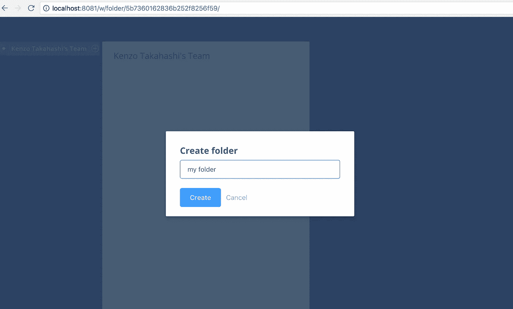
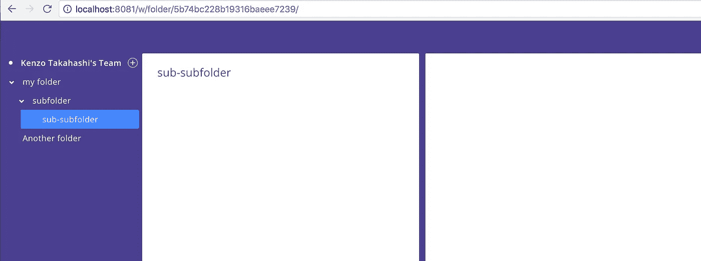
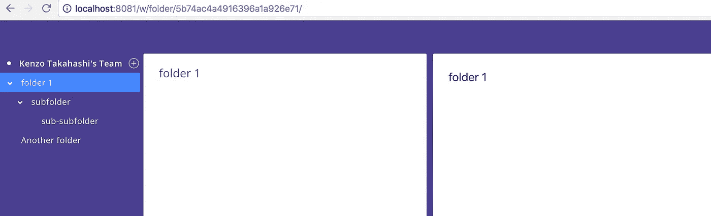
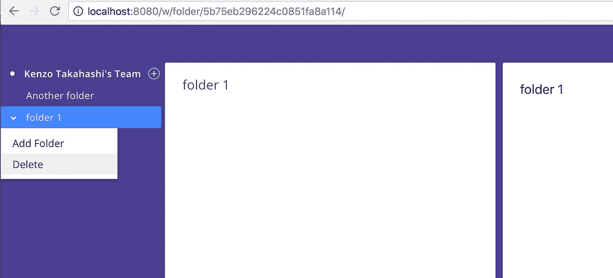
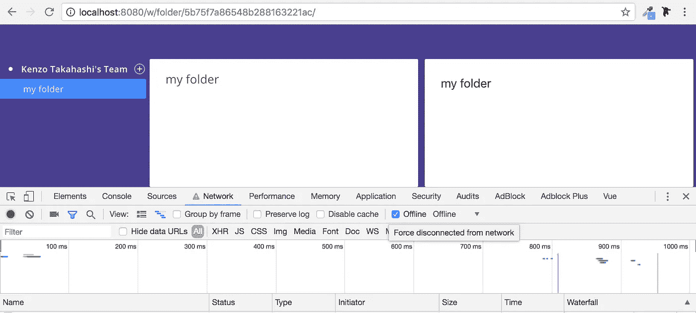
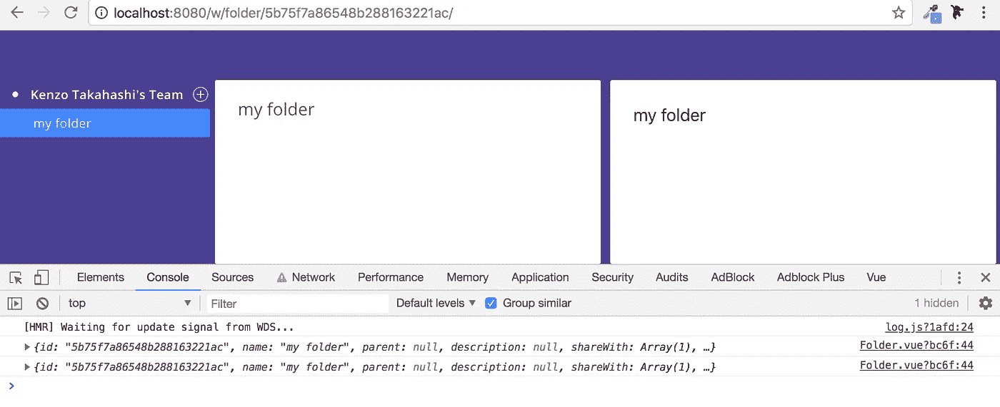

# 用 Vue.js、Node.js 和 Apollo 构建一个项目管理工具——第 5 部分

> 原文：<https://itnext.io/build-a-project-management-tool-with-vue-js-node-js-and-apollo-part-5-d59e6e345e39?source=collection_archive---------3----------------------->

各位 Vue.js 爱好者和 Node.js 爱好者以及阿波罗爱好者们，你们好！让我们开始第 5 部分吧！

> [第 1 部分—构建简单的 GraphQL API](/build-a-project-management-software-with-vue-js-and-apollo-part1-d12ee75a7641)
> 
> [第 2 部分—构建 MongoDB 模式和电子邮件表单](/build-a-project-management-tool-with-vue-js-node-js-and-apollo-part2-47fbe5dc2de4)
> 
> [第 3 部分—认证](/build-a-project-management-tool-with-vue-js-node-js-and-apollo-part-3-69a7bf9f2f1b)
> 
> [第 4 部分——建立工作空间](/build-a-project-management-tool-with-vue-js-node-js-and-apollo-part-4-40fbe0625d32)
> 
> 第 5 部分—文件夹的 CRUD 功能(这一部分)

*本教程的代码可以在* [*这里*](https://github.com/kenzotakahashi/enamel/tree/part5) *找到。或者如果你想跟着一起，你可以在这里* *克隆 part 4 分支* [*。*](https://github.com/kenzotakahashi/enamel/tree/part4)

# 创建文件夹

将模式定义添加到`server/src/schema.graphql`:

```
type Mutation {
  ...
  createFolder(parent: String, name: String!): Folder
}
```

解析器如下所示:

```
Mutation: {
  ...
  async createFolder(_, {parent, name}, context) {
    const userId = getUserId(context)
    const folder = await Folder.create({
      name,
      parent: parent || undefined,
      shareWith: parent ? [] : [{
        kind: 'Team',
        item: (await User.findById(userId)).team
      }]
    })
    return await Folder.findById(folder.id).populate('shareWith.item')
  }
},
```

如果文件夹是根文件夹(没有父文件夹)，则将团队设置为`shareWith`。如果这个文件夹是一个子文件夹，`shareWith`只是一个空数组。稍后，我们将构建一个表单来更改文件夹的共享状态，但是您不能在创建新文件夹时设置共享状态。虽然你可以在 Wrike 中这样做，但我不想在多个地方实现相同的功能。

这就是服务器。

将此添加到`client/src/constants/query.gql`

```
mutation CreateFolder($parent: String, $name: String!) {
  createFolder(parent: $parent, name: $name) {
    ...FolderFields
  }
}
```

下面是`client/src/views/Workspace.vue`的更新版本(CSS 除外):

```
<template>
  <div>
    <div class="container">
      <aside class="tree-root">
        <div v-if="getTeam.id" class="tree-item"
            [@click](http://twitter.com/click).right.stop.prevent="$store.commit('changeActiveWidget', `folder${getTeam.id}`)"
            [@click](http://twitter.com/click).left.stop="$router.push({name: 'folder', params: {id: getTeam.id}})">
          <div class="tree-plate"  v-bind:class="{active: $route.params.id === getTeam.id}">
            <div class="circle"></div>              
            <span class="folder no-select-color teamname">{{ getTeam.name }}</span>
            <plus-button [@click](http://twitter.com/click)="openModal" color="white"></plus-button><div class="dropdown-content left" v-show="activeWidget === `folder${getTeam.id}`">
              <div [@click](http://twitter.com/click)="openModal">Add Folder</div>
            </div>
          </div>
        </div><FolderTree
          v-for="folder in getFolders"
          :key="folder.id"
          :model="folder"
          :team="getTeam.id" >
        </FolderTree>
      </aside><div class="workspace-main">
        <router-view :key="$route.fullPath"></router-view>
      </div><FolderForm v-if="showModal" :config="{parent: ''}" [@close](http://twitter.com/close)="showModal = false"></FolderForm>
    </div></div></template><script>
import { mapState } from  'vuex'
import FolderTree from '@/components/FolderTree'
import FolderForm from '@/components/FolderForm'
import { GetFolders, GetTeam } from '../constants/query.gql'export default {
  components: {
    FolderTree,
    FolderForm,
  },
  computed: mapState(['activeWidget']),
  data() {
    return {
      showModal: false,
      getFolders: [],
      getTeam: {}
    }
  },
  apollo: {
    getTeam: {
      query: GetTeam,
    },
    getFolders: {
      query: GetFolders,
      error(error) {
        console.error(error)
      },
    }
  },
  methods: {
    openModal() {
      this.$store.commit('changeActiveWidget', null)
      this.showModal = true
    },
  }
}
</script>
```

我们有三个新组件。`FolderTree`是递归渲染文件夹的树组件。`FolderForm`是一个创建新文件夹的模态窗体。`PlusButton`只是一个 SVG 图标。我们还有一个突变`changeActiveWidget`。

首先，让我们在`client/src/components/icons`中创建`PlusButton.vue`(创建`icons`文件夹):

```
//client/src/components/icons/PlusButton.vue
<template>
  <div class="plus-button"
    [@click](http://twitter.com/click).stop="$emit('click')">
    <svg :height="size || 16" :width="size || 16" viewBox="0 0 15 15">
      <g fill-rule="evenodd">
        <path :fill="circleColor[color]" d="M7.5 15a7.5 7.5 0 1 0 0-15 7.5 7.5 0 0 0 0 15zm0-1a6.5 6.5 0 1 0 0-13 6.5 6.5 0 0 0 0 13z"></path>
        <path :fill="plusColor[color]" d="M7 7H4v1h3v3h1V8h3V7H8V4H7v3z" id="plus_light_icon" ></path>
      </g>
    </svg>
  </div>
</template><script> 
export default {
  name: 'plus-button',
  props: ['size', 'color'],
  data() {
    return {
      circleColor: {
        'white': 'rgba(255,255,255,.6)',
        'grey': 'rgba(0, 0, 0, 0.32)',
      },
      plusColor: {
        'white': '#fff',
        'grey': 'rgba(0, 0, 0, 0.32)',}      
    }
  }
}
</script><style scoped>
.plus-button {
  display: flex;
  cursor: pointer;
  width: 16px;
  height: 16px;
}</style>
```

我想在全球范围内注册它，所以将它添加到`client/src/main.js`:

```
import PlusButton from '@/components/icons/PlusButton.vue'Vue.component('plus-button', PlusButton)
```

接下来，`FolderTree.vue`。

```
//client/src/components/FolderTree.vue
<template name="tree">
  <li>
    <div class="tree-item"
        [@click](http://twitter.com/click).right.stop.prevent="$store.commit('changeActiveWidget', `folder${model.id}`)"
        [@click](http://twitter.com/click).left.stop="$router.push({name: 'folder', params: {id: model.id}})">
      <span [@click](http://twitter.com/click)="toggle" class="fold-button"
        v-bind:class="{active: $route.params.id === model.id}"
        v-bind:style="{visibility: isFolder ? 'visible' : 'hidden'}">
        <i :class="`fas fa-angle-${open ? 'down' : 'right'}`"></i>
      </span>
      <div class="tree-plate" v-bind:class="{active: $route.params.id === model.id}">
        <span class="folder no-select-color">{{ model.name }}</span><div class="dropdown-content left" v-show="activeWidget === `folder${model.id}`">
          <div [@click](http://twitter.com/click)="openModal">Add Folder</div>
          <!-- <div [@click](http://twitter.com/click)="deleteFolder">Delete</div> -->
        </div>
      </div>
    </div><ul class="tree" v-show="open" v-if="isFolder">
      <tree
        v-for="folder in getFolders"
        :key="folder.id"
        :model="folder"
        [@open](http://twitter.com/open)="openArrow"
      >
      </tree>
    </ul><FolderForm v-if="showModal" :config="modalConfig" [@close](http://twitter.com/close)="showModal = false"></FolderForm>
  </li>
</template><script>
import { mapState } from 'vuex'
import FolderTree from './FolderTree'
import FolderForm from './FolderForm'
import { GetFolders } from '../constants/query.gql'export default {
  name: 'tree',
  components: {
    'tree': FolderTree,
    FolderForm
  },
  props: ['model', 'team'],
  data() {
    return {
      open: false,
      showModal: false,
      modalConfig: {},
      getFolders: []
    }
  },
  mounted() {
    if (this.$route.params.id === this.model.id) {
      this.$emit('open')
    }
  },
  computed: {
    isFolder: function () {
      return this.getFolders.length > 0
    },
    ...mapState(['activeWidget'])
  },
  apollo: {
    getFolders: {
      query: GetFolders,
      variables() {
        return { parent: this.model.id }
      },
      error(error) {
        console.error(error)
      },
    }
  },
  methods: {
    toggle() {
      if (this.isFolder) {
        this.open = !this.open
      }
    },
    openModal(mode) {
      this.$store.commit('changeActiveWidget', null)
      this.showModal = true
      this.modalConfig = {
        parent: this.model.id
      }
    },
    openArrow() {
      this.open = true
      this.$emit('open')
    },
  },
  watch: {
    '$route' (to, from) {
      if (to.params.id === this.model.id) {
        this.$emit('open')
      }
    }
  }
}
</script>
```

如果你熟悉如何在 Vue.js 中实现一棵树，这大部分应该很容易理解。一开始不明显的一点是`this.$emit(‘open’)`。当您直接输入文件夹的 URL 或创建新文件夹时，您希望自动展开树并显示文件夹。为此，对于每个文件夹，检查当前路径是否与文件夹的 id 匹配。如果是，通过调用`[@open](http://twitter.com/open)=”openArrow"`打开父树。我在`mounted`和`watch`都这样做。

我使用了一个字体很棒的图标，所以在`client/public/index.html`中包含这个库:

```
<link rel="stylesheet" href="[https://use.fontawesome.com/releases/v5.1.0/css/all.css](https://use.fontawesome.com/releases/v5.1.0/css/all.css)" integrity="sha384-lKuwvrZot6UHsBSfcMvOkWwlCMgc0TaWr+30HWe3a4ltaBwTZhyTEggF5tJv8tbt" crossorigin="anonymous">
```

还有 [vue-fontawesome](https://github.com/FortAwesome/vue-fontawesome) ，但是我发现很难用。

接下来，创建`FolderForm.vue`:

```
// client/src/components/FolderForm.vue
<template>
  <div class="modal-mask white" [@click](http://twitter.com/click)="$emit('close')">
    <div class="modal-wrapper">
      <div class="modal-container" [@click](http://twitter.com/click).stop="$store.commit('changeActiveWidget', null)"><h3>Create folder</h3><el-form :model="form" [@submit](http://twitter.com/submit).native.prevent="createFolder">
          <el-input type="text" name="foldername" ref="foldername" v-model="form.name"
            placeholder="folder name" [@keyup](http://twitter.com/keyup).esc="$emit('close')">
          </el-input>
        </el-form><div class="button-group">
          <el-button type="primary" [@click](http://twitter.com/click)="createFolder">Create</el-button>
          <el-button type="text" [@click](http://twitter.com/click)="$emit('close')">Cancel</el-button>
        </div></div>
    </div>
  </div>
</template><script>
import { CreateFolder, GetFolders } from '../constants/query.gql'export default {
  props: ['config'],
  data() {
    return {
      form: {
        name: '',
      }
    }
  },
  mounted() {
    this.$refs.foldername.focus()
  },
  methods: {
    createFolder() {
      const { name } = this.form
      if (!name) return
      const parent = this.config.parent
      this.$apollo.mutate({
        mutation: CreateFolder,
        variables: {name, parent},
        update: (store, { data: { createFolder } }) => {
          const variables = parent ? { parent } : {}
          try {
            const data = store.readQuery({
              query: GetFolders,
              variables
            })
            data.getFolders.push(createFolder)
            store.writeQuery({
              query: GetFolders,
              variables,
              data
            })
          } catch(err) {
            console.log(err)
          }
        }
      }).then(({ data: { createFolder } }) => {
        this.$emit('close')
        this.$router.push({name: 'folder', params: {id: createFolder.id} })
      }).catch((error) => {
        console.log(error)
      })
    }
  }
}</script><style scoped>.modal-container {
  width: 400px;
}.radio-group {
  padding: 20px 0;
}.description {
  position: relative;
  left: 28px;
  font-size: 12px;
  color: rgba(0, 0, 0, 0.56);
  line-height: 1.67;
  padding-bottom: 10px;
}.button-group {
  margin-top: 20px;
}
</style>
```

我安装了`this.$refs.foldername.focus()`来自动对焦表单，因为不幸的是，本机自动对焦只在第一次有效。

这是我们第一次在阿波罗上看到`update`。给定相同的参数，Apollo 从缓存中查询数据。这意味着在每次变异之后，你必须明确地告诉 Apollo，“嘿，这个参数的查询已经改变了”。更多信息，请参考[阿波罗](https://www.apollographql.com/docs/react/essentials/mutations.html)和[vue-阿波罗](https://akryum.github.io/vue-apollo/guide/apollo/mutations.html#server-side-example)文档。

`update`的一个棘手之处在于，如果`readQuery`中指定的查询还没有被调用，它会给出一个奇怪的错误。一个典型的例子是在`/folders`中有一个列表，在`/folders/new`中有一个表单。在`/folders`中查询文件夹列表。但是，如果您直接导航到`/folders/new`，文件夹尚未被查询。如果此时调用 mutation 并尝试更新文件夹查询，将会出现错误。因此，在`update`上使用 try & catch 是一个很好的做法。只要你这样做，你就会没事。

最后，更新`client/src/store.js`:

```
import Vue from 'vue'
import Vuex from 'vuex'Vue.use(Vuex)export default new Vuex.Store({
  state: {
    userId: localStorage.getItem('user-id'),
    activeWidget: null,
  },
  mutations: {
    changeActiveWidget(state, key) {
      state.activeWidget = state.activeWidget === key ? null : key
    }
  }
})
```

我应该注意到在 Apollo 中有一个状态管理库叫做 [apollo-link-state](https://www.apollographql.com/docs/link/links/state.html) 。它允许您管理本地状态，而无需使用另一种状态管理，如 vuex 或 redux。这很吸引人，我尝试了一下。但是，它比较笨重，不像 vuex 那样成熟。在一个地方管理所有的州确实有一些好处，但我不认为它们大到足以取代 vuex。

考验的时候到了！可以点击加号按钮，也可以双击团队，会弹出模态表单:



输入名称并提交。您将看到一个正在创建的文件夹。您也可以创建一个子文件夹，并创建一个*的子文件夹，即*子文件夹…



最后我想做一个应用程序:)

你可能已经注意到下拉菜单不会消失，除非你点击它。要解决这个问题，请更新`client/src/App.vue`:

```
<template>
  <div id="app" [@click](http://twitter.com/click)="$store.commit('changeActiveWidget', null)">
    <router-view></router-view>
  </div>
</template>
```

# 更新文件夹

接下来我们要做的是更新一个文件夹。一如既往，让我们从`server/src/schema.graphql`开始:

```
type Mutation {
  ...
  updateFolder(id: String!, input: FolderInput): Folder
}input FolderInput {
  name: String
  parent: String
  description: String
  shareWith: [ShareInput]
}input ShareInput {
  kind: String
  item: String
}
```

解析器如下所示:

```
Mutation {
  ...
  async updateFolder(_, {id, input}, context) {
    const userId = getUserId(context)
    return await Folder.findOneAndUpdate(
      { _id: id },
      { $set: input },
      { new: true }
    ).populate('shareWith')
  },
}
```

GraphQL 的输入与 MongoDB 配合得很好。您可以只设置输入，这比单独设置每个字段要干净得多。

将此添加到`client/src/constants/query.gql`:

```
mutation UpdateFolder($id: String!, $input: FolderInput) {
  updateFolder(id: $id, input: $input) { ...FolderFields }
}
```

下面是`client/src/views/FolderDetail.vue`的更新版本:

```
<template>
  <div class="white card max-height">
    <div class="folder-header">
      <form [@submit](http://twitter.com/submit).prevent="updateFolder">
        <input class="no-outline header-title folder-name" type="text" name="taskname" ref="taskname"
          v-model="folderName" [@keyup](http://twitter.com/keyup).esc="cancel">
        </input>
      </form>
    </div>

  </div>
</template><script>
import { UpdateFolder } from '../constants/query.gql'export default {
  data() {
    return {
      folderName: this.folder.name,
    }
  },
  props: ['folder'],
  mounted() {
    document.title = `${this.folder.name} - enamel`
  },
  methods: {
    updateFolder(e) {
      const name = this.folderName
      if (name === this.folder.name) {
        this.cancel(e)
        return
      }
      this.$apollo.mutate({
        mutation: UpdateFolder,
        variables: { id: this.folder.id, input: {name} },
      }).then(() => {
        this.cancel(e)
      }).catch((error) => {
        console.log(error)
      })
    },
    cancel(e) {
      e.target.blur()
    }
  }}
</script>
```

你可能会注意到，在这个突变中我们没有`update`。这是因为 Apollo 足够聪明，能够根据 id 知道哪个对象正在被更新。这样就不用手动更新了。阿波罗帮你省了很多事。显然，您确实需要查询 id，这样才能工作。

我们来测试一下。单击右侧的文件夹名称并进行编辑。当您按 enter 键时，其他组件中的文件夹名称也将得到更新。太棒了。



# 删除文件夹

我们来实现删除。

`server/src/schema.graphql`

```
type Mutation {
  deleteFolder(id: String!): Boolean
}
```

`server/src/resolvers.js`。我正在递归删除子文件夹。

```
async function deleteSubfolders(id) {
  const folders = await Folder.find({parent: id})
  for (const folder of folders) {
   await deleteSubfolders(folder.id)
   await Folder.deleteOne({_id: folder.id})
  } 
}Mutation {
  ...
  async deleteFolder(_, {id}, context) {
    const userId = getUserId(context)
    await Folder.deleteOne({_id: id})
    deleteSubfolders(id)
    return true
  },
}
```

`client/src/constants/query.gql`

```
mutation DeleteFolder($id: String!) {
  deleteFolder(id: $id)
}
```

就像创建一个新文件夹一样，通过右键单击文件夹可以删除文件夹。因此，取消`client/src/components/FolderTree.vue`中这一行`<div [@click](http://twitter.com/click)=”deleteFolder”>Delete</div>`的注释，并添加以下代码:

```
import { GetFolders, DeleteFolder } from '../constants/query.gql'methods: {
 ...
  deleteFolder() {
    const { id, parent } = this.model
    this.$apollo.mutate({
      mutation: DeleteFolder,
      variables: {id},
      update: (store) => {
        const variables = this.team ? {} : {parent}
        const data = store.readQuery({
          query: GetFolders,
          variables
        })
        data.getFolders.splice(data.getFolders.findIndex(o => o.id === id), 1)
        store.writeQuery({
          query: GetFolders,
          variables,
          data
        })
      }
    }).then(() => {
      this.$router.replace({
        name: "folder",
        params: {id: this.team || parent},
      })
    }).catch((error) => {
      console.log(error)
    })
  },
},
```

这里，`update`从缓存中删除文件夹。它不会删除文件夹的子文件夹，但是因为除非您键入 URL，否则无法在 UI 上访问子文件夹，所以这就足够了。

若要测试代码，请删除包含子文件夹的文件夹。检查数据库以确认父文件夹和子文件夹都已删除。



# 额外材料:缓存重定向

我希望你现在已经意识到阿波罗的力量了。让我向您展示 Apollo 的一个很酷的特性:[缓存重定向](https://www.apollographql.com/docs/react/advanced/caching.html#cacheRedirect)。当我们向`getFolder`查询某个特定文件夹的数据时，实际上该数据已经存在于`getFolders`缓存中。那么为什么不从缓存中获取数据呢？阿波罗允许你用`cacheRedirects`做到这一点。将此代码添加到`client/src/main.js`:

```
const cache = new InMemoryCache({
  cacheRedirects: {
    Query: {
      getFolder: (_, args, { getCacheKey }) => {
        return getCacheKey({ __typename: 'Folder', id: args.id })
      },
    },
  }
})
```

这段代码说，“当我查询`getFolder`时，在`Folder`缓存中找到 id 为的文件夹。”`__typename`由 Apollo 根据 GraphQL 模式中定义的返回类型自动创建。Apollo 使用类型名和 id 的组合来惟一地标识缓存中的每个数据。

要测试缓存重定向，请转到调用`getFolders`的`localhost:8080/w`。然后在 Chrome 开发工具中检查`offline`。然后点击你的一个文件夹。您可以看到，即使`getFolder`不可用，它也会在其他组件中显示文件夹名称。



确认这一点的另一种方法是在`client/src/views/Folder.vue`中打印查询结果

```
apollo: {
    getFolder: {
      query: GetFolder,
      variables() {
        return {id: this.$route.params.id}
      },
      result ({data: { getFolder }}) {
        console.log(getFolder)
        this.folder = getFolder
        this.folderName = this.folder.name
        if (this.isTeam) {
          document.title = `${this.folder.name} - enamel`          
        }
      },
    }
  },
```



这太酷了。当我第一次了解到这一点时，我感到非常震惊。

# 接下来:使用任务

现在我们已经设置了文件夹，我们可以创建任务了。

非常感谢你能坚持这么久。我不确定还会有多少部分，但我想在第 10 部分之前完成。我一直在给珐琅添加越来越多的功能。现在，您可以评论、移动文件夹和任务、查看通知、重新排序任务、查看团队成员的工作量等。但是我试图将本教程的范围限制到最低限度，否则它将是一个永无止境的教程。此外，一旦你对技术栈有了基本的了解，你就可以想出如何构建几乎任何东西。

如果你对珐琅在生产中的样子很好奇，你可以去[http://www.enamel.tech/](http://www.enamel.tech/)或者在 github 上查看[客户端](https://github.com/kenzotakahashi/enamel_client)和[服务器](https://github.com/kenzotakahashi/enamel_server)的源码。

我们将在第 6 部分再见！

如果你喜欢这篇文章，请给它一些掌声！这激励我尽快写下一部分。