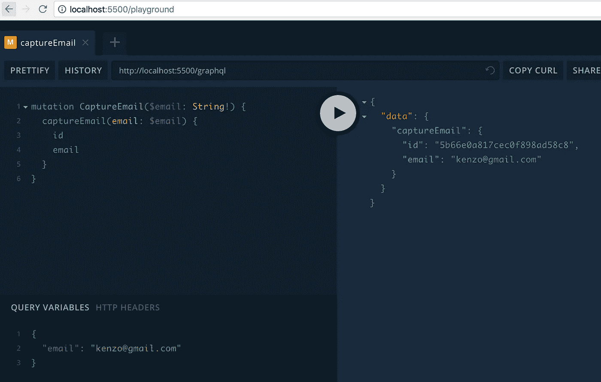
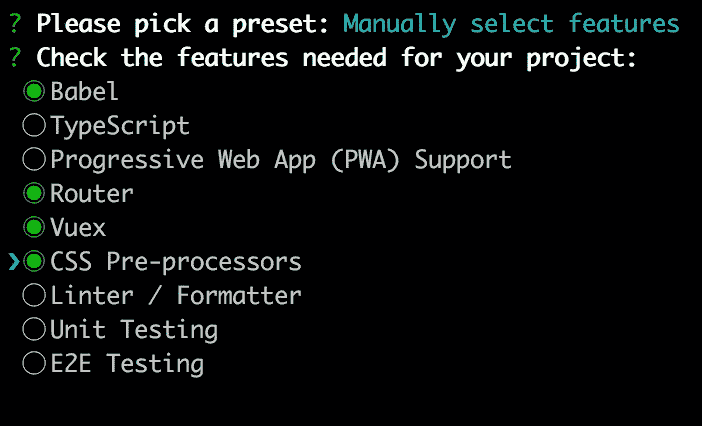
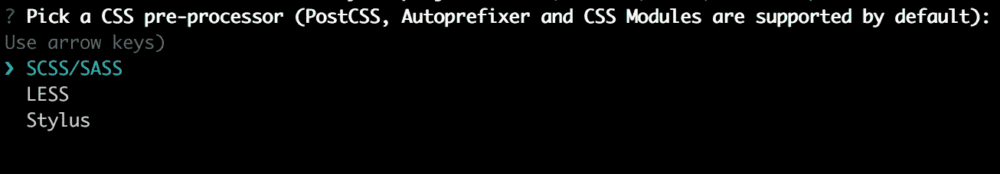
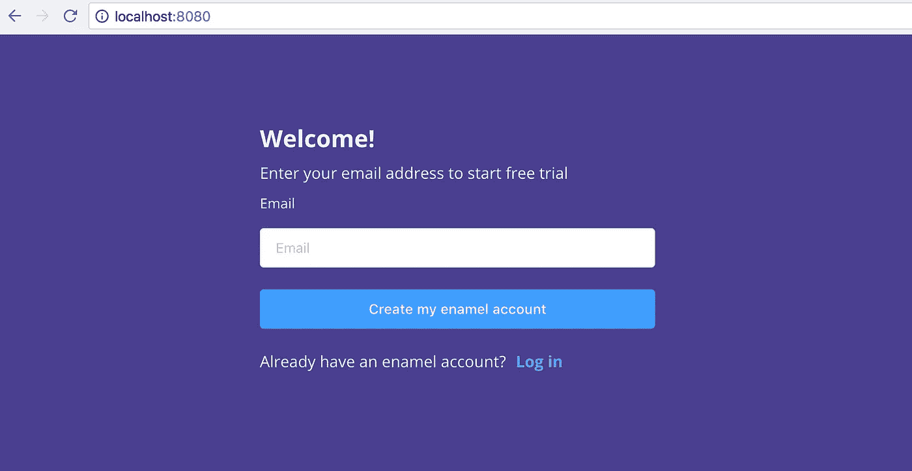

# 用 Vue.js、Node.js 和 Apollo 构建一个项目管理工具——第 2 部分

> 原文：<https://itnext.io/build-a-project-management-tool-with-vue-js-node-js-and-apollo-part2-47fbe5dc2de4?source=collection_archive---------0----------------------->

> 在本系列的第 1 部分中，我们构建了一个简单的 GraphQL API。
> 
> 在这一部分，我们将构建 MongoDB 模式和一个电子邮件表单。
> 
> 在[第 3 部分](/build-a-project-management-tool-with-vue-js-node-js-and-apollo-part-3-69a7bf9f2f1b)中，我们将完成认证。
> 
> [第 4 部分——建立工作空间](/build-a-project-management-tool-with-vue-js-node-js-and-apollo-part-4-40fbe0625d32)
> 
> [第 5 部分—文件夹的 CRUD 功能](/build-a-project-management-tool-with-vue-js-node-js-and-apollo-part-5-d59e6e345e39)

让我们从创建一个 MongoDB 模式开始本教程。在`server/src`中创建一个新文件`models.js`。

虽然您可以在不创建模式的情况下使用 MongoDB，但是这样做可以让您以更具表现力的方式编写代码，并帮助您可视化数据库结构。

首先，我们需要一个文件夹、团队和用户的模型。Wrike 比其他工具更复杂，因为文件夹和任务是一个树状结构——你可以创建一个子文件夹的子文件夹。所以文件夹模型有一个父引用。还要注意，我使用了动态引用[进行共享。这是因为您可以与整个团队、组或用户共享一个文件夹。](http://mongoosejs.com/docs/populate.html#dynamic-ref)

最后，我编写了`buildModel`函数来抽象样板代码。它将时间戳(createdAt 和 updateAt)插入到每个模型中。

```
server/src/models.js
const mongoose = require("mongoose")
const moment = require('moment')
const Schema = mongoose.Schema
const ObjectId = Schema.Types.ObjectIdfunction buildModel(name, schema) {
  return mongoose.model(name, new Schema(schema, {timestamps: true}))
}const Folder = buildModel('Folder', {
  name: String,
  description: String,
  shareWith: [{
    kind: String,
    item: { type: ObjectId, refPath: 'shareWith.kind' }
  }],
  parent: { type: ObjectId, ref: 'Folder' },
})
module.exports.Folder = Folder
```

团队模型与文件夹完全相同。但是由于团队有不同的特征，我为此建立了一个单独的模型。

```
module.exports.Team = Folder.discriminator('Team', new Schema({
}, {timestamps: true}))
```

用户模型有许多字段。我会在我们进行的过程中解释每一个领域。

```
module.exports.User = buildModel('User', {
  name: {
    type: String,
    default: ''
  },
  firstname: String,
  lastname: String,
  email: {
    type: String,
    required: true,
  },
  password: {
    type: String,
  },
  jobTitle: {
    type: String,
    default: ''
  },
  avatarColor: String,
  team: { type: ObjectId, ref: 'Team' },
  role: String,
  status: String
})
```

# **用户对象**

通常像这样的教程在完成一个基本功能后处理认证，这有助于你快速获得一个大图。这种方法的缺点是您最终要重写一些代码。所以我决定先建立身份验证。我知道这不是最令人兴奋的部分，但是让我们现在就完成它，这样我们就可以进入更有趣的东西了！

这里是新的`schema.graphql`。我不想要求用户马上注册，而是想先获取他的电子邮件。所以我们有`captureEmail`以及`signup`和`login`。我们需要定义一个定制的标量类型`Date`，因为 GraphQL 默认没有。

```
// server/src/schema.graphql
scalar Datetype Query {
 test: String
}type Mutation {
  captureEmail(email: String!): User
  signup(id: String!, firstname: String!, lastname: String!, password: String!): AuthPayload!
  login(email: String!, password: String!): AuthPayload!
}type User {
  id: String
  name: String
  firstname: String
  lastname: String
  email: String
  avatarColor: String
  jobTitle: String
  team: String
  role: String
  status: String
  createdAt: Date
}type AuthPayload {
  token: String!
  user: User!
}
```

现在我们已经有了 GraphQL 模式设置，让我们编写相应的 revolver 函数。稍后我们将填充`signup`和`login`。

```
const { GraphQLScalarType } = require('graphql')
const moment = require('moment')
const { User } = require('./models')const resolvers = {
  Query: {
    test (_, args, context) {
      return 'Hello World!!'
    }
  },
  Mutation: {
    async captureEmail (_, {email}) {
      const isEmailTaken = await User.findOne({email})
      if (isEmailTaken) {
        throw new Error('This email is already taken')
      }
      const user = await User.create({
        email,
        role: 'Owner',
        status: 'Pending'
      })
      return user
    },
    async signup (_, {id, firstname, lastname, password}) {
    },
    async login (_, {email, password}) {
    }
  },
  Date: new GraphQLScalarType({
    name: 'Date',
    description: 'Date custom scalar type',
    parseValue: (value) => moment(value).toDate(), // value from the client
    serialize: (value) => value.getTime(), // value sent to the client
    parseLiteral: (ast) => ast
  })
}module.exports = resolvers
```

`captureEmail`直截了当。首先，它检查电子邮件是否已被占用。否则，创建一个拥有所有者角色的用户。状态为待定，因为用户尚未注册。

在突变下面，我们有日期标量类型。由于 GraphQL 不能发送和接收日期对象，我们需要解析和序列化它。为了序列化它，我们调用`getTime()`来获取自 1970/01/01 以来的毫秒数。这样我们就可以把一个日期当作一个数字。为了解析它，我们使用 [moment.js](http://momentjs.com/) 。这是一个非常棒的处理日期和时间的库，我在整个应用程序中广泛使用它。

让我们测试一下`captureEmail`。就像之前一样，通过去`localhost:5500/playground`开辟操场，写一个变异。确保提供电子邮件作为查询变量。



这应该会创建一个新用户。为了证实这一点，请看一下 MongoDB。我使用免费的 GUI 工具 [Robo 3T](https://robomongo.org/) ，但是你可以使用任何你想要的。如您所见，用户对象已经创建。


# 设置 Vue 应用程序

我不想让你在后台呆太久，所以让我们创建一个 Vue 应用程序并测试从客户端捕获电子邮件。

为了搭建 Vue 应用程序，我们将使用 [Vue cli 3](https://cli.vuejs.org/) 。这是一个神奇的工具。你知道它会根据你的代码自动添加 babel polyfills 吗？这让我们的生活变得轻松多了。如果您还没有，请全局安装它。

```
yarn global add @vue/cli
```

然后在根目录下新建一个 app。

```
vue create client
```

这是我们需要的功能。为了简单起见，我只包括了最基本的东西。



CSS 预处理器是个人喜好的问题。我用 SCSS，但你也可以用你最喜欢的。



为了最小化文件数量，我将配置文件放在 package.json 中。

确认应用程序正在运行:

```
cd client
yarn serve
```

将以下依赖项添加到`package.json`。这就是我们客户需要的。可以看到，除了 element-ui 和 moment，都是 GraphQL/Apollo 相关的。

```
{
  ...
  "dependencies": {
    "apollo-cache-inmemory": "1.2.5",
    "apollo-client": "2.3.5",
    "apollo-link": "1.2.2",
    "apollo-link-error": "1.1.0",
    "apollo-link-http": "1.5.4",
    "element-ui": "2.4.3",
    "graphql": "0.13.2",
    "graphql-tag": "2.9.2",
    "moment": "2.22.2",
    "vue-apollo": "3.0.0-beta.19",
    "vue": "^2.5.16",
    "vue-router": "^3.0.1",
    "vuex": "^3.0.1"
  },
  ...
}
```

安装依赖项:

```
yarn
```

在`main.js`中，安装库并为 Apollo 添加一些样板代码:

```
import Vue from 'vue'
import { ApolloClient } from 'apollo-client'
import { InMemoryCache } from 'apollo-cache-inmemory'
import { onError } from "apollo-link-error"
import { ApolloLink } from 'apollo-link'
import { HttpLink } from 'apollo-link-http'
import { enableExperimentalFragmentVariables } from 'graphql-tag'
import VueApollo from 'vue-apollo'
import ElementUI from 'element-ui'import App from './App.vue'
import router from './router'
import store from './store'import 'element-ui/lib/theme-chalk/index.css'Vue.use(ElementUI)Vue.config.productionTip = falseconst uri = `${process.env.VUE_APP_URI}/graphql`
const httpLink = new HttpLink({uri})const cache = new InMemoryCache({})const errorLink = onError(({ graphQLErrors, networkError }) => {
  if (graphQLErrors)
    graphQLErrors.map(({ message, locations, path }) =>
      console.log(
        `[GraphQL error]: Message: ${message}, Location: ${locations}, Path: ${path}`
      )
    )
  if (networkError) console.log(`[Network error]: ${networkError}`)
})const client = new ApolloClient({
  link: ApolloLink.from([
    errorLink,
    httpLink
  ]),
  cache,
  connectToDevTools: true,
})const apolloProvider = new VueApollo({
  defaultClient: client,
  defaultOptions: {
    $loadingKey: 'loading'
  }
})Vue.use(VueApollo)new Vue({
  router,
  provide: apolloProvider.provide(),
  store,
  render: h => h(App)
}).$mount('#app')
```

创建`.env.development`并为后端 API 定义环境变量:

```
VUE_APP_URI=[http://localhost:5500](http://localhost:5500)
```

CSS 文件太长，无法放在这里。您可以从[库](https://github.com/kenzotakahashi/enamel/tree/part2/client/src/assets/css)中复制粘贴`style.scss`和`variables.scss`。

创建`vue.config.js`并添加以下内容:

```
//client/vue.config.js
module.exports = {
  devServer: {
    port: 8080,
    proxy: '[http://localhost:5500'](http://localhost:5500')
  },
  configureWebpack: {
    module: {
      rules: [
        {
          test: /\.(graphql|gql)$/,
          exclude: /node_modules/,
          loader: 'graphql-tag/loader'
        }
      ]
    }
  },
  css: {
    loaderOptions: {
      sass: {
        data: `[@import](http://twitter.com/import) "@/assets/css/variables.scss";`
      }
    }
  }
}
```

我们将在客户端使用 graphQL 文件，所以我们需要在这里定义一个加载器。

我希望 scss 变量可以从所有组件中访问，而不需要手动导入，所以我在这里导入`variables.scss`。

将路线模式改为`history`

```
client/src/router.js
import Vue from 'vue'
import Router from 'vue-router'
import Home from './views/Home.vue'Vue.use(Router)export default new Router({
  mode: 'history',
  ...
})
```

删除`App.vue`中的样本代码，替换为:

```
<template>
  <div id="app">
    <router-view></router-view>
  </div>
</template>
```

最后，Home.vue 中的 captureEmail 页面:

```
//client/src/views/Home.vue
<template>
  <el-container>
    <el-header>
    </el-header><el-main>
      <div class="container-center">
        <h2>Welcome!</h2>
        <div>Enter your email address to start free trial</div><div v-if="error" class="error">
          {{ error }}
        </div><el-form ref="form" :model="form">
          <el-form-item>
            <label>Email</label>
            <el-input v-model="form.email" placeholder="Email"></el-input>
          </el-form-item>
          <el-form-item>
            <el-button type="primary" >Create my enamel account</el-button>
          </el-form-item>
        </el-form><div>
          <span>Already have an enamel account?</span>
          <router-link :to="{name: 'login'}" class="link">Log in</router-link>
        </div><div v-if="submitted">
          <div>Thank you!</div>
          <div>Please check your email.</div>
        </div> 
      </div></el-main>
  </el-container></template><script>export default {
  data() {
    return {
      submitted: false,
      error: false,
      form: {
        email: '',
      }
    }
  }
}
</script><style scoped lang="scss">
.el-button {
  width: 100%;
}.error {
  padding-top: 10px;
}</style>
```

现在，如果您转到一个根 URL，它应该是这样的:



唷，代码太多了！它甚至什么都不做！

# 捕获电子邮件

终于到了使用阿波罗客户端的时候了。创建`constants/query.gql`并放置我们在操场上使用的相同代码:

```
//client/src/constatnts/query.gql
mutation CaptureEmail($email: String!) {
  captureEmail(email: $email) {
    id
    email
  }
}
```

我们还将在`helpers/helpers.js`中定义一个验证函数，因此在`src`中创建文件夹。

```
//client/src/helpers/helpers.js
export function validateEmail(email) {
  const re = /^(([^<>()\[\]\\.,;:\s@"]+(\.[^<>()\[\]\\.,;:\s@"]+)*)|(".+"))@((\[[0-9]{1,3}\.[0-9]{1,3}\.[0-9]{1,3}\.[0-9]{1,3}\])|(([a-zA-Z\-0-9]+\.)+[a-zA-Z]{2,}))$/;
  return re.test(String(email).toLowerCase())
}
```

您可以使用类似 Vue-validate 的东西进行验证。这是一个强大的库，但我想保持简单，不要在库上回复太多。

我们差不多完成了。回到`Home.vue`。向提交按钮添加事件处理程序:

```
<el-button type="primary" [@click](http://twitter.com/click)="capture">Create my enamel account</el-button>
```

导入查询和验证函数。`capture`方法看起来是这样的:

```
<script>
import { CaptureEmail } from '../constants/query.gql'
import { validateEmail } from '@/helpers/helpers'export default {
  ...
  methods: {
    capture() {
      const {email} = this.form
      if (!email || !validateEmail(email)) {
        this.error = 'Please enter a valid email'
        return
      }
      this.$apollo.mutate({
        mutation: CaptureEmail,
        variables: {email}
      }).then(({data}) => {
        this.submitted = true
        this.error = false
        // For development only
        console.log(data.captureEmail.id)
      }).catch((error) => {
        if (error.graphQLErrors.length >= 1) {
          this.error = error.graphQLErrors[0].message            
        } else {
          this.error = 'Something went wrong'
        }
        console.log(error)
      }) },
  }
}
</script>
```

首先，它验证电子邮件。如果有效，调用 Apollo 变异方法，用 email 作为变量。然后，如果一切正常，将`this.submitted`设置为真并显示一条消息。否则，显示一条错误消息。Apollo 错误是 graphQLErrors 或 NetworkError。因此，如果错误对象有 graphQLErrors，则显示消息。在这种情况下，就是邮件已经被占用了。否则这是一个网络错误，所以我们只显示一个普通的错误消息。

你可以在这里了解更多关于错误处理[的信息。](https://www.apollographql.com/docs/react/features/error-handling.html)

如果您输入的电子邮件与您在 playground 中使用的不同，您应该会看到下面的消息。


你也可以尝试输入一个无效的电子邮件或电子邮件已经采取，并确认他们得到妥善处理。

第 2 部分到此为止！如有需要，可查看 [github](https://github.com/kenzotakahashi/enamel/tree/part2) 作为参考。

在[第 3 部分](https://medium.com/@kenzotakahashi2/build-a-project-management-tool-with-vue-js-node-js-and-apollo-part-3-69a7bf9f2f1b)中，我们将创建认证。

如果你喜欢这篇文章，请给它一些掌声！这激励我尽快写下一部分。