# 使用 Redux-Toolkit 包使用 React Redux 和 TypeScript 构建一个应用程序

> 原文：<https://itnext.io/build-a-react-redux-with-typescript-using-redux-toolkit-package-d17337aa6e39?source=collection_archive---------0----------------------->


**网络矢量由 Vecteezy** 链接:【https://www.vecteezy.com/free-vector/web】T2

在本教程中，我们将看到如何使用 redux-toolkit 包在 React 中使用 TypeScript 设置 Redux。我研究了许多其他文章和讲座，但是没有人使用 Redux 工具包。Redux Toolkit 是一个帮助我们以简单的方式设置 Redux 的包。因此，我将在 Redux 工具包的帮助下，使用 TypeScript 一步步地在 React 中设置 Redux。

**Redux** 是一个中央商店，应用程序中的所有组件都可以在这里使用或修改状态。它主要用于避免属性链接，因为它会变得混乱和困难。我们可以使用的替代方法是 React 上下文，但是当构建大型产品时，它会变得非常复杂，这是一个缺点。当状态有高频更新时，Redux 是首选。Redux 的一些最佳用例是:

*   身份验证，因为这是整个应用程序所要求的
*   当有数据需要在许多组件之间共享时，如购物网站中的商品需要在购物车、账单和支付组件中可用。

Redux-Toolkit 是一个非常有用的包，可以用来创建商店。它有助于将悬挂物分成若干片(以后再分成更多片),并且可以很容易地为悬挂物组合减速器。使用这个包的最大好处是它允许直接改变减速器中的状态并克服不变性。这是因为，在幕后，Redux-Toolkit 包运行着 **Immer** 包。点击阅读更多关于**Immer**的内容。

我们将在[*JSONplaceholder Api*](https://jsonplaceholder.typicode.com/todos)的帮助下创建一个 Todo 项目，它提供了免费的假 REST API。

## **第一步:**

要使用 TypeScript 创建 React 应用程序，请运行:

```
npx create-react-app todo — template typescript
```

我们需要安装的额外软件包是:

```
npm install react-redux
npm install [@reduxjs/toolkit](http://twitter.com/reduxjs/toolkit)
npm install axios
```

Axios 包用于发送 http 请求。与 Fetch、XMLHttpRequest 等发送 http 请求的方式相比，它更容易使用。

## 第二步:

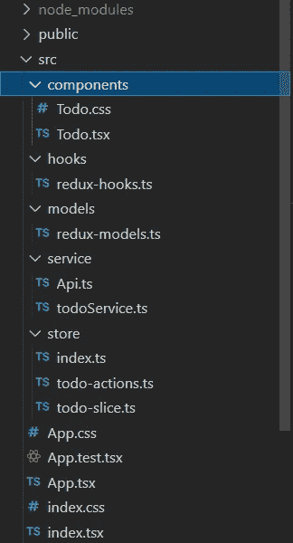

我们将遵循的项目结构

为了更好地理解和访问，我们可以用不同的方法将代码分组到文件夹中。**组件文件夹**用于存储我们将在此处创建的组件。**钩子文件夹**用于存放定制钩子。**模型文件夹**用于存储我们在 typescript 中需要的接口。存储文件夹是我们设置 redux 的地方。**服务文件夹**是我们设置 axios 及其服务来发送 http 请求的地方。

## 第三步:

在这里，我们将检查每个文件，我会尝试解释每一行代码。

因此，我们将首先从需要用 TypeScript 设置 redux 的模型开始。

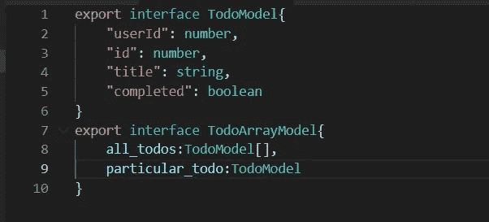

redux-model.ts

在这个文件中，我们可以看到将在 redux store 中作为类型使用的接口。

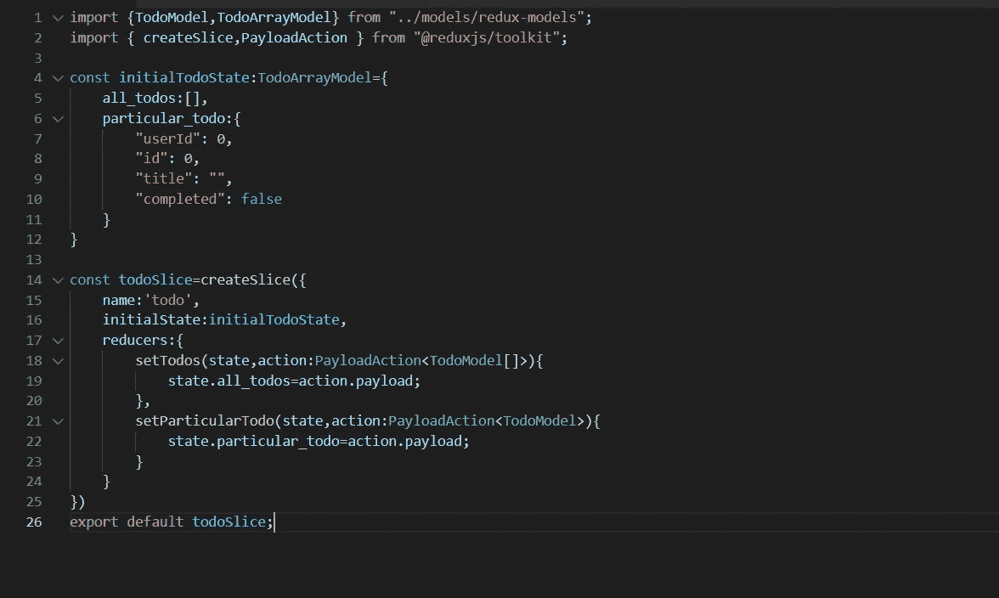

todoSlice.ts

这里是创建切片的地方。所以一家店可以有不止一片。每个切片都有数据和它们的归约器。我们应该记住的一点是，reducers 应该没有副作用(http 调用、超时)，它们应该是简单的函数，只是用来修改状态。所有的异步代码都应该在动作中处理。

在这里我们可以看到许多州。所以 w *的帽子是* ***状态*** *？*

状态就像存储中的当前内容。这里的状态是

```
{all_todos:[],particular_todo:{} }
```

状态就像一个物体；这里它包含一个 ***all_todos*** 数组和一个***special _ todo***对象，这个状态可以在应用程序的任何地方访问。

接下来，我们用 initialState 和 reducers 初始化 todoSlice:

*   setTodos():用于设置***all _ todos****字段中的所有 todo。*
*   *setParticularTodo():用于根据***special _ Todo***字段中的 id 设置特定的 todo。*

*减速器接受参数**状态** ( *是商店的当前状态，因此我们可以操纵它*)和**动作**类型 ***PayloadAction <类型>*** ( *它将拥有来自动作调用*的有效载荷。*

*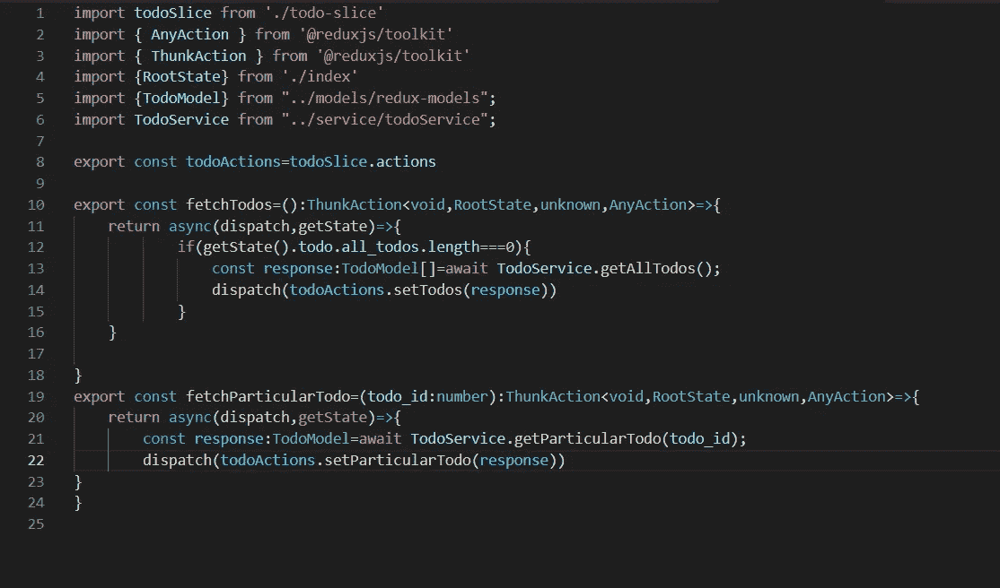*

*todo-操作. ts*

*这里是我们定义自定义动作的地方。所以这里我们定义了 ***fetchTodos()*** 和***fetchspecialtodo()。*** 这里我们实际上是在创建 ***Thunks*** (是一个将一个动作延迟到以后的函数)。这是我们如何在 TypeScript 中定义它们，我们必须创建它们，因为，如前所述，这里有一个 http 调用。*

*我们必须理解，redux-toolkit 根据我们在切片中创建的 reducers，自动创建具有类型和有效负载的动作。所以这些动作可以从***slice name . actions***(这里是 todoSlice.actions *)* 中访问，我们可以使用 **dispatch()** 函数调用它们，该函数调度动作并根据动作类型调用适当的 reducers。我们可以在下面看到:*

```
*const todoActions= todoSlice.actions
dispatch(todoActions.setTodos())*
```

*现在我们可以看到我们是如何为 http 调用设置 axios 的。*

*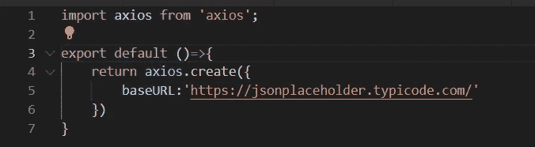*

*Api.ts*

*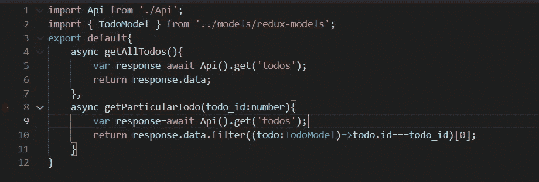*

*todoService.ts*

*在这里的 **Api.ts** 中，我们只是用 baseURL 设置 Axios，而在 **todoService.ts** 中，我们定义了多个函数来从假 Api 获取数据。Async/Await 用于存在异步代码的情况，我们需要等到它完全执行后再做其他事情。因此，从这里，我们得到了需要存储在 Redux 中的数据。*

*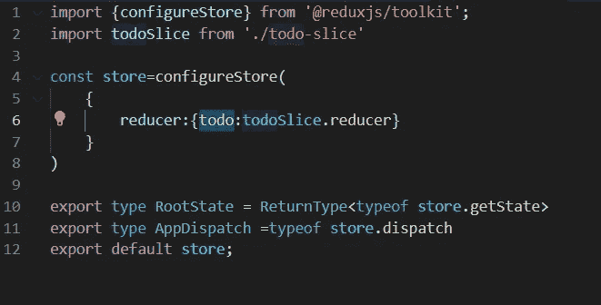*

*index.ts*

*这里的 **configureStore** 是对标准 Redux `createStore`函数的友好抽象，它为商店设置添加了良好的默认值，以获得更好的开发体验。这有助于我们在不使用*组合减速器*套件的情况下组合不同的减速器。*

*因此，这里我们还导出了类型**根状态**和**应用调度**类型，因为它们可以在需要时被引用。从存储本身推断这些类型意味着当您添加更多的状态片或修改中间件设置时，它们会正确地更新。*

*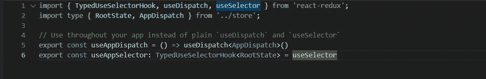*

*redux-hooks.ts*

*我们必须使用***use app dispatch()***和***use app selector()***而不是 *useDispatch()* 和 *useSelector()* ，因为自定义挂钩会自动处理类型，我们无需担心它，这也是我们使用从商店导入的 **RootState** 和 **AppDispatch** 的地方。*

*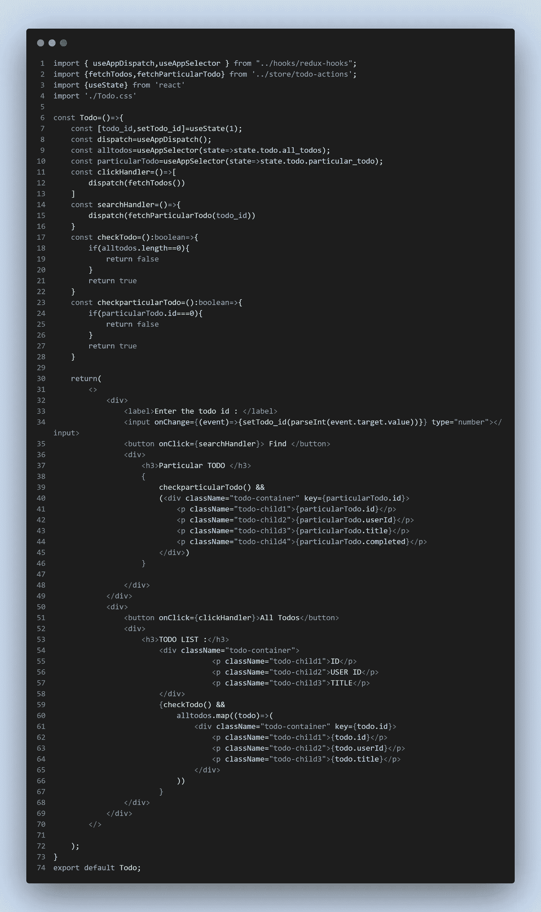*

*这里是 todo 组件，在这里我们可以显示特定的 Todo 和所有的 Todo。*

*   ***useAppSelector()** :这个钩子用于从存储中获取特定的状态。*

```
*const allTodos = useAppSelector(state=>state.todo.all_todos);*
```

*   ***useAppDispatch():** 这个钩子返回一个函数，这个函数用来调度动作，动作又调用相应的 reducers。*

```
*const dispatch=useAppDispatch();const clickHandler=()=>{ dispatch(fetchTodos())}*
```

***dispatch(fetchTodos())*=>***将调用 *todo-actions.ts* 中的 **fetchTodos()** 进行 http 调用，反过来它们**dispatch(todo actions . setTodos(response))*=>***调用 *todo-slice.ts* **中的 reducer **setTodos()*****

*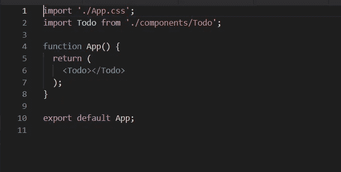*

*App.tsx*

*这是我们导入 Todo 组件的地方，它显示在这里。*

*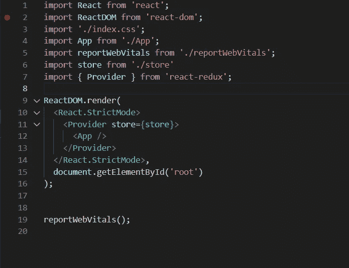*

*index.tsx*

*我们要做的最后一件事是在 App 标签周围添加 Provider 标签。这样做是因为应用程序的任何子组件都可以访问商店，也可以在商店中进行更改。*

*可以添加到谷歌 chrome 浏览器的一个很酷的扩展是 **Redux DevTools** ，如果它有一些错误，这将帮助你调试 Redux。在这里点击[](https://chrome.google.com/webstore/detail/redux-devtools/lmhkpmbekcpmknklioeibfkpmmfibljd?hl=en)*。**

# **摘要**

**在本文中，我们已经了解了如何使用 TypeScript 和 redux-toolkit 包来设置 Redux 存储。**

**整个项目也可以在我的 GitHub 存储库中找到。**

**[](https://github.com/jodtribhu/Redux-Tutorial) [## GitHub-jodtribhu/Redux-教程

### https://jsonplaceholder.typicode.com/todos 这个项目是用 Create React 应用程序引导的。在项目中…

github.com](https://github.com/jodtribhu/Redux-Tutorial) 

如果你喜欢这篇文章，请点击**拍拍**按钮&放下下面的评论。继续编码！！

# 特别感谢:

[https://www . udemy . com/course/react-the-complete-guide-incl-redux/](https://www.udemy.com/course/react-the-complete-guide-incl-redux/)

[https://www . udemy . com/course/react-and-typescript-build-a-portfolio-project/](https://www.udemy.com/course/react-and-typescript-build-a-portfolio-project/)

[https://redux-toolkit.js.org/](https://redux-toolkit.js.org/)

[https://jsonplaceholder.typicode.com/](https://jsonplaceholder.typicode.com/)**