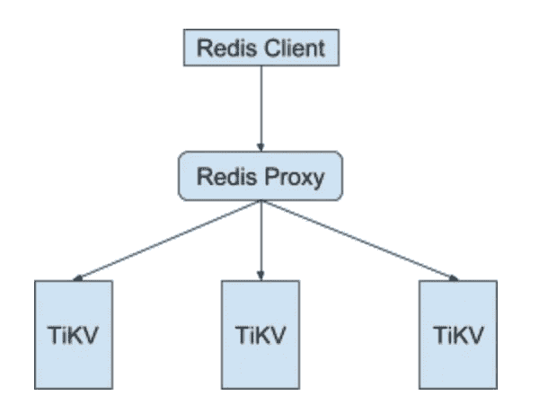

# 基于 TiKV 构建 Redis 兼容集群

> 原文：<https://itnext.io/build-a-redis-compatible-cluster-based-on-tikv-6ef03d26528?source=collection_archive---------1----------------------->

## Redis 是什么？

[Redis](https://redis.io) ，一个快速、开源、内存中的键值数据存储，可以用作数据库、缓存和消息代理。它提供了丰富的数据结构，如字符串、哈希、集合和有序集合，可以帮助用户轻松地构建自己的产品。这是一个高性能的，也许是世界上最快的数据库之一。虽然它将数据保存在内存中，但它支持可以保证数据安全的持久和异步复制。

## Redis 的局限性

Redis 很酷，但它仍然存在一些问题:

1.  内存是昂贵的，而且不是无限的。你不能在一台机器上保存大量数据。
2.  异步复制无法保持数据一致。
3.  交易模式不能保证 ACID 合规。
4.  虽然支持集群化，但是不能支持跨节点分布式事务。

有时，我们需要一个更强大的数据库来支持:

1.  丰富的数据结构，如字符串、散列、集合、有序集合等。
2.  高性能
3.  数据强一致性
4.  水平可扩展性
5.  分布式事务

## 为什么是 TiKV？

大约 4 年前，我开始解决 Redis 的问题。为了保持数据的持久性，直观的方法是将数据保存在磁盘中，而不是内存中。于是我开发了 [LedisDB](https://github.com/siddontang/ledisdb) ，一个使用 RocksDB 保存数据，支持 Redis 协议，提供 Redis 数据结构的数据库。LedisDB 工作得很好，但是它不完全兼容 Redis。所以后来，我创建了 [RebornDB](https://github.com/reborndb/reborn) ，一个完全兼容 redis 的数据库。

LedisDB 和 RebornDB 都将数据保存在磁盘中，克服了内存限制。但是它们不支持 ACID 事务。虽然我们可以使用 [codis](https://github.com/CodisLabs/codis) 来扩展它们以支持集群，但还是不方便，也不能支持分布式事务。

所以我们需要一种新的方法。好在现在对我们来说不难，因为我们有 [TiKV](https://github.com/pingcap/tikv) 。

TiKV 是一个高性能的分布式事务键值存储。虽然它只是提供了一个简单的键值 API，但是您可以在它的基础上构建自己的逻辑。例如，我们已经构建了[TiDB](https://github.com/pingcap/tidb)——一个基于 TiKV 的分布式关系数据库。TiDB 支持 MySQL 协议，它在内部将数据库模式映射到键值。所以对于 Redis，我们也可以构建一个支持 Redis 协议的服务，并将 Redis 数据结构映射到键值格式。

## 怎么



整个架构很简单。我们只需要构建一个 Redis 代理，它解析 Redis 协议，并将 Redis 数据结构转换为 TiKV 键值结构。

## Redis 协议

Redis 协议被称为 [RESP](https://redis.io/topics/protocol) (Redis 序列化协议)，它是基于文本的，人类可读的，并且易于解析。它使用“\r\n”作为终止，并对不同的类型使用不同的前缀。例如，对于简单的字符串，第一个字节是“+”，因此字符串可能像“+OK\r\n”。

大多数情况下，客户端使用请求-响应模式进行通信。客户端向服务器发送请求(数组类型由批量字符串组成),服务器返回任何 RESP 类型作为回复。Redis 也有两种扩展模式:

1.  管道:客户端向服务器发送多个请求并接收回复
2.  推送:在客户端订阅一个频道后，客户端将只接收来自服务器的回复。

下面是一个简单的例子，当客户端向服务器发送`LLEN mylist`命令时:

```
C: *2\r\n
C: $4\r\n
C: LLEN\r\n
C: $6\r\n
C: mylist\r\n

S: :48293\r\n
```

客户端向服务器发送一个包含两个批量字符串的数组，第一个批量字符串长度为 4，第二个批量字符串长度为 6。服务器返回一个整数 48293。如您所见，RESP 很简单，编写 RESP 解析器非常容易。

我刚刚创建了一个 Go 库 [goredis](http://github.com/siddontang/goredis) ，使用它我们可以很容易地从连接中解析 RESP。举个例子，

```
// Create a buffer IO from the connection.
br := bufio.NewReaderSize(conn, 4096)
// Create a RESP reader.
r := goredis.NewRespReader(br)
// Parse the Request
req := r.ParseRequest()
```

ParseRequest 返回一个解析后的请求，是 Go 中的一个`[][]byte`，第一项是类似“LLEN”的命令名，其余项是这个命令的参数。

## TiKV 交易 API

在开始之前，我将展示一个如何使用 TiKV 事务 API 的简单示例。

对于每一笔交易，我们将从一个`Begin`函数开始，比如:

```
txn, err := db.Begin()
```

`Begin`创建一个函数。如果出现问题，我们需要在这里检查错误。

创建事务后，我们可以进行一些操作，比如:

```
value, err := txn.Get([]byte(“key”))
// Do something with value and then update the newValue to the key.
txn.Put([]byte(“key”), newValue)
```

TiKV 使用乐观提交模型，因此所有的更改都缓存在客户机中，然后在提交时提交给服务器。

```
// Commit the transaction
txn.Commit(context.TODO())
```

像普通交易一样，我们也可以取消交易:

```
txn.Rollback()
```

如果两个事务操作同一个密钥，它们会遇到密钥冲突。在这种情况下，只有一个事务可以成功提交，另一个事务将返回冲突错误并中止。

## 将数据结构映射到 TiKV

现在我们知道了如何解析 Redis 协议，在事务中执行键值操作。接下来就是支持 Redis 数据结构。Redis 有四种主要的数据结构:字符串、散列、集合和有序集合。但是对于 TiKV，它只支持 key-value，所以我们需要将这些不同的数据结构映射到 key-value。

首先，我们需要区分 TiKV 中不同的数据结构。一种简单的方法是在键的末尾附加一个类型标志。例如，我们可以为字符串添加“s ”,因此字符串“abc”将在 TiKV 中保存为“abcs”。

对于其他类型，我们需要考虑更多，不能只用一个类型标志。例如，对于哈希类型，我们需要支持以下操作:

```
HSET key field1 value1
HSET key field2 value2
HLEN key
```

一个散列有许多字段，我们也想容易地得到散列的长度。所以在 TiKV 中，我们将把散列键和字段组合在一起作为 TiKV 键，并使用另一个键来保存长度。布局可能看起来:

```
key + ‘h’ -> length
key + ‘f’ + field1 -> value
key + ‘f’ + field2 -> value
```

如果我们不将长度保存为另一个键，那么每次如果我们想要获得 Hash 的长度，我们需要扫描所有带有前缀“key”的数据，这是无效的。但是如果我们对长度使用另一个键，那么每次我们为 Hash 添加一个新的字段，我们都必须更新长度值。这是一个设计权衡，这里我更喜欢使用另一个长度键，因为`HLEN`是一个频繁的操作。

演示

我构建了一个非常简单的[例子](https://github.com/siddontang/redis-tikv-example)，它只支持字符串和哈希以及一些操作。您可以运行:

```
git clone https://github.com/siddontang/redis-tikv-example.git $GOPATH/src/github.com/siddontang/redis-tikv-example

cd $GOPATH/src/github.com/siddontang/redis-tikv-example
go build
```

在运行这个例子之前，你需要启动 TiKV，你可以按照这里的[指令，然后运行:](https://github.com/pingcap/tikv#deploying-to-production)

```
./redis-tikv-example
```

示例服务器将监听端口 6380，您可以使用任何 redis 客户端(如 redis-cli)与其通信:

```
redis-cli -p 6380
127.0.0.1:6380> set k1 a
OK
127.0.0.1:6380> get k1
"a"
127.0.0.1:6380> hset k2 f1 a
(integer) 1
127.0.0.1:6380> hget k2 f1
"a"
```

## 收场白

现在，一些公司已经基于 TiKV 构建了他们的 Redis 协议服务器，有一个名为 [tidis](https://github.com/yongman/tidis) 的开源项目也在做同样的事情。如果你想找一个替代你的 Redis 服务器的解决方案，你可以试试。

如您所见，TiKV 是一个构建模块，我们可以基于它轻松构建许多其他系统。如果你想加入我们开发这个美妙的项目，给我在 tl@pingcap.com 留言！