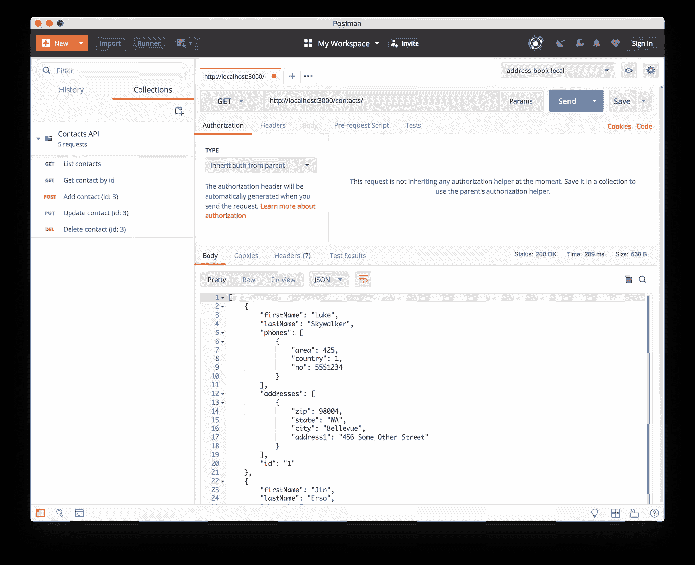

# 使用 AWS Lambda、API Gateway、DynamoDB 和无服务器框架构建 RESTful API

> 原文：<https://itnext.io/build-a-restful-api-using-aws-lambda-api-gateway-dynamodb-and-the-serverless-framework-30fc68e08a42?source=collection_archive---------0----------------------->


**更新:2019 年 11 月 16 日。**

AWS Node 10.16.x 上的无服务器源[库](https://github.com/vanister/contacts_api)已更新。

**更新时间:2019 年 1 月 8 日。**

一些读者指出，如果您继续将代码样本复制到您的项目中，您可能会在构建或运行时出错。

大多数情况下，错误与`.env`和`package.json`文件中的引号有关。只需删除一个报价，添加它回来，并保存文件。

感谢 reggie smith 和 Javish Kathuria 指出了这一点。

**更新:2018 年 10 月 17 日。**

我决定用 [Docker](https://www.docker.com/products/docker-desktop) 和 [LocalStack](https://github.com/localstack/localstack) 替换 Java 和 DynamoDB 本地 jar 依赖项。

这使得开发设置更加灵活，并为在 AWS 之外运行整个应用程序堆栈提供了一个平台。

现在，我们将只从 LocalStack 容器中运行 DynamoDB 服务。

```
# This will start the container in detached mode and map the dynamodb service to port 8000, which is the port we are using in this article; port 8080 is the localhost management portal for LocalStack.# The **DATA_DIR** environment variable is to persist the data when you start/stop the container.**docker run --name 'dynamodb_localstack' -d -p 8000:8000 -p 8080:8080 -e SERVICES=dynamodb:8000 -e DATA_DIR='/tmp/localstack/data' localstack/localstack**# NOTE: There is also a docker-compose.yml file in the GitHub repo to create and start this container as well. 
# Run with **docker-compose up -d**# To stop/start the container, run:
# Check if the container is running**docker ps** # should NOT see 'dynamodb_localstack' in the list
**docker start dynamodb_localstack
...
docker stop dynamodb_localstack** # this will stop the container
```

测试以确保`seed`和`start`脚本在容器运行后仍然工作。

```
# From the the project folder, where the package.json file is, run:**npm run seed
...
...
npm start**# Check postman or browser to see if they still return data.
```

**结束更新。**

我们将使用 Amazon Web Services (AWS)构建一个无服务器 RESTful API 来获取联系信息！

值得注意的是，本文主要关注的是让一切都在本地工作，这样您就可以开发和测试 API，而不需要依赖互联网和 AWS。本文还将使用 Node 8.10.x 支持的纯 ES6，没有传输文件。

本文的原始源代码可以在这里找到:[https://github . com/vanister/contacts _ API/tree/medium-article-source](https://github.com/vanister/contacts_api/tree/medium-article-source)

## **项目设置**

安装以下工具和框架:

*   [Node.js](https://nodejs.org/en/) ，8.10.x
*   [Visual Studio 代码](https://code.visualstudio.com/)
*   [Java](https://www.java.com/en/download/)
*   [DynamoDB 本地](https://docs.aws.amazon.com/amazondynamodb/latest/developerguide/DynamoDBLocal.DownloadingAndRunning.html)
*   [邮递员](https://www.getpostman.com/)

接下来，创建项目文件夹，并使用`npm`初始化它。

```
**$ mkdir contacts_api
$ cd contacts_api/
$ npm init -y**
```

## **依赖关系**

安装以下软件包以使用无服务器和 AWS:

*   [aws-SDK](https://www.npmjs.com/package/aws-sdk)—Amazon Web Services SDK 用于对各种 AWS 服务的编程访问。
*   [dotenv](https://www.npmjs.com/package/dotenv) —用于存储和设置环境变量的模块。
*   [jest](https://www.npmjs.com/package/jest) —一体化 JavaScript 单元测试框架。
*   [无服务器](https://www.npmjs.com/package/serverless) —用于管理 AWS 上的部署的框架。
*   [无服务器离线](https://www.npmjs.com/package/serverless-offline) —模拟 AWS API Gateway 和 Lambdas 进行本地开发的插件。

```
**$ npm install -g serverless
$ npm install --save-dev serverless-offline aws-sdk jest dotenv**
```

如果你想使用无服务器来本地管理 dynamodb，你可以选择安装[无服务器-dynamodb-local](https://www.npmjs.com/package/serverless-dynamodb-local) 插件。

## **项目结构**

在我们开始编写处理程序代码之前，我们将构建项目文件夹并配置我们的工具。

在根级别创建以下结构:

```
/contacts_api
|--/src
|----/handlers
|------/contacts
|--------contacts.serverless.yml
|--.env
|--.gitignore
|--jest.config.js
|--serverless.yml
| …
| …
|--package.json
```

用这些设置更新以下配置文件:

`.env`文件将存储我们的环境变量。如果您选择使用真正的 AWS 密钥，确保在`.gitignore`文件中列出它，这样您就不会意外地提交一些您的私有环境值。

```
**# file: .gitignore**# package directories
node_modules/# Serverless directories
.serverless/
.dynamodb# files
.DS_Store
.env# tests
coverage/**# file: .env**AWS_ENDPOINT=’http://localhost:8000'
AWS_REGION=’localhost’
AWS_ACCESS_KEY_ID=’fake-access-key’
AWS_SECRET_ACCESS_KEY=’fake-secret-key’
```

`jest.config.js`文件用于在 cli 之外配置 Jest。

```
// file: jest.config.jsmodule.exports = {
  // per issue: [https://github.com/jsdom/jsdom/issues/2304](https://github.com/jsdom/jsdom/issues/2304)
  testURL: ‘http://localhost/'
};
```

`serverless.yml`和`contacts.serverless.yml`文件是无服务器框架在本地部署和运行我们的 lambdas 的配置。

无服务器. yml

contacts.serverless.yml

## **存储库和实用程序**

在实现处理程序之前，我们需要编写一个存储库和一些实用程序来帮助抽象处理程序的逻辑，使它们可测试。

我们将使用存储库模式在 DynamoDB 和我们的联系实体之间创建一个抽象层。我们从存储库中获取的数据需要进行格式化，我们将创建一些辅助工具来帮助进行格式化。

为我们的联系人存储库类创建一个名为`src/repositories/contact.repository.js`的文件。

我们将设置我们的存储库来接受 DynamoDB 的 DocumentClient 作为一个依赖项，它将充当 UnitOfWork。

联系人.储存库. js

我们使用 DocumentClient 及其承诺，使 DynamoDB 的工作更简单，并利用 es6 和 Node 对 async/await 的支持。

存储库简单地返回一个承诺和从 DocumentClient 返回的数据。

接下来，让我们创建请求和响应实用程序，以便我们可以使用它们来提取、解析和格式化 lambda 函数要使用的数据。

为我们的请求实用程序创建一个名为`src/utils/request.util.js`的文件。

现在，请求实用程序将包含一个函数，该函数将接受一些解析器函数并返回一个新函数，该函数使用它来解析我们传递给它的一些文本。

请求. util.js

为我们的响应工具创建一个名为`src/utils/response.util.js`的文件。

response.util.js

`withStatusCode`响应实用程序函数类似于请求实用程序，但是它不是解析文本，而是将数据格式化成文本。它还包含额外的检查，以确保我们的状态代码在允许的状态代码范围内。

最后，我们将创建一个工厂模块来创建`DynamoDB.DocumentClient`的实例，这样我们就可以保持我们的 Lambda 函数干燥。

为我们的 DynamoDB 工厂创建一个名为`src/dynamodb.factory.js`的文件。

dynamodb.factory.js

## **λ函数**

思考这些功能的方法是将它们视为相互独立的。我们需要`require`一个函数需要的所有依赖关系，这样它才能独立执行。

由于我们将逻辑和 AWS 依赖项抽象成了一个存储库和实用程序，我们的 Lambda 函数将简单地调用存储库和实用程序并返回数据。

从`src/handlers/contacts`文件夹中，创建以下 Lambda 函数文件:

```
add.js
delete.js
get.js
list.js
update.js
```

打开每个文件，并向其中添加以下代码:

add.js

删除. js

get.js

list.js

update.js

注意，我们首先需要`dotenv/config`模块，因此我们可以设置正确的环境变量，以便在 DynamoDB 工厂模块中使用。

## **DynamoDB**

为了在本地设置 DynamoDB 进行开发，我们需要在项目文件夹旁边创建一个新文件夹来保存 DynamoDB jar 和 sharedDB 文件。

在`contacts_api`项目文件夹的父文件夹中打开一个终端，并运行以下命令:

```
**$ mkdir dynamodb
$ cd dynamodb
$ nano start-dynamodb.sh**
```

在 nano 编辑器中，添加以下行:

```
#!/bin/shjar=DynamoDBLocal.jar
lib=DynamoDBLocal_lib
dynamodir=./dynamodb-localjava -Djava.library.path=$dynamodir/$lib -jar $dynamodir/$jar -sharedDb
```

点击`control + x`，然后点击`Y`，选择“是”，保存并退出。

通过运行以下命令在本地启动 DynamoDB:

```
# from the dynamodb folder**$ sh start-dynamodb.sh**
```

## **播种联系人表**

回到`contacts_api`项目文件夹，添加一个名为`seed`的新文件夹，然后将以下文件添加到`seed`文件夹:

```
contact.seeder.js
contacts-test-json
runner.js
```

打开`contact.seeder.js`文件，添加以下代码:

contact.seeder.js

这个`ContactSeeder`类获取一个`DynamoDB`和`DocumentClient`并使用它们创建一个新的`contacts`表并将数据植入其中。

您可以在 AWS 文档门户上找到更多关于 [DynamoDB](https://docs.aws.amazon.com/AWSJavaScriptSDK/latest/AWS/DynamoDB.html) 和[document client](https://docs.aws.amazon.com/AWSJavaScriptSDK/latest/AWS/DynamoDB/DocumentClient.html)API 的信息。

打开`contacts-test-data.json`文件，添加一些条目作为`contacts`表的种子。

联系人-测试-数据. json

最后，打开`runner.js`文件并添加代码来执行播种器。

亚军. js

确保 DynamoDB 正在本地运行(参见上面的 DynamoDB 部分),并在项目文件夹的根目录下打开一个新的终端，运行`runner.js`文件以创建`contacts`表并为其植入数据。

```
**$ node ./seed/runner.js**# output from runner:>> Checking if ‘contacts’ table exists
>> Table ‘contacts’ exists, deleting
>> Creating ‘contacts’ table
>> Seeding data
>> Done!
```

## **把所有的放在一起**

现在我们已经设置好了一切，我们可以把它们放在一起，通过无服务器框架的`serverless-offline`插件在本地运行 API。

打开`package.json`文件，添加一些`npm`脚本，这样我们就可以使用`npm run <command>`运行我们的 API，而不是输入完整的命令。

```
{
  “name”: “contacts-api”
  “scripts” : {
    “sls”: “serverless”,
    “seed”: “node ./seed/runner.js”,
    “start”: “sls offline start”,
  }
}
```

`sls`脚本是一种调用`serverless` cli 的快捷方式，无需在运行命令前键入`./node_modules/.bin/sls`的完整路径，这仅适用于您没有全局安装无服务器的情况。

为了全面测试一切，我们需要让 DynamoDB 在一个终端本地运行，API 在另一个终端运行。

```
# from first terminal in the ./dynamodb folder where the jar file is
# start DynamoDB locally**$ sh start-dynamodb.sh**# from second terminal in the project root (where package.json is)
# start the api in offline mode**$ npm run start**# output from npm run start> contacts-api@1.0.0 start ./contact_list/contacts_api
> sls offline startServerless: Starting Offline: dev/us-west-2.Serverless: Routes for list:
Serverless: GET /contactsServerless: Routes for get:
Serverless: GET /contact/{id}Serverless: Routes for add:
Serverless: POST /contactServerless: Routes for update:
Serverless: PUT /contact/{id}Serverless: Routes for delete:
Serverless: DELETE /contact/{id}**Serverless: Offline listening on** [**http://localhost:3000**](http://localhost:3000)
```

启动 Postman 并点击列出所有联系人的端点(http://localhost:3000/contacts/)，您应该得到我们在数据库中播种的两个项目。



邮递员/联系人端点

## **结论**

我选择将 Jest 测试排除在文章之外，但是当我编写这个示例时，我使用了测试驱动的开发方法来规范功能代码，这确保了我所编写的内容是解耦的和可测试的。这有助于快速验证我的存储库、实用程序和 Lambda 函数是否如我预期的那样运行。这种方法使得集成一切和运行 API 变得更加简单，并减少了对调试器的依赖。

后来，集成一切和运行 API 变得简单，不需要大量的调试。

关于调试的话题，我在 GitHub 项目中包含了我的`launch.json`文件，这样你就可以用它来调试代码或单元测试，看看它们是如何一起工作的。

要将它部署到 AWS，您需要遵循关于[无服务器](https://serverless.com/framework/docs/providers/aws/guide/deploying/)的文档，并使用 api/secret 密钥的必要设置、DynamoDB 定义和从 AWS 中运行所需的权限来更新项目中的`.yml`文件。

## 后续步骤

部署到 Docker 容器进行本地测试或开发，而无需运行多个项目:

[](/containerizing-serverless-apis-d69fa3e6b9c2) [## 容器化无服务器 API

### 使用 Docker、LocalStack 和无服务器框架进行本地开发

itnext.io](/containerizing-serverless-apis-d69fa3e6b9c2) 

将 API 部署到 AWS:

[](/deploy-a-serverless-api-to-amazon-web-services-aws-106c996cded9) [## 将无服务器 API 部署到 Amazon Web Services (AWS)

### 在上一篇文章中，我写了关于构建一个本地运行的无服务器 API。在这里，我将向您展示如何部署它…

itnext.io](/deploy-a-serverless-api-to-amazon-web-services-aws-106c996cded9)