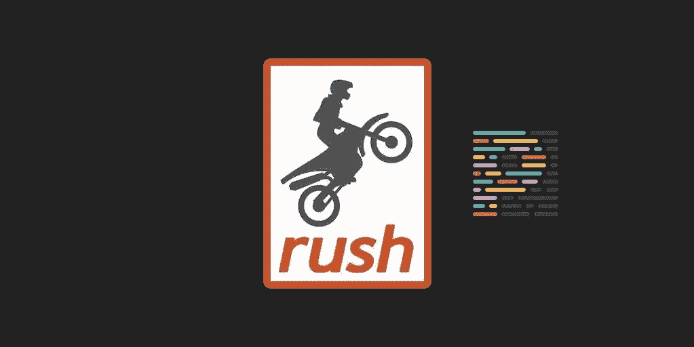

# 使用 Rush monorepo 和 React 构建可扩展的前端—第 1 部分

> 原文：<https://itnext.io/build-a-scalable-front-end-with-rush-monorepo-and-react-part-1-dd50ae38ad3e?source=collection_archive---------1----------------------->

# 回购设置+导入项目+更漂亮



这是博客系列“用 Rush monorepo 和 React 构建可伸缩前端”的第一部分

*   [第 1 部分](https://medium.com/@alexandrubereghici/build-a-scalable-front-end-with-rush-monorepo-and-react-part-1-dd50ae38ad3e) : Monorepo 设置，导入保留 git 历史的项目，
    添加更漂亮的
*   [第 2 部分](https://medium.com/@alexandrubereghici/build-a-scalable-front-end-with-rush-monorepo-and-react-part-2-d7f1c19c1797):用 Webpack 和 react-scripts 创建构建工具包
*   [第 3 部分](https://medium.com/@alexandrubereghici/build-a-scalable-front-end-with-rush-monorepo-and-react-part-3-b90430f15af7):添加共享 ESLint 配置，并与 lint-staged 一起使用
*   [第 4 部分](https://medium.com/@alexandrubereghici/build-a-scalable-front-end-with-rush-monorepo-and-react-part-4-d0939bfb8b8a):用 Github 动作和 Netlify 设置部署工作流。
*   [第 5 部分](https://medium.com/@alexandrubereghici/build-a-scalable-front-end-with-rush-monorepo-and-react-part-5-355f5391fd27):添加 VSCode 配置，获得更好的开发体验。

在多存储库项目结构中，当您需要从一个项目到另一个项目重用一些代码时，这只是一个时间问题。采用 monorepo 架构可以帮助团队共享和贡献代码。

我不会在本文中讨论选择这种方法的利弊，因为有大量的资源讨论这个主题，相反，我将重点讨论使用 Rush.js 和 React 实现可伸缩的 monorepo。

# 工具

我们将使用以下工具:

*   [冲](https://rushjs.io/)
*   [反应](https://reactjs.org/)
*   [打字稿](https://www.typescriptlang.org/)
*   [ESLint](https://eslint.org/)
*   [网络包](https://webpack.js.org/)
*   [更漂亮](https://prettier.io/)
*   [皮棉阶段](https://github.com/okonet/lint-staged)
*   [Github 动作](https://github.com/features/actions)
*   网络生活

# 目标

在实施 monorepo 之前，让我们定义一下我们希望使用这些工具实现的目标:

*   多种应用
*   应用程序之间的代码共享
*   共享工具和配置
*   代码质量的强制规则
*   开发的自动化工作流程

# TL；速度三角形定位法(dead reckoning)

如果你有兴趣只是看看代码，你可以在这里找到它:[https://github.com/abereghici/rush-monorepo-boilerplate](https://github.com/abereghici/rush-monorepo-boilerplate)

如果你想看一个在真实的大型项目中使用 Rush 的例子，你可以看看由 Bentley Systems 开发的开源项目 [ITwin.js](https://github.com/imodeljs/imodeljs) 。

# 向导

## 创建新的存储库

我假设您已经为这个项目创建了一个空的 Github 存储库。
让我们在本地克隆它，让魔法开始吧！

## 初始化紧急单报告

在项目文件夹中，运行以下命令:

```
npm install -g @microsoft/rushrush init
```

在这个命令之后，您会看到创建了一堆文件和文件夹。你可以在这里查看配置文件参考[。](https://rushjs.io/pages/advanced/config_files/)

此时，我们可以删除不必要的文件并创建我们的第一个提交。

```
rm -rf .travis.yml

git add .
git commit -m "Initial commit"
git push origin master
```

导入现有项目而不丢失 git 历史记录

如果您丢失了项目的所有历史记录，您不会真的想要执行到 monorepo 的迁移。如果所有东西都指向合并项目的提交，那么您将不能恢复到以前的提交，或者运行`git blame`或`git bisect`。

我们可以复制 monorepo 中的所有项目，并用一个 git 命令保存每个项目的 git 历史:`git subtree`。

假设我们想要将下面的项目导入到我们的 mono repo[https://github.com/abereghici/react-app](https://github.com/abereghici/react-app)中。我们将使用命令`git subtree add`来完成

```
git subtree add --prefix apps/react-app \
 https://github.com/abereghici/react-app master
```

让我们解码这个命令的参数:

*   `apps/react-app`用于指定 monorepo 内部的路径，项目将被导入到该路径。
*   `https://github.com/abereghici/react-app`是我们想要导入的项目的远程存储库 URL。
*   `master`是项目将从其中导入的分支。

现在，如果您运行`git log`，您将在我们的 monorepo 中看到`react-app`项目的历史。

打开`apps/react-app/package.json`，用`@monorepo/react-app`更改项目名称。

最后一步是在 rush 配置文件中注册`@monorepo/react-app`项目。打开`rush.json`文件，在项目清单下添加一个条目，如下所示:

```
"projects": [
    {
      "packageName": "@monorepo/react-app",
      "projectFolder": "apps/react-app",
      "reviewCategory": "production"
    }
  ]
```

这告诉 Rush 它应该管理这个项目。接下来，运行`rush update`来安装`react-app`项目的依赖项。该命令可以在包含`rush.json`文件的 repo 文件夹的任何子文件夹中启动。

```
rush update
git add .
git commit -m "Imported react-app project"
git push origin master
```

## 添加更漂亮

我们希望 monorepo 中的所有代码文件具有一致的语法和格式。因此，我们将更好地应用于整个存储库。我们将在`git commit`期间运行它。

让我们在 repo 的根目录下创建一个配置文件。漂亮允许这个配置文件有许多不同的名字，但是我们将使用`.prettierrc.js`

`<repo root>/.prettierrc.js`

```
module.exports = {
  arrowParens: 'avoid',
  bracketSpacing: true,
  htmlWhitespaceSensitivity: 'css',
  insertPragma: false,
  jsxBracketSameLine: false,
  jsxSingleQuote: false,
  printWidth: 80,
  proseWrap: 'preserve',
  quoteProps: 'as-needed',
  requirePragma: false,
  semi: true,
  singleQuote: true,
  tabWidth: 2,
  trailingComma: 'es5',
  useTabs: false,
};
```

你还需要制作一个`.prettierignore`文件来告诉漂亮的人跳过哪些文件。建议`.prettierignore`扩展`.gitignore`中使用的相同模式。

```
cp .gitignore .prettierignore
```

一旦设置好配置，接下来我们需要手动调用 Prettier 来重新格式化所有现有的源文件。

```
*# See what files Prettier will format*
*# check the output and modify .prettierignore rules if needed*
npx prettier . --list-different

*# When you are ready, this will format all the source files*
npx prettier . --write
```

为了加速`git commit` hook 上的漂亮进程，我们将使用`prettier-quick`来计算提交文件的子集并格式化它们。

让我们创建一个 rush 自动安装程序，在这里我们将列出所有的格式依赖项。

```
*# This creates the common/autoinstallers/rush-prettier/package.json file:*
rush init-autoinstaller --name rush-prettier
```

安装依赖项:

```
cd common/autoinstallers/rush-prettier

*# Install the dependencies.*
*# You can also manually edit the "dependencies" in the package.json file*
 pnpm install prettier
 pnpm install pretty-quick

*# update the auto-installer*
rush update-autoinstaller --name rush-prettier
```

接下来，我们将创建一个调用`pretty-quick`工具的 rush beauty 定制命令。将此添加到`config/rush/command-line.json`文件的“命令”部分:

```
. . .
  "commands": [
    {
      "name": "prettier",
      "commandKind": "global",
      "summary": "Used by the pre-commit Git hook. This command invokes Prettier to reformat staged changes.",
      "safeForSimultaneousRushProcesses": true,

      "autoinstallerName": "rush-prettier",

      *// This will invoke common/autoinstallers/rush-prettier/node_modules/.bin/pretty-quick*
      "shellCommand": "pretty-quick --staged"
    }
    . . .
```

保存这些更改后，让我们通过运行`rush prettier`来测试我们的定制命令。

最后一步是添加一个 Git 钩子，每当执行`git commit`时，它会自动调用 rush beauty。让我们在`common/git-hooks`文件夹中创建一个名为`pre-commit`的文件:

`common/git-hooks/pre-commit`

```
**#!/bin/sh**
*# Called by "git commit" with no arguments.  The hook should*
*# exit with non-zero status after issuing an appropriate message if*
*# it wants to stop the commit.*

*# Invoke the "rush prettier" custom command to reformat files whenever they*
*# are committed. The command is defined in common/config/rush/command-line.json*
*# and uses the "rush-prettier" autoinstaller.*
node common/scripts/install-run-rush.js prettier || exit $?
```

运行`rush install`安装大钩。

我们完了！现在每次提交时，我们都会被自动美化。

让我们进入[下一部分](https://medium.com/@alexandrubereghici/build-a-scalable-front-end-with-rush-monorepo-and-react-part-2-d7f1c19c1797)，在这里我们将学习如何使用 Webpack 和 jest 创建构建工具。

## 那里见！

*原载于*[*https://bereghici . dev*](https://bereghici.dev/blog/build-a-scalable-front-end-with-rush-monorepo-and-react--repo-setup+import-projects+prettier)*。*