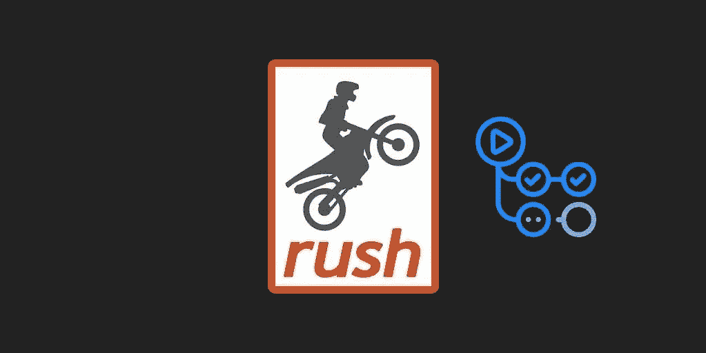

# 使用 Rush monorepo 和 React 构建可扩展的前端—第 4 部分

> 原文：<https://itnext.io/build-a-scalable-front-end-with-rush-monorepo-and-react-part-4-d0939bfb8b8a?source=collection_archive---------4----------------------->

# Github 操作+网络生活



这是博客系列“用 Rush monorepo 和 React 构建可伸缩前端”的第 4 部分

*   [第 1 部分](https://medium.com/@alexandrubereghici/build-a-scalable-front-end-with-rush-monorepo-and-react-part-1-dd50ae38ad3e) : Monorepo 设置，导入项目并保留 git 历史，
    添加更漂亮的
*   [第 2 部分](https://medium.com/@alexandrubereghici/build-a-scalable-front-end-with-rush-monorepo-and-react-part-2-d7f1c19c1797):用 Webpack 和 react-scripts 创建构建工具包
*   [第 3 部分](https://medium.com/@alexandrubereghici/build-a-scalable-front-end-with-rush-monorepo-and-react-part-3-b90430f15af7):添加共享 ESLint 配置，并与 lint-staged 一起使用
*   [第 4 部分](https://medium.com/@alexandrubereghici/build-a-scalable-front-end-with-rush-monorepo-and-react-part-4-d0939bfb8b8a):用 Github 动作和 Netlify 设置部署工作流。
*   [第 5 部分](https://medium.com/@alexandrubereghici/build-a-scalable-front-end-with-rush-monorepo-and-react-part-5-355f5391fd27):增加 VSCode 配置，获得更好的开发体验。

## TL；速度三角形定位法(dead reckoning)

如果你有兴趣只是看看代码，你可以在这里找到它:[https://github.com/abereghici/rush-monorepo-boilerplate](https://github.com/abereghici/rush-monorepo-boilerplate)

如果你想看一个在真实的大型项目中使用 Rush 的例子，你可以看看由 Bentley Systems 开发的开源项目 [ITwin.js](https://github.com/imodeljs/imodeljs) 。

[Netlify](https://www.netlify.com/) 允许您使用构建命令直接在他们的仪表板上配置项目的部署。当您在单个存储库中拥有一个项目，并且不需要经常部署它时，这种方法非常有效。他们给你一个只包含 300 分钟免费构建时间的免费计划。另一方面，Github Actions 更加灵活，他们给你 2000 分钟的免费构建时间。此外，您可以运行各种任务，如“测试”、“林挺”、“部署”等。

## 创建一个网站

*   如果您在 Netlify 上还没有帐户，请创建一个帐户，并创建一个新站点。
*   转到项目设置并复制 API ID。
*   打开 Github 资源库，转到资源库的设置。
*   点击“Secrets ”,添加一个名为`NETLIFY_SITE_ID`的新秘密，并粘贴从 Netlify 复制的 API ID。
*   返回 Netlify 仪表板，打开用户设置。[https://app . netlify . com/user/applications #个人访问令牌](https://app.netlify.com/user/applications#personal-access-tokens)
*   单击“应用程序”并创建一个新的访问令牌。
*   打开 Github“Secrets”并创建一个名为`NETLIFY_AUTH_TOKEN`的新秘密，然后粘贴在 Netlify 上创建的新访问令牌。

## 创建 Github 操作工作流

此时，我们已经拥有了部署所需的所有凭证。现在，我们可以开始编写配置了。

我们需要在`common/rush/command-line.json`中再添加两个命令:`lint`和`test`。在构建项目之前，我们将在 CI/CD 上触发它们。

在`common/rush/command-line.json`增加以下内容:

```
{
      "name": "test",
      "commandKind": "bulk",
      "summary": "Run tests on each package",
      "description": "Iterates through each package in the monorepo and runs the 'test' script",
      "enableParallelism": true,
      "ignoreMissingScript": true,
      "ignoreDependencyOrder": true,
      "allowWarningsInSuccessfulBuild": true
    },
    {
      "name": "lint",
      "commandKind": "bulk",
      "summary": "Run linter on each package",
      "description": "Iterates through each package in the monorepo and runs the 'lint' script",
      "enableParallelism": true,
      "ignoreMissingScript": true,
      "ignoreDependencyOrder": true,
      "allowWarningsInSuccessfulBuild": false
    }
```

在 monorepo 的根目录下，创建一个`.github/workflows`文件夹，并新建一个名为`main.yml`的文件。

```
mkdir -p .github/workflows touch .github/workflows/main.yml
```

现在，让我们来编写 Github 动作的配置。

```
*# Name of workflow*
name: Main workflow

*# When workflow is triggered*
on:
  push:
    branches:
      - master
  pull_request:
    branches:
      - master
*# Jobs to carry out*
jobs:
  lint:
    runs-on: ubuntu-latest
    strategy:
      matrix:
        node-version: [14.x]
    steps:
      *# Get code from repo*
      - name: Checkout code
        uses: actions/checkout@v1
      *# Install NodeJS*
      - name: Use Node.js ${{ matrix.node-version }}
        uses: actions/setup-node@v1
        with:
          node-version: ${{ matrix.node-version }}
      *# Run rush install and build on our code*
      - name: Install dependencies
        run: |
          node common/scripts/install-run-rush.js change -v
          node common/scripts/install-run-rush.js install
          node common/scripts/install-run-rush.js build
      *# Run eslint to check all packages*
      - name: Lint packages
        run: node common/scripts/install-run-rush.js lint
  test:
    runs-on: ubuntu-latest
    strategy:
      matrix:
        node-version: [14.x]
    env:
      CI: **true**
    steps:
      *# Get code from repo*
      - name: Checkout code
        uses: actions/checkout@v1
      *# Install NodeJS*
      - name: Use Node.js ${{ matrix.node-version }}
        uses: actions/setup-node@v1
        with:
          node-version: ${{ matrix.node-version }}
      *# Run rush install*
      - name: Install dependencies
        run: |
          node common/scripts/install-run-rush.js change -v
          node common/scripts/install-run-rush.js install
          node common/scripts/install-run-rush.js build
      *# Run unit tests for all packages*
      - name: Run tests
        run: node common/scripts/install-run-rush.js test
  deploy:
    *# Operating system to run job on*
    runs-on: ubuntu-latest
    strategy:
      matrix:
        node-version: [14.x]
        app-name: [react-app]
        include:
          - app-name: react-app
            app: '@monorepo/react-app'
            app-dir: 'apps/react-app'
            app-build: 'apps/react-app/build'
            site-id: NETLIFY_SITE_ID
    needs: [lint, test]
    *# Steps in job*
    steps:
      *# Get code from repo*
      - name: Checkout code
        uses: actions/checkout@v1
      *# Install NodeJS*
      - name: Use Node.js ${{ matrix.node-version }}
        uses: actions/setup-node@v1
        with:
          node-version: ${{ matrix.node-version }}
      *# Run rush install and build on our code*
      - name: Install dependencies
        run: |
          node common/scripts/install-run-rush.js change -v
          node common/scripts/install-run-rush.js install
      - name: Build ${{ matrix.app-name }}
        working-directory: ${{ matrix.app-dir }}
        run: |
          node $GITHUB_WORKSPACE/common/scripts/install-run-rush.js build --verbose --to ${{ matrix.app }}
      - name: Deploy ${{ matrix.app-name }}
        uses: nwtgck/actions-netlify@v1.2
        with:
          publish-dir: ${{ matrix.app-build }}
          production-deploy: ${{ github.event_name != 'pull_request' }}
          github-token: ${{ secrets.GITHUB_TOKEN }}
          enable-pull-request-comment: **true**
          enable-commit-comment: **true**
          overwrites-pull-request-comment: **true**
        env:
          NETLIFY_AUTH_TOKEN: ${{ secrets.NETLIFY_AUTH_TOKEN }}
          NETLIFY_SITE_ID: ${{ secrets[matrix.site-id] }}
```

我们来分解一下上面的配置。

我们有 3 个工作:`lint`、`test`和`deploy`。`lint`和`test`作业将并行运行，并且`deploy`作业将在`lint`和`test`作业成功完成后运行。我们使用矩阵在不同的 NodeJS 版本上运行作业(目前我们只使用`14.x`，但可以扩展到其他版本)。矩阵还用于为多个项目运行相同的构建步骤。目前，我们只有`react-app`项目，但它可以很容易地扩展。

当`master`分支被修改时，我们正在运行这个工作流。对于 pull 请求，Netlify 将提供预览 URL，但如果我们将某些内容直接推送到`master`分支，它将触发`production`构建，代码将被部署到主 URL。

我们创建的主工作流最适合开发/阶段环境。对于生产，您可能想要手动触发流程并创建一个`git tag`。您可以在 Netlify 中创建另一个站点，在 Github 中创建一个`PRODUCTION_NETLIFY_SITE_ID`秘密，并使用以下配置:

```
name: React App Production Deployment
on:
  workflow_dispatch:
    inputs:
      version:
        description: Bump Version
        default: v1.0.0
        required: **true**
      git-ref:
        description: Git Ref (Optional)
        required: **false**
*# Jobs to carry out*
jobs:
  lint:
    runs-on: ubuntu-latest
    steps:
      *# Get code from repo*
      - name: Clone Repository (Latest)
        uses: actions/checkout@v2
        if: github.event.inputs.git-ref == ''
      - name: Clone Repository (Custom Ref)
        uses: actions/checkout@v2
        if: github.event.inputs.git-ref != ''
        with:
          ref: ${{ github.event.inputs.git-ref }}
      *# Install NodeJS*
      - name: Use Node.js 14.x
        uses: actions/setup-node@v1
        with:
          node-version: 14.x
      *# Run rush install and build on our code*
      - name: Install dependencies
        run: |
          node common/scripts/install-run-rush.js change -v
          node common/scripts/install-run-rush.js install
          node common/scripts/install-run-rush.js build
      *# Run eslint to check all packages*
      - name: Lint packages
        run: node common/scripts/install-run-rush.js lint
  test:
    runs-on: ubuntu-latest
    env:
      CI: **true**
    steps:
      *# Get code from repo*
      - name: Clone Repository (Latest)
        uses: actions/checkout@v2
        if: github.event.inputs.git-ref == ''
      - name: Clone Repository (Custom Ref)
        uses: actions/checkout@v2
        if: github.event.inputs.git-ref != ''
        with:
          ref: ${{ github.event.inputs.git-ref }}
      *# Install NodeJS*
      - name: Use Node.js 14.x
        uses: actions/setup-node@v1
        with:
          node-version: 14.x
      *# Run rush install*
      - name: Install dependencies
        run: |
          node common/scripts/install-run-rush.js change -v
          node common/scripts/install-run-rush.js install
          node common/scripts/install-run-rush.js build
      *# Run unit tests for all packages*
      - name: Run tests
        run: node common/scripts/install-run-rush.js test
  deploy:
    *# Operating system to run job on*
    runs-on: ubuntu-latest
    needs: [lint, test]
    *# Steps in job*
    steps:
      *# Get code from repo*
      - name: Clone Repository (Latest)
        uses: actions/checkout@v2
        if: github.event.inputs.git-ref == ''
      - name: Clone Repository (Custom Ref)
        uses: actions/checkout@v2
        if: github.event.inputs.git-ref != ''
        with:
          ref: ${{ github.event.inputs.git-ref }}
      *# Install NodeJS*
      - name: Use Node.js 14.x
        uses: actions/setup-node@v1
        with:
          node-version: 14.x
      *# Run rush install and build on our code*
      - name: Install dependencies
        run: |
          node common/scripts/install-run-rush.js change -v
          node common/scripts/install-run-rush.js install
      *# Build app*
      - name: Build react app
        working-directory: apps/react-app
        run: |
          node  $GITHUB_WORKSPACE/common/scripts/install-run-rush.js build --verbose --to @monorepo/react-app
      - name: Deploy react app
        uses: nwtgck/actions-netlify@v1.2
        with:
          publish-dir: apps/react-app/build
          production-deploy: **true**
          github-token: ${{ secrets.GITHUB_TOKEN }}
          enable-pull-request-comment: **true**
          enable-commit-comment: **true**
          overwrites-pull-request-comment: **true**
        env:
          NETLIFY_AUTH_TOKEN: ${{ secrets.NETLIFY_AUTH_TOKEN }}
          NETLIFY_SITE_ID: ${{ secrets.PRODUCTION_NETLIFY_SITE_ID }}
      *# Create release tag*
      - name: Create tag
        run: |
          git tag ${{ github.event.inputs.version }}
          git push origin --tags
```

现在我们可以为`react-app`项目手动触发生产部署。我们可以提供下一个版本号作为一个`version`参数，它将为我们创建一个标签。如果我们想恢复到以前的版本，您也可以通过提供一个`git-ref`来实现。

如果你在这个过程中遇到任何问题，你可以在这里看到与这个帖子[相关的代码。](https://github.com/abereghici/rush-monorepo-boilerplate)

如果您正在使用 VSCode，您可能会有兴趣查看一些配置，这些配置可以丰富您的 monorepo 开发体验。见[下一篇](https://medium.com/@alexandrubereghici/build-a-scalable-front-end-with-rush-monorepo-and-react-part-5-355f5391fd27)。

*原发布于*[*https://bereghici . dev*](https://bereghici.dev/blog/build-a-scalable-front-end-with-rush-monorepo-and-react--github-actions+netlify)*。*