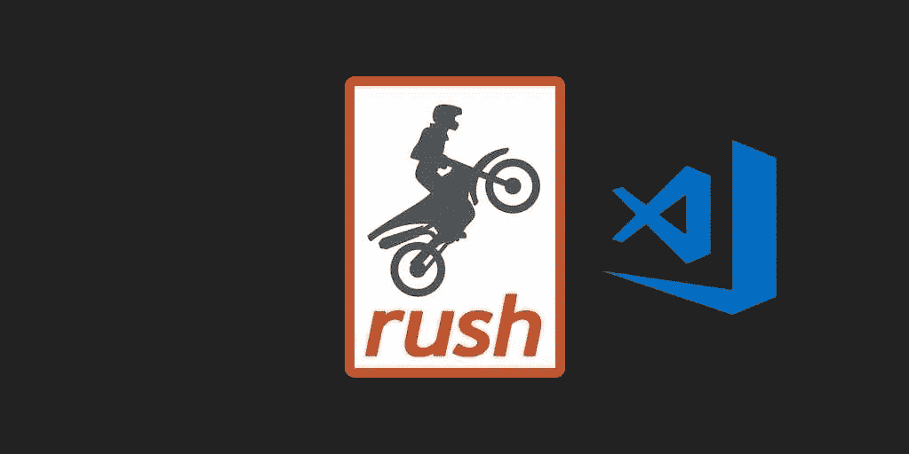

# 使用 Rush monorepo 和 React 构建可扩展的前端—第 5 部分

> 原文：<https://itnext.io/build-a-scalable-front-end-with-rush-monorepo-and-react-part-5-355f5391fd27?source=collection_archive---------5----------------------->

# 虚拟代码



这是博客系列“用 Rush monorepo 和 React 构建可伸缩前端”的第 5 部分

*   [第 1 部分](https://medium.com/@alexandrubereghici/build-a-scalable-front-end-with-rush-monorepo-and-react-part-1-dd50ae38ad3e) : Monorepo 设置，导入保留 git 历史的项目，
    添加更漂亮的
*   第 2 部分:用 Webpack 和 react-scripts 创建构建工具包
*   [第 3 部分](https://medium.com/@alexandrubereghici/build-a-scalable-front-end-with-rush-monorepo-and-react-part-3-b90430f15af7):添加共享 ESLint 配置，并与 lint-staged 一起使用
*   [第 4 部分](https://medium.com/@alexandrubereghici/build-a-scalable-front-end-with-rush-monorepo-and-react-part-4-d0939bfb8b8a):用 Github 动作和 Netlify 设置部署工作流。
*   [第 5 部分](https://medium.com/@alexandrubereghici/build-a-scalable-front-end-with-rush-monorepo-and-react-part-5-355f5391fd27):增加 VSCode 配置，获得更好的开发体验。

## TL；速度三角形定位法(dead reckoning)

如果你有兴趣只是看看代码，你可以在这里找到它:[https://github.com/abereghici/rush-monorepo-boilerplate](https://github.com/abereghici/rush-monorepo-boilerplate)

如果你想看看 Rush 在一个真实的大型项目中的应用，你可以看看 Bentley Systems 开发的开源项目 [ITwin.js](https://github.com/imodeljs/imodeljs) 。

在之前的帖子中，我们添加了`prettier`和`eslint`来格式化我们的代码，并在我们的项目中强制执行一致的代码风格。我们可以通过自动格式化粘贴的代码来节省时间，或者在编写代码时修复`lint`错误，而无需运行 lint 命令来查看所有错误。

VSCode 提供了两种不同类型的设置:

*   用户设置—应用于所有 VSCode 实例
*   工作空间设置—仅适用于当前项目。

我们将使用工作区设置和一些扩展来改善我们在 VSCode 中的开发体验。

## 安装扩展

让我们为 VSCode 添加更漂亮的格式化程序。启动 VS 代码快速打开(Ctrl+P)，粘贴下面的命令，按回车键。

```
ext install esbenp.prettier-vscode
```

或者你可以开[https://marketplace.visualstudio.com/items?itemName = es benp . beauty-vs code](https://marketplace.visualstudio.com/items?itemName=esbenp.prettier-vscode)并手动安装。

同样，让我们安装 VSCode ESLint 扩展:

```
ext install dbaeumer.vscode-eslint
```

或者从 https://marketplace.visualstudio.com/items?手动安装 itemName = dbaeumer . vs code-eslint

## 添加设置

在 monorepo 的根目录下创建一个新文件`.vscode/settings.json`，并添加以下设置:

```
{
  "editor.defaultFormatter": "esbenp.prettier-vscode",
  "editor.tabSize": 2,
  "editor.insertSpaces": true,
  "editor.formatOnSave": true,
  "search.exclude": {
    "**/node_modules": true,
    "**/.nyc_output": true,
    "**/.rush": true
  },
  "files.exclude": {
    "**/.nyc_output": true,
    "**/.rush": true,
    "**/*.build.log": true,
    "**/*.build.error.log": true,
    "**/generated-docs": true,
    "**/package-deps.json": true,
    "**/test-apps/**/build": true
  },
  "files.trimTrailingWhitespace": true,
  "eslint.validate": [
    "javascript",
    "javascriptreact",
    "typescript",
    "typescriptreact"
  ],

  "eslint.workingDirectories": [
    {
      "mode": "auto"
    }
  ],
  "eslint.nodePath": "common/temp/node_modules",
  "eslint.trace.server": "verbose",
  "eslint.options": {
    "resolvePluginsRelativeTo": "node_modules/@monorepo/eslint-config"
  },
  "eslint.format.enable": true,
  "eslint.lintTask.enable": true,
  "editor.codeActionsOnSave": {
    "editor.action.fixAll": true,
    "source.fixAll.eslint": true
  }
}
```

在这些环境中，我们:

*   将漂亮器设置为默认格式器
*   从搜索中排除一些不相关的文件夹，如`node_modules`和`.nyc_output`
*   从 VSCode 文件资源管理器中排除无关文件
*   为 ESLint 提供一个`nodePath`。我们没有直接使用`eslint`(我们使用的是来自`react-scripts`的`lint`脚本)，所以我们在帮助扩展寻找`eslint`二进制文件。
*   提供`eslint`插件的路径。我们正在帮助 ESLint extension 为每个项目挑选正确的规则。

我希望这些设置对你有用。

*原发布于*[*https://bereghici . dev*](https://bereghici.dev/blog/build-a-scalable-front-end-with-rush-monorepo-and-react--vscode)*。*