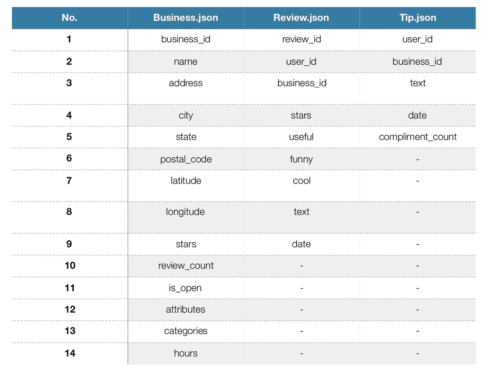
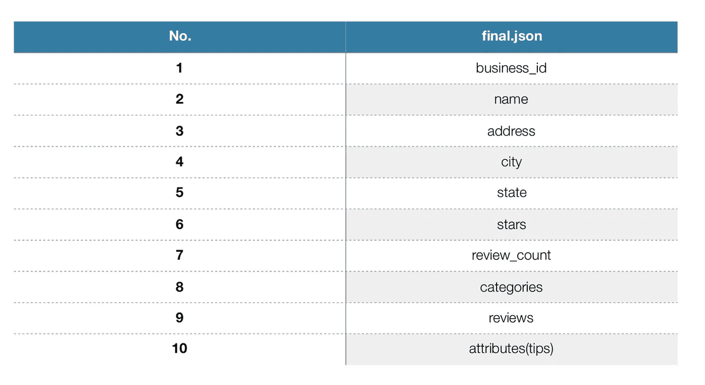
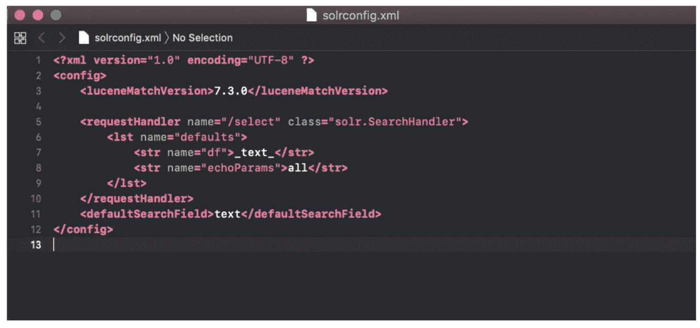
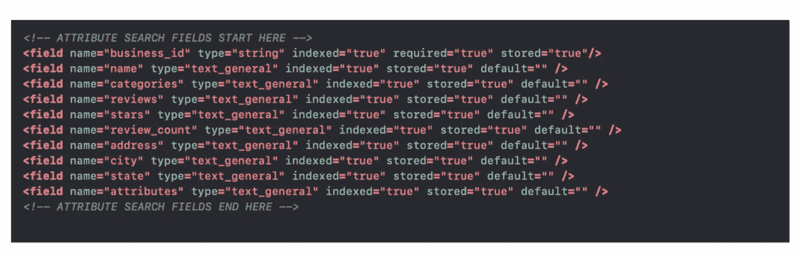
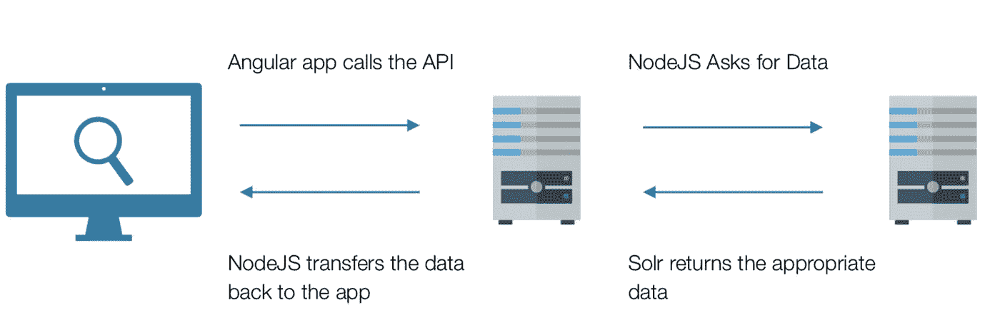
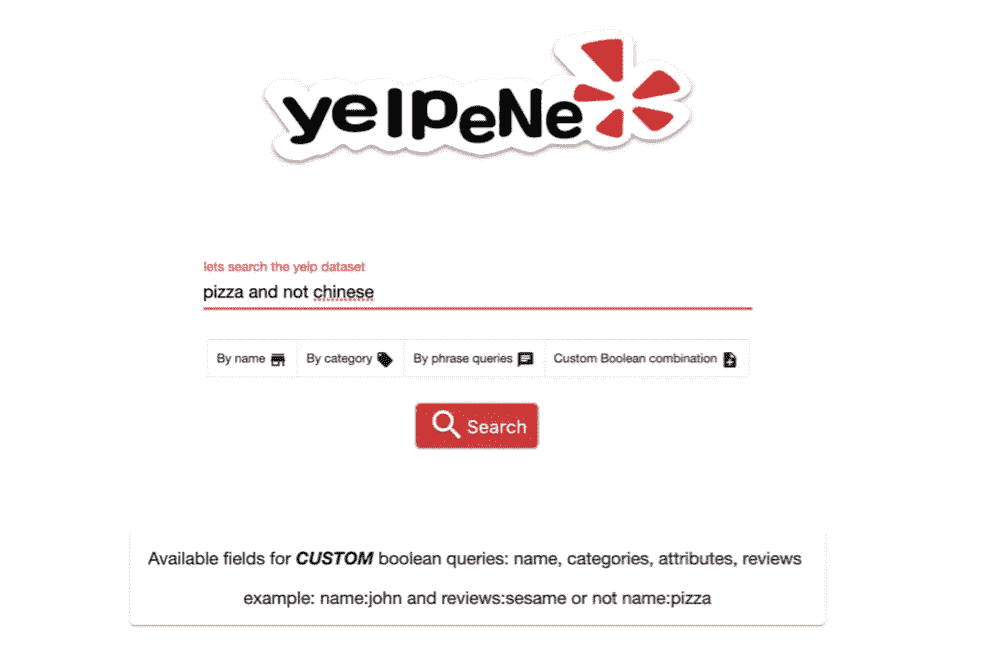
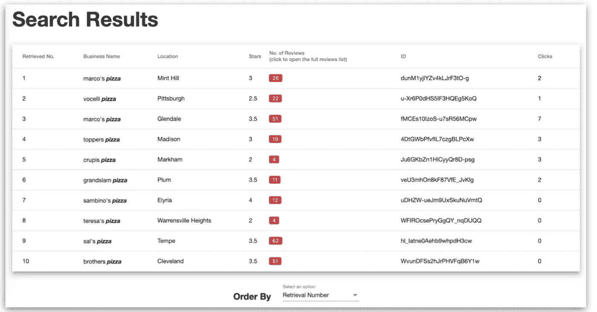

# 构建搜索引擎:使用 SOLR、角度和节点搜索 Yelp 数据集

> 原文：<https://itnext.io/build-a-search-engine-searching-the-yelp-dataset-using-solr-angular-and-node-1cd256e7ac24?source=collection_archive---------1----------------------->

在这篇文章中，我们将介绍用 Angular 创建搜索引擎应用的过程。我们将了解 solr 是如何工作的，以及基于数据集配置索引的最简单方法。

> 你可以在浏览这个博客[这里](https://github.com/leobouts/yelp.ene/tree/master/src)的同时浏览该项目的代码。

让我们从定义所有我们需要知道的俚语开始。

# 什么是指数？

索引是数据的列表。它通常以纯文本形式保存，以便搜索算法可以快速访问。这大大加快了搜索速度。索引通常包括关于列表中每个项目的信息，如元数据或关键字，这允许通过索引搜索数据，而不是逐个阅读每个文件。

# SOLR 呢？

Solr 是一个开源的搜索平台，用 Java 编写。Solr 作为独立的全文搜索服务器运行。它使用 Lucene Java 搜索库作为全文索引和搜索的核心，并拥有类似 REST 的 HTTP/XML 和 JSON APIs，这使得它可以在大多数流行的编程语言中使用。

## *…是的，那很好，但是数据在哪里？*

如前所述，我们将使用 yelp 数据集，可以在这里找到**。**

*数据集包含许多我们可以使用的文件，但我们只需要其中的三个。*

*business.json、review.json 和 tip.json*

*下面我们可以看到它们包含的所有字段。*

**

*json 文件的字段*

# *准备数据*

*我们将只使用数据集的一部分。下面的脚本将选择 100 个随机类别，并选择企业，直到我们达到 10000 个。*

*现在，让我们继续找出用户为我们选择的 10000 家企业留下的所有评论。*

*最后，我们将把商业、评论和技巧合并到一个 final.json 文件中，这样我们就可以很容易地对其进行索引。*

> *final.json 文件的字段如下所示。*

**

*final.json 字段*

*reviews 字段是一个 json 列表，每个 json 都包含以下信息:星级、文本、日期。此外，属性字段引用我们在开始时提到的 tips 文件。*

****在数据集中，我发现 review_count 字段不准确。business.json 的 review_count 字段不是某些企业(reviews.json 文件)的确切评论数。business_filter.py 中有一个函数可以证明这一点。****

# *建立 SOLR*

*你可以很容易地从[这里](https://lucene.apache.org/solr/downloads.html)得到 apache solr*

> *有趣的事实:SOLR 代表“用复制在 Lucene 上搜索”。*

*Solr 创建了所谓的搜索核心，它们是独立的索引块。例如，如果我们有一个名为 core1 的内核，典型的搜索应该是*

> *http://localhost:8983/Solr/core 1/select？Q = '查询'*

*要运行查询或创建新的核心，solr 服务器必须启动。*

> *。/bin/solr start*

*对于我们的应用程序，我们将使用一个核心名称演示。Cd 放入 solr 文件，并像这样创建它。*

> *。/bin/solr create -c 演示*

## *配置 SOLR*

*Solr 使用 2 个配置文件。托管模式和 Solr config . XML。Solr config . XML 文件包括数据目录位置、缓存参数、请求处理程序等设置。托管模式确定搜索中将包括哪种字段，这些字段中的哪些将用作单/主键，哪些字段是必需的，以及如何在每个字段中进行搜索和索引。*

****主键是一条记录的唯一标识符。****

*对于 solrconfig.xml 文件，我们将使用配置的最小版本。*

**

*solrconfig.xml*

*对于托管模式文件，我们将使用 solr 给出的默认配置集。我们还将删除几行用于非英语语言的代码，只添加我们想要搜索的适当索引字段。*

**

> **提醒:所有这些文件都存在于开始提供的 github repo 中**

*我们可以很容易地看到，托管模式中的字段与我们将要使用的 final.json 文件中的字段是相同的。business_id 字段用作唯一键。其余的将定义如何建立索引。*

*名称、类别、评论、星级、评论计数、地址、城市、州和属性*

## *将数据加载到 SOLR*

*一旦我们完成了 solr 设置，我们就可以用命令将数据加载到我们的核心中*

## *SOLR 询问*

*我们现在准备好就 Solr API 提问了。问题基于 solr 运行的端口、核心的名称和索引字段。我们可以看到一个基于名称字段和关键字为“中文”的评论的搜索示例。*

> *[http://localhost:8983/Solr/demo/select？q =姓名% 3 中文% 20 和% 20 评论% 3 中文](http://localhost:8983/solr/demo/select?q=name%3Achinese%20AND%20reviews%3Achinese)*

***其中% 3α是“:”的浏览器代码，而%20 是空格字符。***

# *..是的，那也很好，但是 solr 是如何工作的呢？*

*当用户在 Solr 上搜索时，查询由请求处理器处理。请求处理程序是一个插件，它定义了 Solr 处理请求时要使用的逻辑。Solr 支持多种请求处理程序。有些是为处理搜索查询而设计的，而有些则处理诸如索引复制之类的任务。*

*搜索应用程序选择 Solr 的默认请求处理程序。为了处理查询，请求处理器调用分析器，分析器解释查询的术语和参数。Solr 的默认查询分析器被称为标准查询分析器或“lucene”标准分析器。Solr 还包括 DisMax 查询分析器和扩展的 DisMax (eDisMax)查询分析器。*

*标准的查询解析器语法允许高精度的搜索，但是 DisMax 查询分析器对错误的容忍度要高得多。DisMax 旨在为像 Google 这样的流行搜索引擎提供类似的体验，很少向用户显示语法错误。*

# *Solr 需要与应用程序(节点 API)对话*

*为了在 solr 和应用程序之间建立通信，我们需要一个中间服务器来与两者通信。这对于浏览器中的跨源资源共享(CORS)功能尤其必要。我们将使用 express 和 cors 库。该 API 将由 3 个端点组成，根据用户在搜索引擎中选择的内容生成问题。*

*你必须安装[节点](https://nodejs.org/en/download/)并且*

> *npm 快速安装*
> 
> *npm 安装 cors*

**

*第一个端点服务于基本类型的问题。第二个和第三个是布尔型问题。第一个端点代码使用 baseUrl 参数进行 http 调用，该参数是本地 Solr 地址，通过匹配应用程序提供给它的参数，即关键字和搜索类型。另外两个端点也相应地实现了。*

# *让我们进入应用程序*

*该应用程序将建立使用角和角材料可用[这里](https://material.angular.io/guide/getting-started?source=post_page---------------------------)。
(不要忘记《棱角材料安装指南》中的任何步骤)。*

*第一个屏幕看起来像这样。*

**

*所有的 HTML 代码都在 app.component.html 文件中。两个 div 包含整个视图。一个是搜索视图，另一个是搜索结果视图。通过* ngIf = " searchPageViewActive ",我们可以在两个 div 之间导航。*

*现在，searchPageViewActive 布尔变量将变为 false，因为进度条指示正在进行查询，并且在我们取回数据后将弹出结果页面。*

*结果页面将如下所示。*

**

*结果完全按照 solr 返回的顺序排序。我们可以根据企业的星级来改变顺序。如果出现平局，评审计数将被视为第二个排序参数。*

*还有一个对话框，当我们单击评论的数量时会打开，显示每个评论的完整信息。*

*对话的代码可以在这里看到。*

# *在检查我们的函数之前，让我们先来看看数据服务*

*DataService.ts 文件充当我们的应用程序和我们的节点 API 之间的中介。还记得 api 中的三种不同的查询类型吗？我们将在需要的时候使用三个不同的从应用程序到 API 的调用。*

# *现在搜索功能*

*单击搜索按钮将调用搜索功能，该功能将验证搜索关键字和语法。如果语法不允许，一些 snackbars 会弹出显示警告。如果查询准备就绪，搜索函数将确定用户选择搜索三种类型中的哪一种，使用 cleanQuestion 函数将查询格式化为 solr ready，最后通过 DataService 调用 API。最后，cleanData 函数将准备向角度材料表显示建议的数据。*

*下面我们可以看到对话是如何处理和清理评论数据的。*

# *一些额外的东西..*

*让我们做一些**单词高亮显示**。我们将创建一个管道，将单词列表作为输入，并在它们出现在 html 视图上的每个地方高亮显示它们。*

## *为什么不添加第二种结果排序方式呢？*

*让我们跟踪用户的每一次点击，这样我们就能知道哪家企业吸引了他们的目光。每次打开审核对话时，都会执行此操作。谷歌 [firestore](https://firebase.google.com) 将用于存储数据。*

**Firestore 有详细的文档，网上也有很多教程，你应该去看看。**

# *摘要*

*起初，我们用一些 python 脚本准备数据。然后，我们开始设置和配置。最后，我们创建了一个 API，这样我们的前端应用程序就可以与服务器对话，准备数据并将其显示到搜索结果视图中。从头开始构建一个完整的应用程序可能会非常乏味，这迫使你在这个过程中学习很多东西。即使是一个简单的应用程序，你也必须使用许多工具才能得到想要的结果。*