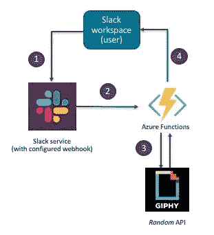
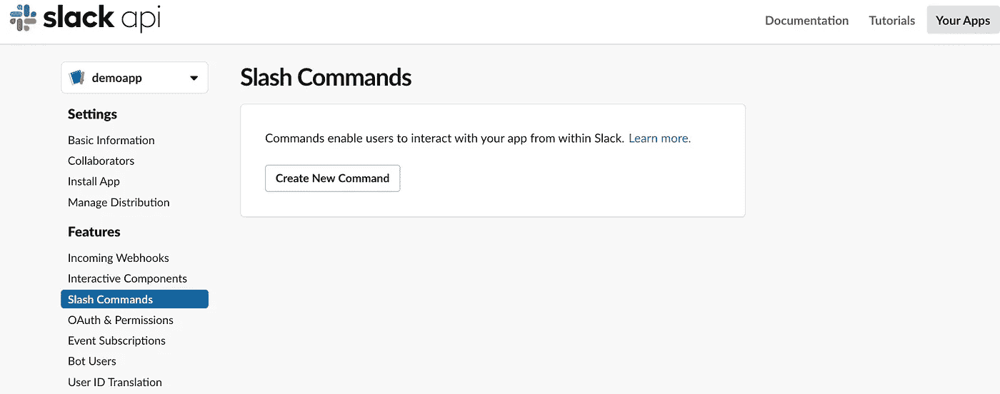
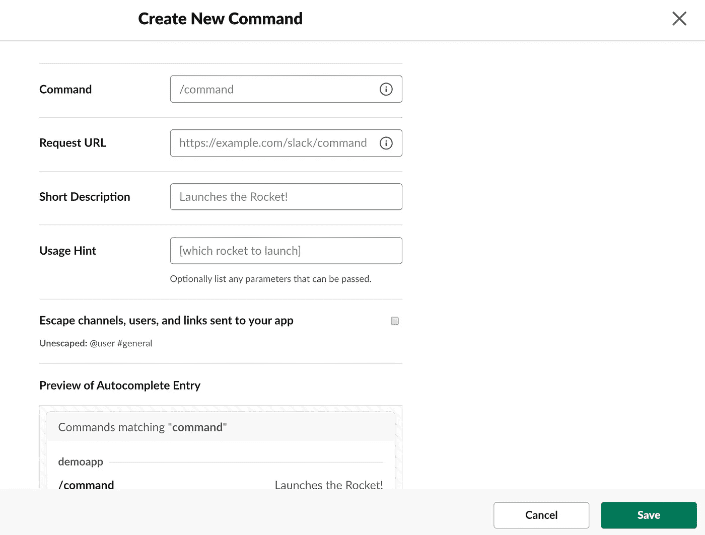
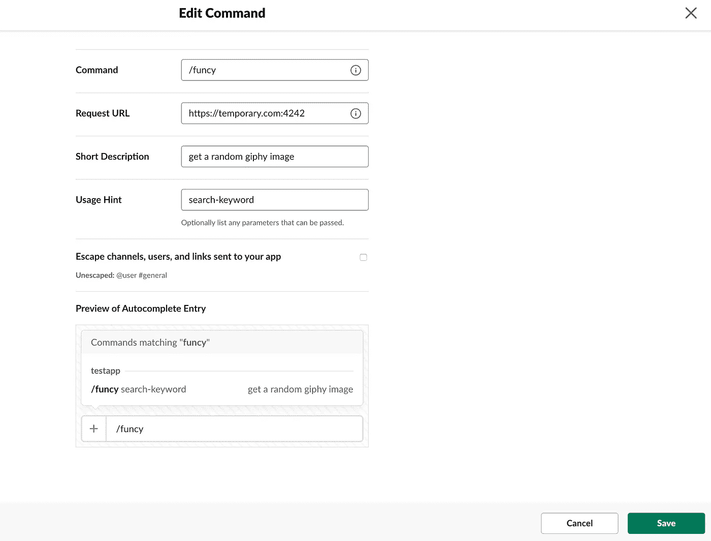
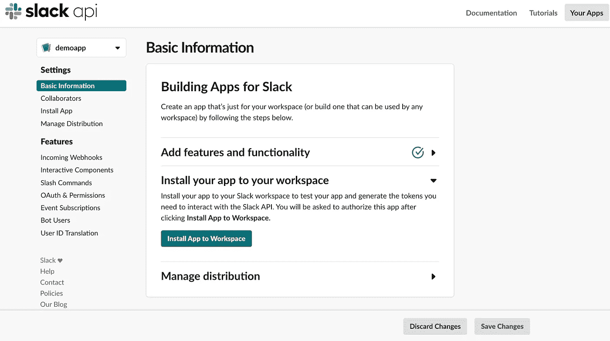
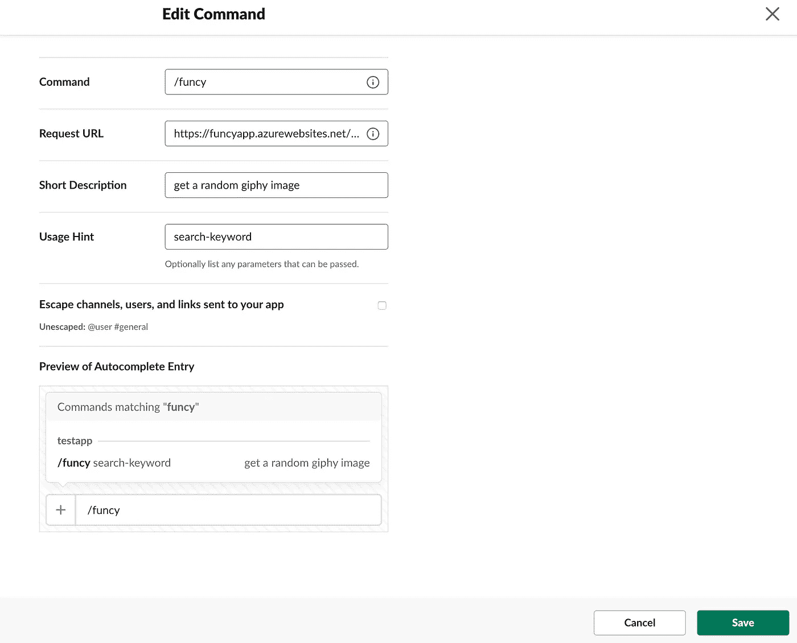

# 教程:为 Slack 构建一个无服务器 API 后端

> 原文：<https://itnext.io/build-a-serverless-api-backend-to-deliver-funny-gifs-in-slack-42002a947f07?source=collection_archive---------4----------------------->

Webhook 后端是无服务器功能的一个流行用例。FaaS (Functions-as-a-service)产品使得提供一个托管 Webhook 逻辑的 HTTP 端点变得相对容易，这可以像发送电子邮件一样简单，像回复有趣的 gif 一样有趣！

在本教程中，我们将探索**funcy**——一个无服务器的 webhook 后端，它是令人敬畏的 [Giphy for Slack](https://get.slack.help/hc/en-us/articles/204714258-Giphy-for-Slack) 的精简版本。(最初的)Giphy Slack 应用为一个搜索词返回一堆 gif，用户可以从中选择一个。 **funcy** 使用 [Giphy Random API](https://developers.giphy.com/docs/#operation--gifs-random-get) 通过简单地返回一个(单个)搜索关键词的随机图像来稍微调整一下。

这篇博文提供了一步一步的指导，让应用程序部署到 Azure Functions，并与你的 Slack workspace 连接起来。代码在 GitHub 上有[供你查找。](https://github.com/abhirockzz/funcy-azure-functions/)

> *如果你有兴趣用* [*Azure 函数*](https://azure.microsoft.com/en-in/services/functions/?WT.mc_id=medium-blog-abhishgu) *学习无服务器开发，只需* [*创建一个免费的 Azure 账号*](https://azure.microsoft.com/en-us/free/?WT.mc_id=medium-blog-abhishgu) *就可以开始了！我强烈推荐查看文档中的* [*快速入门指南、教程和代码示例*](https://docs.microsoft.com/en-in/azure/azure-functions/?WT.mc_id=medium-blog-abhishgu) *，如果您喜欢，可以使用* [*指导学习路径*](https://docs.microsoft.com/en-in/learn/paths/create-serverless-applications/?WT.mc_id=medium-blog-abhishgu) *，或者下载* [*无服务器计算手册*](https://azure.microsoft.com/en-in/resources/azure-serverless-computing-cookbook/?WT.mc_id=medium-blog-abhishgu) *。*


为了保持这篇博客的简洁，代码的细节将在随后的文章中介绍。

[https://dev . to/azure/code-walk-for-funcy-a-server less-slack-app-using-azure-functions-3g MD](https://dev.to/azure/code-walkthrough-for-funcy-a-serverless-slack-app-using-azure-functions-3gmd)

# 概观



`funcy`是作为 Slack 内的斜线命令建立的。作为用户，您可以使用`/funcy <your search term>`从您的 Slack 工作区调用它。这反过来调用了我们部署到 Azure 函数的 webhook 它只不过是一堆 Java 代码。它调用 [Giphy 随机 API](https://developers.giphy.com/docs/#operation--gifs-random-get) 并将结果返回给用户。

例如，使用`/funcy serverless`从您的 Slack 工作区调用它将会返回一个随机的 GIF。


接下来的部分将指导您完成以下内容:

*   先决条件
*   松弛设置和配置
*   部署到 Azure 功能

# 先决条件

在您继续之前，请确保您已准备好以下事项，这不会花费太长时间

*   **Maven**—[用于 Azure 函数的 Maven 插件](https://docs.microsoft.com/java/api/overview/azure/maven/azure-functions-maven-plugin/readme?view=azure-java-stable&WT.mc_id=medium-blog-abhishgu)用于构建和部署您的 Java 函数。如果没有 Maven，请从这里安装`v 3.0`或以上。
*   **Azure CLI** — [按照说明](https://docs.microsoft.com/en-us/cli/azure/install-azure-cli?view=azure-cli-latest&WT.mc_id=medium-blog-abhishgu)设置并登录 Azure CLI。
*   **宽松工作空间** — [如果您没有宽松工作空间](https://slack.com/create)，请创建一个。
*   **GIPHY API key** —你需要创建一个 GIHPY 账户(免费的！)和[创建一个 app](https://developers.giphy.com/dashboard/?create=true) 。您创建的每个应用程序都有自己的 API 密钥。

> *请记下您的 GIPHY API 密钥，因为您稍后会用到它*

# 配置时差

请注意，本节中的说明改编自[松弛文档](https://api.slack.com/slash-commands#creating_commands)

## 创建一个 Slack 应用程序

登录您的[空闲工作区](https://slack.com/signin)。从[创建一个新的 Slack 应用](https://api.slack.com/apps/new)开始


## 创建斜线命令

一旦你完成了应用程序的创建，进入应用程序的设置页面，然后点击导航菜单中的*斜线命令*功能。



您将看到一个标有*创建新命令*的按钮，当您点击它时，您将看到一个屏幕，要求您用所需信息定义新的*斜线命令*。



输入所需的信息。请注意,**请求 URL** 字段是您将输入函数的 HTTP 端点的字段，在您部署它之后将可用。您可以暂时使用虚拟 URL 作为占位符，例如`[https://temporary.com:4242](https://temporary.com:4242)`



完成后，点击**保存**完成。

## 将应用程序安装到您的工作区

创建完 Slash 命令后，转到应用程序的设置页面，在导航菜单中单击*基本信息*功能，选择*将应用程序安装到工作区*，然后单击*将应用程序安装到工作区* —这将把应用程序安装到 Slack 工作区，以测试应用程序并生成与 Slack API 交互所需的令牌。



一旦你完成应用程序的安装，*应用程序凭证*将出现在同一页面上。你需要从那里获取你的*松弛签名秘密*

> *记下你的应用签名密码，因为你以后会用到它*


# 部署到 Azure

首先克隆 GitHub 存储库，然后切换到应用程序目录

```
git clone https://github.com/abhirockzz/funcy-azure-functions
cd funcy-azure-functions
```

`pom.xml`文件包含 Azure Functions Maven 插件使用的以下属性——应用程序名称(`functionAppName`)、区域(`functionAppRegion`)和资源组(`functionResourceGroup`)。上面的参数都有默认值，所以如果您愿意，可以选择继续使用它们。

*   `functionAppName` - funcyapp
*   `functionAppRegion` -韦斯特乌斯
*   `functionResourceGroup`-Java-函数-组

> *请注意，app 名称必须* ***跨 Azure 唯一*** *。*

如果您希望更改这些值，请查看来自`pom.xml`的这个片段，它突出显示了需要更新的`<properties>`

```
<properties>
        <project.build.sourceEncoding>UTF-8</project.build.sourceEncoding>
        <maven.compiler.source>1.8</maven.compiler.source>
        <maven.compiler.target>1.8</maven.compiler.target>
        <azure.functions.maven.plugin.version>1.3.1</azure.functions.maven.plugin.version>
        <azure.functions.java.library.version>1.3.0</azure.functions.java.library.version>
        <functionAppName>YOUR_APP_NAME</functionAppName>
        <functionAppRegion>AZURE_REGION</functionAppRegion>
        <functionResourceGroup>RESOURCE_GROUP_NAME</functionResourceGroup>
        <stagingDirectory>${project.build.directory}/azure-functions/${functionAppName}</stagingDirectory>
    </properties>
```

> *函数的名称与应用程序名称(通过* `*pom.xml*` *配置)不同，是使用函数的 Java 代码中的* `*@FunctionName*` *注释指定的——在本例中，名称是* `*funcy*` *。*

现在，您可以构建该功能并将其部署到 Azure

```
//build
mvn clean package//deploy
mvn azure-functions:deploy
```

成功部署的结果如下所示

```
[INFO] Successfully updated the function app.funcyapp
[INFO] Trying to deploy the function app...
[INFO] Trying to deploy artifact to funcyapp...
[INFO] Successfully deployed the artifact to https://funcyapp.azurewebsites.net
[INFO] Successfully deployed the function app at https://funcyapp.azurewebsites.net
[INFO] ------------------------------------------------------------------------
[INFO] BUILD SUCCESS
```

使用 Azure CLI 列出你的功能应用程序

```
az functionapp list --query "[].{hostName: defaultHostName, state: state}"
```

您应该看到一个 JSON 输出

```
[
    {
        "hostName": "funcyapp.azurewebsites.net",
        "state": "Running"
    }
]
```

> *你应该可以在* [*Azure 门户*](https://portal.azure.com/) 中看到该功能(在 `*Function App*` *菜单下)*

一旦部署成功，该函数应该准备好为请求提供服务，并且可以在以下端点通过 HTTP(s)进行访问— `https://<APP_NAME>.azurewebsites.net/api/<FUNCTION_NAME>`

对于一个名为`funcyapp`的应用程序和一个名为`funcy`的函数，端点应该是

```
[https://funcyapp.azurewebsites.net/api/funcy](https://funcyapp.azurewebsites.net/api/funcy)
```

你就快到了！

## 更新你的 Azure 功能应用

既然 Azure Functions 应用程序已经启动并运行，您需要更新它，将`Giphy API Key`和`Slack Signing Secret`作为环境变量。

```
az functionapp config appsettings set --name <APP_NAME> --resource-group <RESOURCE_GROUP_NAME> --settings "SLACK_SIGNING_SECRET=<SLACK_SIGNING_SECRET>" "GIPHY_API_KEY=<GIPHY_API_KEY>"
```

例如

```
az functionapp config appsettings set --name funcyapp --resource-group java-functions-group --settings "SLACK_SIGNING_SECRET=foobarb3062bd293b1a838276cfoobar" "GIPHY_API_KEY=foobarrOqMb5fvJdIuxTCr3WUDfoobar"
```

> *详见* [*如何在 Azure 门户*](https://docs.microsoft.com/en-us/azure/azure-functions/functions-how-to-use-azure-function-app-settings/?WT.mc_id=medium-blog-abhishgu) *中管理一个功能 app 的文档。*

# 更新 Slack 应用

转到应用程序的设置页面，然后在导航菜单中点击*斜杠命令*功能。编辑命令，并用您的函数 HTTP(s)端点替换*请求 URL* 字段的值



# `funcy`时间到了！

从您的工作区中，调用命令

`/funcy <search term>`

既然你对猫不会错，那就试试吧

`/funcy cat`


如果您在第一次调用后看到 Slack 中的`Timeout error`,请不要担心。这是由于“冷启动”问题，该功能需要几秒钟来引导，但 [Slack 期望在 3 秒钟内得到响应](https://api.slack.com/slash-commands#responding_basic_receipt)。只要重试(几次)就可以了。

> *如果您的应用程序无法承受由于“空闲冷启动”而导致的延迟，您可能需要查看一下*[*Azure Functions Premium plan*](https://azure.microsoft.com/en-us/blog/announcing-the-azure-functions-premium-plan-for-enterprise-serverless-workloads/?WT.mc_id=medium-blog-abhishgu)*，它提供了*“预热的实例，以便在空闲后无延迟地运行您的应用程序……”

# 资源

下面提到的资源是专门用来开发这篇博文中展示的演示应用程序的，所以你可能会发现它们也很有用！

*   [Azure Functions 开发者指南(通用)](https://docs.microsoft.com/en-us/azure/azure-functions/functions-reference/?WT.mc_id=medium-blog-abhishgu)和 [Azure Functions Java 开发者指南](https://docs.microsoft.com/en-us/azure/azure-functions/functions-reference-java/?WT.mc_id=medium-blog-abhishgu)
*   [如何使用 Java 创建函数并将其发布到 Azure Functions 的快速入门](https://docs.microsoft.com/en-us/azure/azure-functions/functions-create-first-java-maven/?WT.mc_id=medium-blog-abhishgu)
*   [Azure 函数的 Maven 插件](https://docs.microsoft.com/en-us/java/api/overview/azure/maven/azure-functions-maven-plugin/readme?view=azure-java-stable/%3FWT.mc_id=medium-blog-abhishgu)
*   如何在本地编码和测试 Azure 功能
*   [如何管理 Azure 功能中的连接](https://docs.microsoft.com/en-us/azure/azure-functions/manage-connections/?WT.mc_id=medium-blog-abhishgu)
*   [GitHub 上 Azure 服务的 Maven 插件](https://github.com/microsoft/azure-maven-plugins)

> *别忘了看看这篇博文的第二部分*[](https://dev.to/azure/code-walkthrough-for-funcy-a-serverless-slack-app-using-azure-functions-3gmd)**，在那里我已经详细介绍了代码**

*我真的希望你喜欢这篇文章，并从中学到了一些东西！如果你做了，请喜欢并跟随。很高兴通过 [@abhi_tweeter](https://twitter.com/abhi_tweeter) 获得反馈或发表评论。*

*[](https://twitter.com/abhi_tweeter) [## 阿布舍克

### Abhishek 的最新推文(@abhi_tweeter)。云开发者🥑@Microsoft @azureadvocates |…

twitter.com](https://twitter.com/abhi_tweeter)*