# 使用 Go 和 Azure 函数构建一个无服务器应用程序

> 原文：<https://itnext.io/build-a-serverless-app-using-go-and-azure-functions-c4475398f4ab?source=collection_archive---------0----------------------->

## 了解如何实现一个作为无服务器后端的 Slack 应用程序

Webhook 后端是 FaaS(功能即服务)平台的一个流行用例。它们可以用于许多用例，比如发送客户通知，用有趣的 gif 来响应！使用无服务器函数，封装 webhook 功能并以 HTTP 端点的形式公开它是非常方便的。在本教程中，你将学习如何使用 [Azure 函数](https://docs.microsoft.com/azure/azure-functions/functions-custom-handlers?WT.mc_id=data-9656-abhishgu)和 [Go](https://golang.org/) 实现一个 [Slack 应用](https://api.slack.com/start/overview#apps)作为无服务器后端。您可以扩展 Slack 平台，并通过实现自定义应用或工作流来集成服务，这些应用或工作流可以访问平台的所有范围，从而让您在 Slack 中构建强大的体验。

这是用于 Slack 的 [Giphy 的更简单版本。最初的 Giphy Slack 应用程序通过响应多个 gif 来响应搜索请求。为了简单起见，本文中演示的函数应用程序只使用](https://get.slack.help/hc/en-us/articles/204714258-Giphy-for-Slack) [Giphy 随机 API](https://developers.giphy.com/docs/#operation--gifs-random-get) 返回与搜索关键字相对应的单个(随机)图像。这篇文章提供了一步一步的指导，让应用程序部署到 [Azure Functions](https://azure.microsoft.com/en-in/services/functions/?WT.mc_id=data-9656-abhishgu) 并将其集成到您的 Slack workspace 中。

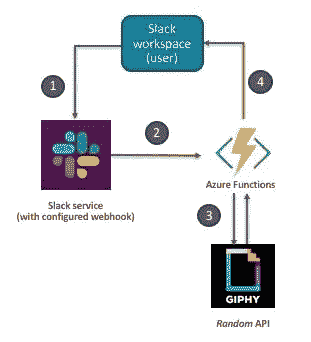

在这篇文章中，你将:

*   获得 Azure 函数中 [**自定义处理程序**的概述](https://techcommunity.microsoft.com/t5/apps-on-azure/azure-functions-in-any-language-with-custom-handlers/ba-p/1942744)
*   通过简短的代码演示了解幕后发生的事情
*   了解如何使用配置 Azure 功能和 Slack 设置解决方案
*   当然，在工作区运行你的 Slack 应用程序！

后端功能逻辑用 Go 编写(代码是 GitHub 上可用的[)。那些使用过 Azure 函数的人可能还记得，Go 是默认支持的语言处理程序中的*而不是*。这就是](https://github.com/abhirockzz/abhirockzz-serverless-go-slack-app)[自定义处理程序](https://docs.microsoft.com/azure/azure-functions/functions-custom-handlers?WT.mc_id=data-9656-abhishgu)的作用！

# 什么是自定义处理程序？

简而言之，自定义处理程序是一个轻量级 web 服务器，它从函数主机接收事件。在您最喜欢的运行时/语言中，您唯一需要实现的定制处理程序是:HTTP 支持！这并不意味着定制处理程序仅限于 [HTTP 触发器](https://docs.microsoft.com/azure/azure-functions/functions-bindings-http-webhook-trigger?tabs=csharp&WT.mc_id=data-9656-abhishgu)——您可以通过扩展包自由使用[其他触发器以及输入和输出绑定](https://docs.microsoft.com/azure/azure-functions/functions-triggers-bindings?tabs=csharp&WT.mc_id=data-9656-abhishgu)。

下面是自定义处理程序如何工作的概要(下图摘自文档)

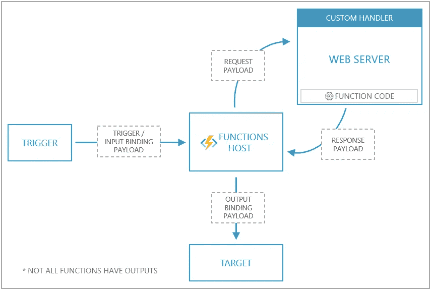

事件触发器(通过 HTTP、存储、事件中心等。)调用函数主机。自定义处理程序与传统函数的不同之处在于，函数主机充当中间人:它向自定义处理程序(函数)的 web 服务器发出请求有效负载，以及包含触发器、输入绑定数据和函数的其他元数据的*有效负载*。函数将响应返回给函数宿主，宿主将响应中的数据传递给函数的输出绑定进行处理。

# 概观

在我们深入其他领域之前，通过探索代码(顺便说一下，这相对简单)来理解本质可能会有所帮助

# 应用程序结构

让我们看看应用程序是如何设置的。这在文档中有定义

```
.
├── cmd
│   └── main.go
├── funcy
│   └── function.json
├── go.mod
├── host.json
└── pkg
    └── function
        ├── function.go
        ├── giphy.go
        └── slack.go
```

*   `function.json`文件位于一个文件夹中，该文件夹的名称使用了函数名([这是惯例](https://docs.microsoft.com/azure/azure-functions/functions-custom-handlers?WT.mc_id=data-9656-abhishgu#application-structure))

```
{
    "bindings": [
        {
            "type": "httpTrigger",
            "direction": "in",
            "name": "req",
            "methods": [
                "get",
                "post"
            ]
        },
        {
            "type": "http",
            "direction": "out",
            "name": "res"
        }
    ]
}
```

*   `host.json`通过指向能够处理 HTTP 事件的 web 服务器，告知函数主机向何处发送请求。注意`customHandler.description.defaultExecutablePath`，它定义了`go_funcy`是用于运行 web 服务器的可执行文件的名称。`"enableForwardingHttpRequest": true`确保原始 HTTP 数据不加任何修改地发送给定制处理程序

```
{
    "version": "2.0",
    "extensionBundle": {
        "id": "Microsoft.Azure.Functions.ExtensionBundle",
        "version": "[1.*, 2.0.0)"
    },
    "customHandler": {
        "description": {
            "defaultExecutablePath": "go_funcy"
        },
        "enableForwardingHttpRequest": true
    },
    "logging": {
        "logLevel": {
            "default": "Trace"
        }
    }
}
```

*   `cmd`和`pkg`目录包含 Go 源代码。让我们在下一小节中探讨这个问题

# 代码遍历

`cmd/main.go`设置并启动 HTTP 服务器。注意，`/api/funcy`端点是函数主机向定制处理程序 HTTP 服务器发送请求的端点。

```
func main() {
 port, exists := os.LookupEnv("FUNCTIONS_CUSTOMHANDLER_PORT")
 if !exists {
   port = "8080"
 }
 http.HandleFunc("/api/funcy", function.Funcy)
 log.Fatal(http.ListenAndServe(":"+port, nil))
}
```

所有繁重的工作都在`function/function.go`中完成。

第一部分是读取请求体(从 Slack 中)并通过基于 Slack 定义的[这个配方的签名验证过程来确保其完整性。](https://api.slack.com/docs/verifying-requests-from-slack#a_recipe_for_security)

```
signingSecret := os.Getenv("SLACK_SIGNING_SECRET")
	apiKey := os.Getenv("GIPHY_API_KEY") if signingSecret == "" || apiKey == "" {
		http.Error(w, "Failed to process request. Please contact the admin", http.StatusUnauthorized)
		return
	} slackTimestamp := r.Header.Get("X-Slack-Request-Timestamp") b, err := ioutil.ReadAll(r.Body)
	if err != nil {
		http.Error(w, "Failed to process request", http.StatusBadRequest)
		return
	}
	slackSigningBaseString := "v0:" + slackTimestamp + ":" + string(b)
	slackSignature := r.Header.Get("X-Slack-Signature") if !matchSignature(slackSignature, signingSecret, slackSigningBaseString) {
		http.Error(w, "Function was not invoked by Slack", http.StatusForbidden)
		return
	}
```

一旦我们确认该函数确实通过 Slack 被调用，下一步就是提取(Slack)用户输入的搜索词

```
vals, err := parse(b)
	if err != nil {
		http.Error(w, "Failed to process request", http.StatusBadRequest)
		return
	}
	giphyTag := vals.Get("text")
```

通过调用 GIPHY REST API，使用搜索词查找 gif

```
giphyResp, err := http.Get("http://api.giphy.com/v1/gifs/random?tag=" + giphyTag + "&api_key=" + apiKey)
	if err != nil {
		http.Error(w, "Failed to process request", http.StatusFailedDependency)
		return
	} resp, err := ioutil.ReadAll(giphyResp.Body)
	if err != nil {
		http.Error(w, "Failed to process request", http.StatusInternalServerError)
		return
	}
```

解编由 GIPHY API 发回的响应，将其转换成 Slack 能够理解的形式并返回。就是这样！

```
var gr GiphyResponse
json.Unmarshal(resp, &gr)
title := gr.Data.Title
url := gr.Data.Images.Downsized.URLslackResponse := SlackResponse{Text: slackResponseStaticText, Attachments: []Attachment{{Text: title, ImageURL: url}}}w.Header().Set("Content-Type", "application/json")
json.NewEncoder(w).Encode(slackResponse)
fmt.Println("Sent response to Slack")
```

> *如果您对检查签名验证过程感兴趣，请检查* `*matchSignature*` *函数，并查看 slack.go、giphy.go(在* `*function*` *目录中)以查看所使用的 go 结构表示在各个组件之间交换的信息(JSON)。为了保持这篇文章的简洁，这里没有包括这些内容。*

好吧！到目前为止，我们已经介绍了很多理论和背景信息。是时候把事情做好了！在您继续之前，请确保您考虑了下面提到的先决条件。

# 先决条件

*   [下载并安装 Go](https://golang.org/dl/) 如果你还没有的话
*   安装 [Azure functions 核心工具](https://docs.microsoft.com/azure/azure-functions/functions-run-local?tabs=macos%2Ccsharp%2Cbash&WT.mc_id=data-9656-abhishgu#v2)——这将允许您使用 CLI 部署功能(并在本地运行测试和调试)
*   [如果你没有空余的工作空间，就去创建一个空余的工作空间](https://slack.com/create)。
*   获取 GIPHY API 密钥—您需要创建 GIHPY 帐户(这是免费的！)和[创建一个应用](https://developers.giphy.com/dashboard/?create=true)。您创建的每个应用程序都将有自己的 API 密钥。

> *请记下你的 GIPHY API 密钥，因为你以后会用到它*

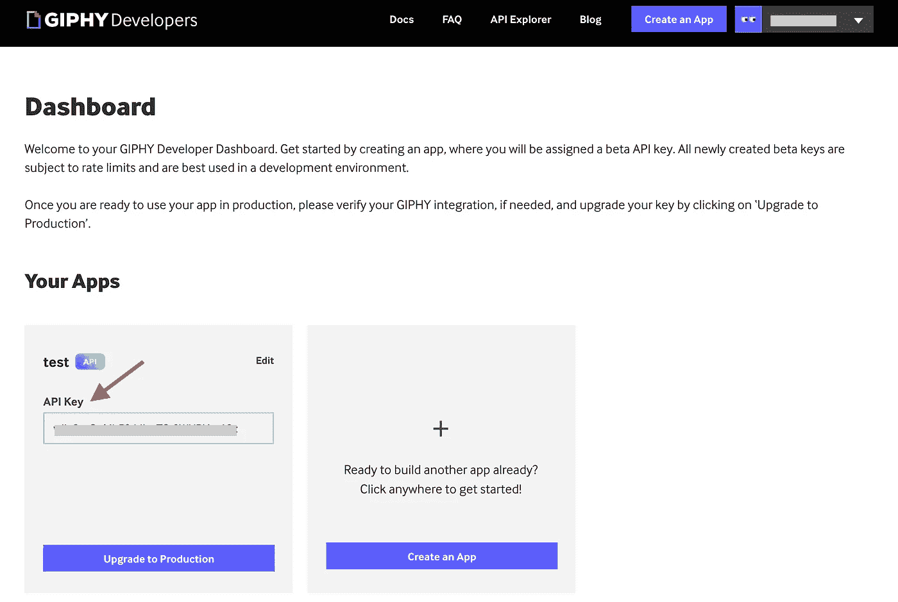

接下来的部分将指导您完成部署 Azure 函数和为 Slash 命令配置 Slack 的过程。

# Azure Functions 设置

首先创建一个[资源组](https://docs.microsoft.com/azure/azure-resource-manager/management/manage-resource-groups-portal?WT.mc_id=data-9656-abhishgu)，以托管解决方案的所有组件。

## 创建函数应用程序

首先在 Azure 门户中搜索**功能应用**，点击**增加**

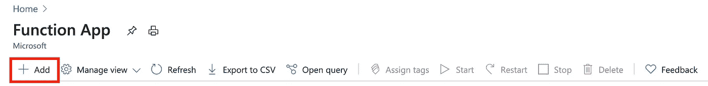

输入所需的详细信息:选择**自定义处理程序**作为**运行时堆栈**

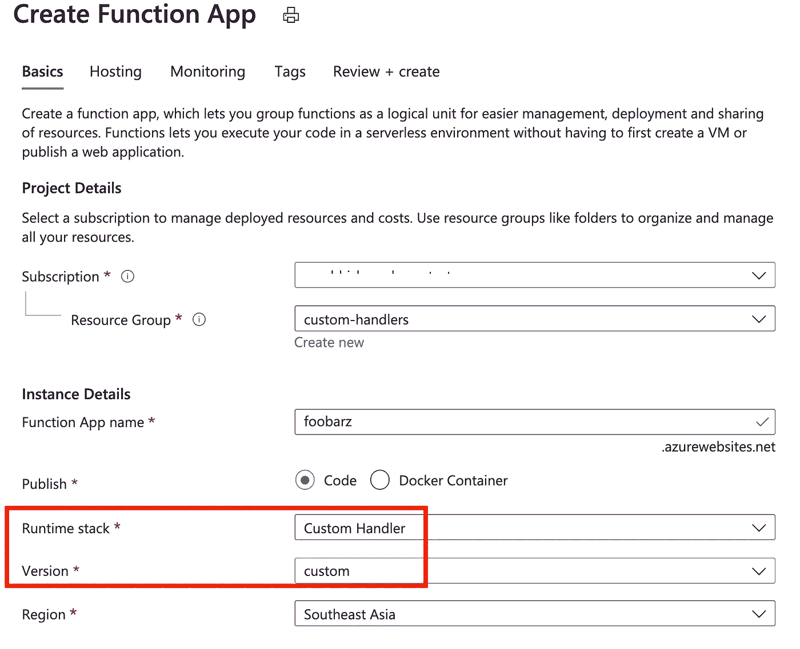

在**托管**部分，选择 **Linux** 和**消费(无服务器)**分别为**操作系统**和**计划类型**。

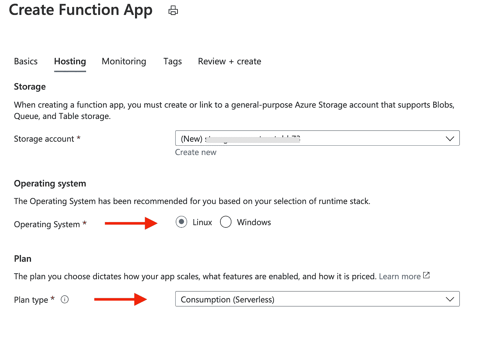

启用应用洞察(如果需要)

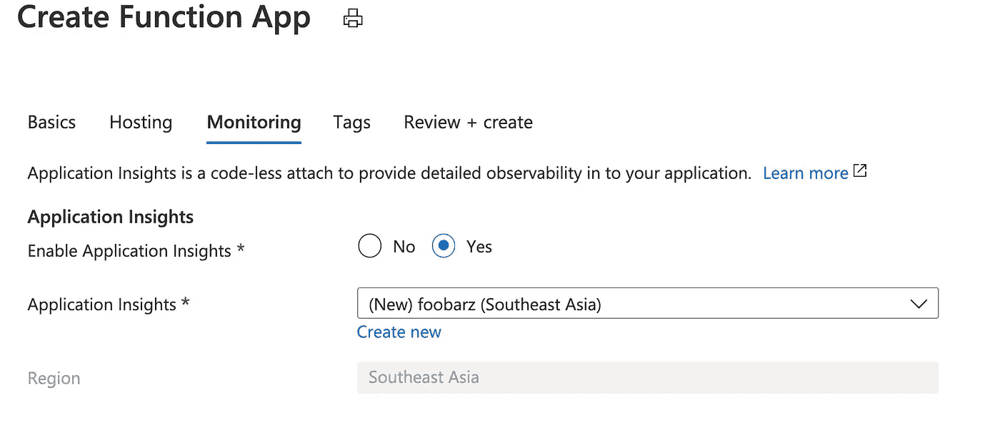

查看最终设置并点击**创建**继续

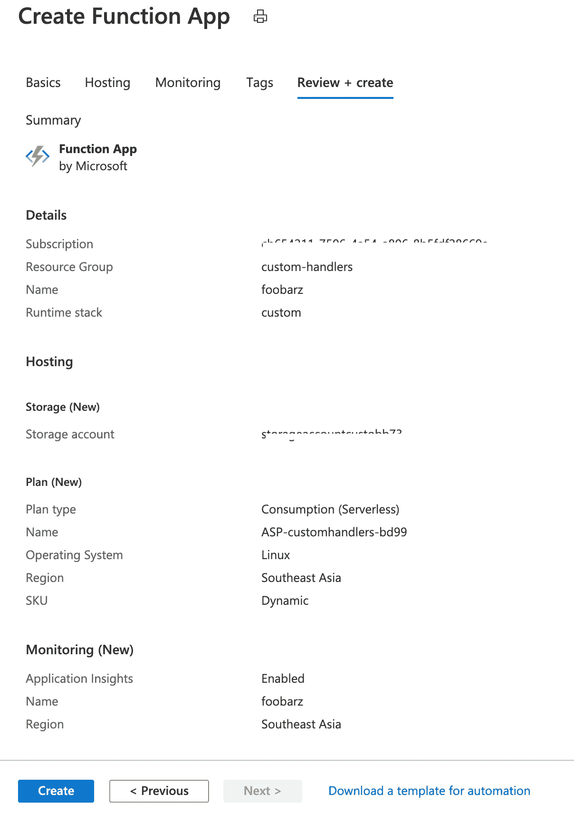

流程完成后，还将创建以下资源以及 Function App:

*   [App 服务计划](https://docs.microsoft.com/azure/app-service/overview-hosting-plans?WT.mc_id=data-9656-abhishgu)(本例中为消费/无服务器计划)
*   一个 [Azure Storage 账户](https://docs.microsoft.com/azure/storage/common/storage-account-overview?WT.mc_id=data-9656-abhishgu)
*   an[Azure Application Insights](https://docs.microsoft.com/azure/azure-monitor/app/app-insights-overview?WT.mc_id=data-9656-abhishgu)功能)

## 部署功能

克隆 GitHub 回购并构建该函数

```
git clone https://github.com/abhirockzz/serverless-go-slack-app
cd serverless-go-slack-appGOOS=linux go build -o go_funcy cmd/main.go
```

> *是用来构建*的*可执行程序，因为我们选择了*T2*操作系统作为我们的功能 App*

要进行部署，请使用 Azure Functions 核心工具

```
func azure functionapp publish <enter name of the function app>
```

部署完成后，复制命令返回的函数 URL 您将在后续步骤中使用它

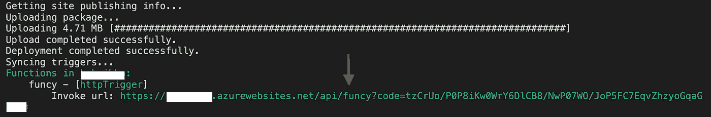

# 配置 Slack

本节将介绍在工作区中设置 Slack 应用程序(Slash 命令)所需执行的步骤:

*   创建一个 Slack 应用程序
*   创建斜线命令
*   将应用程序安装到您的工作区

## 创建一个 Slack 应用程序和斜杠命令

登录到你的 [Slack Workspace](https://slack.com/signin) ，开始[创建一个新的 Slack 应用](https://api.slack.com/apps/new)

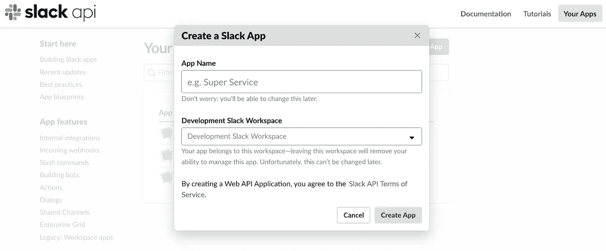

点击*创建新命令*，用所需信息定义新的*斜线命令*。请注意，在**请求 URL** 字段中，您将输入函数的 HTTP 端点，它只不过是您在上一节中部署函数后获得的 URL。完成后，点击**保存**完成。

## 将应用程序安装到您的工作区

创建完 Slash 命令后，转到应用程序的设置页面，在导航菜单中单击*基本信息*功能，选择*将应用程序安装到工作区*并单击*将应用程序安装到工作区* —这将把应用程序安装到 Slack 工作区，以测试应用程序并生成与 Slack API 交互所需的令牌。一旦你安装完应用程序，*应用程序凭证*就会出现在同一个页面上。


> *记下您的应用程序* ***签名密码*** *，因为您稍后会用到它*

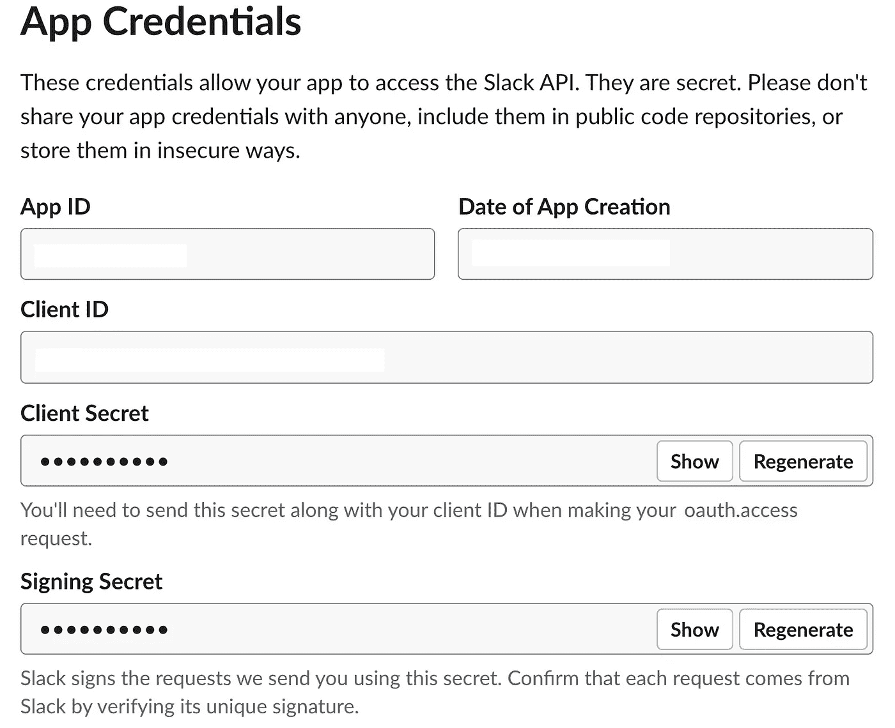

## 在进入有趣的部分之前…

…确保更新函数应用配置，以添加松弛签名密码(`SLACK_SIGNING_SECRET`)和 Giphy API 密钥(`GIPHY_API_KEY` ) -它们将作为函数中的环境变量。

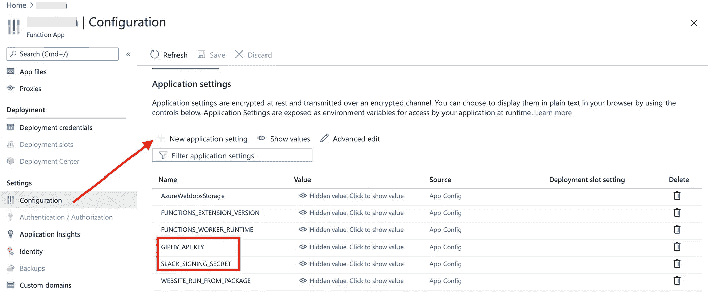

# 欢乐时光！

从您的松弛工作区，调用命令`/funcy <search term>`。例如，尝试`/funcy dog`。你应该得到一个随机的 GIF 作为回报！


简单回顾一下正在发生的事情:当你在 Slack 中调用`/funcy`命令时，它调用函数，然后函数与 Giphy API 交互，最后将 GIF 返回给用户(如果一切顺利的话！)

第一次调用后，您可能会从 Slack 中看到`timeout error`。这很可能是由于`cold start`，当你第一次调用它时，函数需要几秒钟来引导。这与 [Slack 期望在 3 秒内得到响应](https://api.slack.com/slash-commands#responding_basic_receipt)的事实相结合——因此产生了错误消息。

没什么好担心的。你需要做的就是再次尝试，一切都会好的！

> *清理:一旦完成，不要忘记* [*删除资源组*](https://docs.microsoft.com/azure/azure-resource-manager/management/delete-resource-group?tabs=azure-powershell&WT.mc_id=data-9656-abhishgu#delete-resource-group) *，这将依次删除之前创建的所有资源(功能 app、App 服务计划等。)*

现在，没有什么可以阻止你在 Azure 上使用 Go 实现无服务器功能！我希望这将是一种尝试定制处理程序的有趣方式。让我们知道你的想法。