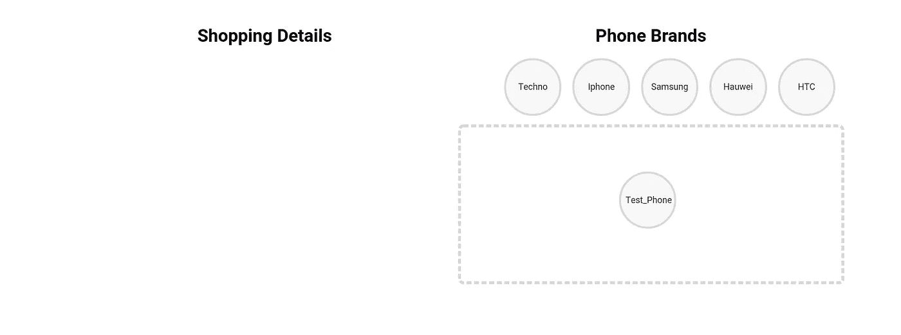

# 用 React、Redux 和 React-DnD 构建购物车—第 1 部分

> 原文：<https://itnext.io/build-a-shopping-cart-with-react-redux-and-react-dnd-part-1-2433558c3f38?source=collection_archive---------1----------------------->


拖放购物清单

我们已经看到了很多关于拖放的教程和文章，但我认为这是一个非常重要的概念，值得更详细地探讨一下。学习的最好方法之一——也许是深入学习任何东西的唯一方法——就是去做和去教。

在本文中，我们将构建一个简单的购物车，它利用了一组 React 实用工具 [React DnD](https://react-dnd.github.io/react-dnd/about) 来帮助构建复杂的拖放界面，同时保持组件的解耦。

本文分为 7 个部分，我们将学习不同的概念和使用的技术。你可以在这个 [repo](https://github.com/Eyongkevin/shopping-list---React-Redux-DragandDrop/tree/finishing-touches) 里查看完整的代码。这个回购协议有 7 个分支的 7 个部分，你可以按照每个分支，因为我们建立他们。

事不宜迟，让我们开始吧

# 入门指南

在本节中，我们将执行以下操作

*   设置环境
*   构建我们的网络应用
*   建立一个假的初始数据并显示一些内容

> 该部分的所有代码都可以在这里的分支[中找到](https://github.com/Eyongkevin/shopping-list---React-Redux-DragandDrop/tree/master)

## 设置环境

确保您已经安装了`create-react-app`或者按照这个[链接](https://reactjs.org/docs/create-a-new-react-app.html)了解如何获得它，然后使用命令创建项目:

```
$ create-react-app shopping-cart
```

在终端中，导航到新创建的项目`shopping-cart`并运行`yarn start`以开发模式启动应用程序。如果一切正常，您将能够打开 [http://localhost:3000](http://localhost:3000/) 在浏览器中查看它

接下来，安装用于管理应用程序状态的`Redux`

```
yarn add react-redux redux
```

然后，为中间件安装`thunk`

```
yarn add redux-thunk
```

## 构建我们的网络应用

在这个项目中，我们不会试图理解组织 Redux 代码的所有选项，但我们将关注并使用在名为`Rails-style pattern`的文档中找到的默认组织。事情是 Redux 不在乎你把它的组成部分放在哪里，因为包有一个奇怪的动态，如果一个动作对象返回到商店，Redux 工作流就满足了。无论你使用什么技术来实现这一点，都取决于你自己。但是，请容忍我，因为我们只在这个例子中使用 Rails 风格的模式，然后您可以继续使用其他模式。

> 这种模式的名字来源于 Rails，这是一种流行的 Ruby 编程语言的 web 框架，恰好具有定义良好的目录布局，其中每种文件类型都被分组到相应的目录中。

我们的应用程序的源文件夹(`src`)将有以下目录:**组件**、**动作**、 **reducers、utils**

```
.src
├── **actions**
│   └── phones.js
├── **components**
│   ├── App.js
│   ├── container.js
│   ├── Phone.js
│   └── ShoppingCart.js
├── index.css
├── index.js
├── **reducers**
│   ├── index.js
│   └── phones.js
├── setupTests.js
└── **utils**
    └── _DATA.js
```

首先导航到`src`目录，如上所示在每个目录下创建所有文件。您也可以删除所有其他默认文件。现在让我们进入每个文件并调整它们的代码

U 瓦片

在`_DATA.js`文件中，我们将创建一些假数据，用于项目的这一部分。由于该项目是关于购物手机，我们将有一些关于一些品牌的信息

```
let phones = {
    Techno:{
        brand: "Techno",
        inCart: 'false' // or "in"
    },
    Apple:{
        brand: "Iphone",
        inCart: "false"
    },
    Samsung:{
        brand: "Samsung",
        inCart: "false" 
    },
    Hauwei:{
        brand: "Hauwei",
        inCart: "true"
    },
    HTC:{
        brand: "HTC",
        inCart: "true"
    }
}
```

`inCart`确定电话项目是否落在目标空间中[ **我们稍后将回到这一点** ]。

接下来，我们有一些 promise 函数来检索我们的品牌信息并设置`inCart`属性

```
export function _getPhones (){
    return new Promise((res, rej) =>{
        setTimeout(() => res({...phones}), 1000);
    });
}export function setInCart({id, inCart}){
    return new Promise((res, rej) =>{
        setTimeout(() =>{
            phones = {
                ...phones,
                [id]:{
                    ...phones[id],
                    inCart: inCart
                }
            }
            res()
        }, 500);
    });
}
```

> 要知道 JavaScript 中的承诺是如何工作的，请点击查看

爱德华

Reducers 指定应用程序的状态如何改变，以响应发送到存储的操作。一个典型的 react 应用程序可能有许多 reducer，但是对于这个小型项目的第一部分，我们只有一个 reducer 来响应一个动作`RECEIVE_PHONES`，这个动作将使用来自`utils/_DATA.js`文件的数据填充我们的状态。

在文件`reducers/phones.js`中我们有以下代码

```
import { RECEIVE_PHONES } from '../actions/phones'export default function phones(state={}, action){
    switch(action.type){
        case RECEIVE_PHONES:
            return {
                ...state,
                ...action.phones
            }
        default:
            return state
    }
}
```

这个代码或 reducer 响应一个动作`RECEIVE_PHONES`，这个动作基本上只是返回一个传递给它的 phone 对象。

将来，我们可能会有不止一个还原器，将还原功能拆分为单独的功能是正确的，每个功能管理状态的独立部分。我们在`combineReducers`的帮助下实现了这一点，它将一个值不同的减函数转换成一个你可以传递给`createStore`的减函数。所以，让我们在`reducers/index.js`文件中处理这件事。

```
import { combineReducers } from 'redux'
import phones from './phones'  // our phone reducerexport default combineReducers({
    phones,
})
```

一场行动

我在上面说过，我们的应用程序的状态会随着发送到商店的动作而改变，并且我们在定义 Reducer 时已经导入了我们的动作。因此，让我们在这里定义我们的行动。在`actions/phone.js`中，我们有:

```
export const RECEIVE_PHONES = 'RECEIVE_PHONES'export function receivePhones(phones){
    return{
        type: RECEIVE_PHONES,
        phones
    }
}
```

我们的动作具有类型`RECEIVE_PHONES`，它接收并返回一个电话对象

在定义了缩减器、动作和数据之后，我们现在可以开始将它们连接起来。让我们移动到`src/index.js`文件并插入代码:

```
import React from 'react';
import { render } from 'react-dom'
import { Provider } from 'react-redux'
import { createStore } from 'redux'import reducer from './reducers'import './index.css';
import App from './components/App';let store = createStore(reducer)render(
  <Provider store={ store }>
    <App />
  </Provider>,
  document.getElementById('root')
);
```

我们这里进口了很多，让我解释几个

*   `Provider`:它使 Redux `store`对任何已经包装在`connect()`函数中的嵌套组件可用
*   `createStore`:用于创建我们的 Redux store，保存我们应用程序的完整状态

我们还进口了我们的减速器，在这种情况下，我们的`reducers/index.js`，这是`createStore`在其他地方创建我们的商店所需要的。

> 存储保存了应用程序的整个状态树

C 成分

现在，让我们定义在`src/index.js`中调用的主要组件。移动到`components/App.js`并插入代码

从上面的代码中可以注意到一些事情:

*   我们导入了`connect`来帮助我们访问我们的商店和`dispatch`功能
*   我们导入了`_getPhones`，这是我们的 promise 函数，它从`_DATA.js`返回我们的 phone 对象
*   我们导入了一个动作，每当我们想要改变状态时，该动作将在 dispatch 函数的帮助下被发送到商店

当我们的应用程序运行时，会发生以下情况

*   `mapStateToProps`从我们在`src/index.js`中定义的存储中接收数据的一部分，在本例中是`phones`，并通过 pop 使其对我们的组件可用。我们的电话状态最初是一个空对象。
*   `componentDidMount`运行并调用我们的 promise 函数，该函数返回我们的 phone 对象，稍后使用 dispatch 将该对象作为一个动作发送到商店。当这种情况发生时，我们的 reducer 被触发，它接收电话对象并改变我们的状态。

当状态改变时，`mapStateToProps`再次被调用，它现在获得更新后的状态，我们的组件使用更新后的状态重新呈现。在我们的 return 语句中，我们调用组件`Container`并传递给它电话对象。

移动到`components/Container.js`并插入代码

这里我们导入了两个组件`Phone`和`ShoppingCart`。前者将用于显示我们的电话，而后者将用于定义我们的目标空间，在“拖放”过程中，电话项目将被放置在该空间中。

这里发生的事情是，我们从 prop 接收我们的 phone 对象，然后我们[将它的元素](https://medium.com/@tonyparkerkenz/javascript-array-prototype-map-b95e245f43c1)映射到`Phone`组件，该组件将依次显示 phone 对象的每个元素。在映射之后，我们通过调用`ShoppingCart`来显示我们的购物车

移至`components/Phone.js`并插入代码，该代码将显示传递给它的手机名称。

```
import React, { Component } from 'react'class Phone extends Component{
    render(){
        const { name } = this.props;
        return(
            <div className='phone'>
                { name }
            </div>
        )
    }
}export default Phone
```

移动到`component/ShoppingCart.js`并插入代码，该代码将形成一个空间，该空间将成为我们“拖放”的目标空间。

```
import React, { Component } from 'react'
import Phone from './Phone'class ShoppingCart extends Component{
    render(){
        return(
            <div className="shopping-cart">
                <Phone name="Test_Phone" />
            </div>
        )
    }
}export default ShoppingCart;
```

## 式样

前往这个[分支](https://github.com/Eyongkevin/shopping-list---React-Redux-DragandDrop/tree/master)并下载文件`index.css`并替换 create-react-app 附带的默认文件

## 结论



[http://localhost:3000](http://localhost:3000/) 浏览器视图

这个旅程的第一部分是奠定基础和了解一些基本知识。你可以在这里获得这部分[的完整代码。我们现在准备开始更令人兴奋的事情。正如承诺的，PART2 是可用的，你可以在这里](https://github.com/Eyongkevin/shopping-list---React-Redux-DragandDrop)得到它