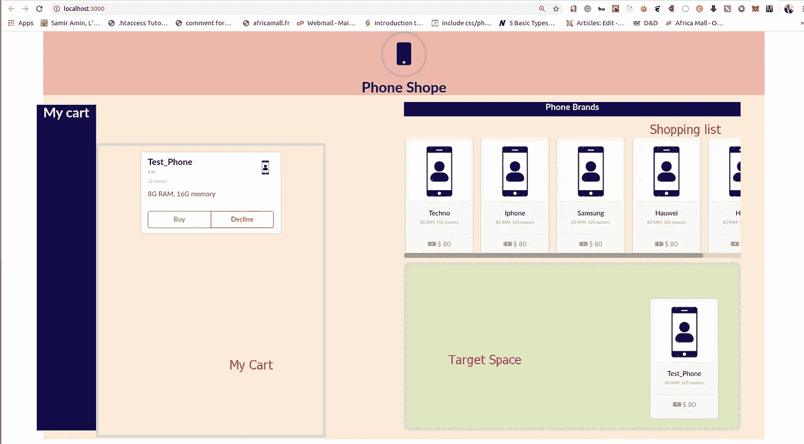

# 用 React、Redux 和 React-DnD 构建购物车—第 2 部分

> 原文：<https://itnext.io/build-a-shopping-cart-with-react-redux-and-react-dnd-part-2-b4cd649e25db?source=collection_archive---------4----------------------->


拖放购物车

欢迎来到**第 2 部分**，构建一个利用[反应 DnD](https://react-dnd.github.io/react-dnd/about) 的简单购物车。如果你还没有看完第 1 部分，你可以在这里找到它[。另外，如果您想从第 2 部分开始构建，请确保克隆并下载第 1 部分的代码，因为第 2 部分是后续部分。](/build-a-shopping-cart-with-react-redux-and-react-dnd-part-1-2433558c3f38)

## 入门指南

在这篇文章中，我们将继续构建购物车，同时学习以下内容:

*   反应组分
*   [语义界面](https://react.semantic-ui.com/)
*   一点 CSS

> *本节的所有代码都可以在* [*分支这里*](https://github.com/Eyongkevin/shopping-list---React-Redux-DragandDrop/tree/default-shopping-list) 找到

## 安装语义-用户界面-反应

在本文中，我们将使用语义 UI 来设计我们的 web 应用程序。我们不会涉及太多的细节，但是我们会介绍如何让你开始在 React 中使用这个框架并完成项目的这一部分。

> [语义 UI](https://semantic-ui.com/) 是一个框架，通过提供一组组件和工具来定义响应性布局和灵活的主题，用于构建 web 应用程序。语义 UI 提供与 React 的集成，语义 UI React 提供 React 组件，而语义 UI 提供 CSS 样式表形式的主题。

打开终端到`package.json`所在的根目录，安装 semantic-UI

```
yarn add semantic-ui-react
yarn add semantic-ui-css
```

> **NB** :确保你已经安装了最新版本的 [Node.js](https://nodejs.org/en/) 。

有了我们的语义 UI，这就是我们要实现的 UI。它并不花哨，但它服务于本教程的目的。它有三个主要视图

*   显示所有手机品牌的购物清单部分
*   目标空间部分，拖动的电话将被放下
*   “我的购物车”部分显示了拖到目标空间的手机品牌的详细信息。



带有语义 UI 的结果 UI

C 组件

让我们在应用程序的入口文件中导入缩小的 CSS 文件。移动到`src/components/app.js`并将它添加到现有的导入中

```
import 'semantic-ui-css/semantic.min.css'
```

移动到`src/components/Container.js`并插入代码

这是保存我们应用程序显示的组件。我们在其中包含了一个组件

*   **MyCart** :显示添加到目标空间的手机的详细信息

为了实现 UI，我们使用了[图标](https://react.semantic-ui.com/elements/icon/)，[网格](https://react.semantic-ui.com/collections/grid/)分别是我们定义的列和行。此外，我们在 CSS 中使用了一些自定义样式。

> 使用语义 UI 最好的方法是与其[官网](https://react.semantic-ui.com/)紧密合作。无论您需要什么，您都可以查看文档，了解它是如何实现的，并在您的项目中使用它。

创建一个名为`MyCart.js`的新组件，并插入以下代码:

在这个组件中，我们使用语义 UI 中的[卡片](https://react.semantic-ui.com/views/card/)来构建我们的购物车部分。我们注意到一些事情:

*   我们使用了一个图像`phone.jpg`。在此下载[并保存在`public/images/`目录中](https://github.com/Eyongkevin/shopping-list---React-Redux-DragandDrop/blob/default-shopping-list/public/images/phone.jpg)
*   价格、时间和描述等细节现在都是硬代码。我们稍后会将它们包含在我们的假数据库中。

我们将修改`component/Phone.js`来显示我们手机的一些静态细节。

```
import React, { Component } from 'react'class Phone extends Component{
    render(){
        const { name } = this.props;
        return(
           ** <div class="ui card phone">
                <div class="image">
                </div>
                <div class="content">
                    <div class="phone-name">**{ name }**</div>
                    <div class="meta">8G RAM, 16G memory</div>
                </div>
                <div class="extra content">
                    <a>
                    <i aria-hidden="true" class="money icon"></i>
                    $ 80
                    </a>
                </div>
            </div>**
        )
    }
}
```

## 式样

前往这个[分支](https://github.com/Eyongkevin/shopping-list---React-Redux-DragandDrop/tree/default-shopping-list)并下载文件`src/index.css`并替换第 1 部分中的默认文件。

`index.css`中需要注意的几件事:

```
.shopping-list{
  width: 700px;
  height: 250px;
  text-align: center;
  float: right;
  margin-top: 10%;
  margin-right: 50px;
 **overflow-x: scroll;
  overflow-y: hidden;**
  white-space: nowrap;
}
```

我们使用了 overflow 属性，该属性指定了如果内容溢出了元素的框会发生什么。正如我们在上面的代码中看到的，它被用来使我们的购物清单可以滚动到 x 轴，并隐藏在 y 轴。

## 结论

旅程的第二部分是用语义 UI 和一些硬编码数据构建我们的 UI。你可以在这里获得这部分[的完整代码。我们现在准备继续我们一直在等待的事情，](https://github.com/Eyongkevin/shopping-list---React-Redux-DragandDrop/tree/default-shopping-list)[反应——DnD](https://react-dnd.github.io/react-dnd/about)。正如承诺的那样，第 3 部分现在已经推出。你可以在这里找到